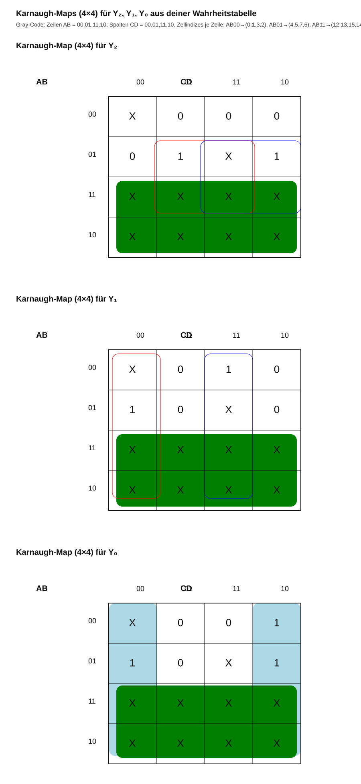
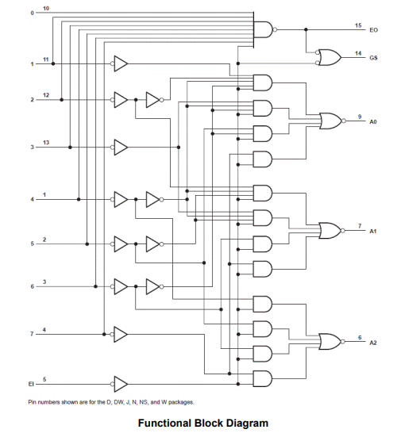
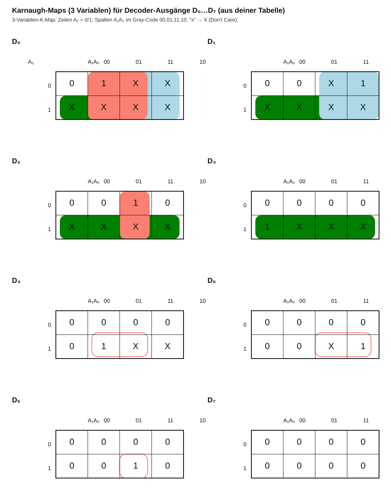
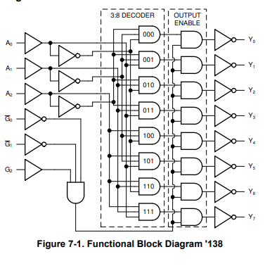
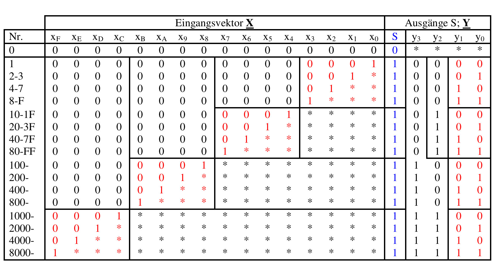
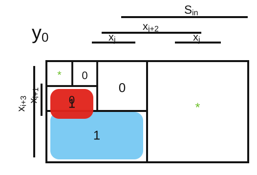
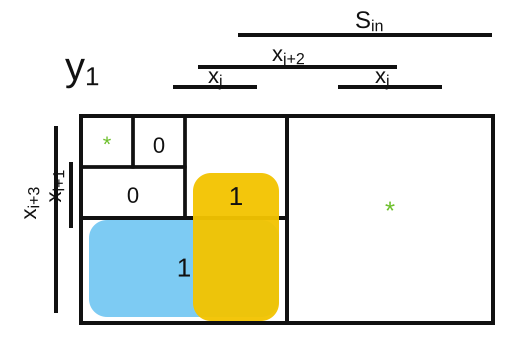
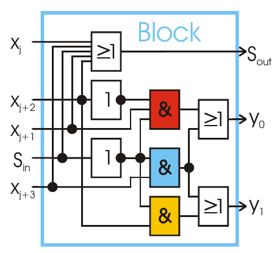
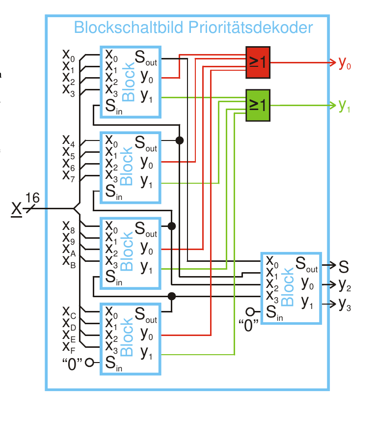



Hallo Leute,

heute wollen wir einen Blick auf kaskadierte Kombinatorik am Beispiel von Prioritätscodierern und -decodierern werfen....
Anschließend werden wir Karnaugh-Diagramme zur Optimierung vorstellen.

== Kaskadierte Kombinatorik und Prioritätscodierer

Zunächst einmal: Was ist ein Prioritätscodierer? Und wozu wird er verwendet? Das können wir anhand einer ersten einfachen Liste erklären.

- Als Interrupt-Controller zur Priorisierung

- Als Codekonverter in einem Flash-ADC.

== Die Wahrheitstabelle und die Ableitung

[width=„100%“]
|================
| Nr. | I_7 | I_6 | I_5 | I_4  | I_3  | I_2 | I_1 | I_0 |  Y_2 | Y_1 | Y_0
| 0   |  0  | 0   |  0  |  0   |  0   | 0   | 0   |  0  |  *   | *   | *
| 1   |  0  | 0   |  0  |  0   |  0   | 0   |  1  |  0   | 0   | 0
| 2   |  0  | 0   |  0  |  0   |  0   | 0   | 1   |  x  |  0   | 0   | 1
| 3   |  0  | 0   |  0  |  0   |  0   | 1   | x   |  x  |  0   | 1   | 0
| 4   |  0  | 0   |  0  |  0   |  1   | x   | x   |  x  |  0   | 1   | 1
| 5   |  0  | 0   |  0  |  1   |  x   | x   | x   |  x  |  1   | 0   | 0
| 6   |  0  | 0   |  1  |  x   |  x   | x   | x   |  x  |  1   | 0   | 1
| 7   |  0  | 1   |  x  |  x   |  x   | x   | x   |  x  |  1   | 1   | 0
| 8   |  1  | x   |  x  |  x   |  x   | x   | x   |  x  |  1   | 1   | 1
|================

=== Karnaugh-Diagramme für Y_2, Y_1 und Y_0

[role=„image“,„./y2.svg“,imgfmt=„svg“, width="75%"]
\[Y_2 = I_7 + I_6 + I_5 + I_4\]

[role=„image“,„./y1.svg“,imgfmt=„svg“, width="75%"]
\[Y_1 = I_7 + I_6 + ( I_3 + I_2 ) \cdot ( \overline{I_7 + I_6 + I_5 + I_4 })\]

[role=„image“,„./y0.svg“,imgfmt=„svg“, width="75%"]
\[Y_0 = I_7 + I_5 \cdot \overline{I_7 + I_6} + I_3 \cdot {\overline{(I_7 + I_6 + I_5 + I_4 )}} + I_1 \cdot ( \overline{I_7 + I_6 + I_5 + I_4 + I_3 + I_2})\]

=== Das Funktionsdiagramm des 8-zu-3-Prioritätscodierers 74HC148 als Beispiel

== Kombinatorik und Prioritätsdecoder

[width=„100%“]
|================
| Nr. | A_2 | A_1 | A_0 | Y_7 | Y_6 | Y_5 | Y_4 | Y_3 | Y_2 | Y_1 | Y_0
| 0   |  0  |  0  |  0  |  1  |  1  |  1  |  1  |  1  |  1  |  1  |  0
| 1   |  0  |  0  |  1  |  1  |  1  |  1  |  1  |  1  |  0  |  1
| 2   |  0  |  1  |  0  |  1  |  1  |  1  |  1  |  1  |  0  |  1  |  1
| 3   |  0  |  1  |  1  |  1  |  1  |  1  |  0  |  1  |  1  |  1
| 4   |  1  |  0  |  0  |  1  |  1  |  1  |  0  |  1  |  1  |  1  |  1
| 5   |  1  |  0  |  1  |  1  |  1  |  0  |  1  |  1  |  1  |  1  |  1
| 6   |  1  |  1  |  0  |  1  |  0  |  1  |  1  |  1  |  1  |  1  |  1
| 7   |  1  |  1  |  1  |  0  |  1  |  1  |  1  |  1  |  1  |  1  |  1
|================

Der 74HC138 hat aktiv-niedrige Ausgänge; genau ein Ausgang wird für jede Adresse niedrig (wenn aktiviert).

[width=„100%“ cols="a,a,a"]
|=====
|
| 
|
|=====

== Kaskadierte Kombinatorik und Prioritätscodierer


Aus der Tabelle geht hervor, dass jeder Block entlang der Diagonalen die gleiche Funktion erfüllt.


[width=„100%“]
|================
| Nr.   | S_in | X_j+3 | X_j+2 | X_j+1 | X_j+0 | S_out | Y_1 | Y_0
| 0     |  0   |  0    |  0    |  0    |  0    |  0    |  *  |  *
| 1     |  0   |  0    |  0    |  0    |  1    |  1    |  0  |  0
| 2-3   |  0   |  0    |  0    |  1    |  *    |  1    |  0  |  1
| 4-7   |  0   |  0    |  1    |  *    |  *    |  1    |  1  |  0
| 8-F   |  0   |  1    |  *    |  *    |  *    |  1    |  1  |  1
| 10-1  |  1   |  *    |  *    |  *    |  *    |  1    |  *  |  *
|================

[width=„100%“ cols="a,a"]
|=====
| 
| 
|=====

[width=„100%“ cols="a,a"]
|=====
|
[role=„image“,„./Sout.svg“,imgfmt=„svg“, width="75%"]
\[S_{out} = S_{in} \lor X_{j+3} \lor X_{j+2} \lor  X_{j+1} \lor X_{j+0} \]

[role=„image“,„./y0.svg“,imgfmt=„svg“, width="75%"]
\[Y_{0} =  \overline{S_{in}}\overline{X_{j+2}} X_{j+1} \lor \overline{S_{in}}X_{j+3}\]

[role=„image“,„./y0.svg“,imgfmt=„svg“, width="75%"]
\[Y_{1} =  \overline{S_{in}}X_{j+2} \lor \overline{S_{in}}X_{j+3}\]

| 
|=====

Übersetzt mit DeepL.com (kostenlose Version)