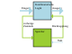
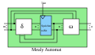
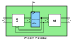
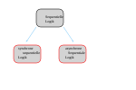


== Sequentielle Logik

Ergänzend zur kombinatorischen Logik enthält die sequentielle Logik eine Art Speicher,
der das Verhalten zustandsabhängig macht. Wir müssen ihr ein Taktsignal zuführen.

=== Mealy- und Moore-Automaten (synchron)
In der digitalen Logik gibt es zwei verschiedene Arten von endlichen Automaten.
Diese sind:

Der Mealy-Automat, der von der Eingabe und dem Zustand abhängig ist.
Der Moore-Automat, der nur vom Zustand abhängig ist

=== Synchrone und asynchrone sequentielle Logik

Es gibt zwei verschiedene Arten sequentieller Logik: die synchrone sequentielle Logik
mit einem zentralen Taktgeber sowie die asnychrone Logik mit mehreren Taktgeber-Domänen.

Wenn wir unserem oben gezeigten Automaten eine Taktgeberfunktion hinzufügen, wird der synchrone Automat zum asynchronen Automaten.

(translation: 2024-12-29)