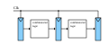
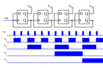



== Taktgeber, Flipflops und Register
In diesem Blogbeitrag stellt der Autor mehrere Elemente vor, die zu einem späteren Zeitpunkt benötigt werden
.

=== Register-Transfer-Level benötigt eine Taktquelle
Bisher haben wir nur die kombinatorische Logik kennengelernt, die
ohne Taktquelle auskommt – jedes Signal wird nur um die Zeit verzögert, die es
für die Übertragung durch den Schaltkreis benötigt. Dies wird als asynchron bezeichnet.
Für anspruchsvollere Aufgaben, wie sequentielle Schaltkreise, sind jedoch Register erforderlich,
 die die Eingangs- und Ausgangssignale speichern,
um korrekte Ergebnisse zu erzielen. Dies wird als synchron bezeichnet.
Die meisten, wenn nicht sogar alle heutzutage verwendeten Designs sind synchron, da diese weniger komplex sind.

*Register-Transfer-Level*

Die blauen Teile im Bild oben zeigen Register, in denen die Werte
gespeichert werden. Wir werden später sehen, wie diese implementiert werden. Schauen wir uns zunächst
die benötigte Taktquelle an.

Es gibt verschiedene Möglichkeiten, eine Taktquelle zu erzeugen:

. Ein Quarzoszillator
. Ein Ringoszillator

Ersterer ist die klassische, letzterer eine modernere Variante.

[cols=„a,a“ width=„100%“]
|===
| *Quarzoszillator* | *Ringoszillator*
|
|
|typischer Frequenzbereich: 1Mhz..100Mhz | typischer Frequenzbereich: 1Hz..15Mhz(diskretes Layout)
|
|
| Frequenz wird durch Kristallgeometrie bestimmt
| Frequenz wird durch Laufzeit und Anzahl der Gates bestimmt
| Genauigkeit hängt hauptsächlich von der Temperatur ab; für präzise Anwendungen werden Kristallöfen verwendet
| Genauigkeit hängt hauptsächlich von der Stabilität der Stromversorgung ab
|===

==== Der Kristalloszillator
Der Kristalloszillator ist eine Taktquelle, die auf einem Quarzkristall basiert.
Die Frequenz hängt von der Geometrie des Quarzes ab.
Quarzoszillatoren sind in einem Metallgehäuse mit
zusätzlicher Verdrahtung erhältlich, wobei der Quarz das Herzstück des Schaltkreises bildet.
Der Schaltkreis basiert in der Regel auf dem https://en.wikipedia.org/wiki/Pierce_oscillator[Pierce-Oszillator].

Ihre Genauigkeit hängt hauptsächlich von der Temperatur ab. Für Anwendungen mit hohen Genauigkeitsanforderungen
werden sie daher in einem Quarzofen untergebracht, der den Quarz auf einer konstanten Temperatur hält.
Eine interessante Zerlegung eines solchen Oszillators ist auf http://www.righto.com/2021/02/teardown-of-quartz-crystal-oscillator.html [Ken Shirriffs Blog] verfügbar.

==== Der Ringoszillator
Eine weitere gängige Taktgeberquelle ist der Ringoszillator.
Der Trick besteht darin, eine ungerade Anzahl von Inverter-Gates zu verketten und den Ausgang des letzten Inverters als Eingang
für den ersten Inverter zu verwenden. Auf diese Weise entsteht ein Schwingkreis.

Die Frequenz hängt von der Anzahl der Inverter sowie von der Laufzeit Tp ab (siehe Gleichung unten). Die Zeit, die das Signal benötigt, um
durch das Gate zu laufen, wird als Laufzeit Tp bezeichnet.

[role=„image“,„../images/how_does_cpu/ring_oscillator_frequency.svg“,imgfmt=„svg“, width=„40%“]
\[f_{ro} = \frac{1}{2nT_{p}}\]

Hier hängt die Genauigkeit hauptsächlich von der Stabilität der Stromversorgung ab.
Ein Anwendungsbeispiel – z. B. die 8087, die Gleitkommaeinheit von Intel® – wird erneut von
http://www.righto.com/2018/08/inside-die-of-intels-8087-coprocessor.html[Ken Shirriffs Blog].
 Wie dort gezeigt, kann die Frequenz durch Hinzufügen eines RC-Netzwerks zwischen den Invertern verringert werden.

==== Das klassische RS-Flipflop

Das klassische Flipflop besteht aus zwei NAND-Gattern, deren Ausgänge an das komplementäre Gatter rückgekoppelt werden,
 wie in der folgenden Tabelle zu sehen ist. Unterhalb der Schaltung ist die Wahrheitstabelle angegeben.
Wie zu sehen ist, sperrt das Flipflop den Ausgang auf einen Zustand, „1“ oder „0“.
Wenn beide Eingänge auf „niedrig“ gesetzt sind, ist der Ausgang undefiniert (und entspricht der bevorzugten Position).

[cols=„a,a“ width=„100%“]
|===
| *RS-Flipflop-Struktur* | *RS-Flipflop-Symbol*
|image:./flipflop_circuit.svg[width=50%]
|image:./flipflop_symbol.svg[width=50%]
|===

[width=„50%“]
|===
|̅R | ̅S || Q | ̅Q | comments
| 0 | 0 | 1 | 1 | invalid
| 0 | 1 | 1 | 0 | Reset
| 1 | 0 | 0 | 1 | Setzen
| 1 | 1 | Q | Q | --
|===
Eine Anwendung des klassischen RS-Flipflops ist die Entprellung von Schaltern.

Für die meisten Anwendungen ist jedoch ein weiterentwickeltes Flipflop erforderlich. Sehen wir uns
das (D)ata-Flipflop an.

==== Das D-Flipflop

Beim D-Flipflop wird der Schaltung des RS-Flipflops zwei NAND-Gatter vorgeschaltet,
die durch einen Taktimpuls gesteuert werden. Nur wenn der Takt hoch ist (d. h. „1“), ist das
am (D)ata-Eingang anliegende Datum gültig und wird im RS-Flipflop gespeichert. Andernfalls ist das
anliegende Datum ungültig.

[cols=„a,a“ width=„100%“]
|===
| *D-Flipflop-Struktur* | *D-Flipflop-Symbol*
|
|
|===

[width=„50%“]
|===
|Clock | D | Q | ̅Q | comments
| 🠓 >>0 | x | Q | ₯Q | keine Änderung
| 🠓 >>0 | 1 | 1 | 0 | Zurücksetzen
| 🠑 >>1 | 0 | 0 | 1 | Setzen
| 🠑 >>1 | 1 | Q | ₯Q | -
|===

=== Ein Binärzähler

Mit dem D-Flipflop, das wir im letzten Abschnitt kennengelernt haben,
können wir einen (asynchronen) Binärzähler konstruieren.
Dieser Ausgang kann als Adresse für eine ROM-Tabelle verwendet werden, wie wir in einem anderen Blogbeitrag sehen werden.

[cols=„a“ width=„100%“]
|===
| *Asynchroner Binärzähler mit D-Flipflops*
|
|===

Wenn man die Ausgänge unabhängig voneinander betrachtet, kann man sehen, dass der Zähler
auch als Frequenzteiler funktioniert: Bei jedem Ausgang wird die Frequenz
im Verhältnis zu der vorherigen durch zwei geteilt.

== Register
Was sind Register? Register werden verwendet, um Werte zu halten bzw. zu speichern.
Jede heutzutage etwas komplexere CPU verfügt über eine große Anzahl von Registern.
Die Registergrößen variieren stark je nach Anwendung. Sie reichen von Statusregistern,
 die nur ein Bit enthalten, über Register mit mehr als 32 und 64 Bit für reguläre Register bis hin zu Vektorregistern
mit einer Größe von 64 Byte (= 512 Bit). Diese Register werden nach einem bestimmten Schema benannt
Schema benannt, in einigen Architekturen mit Zahlen (z. B. MIPS und ARM), in anderen Fällen mit einem
komplexeren Schema aus alphabetischen Zahlen (wie in x86-Architekturen).

In den vorherigen Abschnitten haben wir etwas über das Flipflop gelernt.
Dies sind die Bausteine der Register. Wie im Bild oben zu sehen ist,
wird jedes Flipflop mit demselben Signal getaktet.
Wir werden auch oft den Begriff Akkumulator verwenden.
Akkumulatoren sind Register, die gleichzeitig Quell- und Zielregister sind.
 So speichern sie z. B. bei einer Addition einen Eingabewert und
halten das Ergebnis nach der Operation im selben Register.

(translation: 2024-12-29)