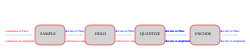
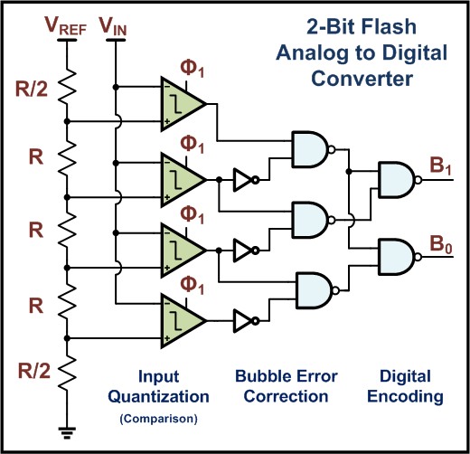

== Die beiden wichtigen Säulen – Digital-Analog-Wandler und Analog-Digital-Wandler

Was wir auf unserer Reise durch die (analoge) Elektronik und die digitale Elektronik noch nicht behandelt haben,
sind die Wandlerschaltungen von analog zu digital und umgekehrt – dafür möchten wir zunächst
die verschiedenen Begriffe erläutern.

==  Die Theorie zu analogen Signalen, digitalen Signalen, Abtastung und Quantisierung

Analoge Signale zeichnen sich dadurch aus, dass sie zeitlich und wertmäßig kontinuierlich sind.
Der Umwandlungsprozess von analogen Signalen
wird oft als Quantisierung bezeichnet.

Digitale Signale hingegen sind Signale, die einen
Quantisierungsprozess durchlaufen haben, was bedeutet, dass sie keine kontinuierlichen Signale, sondern diskrete Signale sind.
Digitale Signale sind sowohl zeitlich als auch wertmäßig diskret.

=== Analoge Signale

Analoge Signale sind zeitlich und wertmäßig kontinuierlich.
Das bedeutet, dass das Signal zu jedem Zeitpunkt vorhanden ist und
jeden Wert innerhalb eines bestimmten Bereichs annehmen kann. Das Signal weist keine Sprünge oder Lücken auf.
Viele physikalische Größen, wie beispielsweise Schall, Temperatur oder Lichtintensität,
lassen sich auf natürliche Weise durch analoge Signale beschreiben.

Da sich analoge Signale kontinuierlich ändern, bieten sie eine direkte Darstellung
von Prozessen der realen Welt.

image:./adc_ conversion.svg[width="1000px"]

=== Digitale Signale

Digitale Signale hingegen sind nicht kontinuierlich. Es handelt sich um Signale, die einem Quantisierungsprozess unterzogen wurden.
Daher sind digitale Signale zeitlich und wertmäßig diskret.
Anstatt zu jedem Zeitpunkt definiert zu sein, ist ein digitales Signal nur zu bestimmten Zeitpunkten definiert.
Darüber hinaus sind die Signalwerte auf eine endliche Menge möglicher Werte beschränkt. Digitale Signale bestehen daher
aus einzelnen Werten und nicht aus einer kontinuierlichen Wellenform.

=== Abtastung und Quantisierung

==== Abtastung
Abtastung beschreibt den Prozess der Messung eines zeitkontinuierlichen Signals zu diskreten Zeitpunkten.
Quantisierung beschreibt den Prozess der Zuordnung dieser abgetasteten Werte zu einer endlichen Menge diskreter Amplitudenpegel.

==== Quantisierung
Quantisierung beschreibt den Prozess der Umwandlung eines analogen Signals in ein digitales Signal.
Während dieses Prozesses wird das kontinuierliche Signal durch eine Folge von diskreten Werten dargestellt.
Dieser Prozess ermöglicht es, Signale mit digitalen Systemen zu verarbeiten, zu speichern und zu übertragen.

== Der Analog-Digital-Wandler (ADC)

Der umgekehrte Vorgang wird als Analog-Digital-Wandler bezeichnet. Der schnellste ist ein Flash-Wandler,
ein einzelner IC, der (2^n) -1  Komparatoren enthält, wobei n für die Bitbreite steht.

[width=„100%“ cols="a,a"]
|=====
| image:./flash_adc_w_priority_encoder.svg[width=„500px“]
| 
|=====

// 
== Der Sigma-Delta-Wandler (ΣΔ-Wandler)

Neben schnellen Wandlerarchitekturen wie dem Flash-ADC und einfachen DAC-Strukturen
wie der R-2R-Leiter gibt es eine weitere sehr wichtige Klasse von Wandlern, die nicht auf Geschwindigkeit,
sondern auf Präzision und Auflösung optimiert sind: die Sigma-Delta-Wandler.

Sigma-Delta-Wandler werden häufig in modernen elektronischen Systemen eingesetzt, insbesondere in Audioanwendungen,
 Sensorschnittstellen und Präzisionsmessgeräten. Ihre Grundidee besteht darin,
durch Oversampling und digitale Signalverarbeitung die Wandlungsgeschwindigkeit zugunsten der Genauigkeit zu verringern.

Anstatt ein analoges Signal direkt in ein mehrbitiges digitales Wort umzuwandeln, arbeitet ein Sigma-Delta-Wandler
mit einer sehr hohen Abtastfrequenz und einer Rückkopplungsschleife. Das analoge Eingangssignal
wird kontinuierlich mit einem aus dem Wandlerausgang abgeleiteten Rückkopplungssignal verglichen.
Die Differenz zwischen diesen beiden Signalen wird über die Zeit integriert. Dieser Integrationsprozess
betont die niederfrequenten Komponenten des Signals und gleicht gleichzeitig hochfrequente Störgeräusche aus.

Der Name Sigma-Delta leitet sich von den beiden Operationen ab, die innerhalb der Wandlerschleife verwendet werden.
Das Sigma (Σ) steht für die Integration des Fehlersignals über die Zeit, während das
Delta (Δ) die Differenz zwischen dem Eingangssignal und dem Rückkopplungssignal darstellt.
Zusammen bilden diese Operationen ein geschlossenes System, das sich kontinuierlich selbst korrigiert.

Das Herzstück des Sigma-Delta-Wandlers ist ein sehr einfacher Quantisierer, der häufig als
1-Bit-Komparator implementiert ist. Dieser Quantisierer entscheidet, ob der Ausgang des Integrators positiv
oder negativ ist, und erzeugt ein entsprechendes digitales Ausgangsbit. Der digitale Ausgang wird dann
mit einem einfachen DAC wieder in ein analoges Signal umgewandelt und an den Eingang des
Wandlers zurückgeführt. Dieser Rückkopplungsmechanismus zwingt den Durchschnittswert des digitalen Ausgangs, dem
analogen Eingangssignal zu folgen.

Der direkte Ausgang eines Sigma-Delta-Modulators ist daher keine herkömmliche Mehrbit-
Binärzahl, sondern ein schneller Strom einzelner Bits, zum Beispiel:

111011101111010111...

Die Informationen sind in der Dichte der Einsen innerhalb dieses Bitstroms kodiert. Eine höhere Dichte
von Einsen entspricht einer höheren Eingangsspannung, während eine geringere Dichte einer niedrigeren
Eingangsspannung entspricht. Diese Art der Darstellung wird als Pulsdichtemodulation (PDM) bezeichnet.

Sigma-Delta-Wandler arbeiten mit einer Abtastfrequenz, die viel höher ist als die
Nyquist-Frequenz des Eingangssignals. Diese Technik wird als Überabtastung bezeichnet.
Oversampling reduziert das Quantisierungsrauschen innerhalb des Signalbandes und lockert die Anforderungen an analoge Anti-Aliasing-Filter erheblich
.

Ein weiteres Schlüsselkonzept von Sigma-Delta-Wandlern ist die Rauschformung. Während das Quantisierungsrauschen
nicht eliminiert werden kann, verschiebt die Rückkopplungsschleife den größten Teil dieses Rauschens in Richtung höherer
Frequenzen außerhalb des interessierenden Frequenzbereichs. Ein digitales Tiefpassfilter entfernt
dieses hochfrequente Rauschen, und ein Dezimator reduziert die Datenrate, um einen hochauflösenden
digitalen Mehrbit-Ausgangswert zu erzeugen.

Aufgrund dieses Prinzips können Sigma-Delta-Wandler sehr hohe Auflösungen erreichen,
oft 16 bis 24 Bit, mit relativ einfachen analogen Schaltungen. Dies geht jedoch zu Lasten der
Wandlungsgeschwindigkeit und der durch die digitale Filterung verursachten Latenz. Aus diesem Grund
sind Sigma-Delta-Wandler nicht für sehr hochfrequente oder schnelle transiente Signale geeignet,
aber ideal für Präzisionsanwendungen.

image:./sigma_delta_adc.svg[width="1000px"]

(Nicht meine eigene LT-Spice-Datei, sondern gefunden unter https://github.com/teddokano/sigma-delta_modulation_sim[hier])

link:./sigma_delta_adc.asc[LTSpice-Datei]

image:./sigma_delta_adc_ltspice.png[width="1000px"]

== Der Digital-Analog-Wandler (DAC)
Ein außergewöhnlich einfaches Beispiel für einen DAC ist ein Widerstandsnetzwerk R-2R-Ladder... Es besteht lediglich aus einem einfachen
Widerstandsnetzwerk und einem einfachen Einzeloperationsverstärker.

=== Der R-2R-DAC

Der einfachste DAC ist der R-2R-Ladder-DAC. Es handelt sich im Grunde um ein Widerstandsnetzwerk
mit einem Verstärker (Operationsverstärker) am Ausgang.

// Diese Seite befindet sich noch im Aufbau.
//