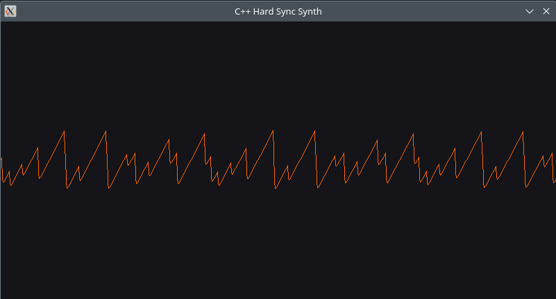



== Mehr als nur eine Note: Polyphonie implementieren

In unseren bisherigen Tutorials war unser Synthesizer darauf beschränkt, jeweils nur eine Note zu spielen. Wenn man eine neue Taste drückte, verschwand der alte Klang einfach.
Heute ändern wir das, indem wir **Polyphonie** implementieren – die Fähigkeit, Akkorde zu spielen und mehrere „Stimmen“ gleichzeitig zu verwalten.

=== 1. Was ist eine „Stimme“?

Im professionellen Synthesizer-Design verwenden wir die **Voice-Architektur**. Eine „Voice“ ist eine in sich geschlossene Einheit, die alles enthält,
was zur Erzeugung eines Klangs benötigt wird: einen **Oszillator** und eine **Hüllkurve**.

Anstatt dass die `SynthEngine` einen einzelnen Oszillator besitzt, verfügt sie nun über eine Liste von `Voice`-Objekten.

=== 2. Verwaltung von Objekten mit `std::vector`

Wie behalten wir den Überblick über Noten, die entstehen (Taste gedrückt) und vergehen (Release-Phase beendet)? Wir verwenden den `std::vector` aus der C++-Standardbibliothek.

* **Entstehung:** Wenn eine Taste gedrückt wird, fügen wir mit `push_back` eine neue `Voice` in unseren Vektor ein.
* **Ende:** Wir durchlaufen den Vektor. Wenn die Hüllkurve einer Stimme den `OFF`-Zustand erreicht hat, entfernen wir sie aus dem Vektor und geben den Speicher frei.

=== 3. Thread-Sicherheit: Die Audio-Sperre

In der Audioprogrammierung laufen zwei „Threads“ gleichzeitig:
1. **Der Haupt-Thread:** Überwacht die Tastatur und fügt Stimmen zum Vektor hinzu.
2. **Der Audio-Thread:** Durchläuft den Vektor in einer Schleife, um den Klang zu berechnen.

Wenn der Haupt-Thread eine Stimme hinzufügt, während der Audio-Thread gerade dabei ist, den Vektor zu lesen, stürzt das Programm ab.
Um dies zu verhindern, verwenden wir `SDL_LockAudio()`. Es fungiert als „Ampel“ und stellt sicher, dass jeweils nur ein Thread auf unsere Liste der Stimmen zugreift.

=== 4. Digitales Mischen: Der Summenbus

Um mehrere Stimmen zu hören, **addieren** wir einfach ihre Samples. Dabei müssen wir jedoch vorsichtig sein. Wenn vier Stimmen alle
ein Signal von 0,5 erzeugen, beträgt die Summe 2,0. Da digitales Audio bei 1,0 übersteuert, führt dies zu schrecklichen Verzerrungen.

Wir lösen dies durch die Bereitstellung von **Headroom**:

\[Output = (\sum_{n=1}^{Voices} Voice_{n}) \cdot MasterVolume\]

=== 5. Die Tastaturzuordnung

Um den Synthesizer spielbar zu machen, verwenden wir `std::map<SDL_Keycode, int>`. Dies ermöglicht es uns, eine Computertaste (wie `SDLK_a`)
mithilfe der MIDI-Standardformel in eine musikalische Frequenz umzuwandeln:

\[f = 440 \cdot 2^{\frac{n - 69}{12}}\]

=== Fazit

Durch den Wechsel zu einer polyphonen Architektur haben wir zentrale C++-Konzepte eingeführt: **Dynamische Speicherverwaltung**, **Thread-Synchronisation**
und **Datenstrukturen**. Unser Synthesizer ist nun ein echtes Instrument.

Im nächsten Teil fügen wir **Master- und Slave-Oszillatoren für / mit Hard Sync** hinzu, um diesen Stimmen Bewegung und Charakter zu verleihen!

== Der Laser-Sound: Implementierung von Hard Sync

In den vorangegangenen Kapiteln existierten unsere Oszillatoren isoliert voneinander. Sie wussten nichts voneinander. Heute durchbrechen wir diese Barriere.
Wir implementieren **Hard Sync**, eine klassische Synthesetechnik, die dafür bekannt ist, aggressive, „schreiende“ Lead-Sounds zu erzeugen.

.

=== 1. Was ist Hard Sync?

Bei Hard Sync kommen zwei Oszillatoren zum Einsatz: ein **Master** und ein **Slave**.
Der Master bestimmt die Grundtonhöhe. Der Slave liefert den eigentlichen Klang. Es gibt jedoch einen Haken:
Jedes Mal, wenn der Master einen Zyklus beendet (das Ende seiner Phase erreicht), zwingt er den Slave, seine Phase sofort auf Null zurückzusetzen.

Läuft der Slave mit einer höheren Frequenz als der Master, wird er mitten im Zyklus „abgeschnitten“. Dies erzeugt scharfe,
gezackte Kanten in der Wellenform, was zu komplexen, metallischen Obertönen führt, die sich perfekt dazu eignen, sich im Mix durchzusetzen.

=== 2. Refactoring für die Interaktion

Damit dies funktioniert, mussten wir unsere `Oscillator`-Klasse umgestalten. Bisher übernahm `getNextSample()` sowohl die Phasenaktualisierung als auch die Berechnung.
Für die Synchronisation müssen wir diese beiden Aufgaben voneinander trennen.

Durch Hinzufügen von `getPhase()` und `setPhase()` kann die **Voice**-Klasse nun als Vermittler fungieren, der den Fortschritt des Masters überprüft und den Slave steuert.

=== 3. Die Sync-Logik in C++

Innerhalb unserer `Voice::getNextSample()` geschieht das Wunder in wenigen Zeilen Code. Wir verfolgen den „Phase Wrap“ des Masters:

[source,cpp]
----
float oldPhase = masterOsc->getPhase();
masterOsc->updatePhase();
float newPhase = masterOsc->getPhase();

// Wenn der Master auf 0 zurückgegangen ist, den Slave zurücksetzen
if (newPhase < oldPhase) {
    slaveOsc->setPhase(0.0f);
}
----

Diese Interaktion ist ein hervorragendes Beispiel für **Objektkomposition**. Die `Voice` verwaltet den Lebenszyklus zweier Oszillatoren und
legt fest, wie diese miteinander kommunizieren.

=== 4. Warum es „wütend“ klingt

Mathematisch gesehen führen diese Phasenrücksetzungen zu **Diskontinuitäten** in der Wellenform des Slaves. Im Frequenzbereich
führen diese abrupten Sprünge zu einer massiven Verstärkung der hochfrequenten Obertöne.

> **Profi-Tipp:** Der klassische „Sync Sweep“-Effekt wird erzielt, indem die Frequenz des Slaves moduliert wird (normalerweise mit einem LFO oder einer Hüllkurve),
während der Master auf einer konstanten Tonhöhe bleibt.

=== 5. Fazit

Hard Sync führt uns weg von der „statischen“ Synthese hin zur „dynamischen“ Synthese. Wir spielen nicht mehr nur Wellen ab; wir schaffen
ein System, in dem Objekte in Echtzeit aufeinander reagieren.

Im nächsten Teil werden wir uns mit **Digitalem Aliasing** befassen – dem „Rauschen“, das diese scharfen Wellenformen erzeugen – und wie wir versuchen können, es zu beseitigen.

Übersetzt mit DeepL.com (kostenlose Version)