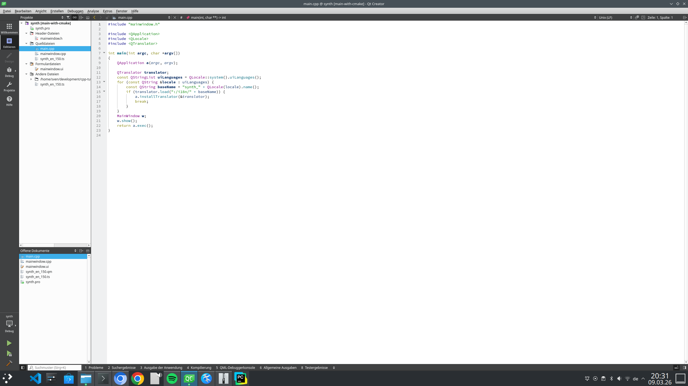



=== Eine GUI ist eine *fantastische* Idee ... Aber welche soll es sein – SDL, wxWidgets oder Qt?

Die Wahl eines GUI-Frameworks für ein C++-Audio-Projekt ist ein „Fork in the Road“-Moment. Jede dieser Optionen lenkt das Projekt in eine völlig andere architektonische Richtung.

Da dein Kurs derzeit SDL verwendet, ist es der natürliche Favorit. So sieht der Vergleich im Kontext eines Synthesizer-Projekts aus:

1. **SDL (Simple DirectMedia Layer) – Die „Low-Level“-Wahl**

Da du SDL bereits in Tutorial 02 eingeführt hast, ist es der Weg mit dem geringsten Widerstand, dabei zu bleiben.

*Pros:* Es „übernimmt“ deine `main()`-Funktion nicht so aggressiv wie die anderen. Es eignet sich hervorragend für selbst gezeichnete Drehregler und Slider mit einfachen Formen oder Bitmaps.

*Der „Audio“-Fit:* Es ist ideal für Visualizer (Oszilloskope oder Spektrumanalysatoren), da du direkten Zugriff auf den Pixelpuffer oder hardwarebeschleunigtes Rendering hast.

*Cons:* Es hat keine eingebauten „Widgets“ (Buttons, Texteingaben). Du musst dein eigenes UI-System von Grund auf bauen oder eine Bibliothek wie Dear ImGui verwenden.

2. **Qt – Die „professionelle/industrielle“ Wahl**

Qt ist der Schwergewichtschampion. Wenn dein Synth wie eine moderne DAW (Digital Audio Workstation) oder ein kommerzielles Plugin aussehen soll, ist das die richtige Wahl.

*Pros:* Hervorragende Dokumentation und ein „What You See Is What You Get“ (WYSIWYG) Editor. High-DPI-Skalierung und komplexe Layouts werden sehr elegant gehandhabt.

*Der „Audio“-Fit:* Für ein einfaches Tutorial ist es vielleicht überdimensioniert, aber es eignet sich hervorragend, um **Signals und Slots** zu vermitteln – einen C++-Mechanismus, der perfekt nachbildet, wie Patchkabel in einem modularen Synthesizer funktionieren.

*Cons:* Große Binärgröße und eine steile Lernkurve. Außerdem benötigt Qt den **moc** (Meta-Object Compiler), der eine zusätzliche Ebene von „Magie“ hinzufügt und möglicherweise die rohe C++-Logik verbirgt, die du eigentlich vermitteln möchtest.

3. **wxWidgets – Die „native“ Wahl**

wxWidgets verwendet die nativen Controls des Host-Betriebssystems (es sieht unter Windows wie eine Windows-App und unter Linux wie eine GTK-App aus).

*Pros:* Keine „magischen“ Präprozessoren wie bei Qt. Es ist im traditionellen Sinne „reines“ C++.

*Cons:* Es wirkt etwas altmodisch. Eigene, „cool aussehende“ Synth-Regler zu gestalten ist in wxWidgets deutlich schwieriger als in SDL oder Qt, da es darauf ausgelegt ist, wie eine klassische Tabellen- oder Dateimanager-Oberfläche auszusehen.

[width="100%" cols="a,a,a,a"]
|=====
| Feature        | SDL                      | Qt                  | wxWidgets
| Learning Curve | Easy (wenn man SDL kennt)| Steil               | Mittel
| Look & Feel    | Custom/Game-artig        | Modern/Schick      | Nativ/Standard
| Best For...    | Visualizer & Prototyping | Kommerzielle Software | Klassische Desktop-Apps
| C++ Style      | Prozedural/Einfache OOP  | Starke OOP & Makros | Traditionelle OOP
|=====

== Also wählen wir Qt – installieren wir die Abhängigkeiten und die Qt-Creator-IDE

Wir beginnen einfach damit, Qt 5 plus Abhängigkeiten zu installieren (ungefähr 500 MB):


```
sudo apt install qtbase5-dev qtchooser qt5-qmake qtbase5-dev-tools qtcreator
```

== Der QtCreator



image:./qt_creator_designer.png[QtCreator Designer]

Der QtCreator erlaubt es uns – zum Beispiel unsere eigene Benutzeroberfläche zu erstellen ...

Wir beginnen mit der einfachen *.pro(jekt)-Datei, die beim Anlegen eines neuen Projekts generiert wird ...

synth.pro

QT       += core gui
QT       += multimedia
greaterThan(QT_MAJOR_VERSION, 4): QT += widgets

CONFIG += c++17

# You can make your code fail to compile if it uses deprecated APIs.
# In order to do so, uncomment the following line.
#DEFINES += QT_DISABLE_DEPRECATED_BEFORE=0x060000    # disables all the APIs deprecated before Qt 6.0.0

SOURCES += \
    main.cpp \
    mainwindow.cpp

HEADERS += \
    mainwindow.h

FORMS += \
    mainwindow.ui

TRANSLATIONS += \
    synth_en_150.ts
CONFIG += lrelease
CONFIG += embed_translations

# Default rules for deployment.
qnx: target.path = /tmp/$${TARGET}/bin
else: unix:!android: target.path = /opt/$${TARGET}/bin
!isEmpty(target.path): INSTALLS += target


== Der Meta-Object Compiler (moc)



Der Meta-Object Compiler, kurz moc, ist das Werkzeug, das Qt zu mehr macht als nur eine gewöhnliche C++-Bibliothek.
Obwohl C++ sehr leistungsfähig ist, fehlte ihm historisch gesehen Introspektion – also die Fähigkeit eines Programms,
seine eigene Struktur (wie Klassen, Methoden oder Eigenschaften) zur Laufzeit zu untersuchen.

Der moc löst dieses Problem, indem er zusätzlichen C++-Code generiert, der die Lücke zwischen Standard-C++ und den erweiterten Qt-Funktionen schließt.



=== Funktionsweise

Der moc ist kein Ersatz für deinen Compiler (wie GCC oder Clang), sondern ein Präprozessor. Der typische Workflow sieht so aus:

Scanning:
Der moc liest deine C++-Headerdateien.

Detection:
Er sucht nach dem Makro Q_OBJECT. Wenn er es findet, weiß er, dass diese Klasse „Meta-Fähigkeiten“ benötigt.

Generation:
Er erzeugt eine neue C++-Datei (normalerweise moc_filename.cpp), die den Meta-Object-Code enthält.

Compilation:
Dein normaler Compiler kompiliert sowohl deinen ursprünglichen Code als auch den vom moc generierten Code und linkt beide in das finale Binary.

Wichtige Funktionen, die durch moc ermöglicht werden

Ohne den Meta-Object Compiler würden die folgenden zentralen Qt-Funktionen nicht existieren:

1. Signals und Slots
Dies ist Qts charakteristische Methode, mit der Objekte miteinander kommunizieren. Da Standard-C++ kein eingebautes „signal“-Schlüsselwort besitzt, erzeugt der moc den notwendigen „Glue Code“, um Funktionen anhand ihres Namens zu finden und auszuführen, wenn ein Signal ausgelöst wird.

2. Introspektion (Run-Time Type Information)
Du kannst ein QObject zur Laufzeit nach seinem Klassennamen fragen, welche Signale es besitzt oder welche Methoden verfügbar sind – über metaObject(). Das ist wesentlich aussagekräftiger als das Standard-C++-typeid.

3. Properties
Der moc ermöglicht das Q_PROPERTY-System, mit dem sich Klassenmitglieder wie Properties in Sprachen wie Python oder C# behandeln lassen. Werte können über String-Namen gelesen oder gesetzt werden – was besonders für Qt Quick (QML) wichtig ist.

==


main.cpp

#include "mainwindow.h"
#include <QApplication>
#include <QLocale>
#include <QTranslator>

int main(int argc, char *argv[])
{
    QApplication a(argc, argv);

    QTranslator translator;
    const QStringList uiLanguages = QLocale::system().uiLanguages();
    for (const QString &locale : uiLanguages) {
        const QString baseName = "synth_" + QLocale(locale).name();
        if (translator.load(":/i18n/" + baseName)) {
            a.installTranslator(&translator);
            break;
        }
    }
    MainWindow w;
    w.show();
    return a.exec();
}



mainwindow.h
{{< hcode
lang="cpp"
hl_lines="3"
c0="1-2:header guard start"
c1="4-9:Qt includes used by the application"
c2="11-13:forward declaration of the UI class"
c3="15:MainWindow class declaration"
c4="17:enable Qt meta-object system (signals/slots)"
c5="19-21:constructor and destructor"
c6="23-26:private members including UI and audio objects"
c7="28-29:Qt paint event override for drawing the waveform"
c8="31-34:waveform data, frequency value, and waveform generator function"
c9="36:AudioGenerator class declaration (custom audio device)"
c10="37:enable Qt meta-object system"
c11="39-41:constructor and frequency setter"
c12="43-52:readData() generates the sine wave audio samples"
c13="54-56:writeData() unused for this generator"
c14="58-61:internal audio state variables"
c15="62:header guard end"
>}}
#ifndef MAINWINDOW_H
#define MAINWINDOW_H

#include <QMainWindow>
#include <QVector>
#include <QPointF>
#include <QtMath>
#include <QAudioOutput>
#include <QIODevice>

QT_BEGIN_NAMESPACE
namespace Ui { class MainWindow; }
QT_END_NAMESPACE

class MainWindow : public QMainWindow
{
    Q_OBJECT

public:
    MainWindow(QWidget *parent = nullptr);
    ~MainWindow();

private:
    Ui::MainWindow *ui;
    // In der mainwindow.h unter private:
    class AudioGenerator *m_generator;
    class QAudioOutput *m_audioOutput;

protected:
    void paintEvent(QPaintEvent *event) override; // This draws the waveform

private:
    QVector<QPointF> waveformPoints;
    float currentFreq = 440.0;
    void generateWaveform(); // Logic to calculate the sine wave
};

class AudioGenerator : public QIODevice {
    Q_OBJECT
public:
    // Konstruktor mit Parent, damit Qt den Speicher verwalten kann
    AudioGenerator(QObject *parent = nullptr) : QIODevice(parent) {}

    void setFrequency(float f) { m_frequency = f; }

    qint64 readData(char *data, qint64 maxlen) override {
        qint16 *samples = reinterpret_cast<qint16*>(data);
        int sampleCount = maxlen / sizeof(qint16);
        for (int i = 0; i < sampleCount; ++i) {
            float val = 8000.0 * qSin(m_phase);
            samples[i] = static_cast<qint16>(val);
            m_phase += 2.0 * M_PI * m_frequency / 44100.0;
            if (m_phase > 2.0 * M_PI) m_phase -= 2.0 * M_PI;
        }
        return maxlen;
    }

    qint64 writeData(const char *data, qint64 len) override {
        Q_UNUSED(data); Q_UNUSED(len); return 0;
    }

private:
    float m_frequency = 440.0;
    float m_phase = 0.0;
};
#endif // MAINWINDOW_H


mainwindow.cpp
{{< hcode
lang="cpp"
hl_lines="3"
c0="1-3:includes"
c1="5:MainWindow constructor definition"
c2="7-8:initialize base class and UI pointer"
c3="10:initialize UI widgets"
c4="12-18:define audio format (44.1 kHz mono PCM)"
c5="20-25:create audio generator and audio output"
c6="27-33:connect slider to update frequency, waveform, and repaint"
c7="35-36:initial waveform generation"
c8="39:generateWaveform() function definition"
c9="40-46:calculate sine wave points for visualization"
c10="49:paintEvent() override definition"
c11="52-53:create QPainter and enable antialiasing"
c12="55-56:draw oscilloscope background"
c13="58-60:draw waveform polyline"
c14="63:MainWindow destructor"
c15="64-65:stop audio output and clean up UI"
>}}
#include "mainwindow.h"
#include "ui_mainwindow.h"
#include <QPainter>

MainWindow::MainWindow(QWidget *parent)
    : QMainWindow(parent)
    , ui(new Ui::MainWindow)
{
    ui->setupUi(this);

    // 1. Audio-Format definieren (Standard CD-Qualität)
    QAudioFormat format;
    format.setSampleRate(44100);
    format.setChannelCount(1);
    format.setSampleSize(16);
    format.setCodec("audio/pcm");
    format.setByteOrder(QAudioFormat::LittleEndian);
    format.setSampleType(QAudioFormat::SignedInt);

    // 2. Audio-Generator (Logik im Header) und Output initialisieren
    m_generator = new AudioGenerator(this);
    m_generator->open(QIODevice::ReadOnly);

    m_audioOutput = new QAudioOutput(format, this);
    m_audioOutput->start(m_generator);

    // 3. Slider-Verbindung: Ändert Tonhöhe und Grafik gleichzeitig
    connect(ui->freqSlider, &QSlider::valueChanged, this, [this](int value) {
        currentFreq = static_cast<float>(value);
        m_generator->setFrequency(currentFreq); // Ändert die Audio-Frequenz
        generateWaveform();                     // Berechnet neue Punkte für das Oszilloskop
        update();                               // Erzwingt das Neuzeichnen (paintEvent)
    });

    // Initiale Berechnung der Wellenform
    generateWaveform();
}

void MainWindow::generateWaveform() {
    waveformPoints.clear();
    // Wir nutzen die Breite des Fensters als Basis für die X-Achse
    for (int x = 0; x < width(); ++x) {
        // Die Konstante 3.14... ersetzt M_PI, falls Makros nicht gefunden werden
        float y = 80 * qSin(2 * 3.14159265 * currentFreq * (float)x / 10000.0);
        waveformPoints.append(QPointF(x, 200 + y));
    }
}

void MainWindow::paintEvent(QPaintEvent *event) {
    (void)event; // Verhindert Warnung über ungenutzten Parameter
    QPainter painter(this);
    painter.setRenderHint(QPainter::Antialiasing);

    // Zeichne den schwarzen "Bildschirm" des Oszilloskops
    painter.fillRect(0, 100, width(), 200, Qt::black);

    // Zeichne die grüne "Phosphor"-Linie
    painter.setPen(QPen(Qt::green, 2));
    painter.drawPolyline(waveformPoints.data(), waveformPoints.size());
}

MainWindow::~MainWindow() {
    m_audioOutput->stop(); // Audio-Stream sauber beenden
    delete ui;
}


<?xml version="1.0" encoding="UTF-8"?>
<ui version="4.0">
 <class>MainWindow</class>
 <widget class="QMainWindow" name="MainWindow">
  <property name="geometry">
   <rect>
    <x>0</x>
    <y>0</y>
    <width>800</width>
    <height>600</height>
   </rect>
  </property>
  <property name="windowTitle">
   <string>MainWindow</string>
  </property>
  <widget class="QWidget" name="centralwidget">
   <widget class="QSlider" name="freqSlider">
    <property name="geometry">
     <rect>
      <x>230</x>
      <y>460</y>
      <width>160</width>
      <height>16</height>
     </rect>
    </property>
    <property name="maximum">
     <number>2000</number>
    </property>
    <property name="orientation">
     <enum>Qt::Horizontal</enum>
    </property>
   </widget>
   <widget class="QLabel" name="label">
    <property name="geometry">
     <rect>
      <x>230</x>
      <y>440</y>
      <width>54</width>
      <height>17</height>
     </rect>
    </property>
    <property name="text">
     <string>Frequenz</string>
    </property>
   </widget>
  </widget>
  <widget class="QMenuBar" name="menubar">
   <property name="geometry">
    <rect>
     <x>0</x>
     <y>0</y>
     <width>800</width>
     <height>22</height>
    </rect>
   </property>
  </widget>
  <widget class="QStatusBar" name="statusbar"/>
 </widget>
 <resources/>
 <connections/>
</ui>



== From linear to logarithmic



Human perception of pitch and loudness is logarithmic, so the slider must be mapped using an exponential function.

The standard approach:

[role=“image”,“./logarithmic_scale_formula.svg” ,imgfmt=“svg”]
\large \[f = f_{min} * (f_{max} / f_{min} )^{(slider/maxSlider)}\]

This is the valid approach for both, volume and frequency.



So next we show the both adapted files mainwindow.h and mainwindow.cpp

mainwindow.h


#ifndef MAINWINDOW_H
#define MAINWINDOW_H

#include <QMainWindow>
#include <QVector>
#include <QPointF>
#include <QIODevice>

QT_BEGIN_NAMESPACE
namespace Ui { class MainWindow; }
QT_END_NAMESPACE

class QAudioOutput;
class QPaintEvent;

class AudioGenerator : public QIODevice
{
    Q_OBJECT

public:
    explicit AudioGenerator(QObject *parent = nullptr);

    void setFrequency(float frequency);
    void setAmplitude(float amplitude);

    qint64 readData(char *data, qint64 maxlen) override;
    qint64 writeData(const char *data, qint64 len) override;

private:
    float m_frequency = 440.0f;
    float m_phase = 0.0f;
    float m_amplitude = 8000.0f;
};

class MainWindow : public QMainWindow
{
    Q_OBJECT

public:
    explicit MainWindow(QWidget *parent = nullptr);
    ~MainWindow() override;

protected:
    void paintEvent(QPaintEvent *event) override;

private:
    static float sliderToLogFrequency(int value, int minValue, int maxValue,
                                      float minFreq, float maxFreq);
    static float sliderToLogAmplitude(int value, int minValue, int maxValue,
                                      float minAmp, float maxAmp);
    void generateWaveform();

    Ui::MainWindow *ui = nullptr;
    AudioGenerator *m_generator = nullptr;
    QAudioOutput *m_audioOutput = nullptr;
    QVector<QPointF> waveformPoints;
    float currentFreq = 440.0f;
};

#endif // MAINWINDOW_H




mainwindow.cpp


#include "mainwindow.h"
#include "ui_mainwindow.h"

#include <QAudioFormat>
#include <QAudioOutput>
#include <QPainter>
#include <QPaintEvent>
#include <QSlider>
#include <QtMath>

namespace {
constexpr float kMinFreq = 20.0f;
constexpr float kMaxFreq = 20000.0f;
constexpr float kMinAmp = 0.0f;
constexpr float kMaxAmp = 16000.0f;
constexpr int kFreqSliderDefault = 895; // ~440 Hz on a 0..2000 logarithmic slider
}

AudioGenerator::AudioGenerator(QObject *parent)
    : QIODevice(parent)
{
}

void AudioGenerator::setFrequency(float frequency)
{
    m_frequency = frequency;
}

void AudioGenerator::setAmplitude(float amplitude)
{
    m_amplitude = amplitude;
}

qint64 AudioGenerator::readData(char *data, qint64 maxlen)
{
    qint16 *samples = reinterpret_cast<qint16 *>(data);
    const int sampleCount = static_cast<int>(maxlen / static_cast<qint64>(sizeof(qint16)));

    for (int i = 0; i < sampleCount; ++i) {
        const float value = m_amplitude * qSin(m_phase);
        samples[i] = static_cast<qint16>(value);

        m_phase += static_cast<float>(2.0 * M_PI) * m_frequency / 44100.0f;
        if (m_phase >= static_cast<float>(2.0 * M_PI)) {
            m_phase -= static_cast<float>(2.0 * M_PI);
        }
    }

    return static_cast<qint64>(sampleCount) * static_cast<qint64>(sizeof(qint16));
}

qint64 AudioGenerator::writeData(const char *data, qint64 len)
{
    Q_UNUSED(data)
    Q_UNUSED(len)
    return 0;
}

MainWindow::MainWindow(QWidget *parent)
    : QMainWindow(parent)
    , ui(new Ui::MainWindow)
    , m_generator(new AudioGenerator(this))
{
    ui->setupUi(this);

    QAudioFormat format;
    format.setSampleRate(44100);
    format.setChannelCount(1);
    format.setSampleSize(16);
    format.setCodec("audio/pcm");
    format.setByteOrder(QAudioFormat::LittleEndian);
    format.setSampleType(QAudioFormat::SignedInt);

    m_generator->open(QIODevice::ReadOnly);
    m_generator->setAmplitude(8000.0f);

    m_audioOutput = new QAudioOutput(format, this);
    m_audioOutput->start(m_generator);

    ui->freqSlider->setRange(0, 2000);

    connect(ui->freqSlider, &QSlider::valueChanged, this, [this](int value) {
        currentFreq = sliderToLogFrequency(value,
                                           ui->freqSlider->minimum(),
                                           ui->freqSlider->maximum(),
                                           kMinFreq,
                                           kMaxFreq);
        m_generator->setFrequency(currentFreq);
        generateWaveform();
        update();
    });

    if (QSlider *volumeSlider = findChild<QSlider *>(QStringLiteral("volumeSlider"))) {
        connect(volumeSlider, &QSlider::valueChanged, this, [this, volumeSlider](int value) {
            const float amplitude = sliderToLogAmplitude(value,
                                                         volumeSlider->minimum(),
                                                         volumeSlider->maximum(),
                                                         kMinAmp,
                                                         kMaxAmp);
            m_generator->setAmplitude(amplitude);
        });
    }

    ui->freqSlider->setValue(kFreqSliderDefault);
    currentFreq = sliderToLogFrequency(ui->freqSlider->value(),
                                       ui->freqSlider->minimum(),
                                       ui->freqSlider->maximum(),
                                       kMinFreq,
                                       kMaxFreq);
    m_generator->setFrequency(currentFreq);
    generateWaveform();
}

MainWindow::~MainWindow()
{
    if (m_audioOutput != nullptr) {
        m_audioOutput->stop();
    }
    delete ui;
}

float MainWindow::sliderToLogFrequency(int value, int minValue, int maxValue,
                                       float minFreq, float maxFreq)
{
    if (maxValue <= minValue || minFreq <= 0.0f || maxFreq <= minFreq) {
        return minFreq;
    }

    const float normalized = static_cast<float>(value - minValue)
                           / static_cast<float>(maxValue - minValue);
    return minFreq * qPow(maxFreq / minFreq, normalized);
}

float MainWindow::sliderToLogAmplitude(int value, int minValue, int maxValue,
                                       float minAmp, float maxAmp)
{
    if (maxValue <= minValue || maxAmp < minAmp) {
        return minAmp;
    }

    const float normalized = static_cast<float>(value - minValue)
                           / static_cast<float>(maxValue - minValue);

    if (normalized <= 0.0f) {
        return minAmp;
    }

    return minAmp + (maxAmp - minAmp) * qPow(normalized, 2.0f);
}

void MainWindow::generateWaveform()
{
    waveformPoints.clear();
    waveformPoints.reserve(width());

    for (int x = 0; x < width(); ++x) {
        const float y = 80.0f * qSin((2.0f * static_cast<float>(M_PI) * currentFreq * static_cast<float>(x)) / 10000.0f);
        waveformPoints.append(QPointF(x, 200.0 + y));
    }
}

void MainWindow::paintEvent(QPaintEvent *event)
{
    Q_UNUSED(event)

    QPainter painter(this);
    painter.setRenderHint(QPainter::Antialiasing);
    painter.fillRect(0, 100, width(), 200, Qt::black);
    painter.setPen(QPen(Qt::green, 2));

    if (!waveformPoints.isEmpty()) {
        painter.drawPolyline(waveformPoints.constData(), waveformPoints.size());
    }
}

