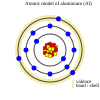
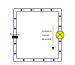
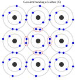
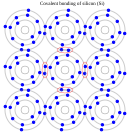
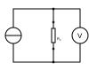
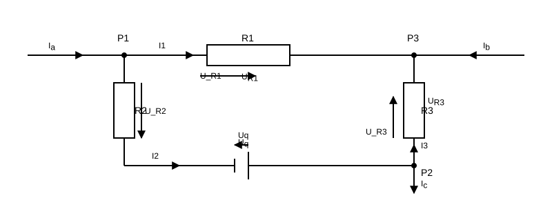
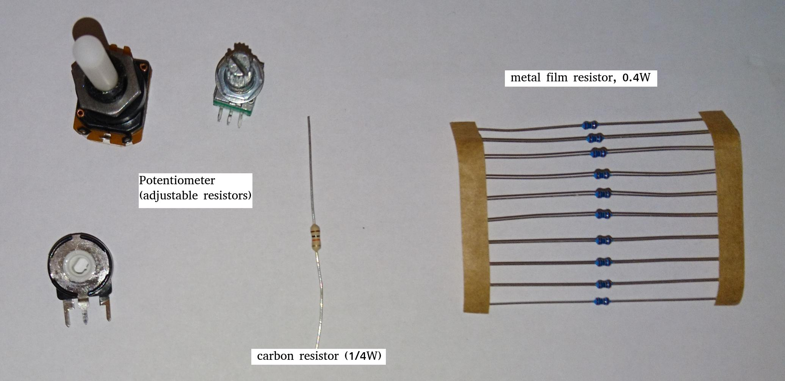




Nach diesem Kapitel kennen Sie alle Grundlagen rund um Elektrizität und einfache Schaltungen mit ohmscher Last...


= Vorwort Einführung in die Elektronik

‚‘'
Als ich gerade dabei war, den Teil über die Umsetzung der Booleschen Algebra zu schreiben, also die grundlegenden Logikgatter,
geriet der Schreibprozess schnell außer Kontrolle und ich merkte, dass ich mehr über weniger relevante Themen schrieb,
wie die Erklärung grundlegender elektronischer Komponenten und deren Umsetzung auf Silizium, als über den eigentlichen Inhalt.
Hier soll nun Platz für diese Exkurse sein. Dies soll keine vollständige Referenz sein, sondern eher eine Ergänzung zur
bestehenden Literatur.
'‚‘

== Freie Elektronen und elektrischer Strom

Was ist Elektrizität? Grob gesagt ist es der Fluss von Elektronen in einem Leiter. Laienhaft ausgedrückt kann man sagen, dass
Elektronen auf der Außenhülle – auch Valenzband genannt – eines Atoms vom Valenzband
eines Atoms zum benachbarten springen. Im Wesentlichen besteht Elektrizität also aus der Bewegung von Elektronen durch Materie.
In der praktischen Anwendung ist diese Materie ein elektrischer Stromkreis, aber auch beispielsweise bei einer Blitzentladung
kann die ionisierte Luft als (Kurz-)Schluss betrachtet werden.

////
darüber schreiben

Die folgende Tabelle zeigt die Atommodelle von Kohlenstoff, Silizium und Kupfer als Leiter. Der Autor wählt diese Elemente
aufgrund ihrer interessanten Eigenschaften aus. Kohlenstoff und Silizium gehören zur Gruppe der Halbleiter, während Kupfer als
ausgezeichneter Leiter bekannt ist. Die Leitfähigkeit von Halbleitern ist in hohem Maße variabel und hängt von ihrem Reinheitsgrad und ihrer Temperatur ab.

////

=== Auf atomarer Ebene: Leiter...

Die erste Gruppe von Elementen (oder Verbindungen), die wir hier vorstellen, sind die Leiter.
Wichtige Vertreter dieser Gruppe sind die Elemente Aluminium und Kupfer,
die beide für Stromübertragungsleitungen und Stromnetze unverzichtbar sind.
Wie die folgende Tabelle zeigt, verfügen beide Elemente über freie Elektronen in ihrer Valenzschale,
 die, wie oben beschrieben, erforderlich sind, damit Elektronen von einem Atom
zum anderen springen können und somit eine Bewegung der Elektronen ermöglichen, wodurch das Element (in seiner reinen Form) zu einem Leiter wird.

Natürlich gibt es in der Realität mehrere Faktoren, die den hier dargestellten idealen Eigenschaften entgegenwirken
. So müssen wir unter anderem berücksichtigen, dass Metalle oxidieren, wenn sie mit Sauerstoff in Kontakt kommen,
wodurch sich eine dünne, aber wirksame Isolierschicht auf der Oberfläche des Metalls bildet,
die einen guten Kontakt verhindert. Wir werden solche Effekte später noch diskutieren. Lassen Sie uns zunächst mit dem Thema fortfahren...

[width="100%" cols="a,a"]
|=====
2+>| Leiter
| 
| image:./atomic_model_Cu.svg[width="300px"]
| Atommodell von Aluminium (13) | Atommodell von Kupfer (28)
| Valenzschale / freie Elektronen: 3 (3) | Valenzschale / freie Elektronen: 1 (1)
|=====

[role=„image“, „./elemental_charge.svg“, imgfmt="svg"]
\large \[Q = N \cdot (\pm e)\]

[role=„image“, „./current.svg“, imgfmt="svg"]
\large \[I = \frac{\Delta Q }{\Delta t}\]

=== ...und nicht so leitfähig

Die zweite Gruppe von Elementen, die wir hier vorstellen möchten, sind Elemente, deren
Leitfähigkeit (stark) von ihrem Reinheitsgrad und Umweltfaktoren
wie der Temperatur abhängt. Vertreter dieser Gruppe werden als Halbleiter bezeichnet.
Kohlenstoff und Silizium sind Beispiele, die im Periodensystem zu finden sind.
Der Autor hat diese beiden Elemente ausgewählt, da sie sehr interessante Eigenschaften
in Bezug auf – aber nicht nur – die Leitfähigkeit aufweisen. Dies ist auf die Anzahl der Valenzelektronen
in der Außenhülle zurückzuführen.

[width="100%"" cols="a,a"]
|=====
2+>| Halbleiter
| image:./atomic_model_C.svg[width="300px“]
| image:./atomic_model_Si.svg[width="300px“]
| Atommodell von Kohlenstoff (6) | Atommodell von Silizium (14)
| Valenzschale / freie Elektronen: 4 (0) | Valenzschale / freie Elektronen: 4 (0)
|=====

Warum haben Kohlenstoff und Silizium trotz ihrer vier Elektronen
in der Valenzschale so schlechte Leitfähigkeitseigenschaften im Vergleich zu Kupfer?

Die Antwort liegt in der einfachen Tatsache, dass sowohl Kohlenstoff als auch Silizium ein Gitter bilden, das alle Elektronen der Valenzschale
verbraucht.

[width="100%“ cols="a,a"]
|=====
| kovalente Bindung von Kohlenstoff | kovalente Bindung von Silizium
| 
| 
2+>|Halbleiter | Leiter
|=====

== Spannung und Potential

Die folgende Tabelle zeigt die gängigen Symbole für Spannungsquellen. Auf der linken Seite
ist eine ideale Spannungsquelle dargestellt, auf der rechten Seite eine reale Spannungsquelle.
 Wie Sie sehen können, ähnelt die reale Quelle einer Batteriezelle. Natürlich kann sich die
Spannungsquelle von einer tatsächlichen Batteriezelle unterscheiden und wird meist auch nicht implizit dargestellt.

[width="100%“ cols="a,a"]
|=====
| ideale Spannungsquelle | reale Spannungsquelle
| image:./ideal_voltage_source.svg[width="150px“]
| 
|=====

Eine ideale Spannungsquelle liefert eine Spannung eines bestimmten Niveaus.

Wie wir in den unten gezeigten Schaltplänen sehen können, ist eine Spannung lediglich die Differenz zwischen zwei Potentialen.
Im ersten Beispiel (links) wird die Verbindungsstelle unten als Referenzpunkt gewählt, da sie
als Masse gekennzeichnet ist. Die Spannung beträgt also 1,5 V für U_B0 bzw. 3 V für U_A0.
Im Beispiel rechts hingegen wird die Verbindungsstelle zwischen den Batteriezellen als Referenzpunkt und Masse gewählt.
Die hier gemessenen Potentialunterschiede sind: U_A0 = 1,5 V und U_B0 = -1,5 V.
Als Anmerkung sei gesagt, dass doppelte Stromversorgungen wie diese – allerdings mit einem Spannungsbereich von 12...15 V – häufig für
Anwendungen mit Operationsverstärkern verwendet werden.

[width="100%“ cols="a,a"]
|=====
| Einfaches Netzteil | Doppeltes Netzteil
| image:./potential_l.svg[width="250px“] | image:./potential_ll.svg[width="250px“]
|=====

[role=„image“, „../images/electronic_basics/potentialdifference.svg“, imgfmt="svg"]
\large \[U = \phi_{1} - \phi_{0}\]

////
Einfacher Schaltkreis mit Spannungsquelle und Widerstand, Brücke zum nächsten Abschnitt
////
Das nächste Bild zeigt den einfachsten möglichen Stromkreis: Eine Spannungsquelle mit einem Widerstand in Reihe.
Physikalisch gesehen ist jeder Widerstand lediglich ein  Wandler von elektrischer Energie in thermische Energie, also Wärme.

Widerstände werden in Stromkreisen im Allgemeinen verwendet, um die Spannung auf das gewünschte Niveau zu senken bzw.
den Stromfluss zwischen bestimmten Pfaden eines Stromkreises zu begrenzen. Mehr dazu erfahren wir im nächsten Abschnitt.

image:./resistor_circuit.svg[width="250px“]

== Ohmsches Gesetz und Leitungswiderstand

*Übung: Widerstand messen*
Um die folgende Übung durchzuführen, benötigen Sie ein Voltmeter und ein Amperemeter (oder einfach zwei Multimeter), eine variable Spannungsquelle und
einige Probenkabel aus unterschiedlichen Materialien, die jedoch alle die gleiche Länge und den gleichen Durchmesser haben.
Wenn Sie nicht über die erforderliche Ausrüstung verfügen, können Sie diese Übung theoretisch auch in http://qucs.sourceforge.net[Qucs] oder
https://www.analog.com/en/design-center/design-tools-and-calculators/ltspice-simulator.html[LTspice] simulieren.

Da wir jedoch die Parameter der Messdrähte, die wir messen möchten, im Voraus definieren müssen,
 würde dieser Ansatz den Zweck der Übung, nämlich das Erlernen der indirekten Messung des elektrischen
Widerstands, zunichte machen.

Schließen Sie die Geräte gemäß der unten gezeigten Abbildung an, wobei der Probenleiter als Widerstand Rx dient.

//.Prinzip der Widerstandsmessung
image:./resistance_measurement_l.svg[width="550px"]

Messen Sie nun für jeden Draht die Spannung und den Strom und zeichnen Sie ein Diagramm mit der Spannung auf der x-Achse und dem Strom auf der y-Achse.
Sie werden feststellen, dass Sie für verschiedene Materialien ein lineares Diagramm erhalten, jedoch mit unterschiedlicher Steigung. Sie haben also eine Beziehung
zwischen Spannung, Strom und Widerstand gefunden. Zusätzlich können Sie nach der Messung der verschiedenen Drähte auch Stift und Papier verwenden: Zeichnen Sie eine Linie mit
einem Bleistift oder kritzeln Sie einen kleinen Bereich. Verbinden Sie diese nun mit den Sonden der Messvorrichtung. Sie werden sehen, dass auch
die Graphitspur als Leiter fungiert – zwar kein optimaler, aber dennoch ein Leiter.

Diese Beobachtung führt uns zu der wichtigsten Formel, die Sie in einem Einführungskurs in die Elektrotechnik kennenlernen werden: dem Ohmschen Gesetz.

[role=„image“,„../images/electronic_basics/ohms_law.svg“ ,imgfmt=„svg“]
\large \[ R [\Omega] = \frac{U [V]}{I [A]}\]

// .Ohmsches Gesetz
// :figure-caption: Gleichung

Wenn wir diese Gleichung in ihre einfachere, interpretierbare Form U = R·I umstellen, erkennen wir, dass der Spannungsabfall (U) am Widerstand dem Widerstandswert ( R) mal dem durchfließenden Strom (I) entspricht.
Über den Strom haben wir noch nicht gesprochen, das verschieben wir auf einen späteren Abschnitt.
Wie in den Klammern angegeben, ist die Einheit des Widerstands Ω.
// Todo: Mehr über das Ohmsche Gesetz schreiben.

////
Regeln für Reihen- und Parallelschaltungen hinzufügen
////
In der Abbildung unten sind die Regeln für die Reihen- und Parallelschaltung von Widerständen dargestellt.

Bei der Reihenschaltung addieren sich die Werte einfach, wie wir es bei den Spannungsquellen gesehen haben.
Bei der Parallelschaltung gilt dasselbe, jedoch für die Leitfähigkeit G, die der Kehrwert
des Widerstands R ist und in S (Siemens) gemessen wird.

////
Erklärung für Parallelschaltung hinzufügen
////

Wir haben also festgestellt, dass sich die Materialien in ihrer elektrischen Leitfähigkeit unterscheiden – die der Kehrwert des elektrischen Widerstands ist.
Einige sind gut (Leiter), andere ziemlich schlecht und unbrauchbar (Nichtleiter), aber dennoch als Dielektrikum nützlich, wie wir im
nächsten Abschnitt sehen werden, und einige liegen dazwischen.
Wir müssen natürlich auch beachten, dass die Leitfähigkeit nicht nur vom Material selbst abhängt, sondern auch von seiner Geometrie (außerdem hängt sie
auch von der Temperatur ab, aber darauf werde ich hier nicht näher eingehen). Wie Sie wissen, beschäftigen wir uns mit Physik, daher ist eine weitere nützliche Formel/Gleichung
in diesem Zusammenhang die folgende.

[role=„image“,„../images/electronic_basics/wire_resistance.svg“ ,imgfmt=„svg“]
\large \[ R = \frac{\rho L}{A}\]

Bei der gängigsten Rechteckform – wie einem Streifenleiter auf einer Leiterplatte  – ergibt sich die Fläche A aus der Breite mal Höhe

[role=„image“,„../images/electronic_basics/strip_resistance.svg“ ,imgfmt=„svg“]
\large \[ R = \frac{\rho L}{A} = \frac{\rho L}{w \cdot h}\]

Der Gesamtwiderstand eines Drahtes oder eines Streifenleiters auf einer Leiterplatte hängt also vom spezifischen spezifischen Widerstand ρ, der Länge
des Leiters und der zur Stromübertragung genutzten Fläche ab. Logischerweise erhöhen sowohl der spezifische spezifische Widerstand als auch die Länge des Leiters
den Widerstand, während die Fläche diesem entgegenwirkt.

*Warum müssen wir das wissen?*

An dieser Stelle fragen Sie sich vielleicht, warum es wichtig ist, dies zu wissen, wenn wir einfach einen Schaltplan unseres DIY-Projekts zeichnen und es mit diskreten Bauteilen
auf einer Breakout-Platine realisieren können. Die Antwort ist einfach: Skalierbarkeit. Für dieses einfache Hobby-Beispiel mag es funktionieren, aber es mangelt an Skalierbarkeit, Kosten und/oder Zuverlässigkeit.

Je weiter wir uns in der Skalierung nach unten bewegen, desto wichtiger werden parasitäre Effekte – darüber erfahren wir mehr in den folgenden Abschnitten.

Widerstandsmessung

Die folgende Abbildung zeigt das Prinzip der Widerstandsmessung in einem Digitalmultimeter – ohne Berücksichtigung des Bereichsschalters.
Auf der linken Seite haben wir eine Konstantstromquelle, in der Mitte den Widerstand – oder den zu messenden Draht – und auf der linken Seite
ein Voltmeter, das die Spannung misst. Da bei der Konstantstromquelle der Gesamtstrom im Stromkreis bekannt ist, kann der Widerstand
aus der gemessenen Spannung skaliert werden.

// .Widerstandsmessung in einem Digitalmultimeter

== Grundschaltungen


Dies ist ein vereinfachtes Modell zur Veranschaulichung; die reale Halbleiterphysik verhält sich komplexer.


Grundschaltungen in der Elektrotechnik bestehen aus einer Quelle mit Innenwiderstand und einer Last. Je nachdem, wie die Quelle betrachtet wird,
unterscheidet man zwischen einem Grundschaltkreis mit einer Spannungsquelle und einem Grundschaltkreis mit einer Stromquelle.
Bei der Schaltungsanalyse ist es das Ziel, komplexe Schaltungen auf Grundschaltungen zu reduzieren. Grundschaltungen sind definiert als
Reihen- und Parallelschaltungen von Bauteilen.

=== Grundgesetze der Schaltungen

Welche allgemein gültigen Gesetze gelten für jede Schaltung, unabhängig davon, ob die Widerstände darin linear oder nichtlinear sind?
Die drei unten beschriebenen Gesetze bilden die Grundlage für Schaltungsberechnungen.

==== Ohmsches Gesetz

Für jeden Widerstand gilt, wenn Strom und Widerstandswert bekannt sind

[role=“image”,“./ohms_law.svg” ,imgfmt=“svg”]
\[ I[A] = \frac{U[V]}{R[\Omega]} \]

Allerdings weisen nur lineare Widerstände eine Proportionalität zwischen Spannung und Strom auf.

==== Gesetz der elektrischen Leistung

Das zweitwichtigste Gesetz in der Elektrotechnik ist das Gesetz der elektrischen Leistung, wonach die Multiplikation von Spannung und Strom
die elektrische Leistung mit der Einheit „Watt” ergibt.

[role=“image”,“./electriacal_power_law.svg” ,imgfmt=“svg”]
\[ P[W] = U[V]\cdot I[A] \]

Wir werden dieses Gesetz in einem späteren Beitrag näher erläutern...

==== Kirchhoffsches erstes Gesetz

Das erste Gesetz von Kirchhoff besagt: Die Summe aller vorzeichenbehafteten Ströme, die zu einem Knotenpunkt gehören, ist gleich Null:

[role=“image”,“./kirchhoff_law1.svg” ,imgfmt=“svg”]
\large \[ \sum_{i=1}^{n} I_i = 0\]

Ein Knotenpunkt ist jeder Verbindungspunkt von Leitungen in einem Stromkreis. Da an einem Knotenpunkt keine Ladungen erzeugt, verloren oder gespeichert werden,
muss die Menge der Ladungen, die während der Zeit \Delta t in den Knotenpunkt fließen, gleich der Summe der Ladungen sein, die aus dem Knotenpunkt fließen.

==== Kirchhoffsches zweites Gesetz

Das zweite Gesetz von Kirchhoff besagt: Die Summe aller vorzeichenbehafteten Spannungen in einem Netz ist gleich Null:

[role=“image”,“./kirchhoff_law2.svg” ,imgfmt=“svg”]
\large \[ \sum_{i=1}^{n} U_i = 0\]

Ein Netz ist jeder geschlossene Stromkreis in einer Schaltung. Für jedes Netz gilt dasselbe wie für eine unverzweigte Schaltung:
Die Summe aller Spannungen ist gleich Null, da die Ladung nach Abschluss eines Stromkreises wieder auf das gleiche Potenzial wie am Ausgangspunkt zurückgekehrt ist..

==== Beispiel

Betrachten wir eine typische Netzkonfiguration und wenden wir Kirchhoffs erstes und zweites Gesetz darauf an.

==== Kirchhoffsches zweites Gesetz

Das zweite Gesetz von Kirchhoff besagt: Die Summe aller vorzeichenbehafteten Spannungen in einem Netz ist gleich Null:

[role=“image”,“./kirchhoff_law2.svg” ,imgfmt=“svg”]
\large \[ \sum_{i=1}^{n} U_i = 0\]

Ein Netz ist jeder geschlossene Stromkreis in einer Schaltung. Für jedes Netz gilt dasselbe wie für eine unverzweigte Schaltung:
Die Summe aller Spannungen ist gleich Null, da die Ladung nach Abschluss eines Stromkreises wieder auf das gleiche Potenzial wie am Ausgangspunkt zurückgekehrt ist..

==== Beispiel

Betrachten wir eine typische Netzkonfiguration und wenden wir Kirchhoffs erstes und zweites Gesetz darauf an.

==== Lösung:

Kirchhoffsches erstes Gesetz

Das Netz in der obigen Abbildung enthält drei Knotenpunkte. Bei der Anwendung der obigen Gleichung (Kirchhoffsches erstes Gesetz) auf einen Knotenpunkt
werden den einfließenden Strömen ein positives Vorzeichen und den ausfließenden Strömen ein negatives Vorzeichen zugewiesen.

Für den Knotenpunkt P1 gilt:
 (+ I_a) + (-I_1) + (-I_2) = 0
 Darüber hinaus gilt die Gleichung in erweiterter Form auch für die externen Ströme I_a, I_b, I_c eines Netzes. Für die Knoten gilt:

     P1: +I_a - I_1 - I_2 = 0  => I_a = I_1 + I_2

     P2: +I_2 - I_c - I_3 = 0  => I_c = I_2 - I_3

     P3: +I_b + I_3 + I_1 = 0  => I_b = -I_1 - I_3

Gemäß der Knotenregel muss für die drei äußeren Ströme Folgendes gelten:

+ I_a  + I_b -I_c = 0

Überprüfung:

  + I_1 + I_2 - I_1 -I_3 -I_2 + I_3 = 0

2. Kirchhoffsches Gesetz

Im Allgemeinen ist es nicht möglich, Vorhersagen über die Richtung der Ströme zu treffen. Daher werden die Stromrichtungen angenommen.
Die Spannungspfeile auf den Widerständen zeigen dann in die gewählte Stromrichtung. Die Quellspannungspfeile zeigen vom Pluspol
zum Minuspol der Spannungsquelle. Die Umlaufrichtung wurde nach unserem Ermessen gegen den Uhrzeigersinn gewählt, und die
in Umlaufrichtung zeigenden Spannungspfeile wurden als positiv, die anderen als negativ gezählt. Für das oben gezeigte Netzwerksystem erhalten wir:

(+ U_R3) + (-U_R1) + (+ U_R2) + (-U_q) = 0

(+ I_3 * R_3) + (-I_1 * R_1) + (+ I_2 * R_2) + (-U_q) = 0

=== Der Widerstand

Die elektrische Komponente selbst gibt es in allen Formen und Größen, je nach Anwendungsbereich.
Die Miniaturwiderstände für die Oberflächenmontagetechnik, die in allen höher integrierten elektronischen Geräten verwendet werden,
der durchschnittliche 1/4-Watt-Widerstand auf Kohlebasis mit 5 Prozent Toleranz (in der Abbildung unten in der Mitte)
und die präziseren Metallfilmwiderstände mit 1 Prozent Toleranz (blau, rechts in der Abbildung).
Es gibt Widerstände mit mechanisch einstellbarem Widerstand, sogenannte Potentiometer (wie die links im Bild gezeigten).
Andere Typen sind Varistoren, bei denen der Widerstand von der angelegten Spannung abhängt, sowie einige andere Typen wie
NTC/PTC, die von der Temperatur abhängen.

image:./smd_example.jpg[width=300]

//Erläutern Sie den Aufbau und die Konstruktion von SMD-Widerständen.

////
Erläutern Sie das Ganze auf physikalischer Ebene.
Rho und Geometrie (das Gleiche gilt für Kondensatoren und Spulen).
Warum? Weil wir meistens nicht nur mit konzentrierten Komponenten arbeiten,
sondern eher mit verteilten – insbesondere in HF, aber lassen Sie mich
nicht mit HF anfangen. Auch Netzwerk-Dinge – warum brauchen wir das?
///

Übersetzt mit DeepL.com (kostenlose Version)