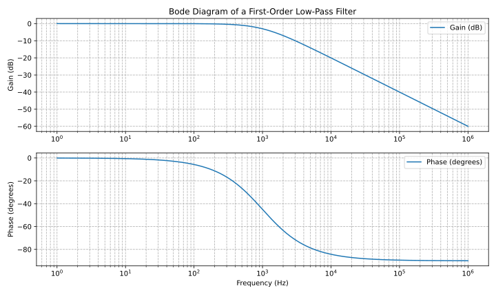
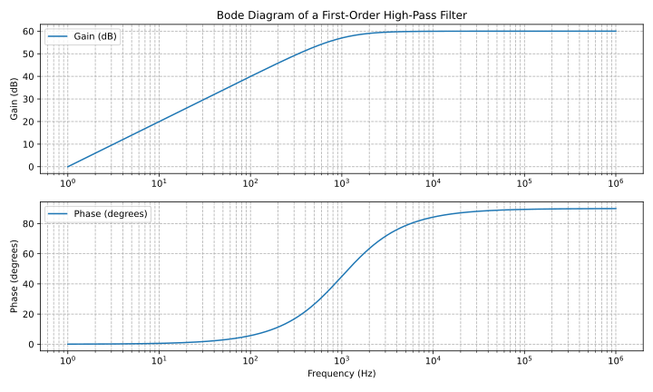




Nach diesem Kapitel kennen Sie alle Grundlagen zu zeitkritischen Bauteilen wie Spulen und Kondensatoren sowie zu einfachen Schaltungen, die diese Bauteile verwenden...


= Elektronik 102

== Zeitabhängige Bauteile

Nachdem wir im ersten Teil das wichtigste Bauteil, den Widerstand, behandelt und ausführlich beschrieben haben,
wollen wir uns nun das nächste wichtige
Bauteil ansehen, den Kondensator. Kondensatoren sind ebenfalls passive Bauteile, das heißt,
sie verstärken kein Signal.

=== Elektrostatisches Feld
Wenn wir zwei Metallplatten nebeneinander legen und dazwischen eine dünne Schicht aus einem nichtleitenden
Material anbringen, entsteht ein elektrostatisches Feld.

Das elektrostatische Feld wird durch eine Gleichstromquelle aufgebaut, die in der Abbildung unten durch den Generator G dargestellt wird.
Die Quellenspannung des Generators verschiebt die Elektronen im Draht und in den Metallplatten.
Auf diese Weise entsteht auf der rechten Platte ein Überfluss an Elektronen (-Q), während auf der anderen Platte ein Mangel
in gleicher Höhe, +Q, entsteht.

Für kurze Zeit fließt ein Ladestrom mit dem Momentanwert i, der in traditioneller Richtung
eine Strommenge +Q fördert. Der Ladestrom i wird null, wenn sich die Strommengen +Q und -Q
ausgleichen.

Das elektrostatische Feld bleibt nach dem Trennen von der Gleichstromquelle bestehen, was mit einem
hochohmigen Voltmeter überprüft werden kann. Die Schlussfolgerung: Das elektrostatische Feld entsteht durch die getrennten Ladungen
+Q, -Q. Die vorhandene Spannung zeigt, dass Energie im Feld gespeichert ist. Diese Anordnung wird als Plattenkondensator bezeichnet.

image:./electrostatic_field.svg[width="300px"]

Referenz: Dieter Zastrow, Elektrotechnik, 16. Auflage, S. 120.
Es handelt sich um ein weiteres grundlegendes elektronisches Bauteil, das häufig
in elektronischen Geräten verwendet wird. Die Substanz dazwischen wird als Dielektrikum bezeichnet.

=== Kapazität
Die Grundgleichung zur Berechnung der Kapazität, der wichtigsten Eigenschaft eines Kondensators, lautet wie folgt.
Die Kapazität C des Kondensators ergibt das interessante Verhältnis der gespeicherten Ladungsmenge Q zur Ladespannung
U_c .

[role=„image“,„../images/electronic_basics/Capacitance.svg“ ,imgfmt=„svg“]
\[C= \frac{Q}{U_c}\]

=== Parallel- und Reihenschaltung

Bei einer Parallelschaltung von Kondensatoren addieren sich die Kapazitäten zur Gesamtkapazität.

[role=„image“,„../images/electronic_basics/parallel_C.svg“ ,imgfmt=„svg“]
\[C= C_{1} + C_{2} + ... \]

Bei einer Reihenschaltung ist der Kehrwert der Gesamtkapazität gleich
der Summe der Kehrwerte der einzelnen Kapazitäten.

[role=„image“,„../images/electronic_basics/series_C.svg“ ,imgfmt=„svg“]
\[ \frac{1}{C}= \frac{1}{C_{1}} + \frac{1}{C_{2}} + ... \]

=== Der Kondensator und die Spulen

Die als nächstes vorgestellten Elemente haben einen Hinweis auf die Statik des (ohmschen) Widerstands.
Nun rückt auch die Zeit in den Fokus, da Kondensatoren und Spulen in gewisser Weise zeitabhängige
Elemente sind.
Normalerweise würden wir also zunächst den Kondensator mit all seinen Implikationen vorstellen und dann zu den Spulen übergehen, die
anschließend vorgestellt werden. In diesem Beitrag zeigen wir stattdessen beide im Vergleich,
da sie sich in ihren Eigenschaften ergänzen.

[width="100%“ cols="a,a"]
|=====
| Leiter | Spule
| 
| image:./coil.svg[width=„300px“]
| Schaltzeichen eines Kondensators | Schaltzeichen einer Spule
| image:./capacitor_scan.png[width=„450px“]
| image:./induction_scan.png[width=„450px“]
| speichert Energie im elektrischen Feld | speichert Energie im magnetischen Feld
| führt in Phase | hinkt in Phase
| blockiert im Gleichstrommodus | im Gleichstrommodus wächst der Strom, während die Spannung mit derselben Rate abnimmt
|
|=====

== Komplexe Berechnung

Um Schaltungen mit Kondensatoren (und/oder Spulen) einfach und genau berechnen zu können, müssen wir
unseren Zahlenbereich von reellen Zahlen auf komplexe Zahlen erweitern. Das bedeutet, dass wir am Ende
nicht nur eine, sondern zwei Dimensionen von Zahlen haben, wie unten dargestellt:

image:./complex_number.png[width=„400px“]

[role=„image“,„./complex_numbers.svg“, imgfmt="svg"]
\[ z = x + yi  \]

wobei i ist:

[role=„image“,„./imaginary_numbers.svg“, imgfmt="svg"]
\[ i = \sqrt(-1) \]

Komplexe Zahlen können sowohl im kartesischen Koordinatensystem wie oben gezeigt
als auch als Polarkoordinaten mit einer Phase \phi und einem Radius r ausgedrückt werden.

[width="100%" cols="a,a"]
|=====
| image:./cart.svg[width="450px"]
| image:./polar.svg[width="450px"]
|=====

=== Berechnungsregeln für komplexe Zahlen

Komplexe Zahlen können entweder in kartesischen Koordinaten oder in Polarkoordinaten berechnet werden.
Das werden wir im nächsten Unterabschnitt analysieren.

==== Berechnungsregeln für kartesische Koordinaten

===== Addition und Subtraktion von kartesischen Koordinaten
==== Berechnungsregeln für kartesische Koordinaten

===== Addition und Subtraktion kartesischer Koordinaten

[role=„image“,„./addition-rule.svg“, imgfmt="svg"]
\[ z = a + bi   w =  c + di \]

[role=„image“,„./addition-rule2.svg“, imgfmt="svg"]
\[ z + w = (a + c) + (b +d) i \]

===== Multiplikation kartesischer Koordinaten

[role=„image“,„./multiplication-rule.svg“, imgfmt="svg"]
\[ z = a + bi   w =  c + di \]

[role=„image“,„./multiplication-rule2.svg“, imgfmt="svg"]
\[ z \cdot w = (a + ci) \cdot (b +di)  = (ac -bd)+ (ad +bc)i mit i^2 = -1 \]

===== Division kartesischer Koordinaten
Um eine komplexe Zahl
z {\displaystyle z} durch eine komplexe Zahl  w≠ 0
{\displaystyle w\neq 0} zu dividieren, erweitern Sie den Bruch um die komplexe Konjugierte zum Nenner.

[role=„image“,„./conjugated-complex-rule.svg“, imgfmt="svg"]
\[ \overline{w} = c -di\]

[role=„image“,„./division-rule2.svg“, imgfmt="svg"]
\[ \frac{z}{w} = \frac{z \cdot \overline{w} }{w \cdot \overline{w}} = \frac{(a + bi) (c-di)}{(c+di)(c - di )} = \frac{ac+bd}{c^2 + d^2} +\frac{bc-ad}{c^2 + d^2} i \]

==== Berechnungsregeln für Polarkoordinaten

===== Addition und Subtraktion von Polarkoordinaten

Da Addition und Subtraktion für Polarkoordinaten nicht definiert sind, müssen wir sie durch Berechnung in kartesischen Koordinaten berechnen
und schließlich wieder in Polarkoordinaten umwandeln.

===== Multiplikation von Polarkoordinaten

[role=„image“,„./multiplication-polar-rule.svg“, imgfmt="svg"]
\[ z_{1} = a + bi   z_{2} =  c + di \]

[role=„image“,„./multiplication-polar-rule2.svg“, imgfmt="svg"]
\[ z_{1} \cdot z_{2} = r_{1} r_{2} \cdot e^{i{(\phi_{1} + \phi_{2})}}\]

===== Division von Polarkoordinaten
Um eine komplexe Zahl
z {\displaystyle z} durch eine komplexe Zahl  w≠ 0

[role=„image“,„./conjugated-divison-rule.svg“, imgfmt="svg"]
\[ \frac{z_{1}}{z_{2}} =\frac{r_{1}}{r_{2}} \cdot e^{{i(\phi_{1} - \phi_{2})}}, mit  r_{2} \neq 0\]


    Da die Variable i in der Elektrotechnik bereits für Strom reserviert ist, verwenden wir stattdessen j als i !


////
- Aufbau Kondensator
- Kondensator im Gleichstromkreis
- RC-Glieder
////

== Frequenzabhängige Netzwerke (Filter)

Eine häufige und sehr beliebte Anwendung von Kondensatoren sind Filter.
Einfache Filter erster Ordnung, wie hier gezeigt, bestehen aus
einem Widerstand und einem Kondensator. Als Nächstes wollen wir die Frequenzantwort
eines Filters berechnen, indem wir die Frequenzantwortfunktion ermitteln,
die sich aus der ausgehenden Spannung geteilt durch die eingehende Spannung ergibt –
dies wird anhand der folgenden Beispiele deutlicher.

=== Tiefpassfilter
Tiefpass 1. Ordnung

Frequenzgang

[role=„image“,„../images/electronic_basics/lowpass_fr.svg“, imgfmt="svg"]
\[ H(\omega) = \frac{U_{out}}{U_{in}} = \frac{(1/j\omega C)}{(R+ 1/j \omega C)} = \frac{(1/j\omega C)\cdot j \omega C}{(R+ 1/j \omega C) \cdot j \omega C } =
\frac{1}{1+ j\omega RC } = \frac{1}{1+ j \omega/ \omega_g}\]

Grenzfrequenz (mit Beispielwerten von R=1kOhm, C= 1µF)
[role=„image“,„../images/electronic_basics/cutoff_fr.svg“, imgfmt="svg"]
\[ \omega_g = \frac{1}{RC} = \frac{1}{1 \cdot 10^3 \cdot 1 \cdot 10^(-6)}= 10^3= 1000 \cdot 1/s\]

image:./lowpass_pz_plot.svg[width=„400px“]

Wir benötigen etwas Hilfe, um das Bode-Diagramm für den oben gezeigten Tiefpass zu erstellen.
Installieren Sie dazu bitte matplotlib mit dem folgenden Befehl:

'''
pip install matplotlib
'''

und führen Sie das folgende Python-Skript aus:

[source, Python]
----

import matplotlib.pyplot as plt
import numpy as np

# Definieren Sie die Übertragungsfunktion eines Tiefpassfilters erster Ordnung (nur Amplitude)
def lowpass_first_order(frequency, cutoff_frequency):
    x = frequency / cutoff_frequency
    return 1 / np.sqrt(1 + x**2)

# Frequenzbereich für das Bode-Diagramm (logarithmische Skala)
frequency = np.logspace(0, 6, 1000)  # Von 10^0 bis 10^6 Hertz

# Grenzfrequenz des Tiefpassfilters
cutoff_frequency = 1000  # Beispielwert – Sie können hier Ihren eigenen Wert festlegen.

# --- BODE-DIAGRAMM ------------------------------------------------- -------

# Berechnung der Verstärkung in Dezibel (20 * log10(Amplitude))
gain_db = 20 * np.log10(lowpass_first_order(frequency, cutoff_frequency))

# Berechnung der Phasenantwort in Grad
phase_deg = np.degrees(np.arctan(-frequency / cutoff_frequency))

plt.figure(figsize=(10, 6))

# Verstärkungsdiagramm (Betrag)
plt.subplot(2, 1, 1)
plt.semilogx(frequency, gain_db, label=‚Verstärkung (dB)‘)
plt.ylabel(‚Verstärkung (dB)‘)
plt.title(‚Bode-Diagramm eines Tiefpassfilters erster Ordnung‘)
plt.grid(which=‚both‘, axis=‚both‘, linestyle=‚--‘)
plt.legend()

# Phasendiagramm
plt.subplot(2, 1, 2)
plt.semilogx(frequency, phase_deg, label=‚Phase (Grad)‘)
plt.xlabel(‚Frequenz (Hz)‘)
plt.ylabel(‚Phase (Grad)‘)
plt.grid(which=‚both‘, axis=‚both‘, linestyle=‚--‘)
plt.legend()

plt.tight_layout()
plt.savefig(‚lowpass_bode_phase.svg‘, format=‚svg‘)
plt.show()

# --- S-PLANE POLE-ZERO PLOT ---------------------------------------------

# Für den 1. Ordnung Tiefpass: H(s) = 1 / (1 + s/ωc)
# Pol bei s = -ωc, keine endliche Nullstelle

omega_c = 2 * np.pi * cutoff_frequency

pole_real = -omega_c
pole_imag = 0.0

plt.figure(figsize=(5, 5))

# Achsen zuerst (damit Marker oben liegen)
plt.axhline(0, linewidth=0.5, zorder=0)
plt.axvline(0, linewidth=0.5, zorder=0)

# Pol(e) – gut sichtbar machen
plt.scatter(pole_real, pole_imag,
            marker=‚x‘, s=150,
            label=‚Pole‘, zorder=3)

# Hier gäbe es theoretisch keine endliche Nullstelle.
# Wenn du eine hypothetische Nullstelle plotten willst, kannst du z.B. s = ∞ nicht darstellen,
# daher lassen wir sie weg.

plt.xlabel(‚Re{s}‘)
plt.ylabel(‚Im{s}‘)
plt.title(‚Pole-Zero Plot (s-plane) of 1st-Order Low-Pass‘)
plt.grid(True, linestyle=‚--‘)
plt.legend()
plt.tight_layout()
plt.savefig(‚lowpass_pz_plot.svg‘, format=‚svg‘)
plt.show()

----

=== Einfacher Tiefpass in LTspice

Wir können unsere Ergebnisse überprüfen, indem wir LTSpice verwenden und unser Modell in dieser Software erstellen.0
Wenn Sie wissen möchten, wie Sie LTspice unter Linux (Debian/Ubuntu) mit Wine verwenden können, schauen Sie bitte
link:https://github.com/joaocarvalhoopen/LTSpice_on_Linux_Ubuntu__How_to_install_and_use[hier].

image:./lowpass_ltspice.png[width="1400px“]

link:./lowpass.asc[LTSpice Lowpass]

=== Hochpassfilter
Hochpass 1. Ordnung

Frequenzgang

[role=„image“,„../images/electronic_basics/highpass_fr.svg“, imgfmt="svg"]
\[ H(\omega) = \frac{U_{out}}{U_{in}} = \frac{R}{R+ 1/j\omega C} = \frac{j \omega C}{1+ j \omega RC} =
\frac{j\omega / \omega_g}{1+ j\omega/ \omega_g}\]

Grenzfrequenz (mit Beispielwerten von R=1kOhm, C= 1µF)

////
[role=„image“, „../images/electronic_basics/cutoff_fr.svg“, imgfmt="svg"]
\[ \omega_g = \frac{1}{RC} = \frac{1}{1 \cdot 10^3 \cdot 1 \cdot 10^6}= 10^3= 1000 \cdot 1/s\]
////

image:./highpass_pz_plot.svg[width="400px“]

Und hier noch einmal das Python-Skript, diesmal für den Hochpass:

=== Hochpassfilter
Hochpass 1. Ordnung

Frequenzgang

[role=„image“,„../images/electronic_basics/highpass_fr.svg“, imgfmt="svg"]
\[ H(\omega) = \frac{U_{out}}{U_{in}} = \frac{R}{R+ 1/j\omega C} = \frac{j \omega C}{1+ j \omega RC} =
\frac{j\omega / \omega_g}{1+ j\omega/ \omega_g}\]

Grenzfrequenz (mit Beispielwerten von R=1kOhm, C= 1µF)

////
[role=„image“, „../images/electronic_basics/cutoff_fr.svg“, imgfmt="svg"]
\[ \omega_g = \frac{1}{RC} = \frac{1}{1 \cdot 10^3 \cdot 1 \cdot 10^6}= 10^3= 1000 \cdot 1/s\]
////

image:./highpass_pz_plot.svg[width="400px“]

Und hier noch einmal das Python-Skript, diesmal für den Hochpass:

[source,python]
----

import matplotlib.pyplot as plt
import numpy as np

# Definieren Sie die Übertragungsfunktion eines Hochpassfilters erster Ordnung (nur Amplitude)
def highpass_first_order(frequency, cutoff_frequency):
    # Normierter Hochpass: |H(jw)| = (f/fc) / sqrt(1 + (f/fc)^2)
    x = frequency / cutoff_frequency
    return x / np.sqrt(1 + x**2)

# Frequenzbereich für das Bode-Diagramm (logarithmische Skala)
frequency = np.logspace(0, 6, 1000)  # Von 10^0 bis 10^6 Hertz

# Grenzfrequenz des Hochpassfilters
cutoff_frequency = 1000  # Beispielwert – Sie können hier Ihren eigenen Wert festlegen.

# Berechnung der Verstärkung in Dezibel (20 * log10(Amplitude))
gain_db = 20 * np.log10(highpass_first_order(frequency, cutoff_frequency))

# Berechnung der Phasenantwort in Grad (Winkel)
# Für H(s) = s / (s + ωc) gilt: φ = 90° - arctan(ω/ωc)
phase_deg = 90 - np.degrees(np.arctan(frequency / cutoff_frequency))

# --- BODE-DIAGRAMM -------- ------------------------------------------------

plt.figure(figsize=(10, 6))

# Verstärkungsdiagramm (Betrag)
plt.subplot(2, 1, 1)
plt.semilogx(frequency, gain_db, label=‚Verstärkung (dB)‘)
plt.ylabel(‚Verstärkung (dB)‘)
plt.title(‚Bode-Diagramm eines Hochpassfilters erster Ordnung‘)
plt.grid(which=‚both‘, axis=‚both‘, linestyle=‚--‘)
plt.legend()

# Phasendiagramm
plt.subplot(2, 1, 2)
plt.semilogx(frequency, phase_deg, label=‚Phase (Grad)‘)
plt.xlabel(‚Frequenz (Hz)‘)
plt.ylabel(‚Phase (Grad)‘)
plt.grid(which=‚both‘, axis=‚both‘, linestyle=‚--‘)
plt.legend()

plt.tight_layout()

# Speichern Sie das Bode-Diagramm als SVG-Datei.
plt.savefig(‚highpass_bode_diagram.svg‘, format=‚svg‘)

# Optional können Sie das Bode-Diagramm anzeigen.
plt.show()

# --- S-PLANE-POL-NULL-PLOT -------- -------------------------------------

omega_c = 2 * np.pi * cutoff_frequency

pole_real = -omega_c
pole_imag = 0.0

zero_real = 0.0
zero_imag = 0.0

plt.figure(figsize=(5, 5))

# Achsen zuerst, mit kleinem zorder
plt.axhline(0, linewidth=0.5, zorder=0)
plt.axvline(0, linewidth=0.5, zorder=0)

# Pol(e) – etwas größer und nach vorne
plt.scatter(pole_real, pole_imag,
            marker=‚x‘, s=150,
            label=‚Pole‘, zorder=3)

# Nullstelle(n) – deutlich sichtbar
plt.scatter(zero_real, zero_imag,
            marker=‚o‘, s=150,
            facecolors=‚none‘, edgecolors=‚red‘,
            linewidths=2,
            label=‚Zero‘, zorder=4)

plt.xlabel(‚Re{s}‘)
plt.ylabel(‚Im{s}‘)
plt.title(‚Pole-Zero Plot (s-Ebene) eines Hochpassfilters erster Ordnung‘)
plt.grid(True, linestyle=‚--‘)
plt.legend()
plt.tight_layout()
plt.savefig(‚highpass_pz_plot.svg‘, format=‚svg‘)
plt.show()


----
=== Einfacher Hochpass in LTspice

Wir können unsere Ergebnisse überprüfen, indem wir LTSpice verwenden und unser Modell in dieser Software erstellen.

image:./highpass_ltspice.png[width="1400px“]

link:./highpass.asc[LTSpice Highpass]

=== Doppel-T-Notch-Filter

Als Nächstes wollen wir uns einen etwas anderen Filter ansehen, der hauptsächlich als Notch-Filter verwendet wird –
https://electronicscoach.com/band-stop-filter.html[siehe die Doppel-Ts].

Beachten Sie hierbei, dass die Kondensatoren im obigen Design so konfiguriert sind, dass die beiden oberen Kondensatoren C sind,
während der Kondensator in der Mitte des Netzwerks 2C ist. Ebenso sind die beiden Widerstände unten R, aber der in der Mitte
ist R/2.
Um einen ordnungsgemäßen Schmalband-Unterdrückungsbetrieb zu gewährleisten, muss diese beschriebene Konfiguration immer beibehalten werden.

image:./notch_filter.svg[width="1000px"]

Die Formel für diesen Filter lautet wie folgt:

[role=„image“,„./formula.svg“, imgfmt="svg"]
\[ f_0 = \frac{1}{2\pi RC}\]

Wenn wir also einen Notch-Filter für 50 Hz erstellen möchten, müssen wir die Werte für R und C berechnen.lowpass_pz_plot
Der Wert für die RC-Konstante wird anhand der folgenden Gleichung berechnet:

[role=„image“,„./formula2.svg“, imgfmt="svg"]
\[ RC = \frac{1}{2\pi f_0}= 0,00318\]

Wenn wir den Wert für R = 10 kOhm festlegen, erhalten wir folgende Ergebnisse:

[role=„image“,„./formula2.svg“, imgfmt="svg"]
\[ C = \frac{RC}{R}= \frac{0,00318}{10000}= \approx 0,0000003183 F = 318nF\]

Daraus ergeben sich die folgenden Werte für die einzelnen Komponenten:

[cols="3"]
|===
| Komponente
| berechneter Wert
| ausgewählter Standardwert
| R
| 10,0 kΩ
| 10,0 kΩ
| R/2
| 5,0 kΩ
| zwei 10,0 kΩ parallel
| C
| 318,3 nF
| 330 nF
| 2C
|636,6 nF
| 680 nF
|===

image:./twin_t_notch.png[width="1400px“]

link:./twin_notch.asc[LTSpice – Kerbfilter]

=== Vorausschau (aktive Filter)

Wir möchten kurz auf aktive Filter eingehen, die mit Operationsverstärkern aufgebaut sind und in
https://wehrend.github.io/pages/electronics-104/[electronics-104] gezeigt und erklärt werden.
Der Operationsverstärker, den wir in der Abbildung unten sehen, ist ein Operationsverstärker, der als Spannungsfolger geschaltet ist.
Das bedeutet, dass der Filter mit einer Schaltung mit einem Widerstand am Ausgang belastet werden kann, ohne das Verhalten
der vorherigen Filterschaltung zu verändern...

image:./notch_filter_active.svg[width="1000px"]
