


Nach diesem Kapitel kennen Sie alle Grundlagen zu Halbleiterbauelementen wie Dioden, Transistoren (BJT sowie MOSFETs) und deren Wirkungen...



Ein *nichtlinearer Bauelement* ist ein Gerät, dessen Strom-Spannungs-Verhältnis **nicht proportional** ist.
Mit anderen Worten: Der Strom steigt nicht linear mit der angelegten Spannung an.

Beispiele für nichtlineare Bauelemente sind:
* Dioden (leiten Strom nur in eine Richtung),
* Transistoren (deren Verhalten von internen Halbleiterübergängen abhängt)
* und CMOS-Strukturen.

Aufgrund dieses nichtlinearen Verhaltens ermöglichen solche Bauelemente das Schalten, Verstärken,
Gleichrichten und fast alle Formen der digitalen Logik.


== Von linearen Bauteilen zur Halbleiterphysik

Bisher haben wir uns in Elektronik 101 und 102 auf Bauteile konzentriert, deren Verhalten
durch lineare Beziehungen gut beschrieben werden kann: Leiter, Widerstände, einfache RC-Schaltungen und
andere Bauelemente, deren Strom-Spannungs-Eigenschaften vorhersagbar und proportional sind.

Dies ändert sich grundlegend, wenn wir in die Welt der **Halbleiter** eintreten.

Halbleitermaterialien verhalten sich nicht wie Metalle. Ihre Fähigkeit, Strom zu leiten, kann
sich je nach Temperatur, Verunreinigungen, internen elektrischen Feldern und
der Struktur des Kristallgitters drastisch ändern. Dieses nichtlineare Verhalten ist kein kleines Detail –
es ist die Grundlage der gesamten modernen Elektronik.

Das Verständnis von Halbleitern ist daher unerlässlich, bevor wir uns sinnvoll mit folgenden Themen befassen können:
* **Dioden**,
* **Transistoren** und
* die **CMOS-Technologie**, die Mikroprozessoren und Speicher ermöglicht.

Mit dieser Motivation beginnen wir nun mit Elektronik 103 und werfen einen ersten tieferen Blick auf
die Physik und das Verhalten von Halbleitermaterialien.

== Elektronik 103 – Nichtlineare Komponenten

Nach unserem ersten Einblick in die Elektronik möchten wir nun unser Verständnis von Komponenten wie Dioden und – noch wichtiger –
Transistoren und CMOS-Technologie vertiefen. Wir möchten zeigen, dass ein Transistor sowohl als analoges als auch als digitales Gerät fungieren kann,
je nachdem, auf welcher Ebene – oder Abstraktionsebene – man ihn betrachtet.

== Halbleitermaterialien

[cols="3"]
|===
a| image:./atomic_model_C.svg[width="350px"]
a| 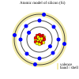
a| 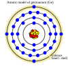
|===

Diese drei Elemente – Kohlenstoff (C), Silizium (Si) und Germanium (Ge) – haben alle **vier Valenzelektronen**.
Dadurch können sie eine stabile **tetraedrische Kristallstruktur** bilden, in der jedes Atom vier kovalente
Bindungen mit seinen Nachbarn eingeht.

Aufgrund dieser Struktur können sich Silizium und Germanium wie **Halbleitermaterialien** verhalten: Bei niedrigen
Temperaturen sind sie schlechte Leiter, aber ihre Leitfähigkeit steigt mit der Temperatur oder wenn der
Kristall durch Zugabe kleiner Mengen dreiwertiger oder fünfwertiger Atome (Dotierung) gezielt modifiziert wird.

Kohlenstoff in seiner Diamantform ist eine idealisierte Referenzstruktur mit derselben tetraedrischen Bindungsgeometrie.
 Dies verdeutlicht, warum Silizium und Germanium, die dieselbe Valenzkonfiguration aufweisen,
die Grundlage aller modernen Halbleiterbauelemente bilden.

Beginnen wir unseren Rundgang durch die Halbleiterbauelemente mit einer kurzen Wiederholung dieses Themas aus
„https://wehrend.github.io/pages/prequel-short-introduction-to-electronics[electronics 101]”.

Wenn wir sicherstellen, dass das Halbleitermaterial, hier Silizium, nicht mit dreiwertigen oder fünfwertigen Atomen verunreinigt oder *dotiert* ist,
 ist der einzige relevante Faktor die Temperatur.
Bei Raumtemperatur (≈ 25 °C) ist intrinsisches Silizium ein sehr schlechter Leiter.

## n-Typ-Dotierung (fünfwertige Donatoren)

Wenn Silizium mit Atomen dotiert wird, die **fünf Valenzelektronen** haben (fünfwertige Donatoren),
bleibt ein zusätzliches Elektron schwach gebunden und kann leicht in das Leitungsband übergehen.
Dadurch entsteht ein **n-Typ** (negatives) Halbleitermaterial.

[cols="2"]
|===
a| Beispiele für fünfwertige Donorelemente (Gruppe V): +
    - Stickstoff (N) +
    - Phosphor (P) +
    - Arsen (As) +
    - Antimon (Sb) +
    - Wismut (Bi) +
a| 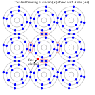
|===

## p-Typ-Dotierung (dreiwertige Akzeptoren)

Wenn Silizium mit Atomen dotiert wird, die **drei Valenzelektronen** haben (dreiwertige Akzeptoren),
fehlt ein Elektron im Gitter. Dieses „Loch” verhält sich wie ein positiver beweglicher Ladungsträger
und erzeugt ein **p-Typ** (positives) Halbleitermaterial.

[cols="2"]
|===
a| Beispiele für dreiwertige Akzeptorelemente (Gruppe III): +
- Bor (B) +
- Aluminium (Al) +
- Gallium (Ga) +
    - Indium (In) +
    - Thallium (Tl) +
a| image:./covalent_bonding_B.svg[width="350px"]
|===

== Kombination von p-Typ- und n-Typ-Material

Wenn wir n-dotiertes und p-dotiertes Halbleitermaterial zusammenbringen,
entsteht ein **pn-Übergang**.
Dieser Übergang zeigt ein sehr interessantes und äußerst nützliches Verhalten:
Es entsteht eine Verarmungszone, es entstehen interne elektrische Felder und das Bauelement wird richtungsabhängig.
Alle modernen Dioden, Transistoren und CMOS-Strukturen basieren auf diesem grundlegenden Effekt.

== Anwendungen von Dioden

=== Die Diode als Gleichrichter

==== Der Halbwellengleichrichter

Der einfachste – aber höchst ineffiziente – Gleichrichter ist der hier vorgestellte Halbwellengleichrichter.
Es handelt sich um eine einfache Diode, die in Vorwärtsrichtung geschaltet ist...

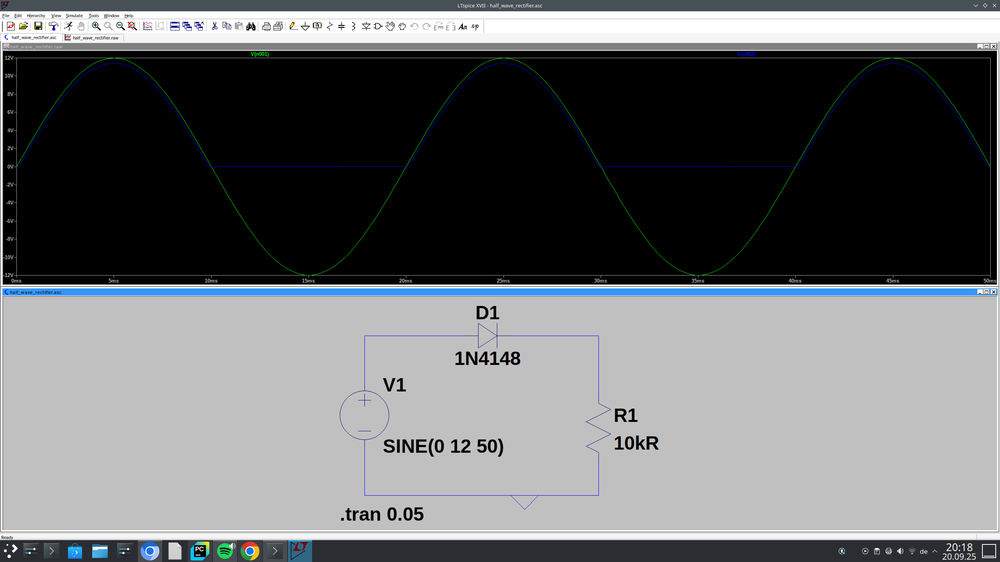

Als Diode stellen wir hier die 1N4148 vor, eine beliebte Signaldiode, die jedoch als Gleichrichterdiode untypisch ist.
Wie wir sehen können, wird nur eine Hälfte der Sinuswelle verwendet...

link:./half_wave_rectifier.asc[Halbwellen-Gleichrichter – LTspice-Datei]

Unten sehen Sie denselben Schaltkreis, jedoch mit einem Kondensator zur Beseitigung der Welligkeit...
image:./half_wave_rectifier_with_C.png [Halbwellen-Gleichrichter mit C]

link:./half_wave_rectifier_with_C.asc[Halbwellen-Gleichrichter mit Kondensator – LTspice-Datei]

==== Der Vollweggleichrichter

Um den Gleichrichter effizienter zu machen, nutzen wir auch den negativen Teil der Sinuswelle, um unsere Gleichspannung zu erzeugen.

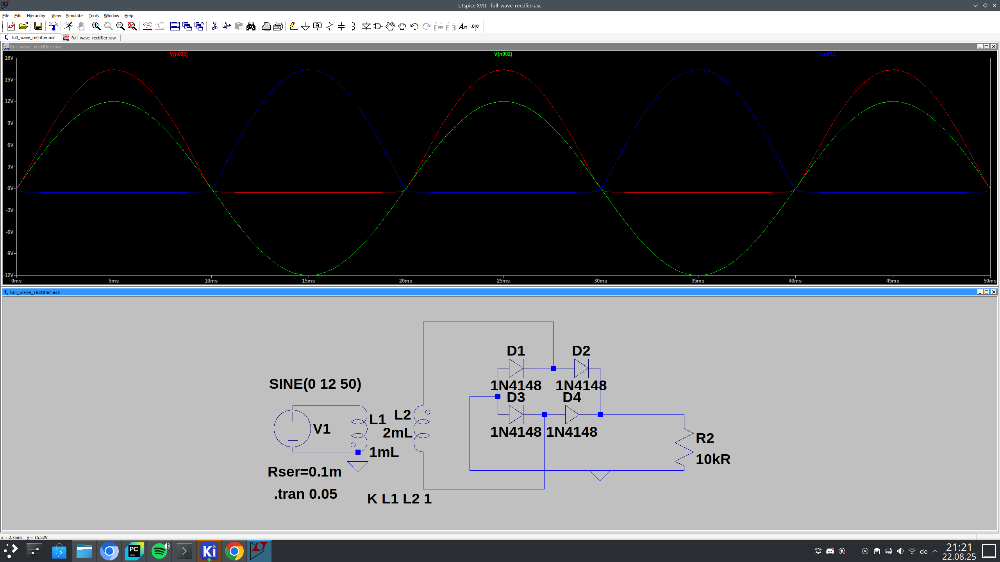

link:./full_wave_rectifier.asc[Vollweggleichrichter – LTspice-Datei]

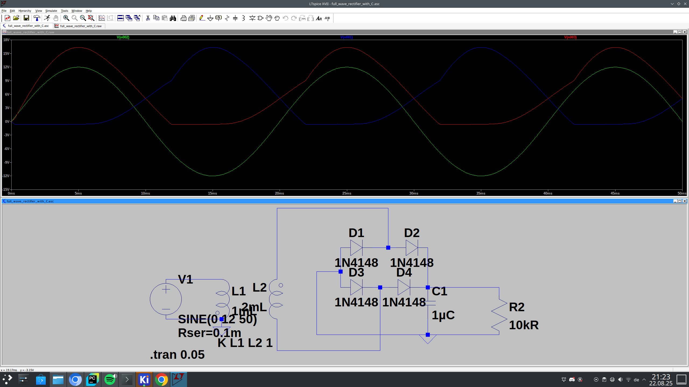

link:./full_wave_rectifier_with_C.asc[Vollweggleichrichter mit Kondensator – LTspice-Datei]

== Die (einfache) LED-Schaltung

Zunächst möchten wir Ihnen eine der einfachsten Schaltungen zeigen, die Ihren Tag (oder Ihre Nacht, Wortspiel beabsichtigt) erhellen wird.

[cols="2"]
|===
a|  Dioden im Schaltplan
a| 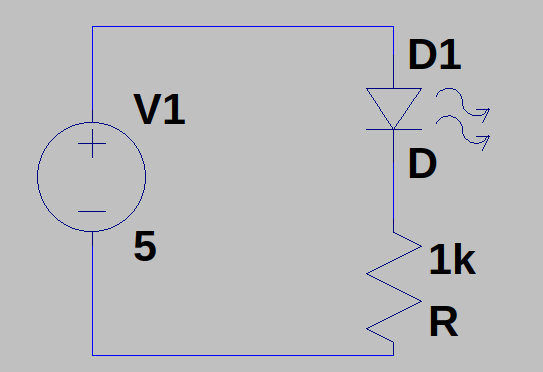
|===

Eine Leuchtdiode (LED) kommt nicht ohne ihren Vorwiderstand aus, der dazu dient, den durch die LED fließenden Strom zu begrenzen.
Sie können einen Widerstand von 1 kOhm bis 10 kOhm nehmen, der genaue Wert ist in den meisten Fällen unkritisch...
Zur Überprüfung gilt jedoch folgende Gleichung:

[image src="./pre-resistor.svg" format="svg" alt="Vorwiderstand"]
\large \[ R_{V} = \frac{U_{\text{Total}} - U_{R}}{I} \]

Mit dieser Gleichung können wir den Wert für den Widerstand berechnen – nach der Berechnung verwenden wir einfach den nächsthöheren verfügbaren Widerstand
in der E24-Serie. In den meisten Fällen können Sie einfach einen 1-kOhm-Widerstand wählen, der ausreicht.
Außerdem sind für die hier beschriebenen Zwecke 1/4-Watt-Widerstände ausreichend, sogar 1/8-Watt-Widerstände.

Nun wollen wir sehen, was passiert, wenn wir die Pole vertauschen. Dann arbeitet die Diode in umgekehrter Polarität und leuchtet daher nicht ...

LEDs gibt es in einer Vielzahl unterschiedlicher Größen, Formen und Farben, beispielsweise unterscheiden sich die Größen in verschiedenen SMD-Größen, z. B.
0805, sowie in verschiedenen Formen (siehe https://makezine.com/article/craft/what-shape-of-led-should-i-use-for-my-project/[hier]).
Aber in erster Linie ist die Farbe entscheidend. Die unterschiedlichen Dotierungen sorgen für unterschiedliche Farben.

[cols="2"]
|===
a| image:./led_querschnitt.svg[width="350px"]
a| 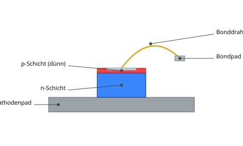
|===

image:./simple_led_comparison.png[Dioden als LED-Schaltung]

image:./led_colors.png[Dioden als LED-Schaltung]

https://www.electricaltechnology.org/2022/06/led-light-emitting-diode.html[siehe hier]

// LEDs funktionieren wie alle anderen gewöhnlichen Dioden nur in einer Richtung und blockieren in der Gegenrichtung.
// Auf dieses Verhalten gehen wir im nächsten Kapitel ein...

== Bipolare Transistoren und ihre Anwendungen

////

=== Der bipolare Sperrschichttransistor (BJT)

Ein bipolarer Sperrschichttransistor ist ein Halbleiterbauelement, das durch die Kombination von zwei pn-Übergängen gebildet wird.
Je nach Reihenfolge der p- und n-Typ-Materialien erhalten wir entweder einen **NPN**- oder einen **PNP**-Transistor.

Ein Transistor hat drei Anschlüsse:
* **Emitter (E)** – die Quelle der Ladungsträger
* **Basis (B)** – ein dünner, leicht dotierter Steuerbereich
* **Kollektor (C)** – sammelt die Ladungsträger und lässt den Strom fließen

Die Grundidee ist einfach:
Ein **kleiner Basisstrom** steuert einen **viel größeren Kollektorstrom**.

Diese Beziehung ist der Grund dafür, dass ein Transistor sowohl als **Schalter** als auch als **Verstärker** verwendet werden kann.

---

=== Betriebsarten

Ein BJT kann je nach den Spannungen zwischen seinen Anschlüssen in drei Hauptbereichen betrieben werden.

[cols=„3“]
|===
a| **Sperrzone**
*Basis-Emitter-Übergang nicht in Vorwärtsrichtung vorgespannt.*
Der Transistor ist ausgeschaltet.
IB = 0, IC ≈ 0.
Keine Leitung zwischen Kollektor und Emitter.

a| **Aktiver Bereich**
*Basis-Emitter-Übergang in Vorwärtsrichtung vorgespannt, Kollektor-Basis-Übergang in Rückwärtsrichtung vorgespannt.*
Dies ist der **lineare Bereich**, in dem sich der Transistor wie ein Verstärker verhält.
IC ≈ β · IB.

a| **Sättigung**
*Beide Übergänge in Vorwärtsrichtung vorgespannt.*
Der Transistor ist vollständig eingeschaltet.
Die Kollektor-Emitter-Spannung fällt auf einen kleinen Wert (≈ 0,1–0,3 V).
|===

Diese drei Modi erklären fast alle praktischen Transistorschaltungen.

---

=== Warum verstärkt ein BJT?

In einem NPN-Transistor werden Elektronen vom Emitter in den dünnen Basisbereich injiziert.
Die Basis ist sehr leicht dotiert und extrem dünn, sodass nur ein kleiner Teil der Elektronen
mit den Löchern in der Basis rekombiniert.

Die meisten Elektronen werden über den in Sperrrichtung vorgespannten Basis-Kollektor-Übergang gefegt und werden zum
**Kollektorstrom IC**.

Da nur ein geringer Strom erforderlich ist, um die Elektronen zu ersetzen, die sich in der Basis rekombinieren,
steuert ein kleiner **Basisstrom IB** einen viel größeren **Kollektorstrom IC**.

Das Verhältnis

\[
\beta = \frac{I_C}{I_B}
\]

wird als **Stromverstärkung** bezeichnet.

---

=== BJT als Schalter

Bei der Verwendung in digitalen Schaltungen zwingen wir den Transistor absichtlich in nur zwei Bereiche:

* **Cutoff** → AUS-Zustand
* **Sättigung** → EIN-Zustand

Auf diese Weise werden Transistoren in Logikschaltungen, Flipflops, astabilen Multivibratoren
und praktisch allen CMOS-ähnlichen Schaltungsdesigns verwendet (auch wenn CMOS MOSFETs und keine BJTs verwendet,
ist das Konzept ähnlich).

---

=== BJT als Verstärker

Wenn der Transistor im **aktiven Bereich** gehalten wird, beträgt sein Kollektorstrom ungefähr:

\[
I_C = \beta \cdot I_B
\]

Eine kleine Änderung des Basisstroms bewirkt eine proportionale Änderung des Kollektorstroms.
Dadurch wird der Transistor zu einem **stromgesteuerten Verstärker**.

Verstärkerstufen (gemeinsamer Emitter, gemeinsamer Kollektor, gemeinsame Basis) nutzen alle den aktiven Bereich,
um eine Spannungs- oder Stromverstärkung zu erzeugen.

---

=== Zusammenfassung

* Ein BJT besteht aus zwei pn-Übergängen und drei Anschlüssen: E, B, C.
* Kleine Basisströme steuern große Kollektorströme.
* Der Transistor hat drei Betriebsbereiche: Sperrbereich, aktiver Bereich, Sättigungsbereich.
* Verwendung als **Schalter** → Betrieb zwischen Sperr- und Sättigungsbereich.
* Verwendung als **Verstärker** → Betrieb im aktiven Bereich.
* BJT bilden die konzeptionelle Grundlage für das Verständnis des späteren Verhaltens von CMOS-Transistoren.

////

Wenn wir den in Dioden verwendeten pn-Übergang wie im obigen Abschnitt gezeigt erweitern, erhalten wir vom einfachen zum
sogenannten BJT (Bipolar-Transistor). Es gibt zwei verschiedene Versionen von Bipolartransistoren (https://www.allaboutcircuits.com/textbook/semiconductors/chpt-4/bipolar-junction-transistors-bjt/, BJTs) (benannt nach
ihrer Dotierung): den NPN-Transistor und den PNP-Transistor.

[cols="2"]
|===
| Gehäuse
| Bild
| TO-92
a| 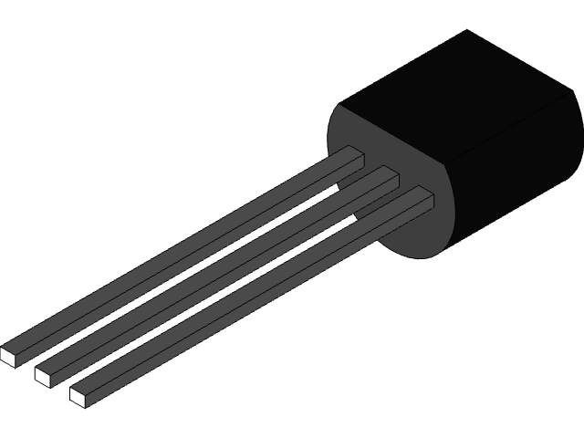
|===

[cols="3"]
|===
| Typ
| Symbol
| Struktur
| BC-547 (TO-92)
a| 
a| image:./transistor_npn_schema.svg[width="400px"]
| BC-557 (TO-92)
a| 
a| 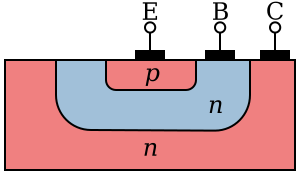
|===

=== Die einfache Schaltung

Es gibt unzählige Anwendungsmöglichkeiten für BJT sowohl als Schalter als auch als Verstärker – im Folgenden
wollen wir nur die wichtigsten Anwendungen (beider Typen) betrachten.
Im folgenden Beispiel fungiert er als Verstärker. Wir verwenden ihn aber auch für Logikschaltungen, wie
https://wehrend.github.io/pages/01_boolean_algebra/[hier] gezeigt.

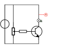

=== Die einfache Schaltung mit negativer Rückkopplung
Stellen Sie sich vor, Sie hätten eine Tüte voller BC547 gekauft, der beliebtesten NPN-Transistoren.
Wenn Sie diese vermessen, werden Sie feststellen, dass ihre Eigenschaften sehr unterschiedlich sind.
Wenn Sie sich für einige BC547 aus verschiedenen Chargen bzw. von verschiedenen Herstellern entscheiden, werden Sie feststellen, dass
die Verteilung ihrer Hauptparameter noch größer ist.

Daher führen wir das systemische Prinzip einer negativen Rückkopplungsschleife ein.

image:./the_simple_circuit_w_feedback_wo_poti.svg[width="500px"]

==== Negative Rückkopplung
Eine weitere geeignete Methode ist die Verwendung einer negativen Rückkopplung...
Wenn ein Teil der Ausgangsspannung zum Eingang eines Verstärkers zurückgeführt wird,
spricht man von Rückkopplung.  Eine Rückkopplung in Phase wird als „positive Rückkopplung” bezeichnet;
in diesem Fall wird das zurückgeführte Ausgangssignal zum Eingangssignal addiert,
was zu einer Selbsterregung (Resonanz) führt. Eine Rückkopplung in Gegenphase wird als negative Rückkopplung bezeichnet;
in diesem Fall hebt die zurückgeführte Ausgangsspannung einen Teil der Eingangsspannung auf. In Bezug
auf die Größe des Ausgangssignals wirkt die negative Rückkopplung daher als eine signifikante
Verringerung der Verstärkung (ein reduziertes Eingangssignal führt zu einem entsprechend kleineren Ausgangssignal).

Warum also negative Rückkopplung verwenden?

Diese negative Rückkopplung hat einen Nachteil, aber mehrere große Vorteile gegenüber der normalen Schaltung ohne Regelkreis.
 Wir erzielen eine geringere Verstärkung, verwenden aber eine weitaus bessere Verstärkerschaltung – größere Bandbreite, geringerer
Verzerrungsfaktor...

Die Werte für diesen Rückkopplungswiderstand sollten zwischen 30 und 70 kOhm liegen...

== BJT als Schalter

=== Das Flipflop

Eine weitere wichtige Anwendung, die wir bereits vor einiger Zeit behandelt haben, ist die Verwendung als Flipflop,
 wie unter https://wehrend.github.io/pages/11_clocks_and_registers/#_a_binary_counter[hier] gezeigt.
Das Flipflop ist eine zentrale Komponente in fast allen digitalen Schaltungen, die digitale Werte (0 und 1) speichert.

[cols="3"]
|===
a| Symbol
a| Logikschaltung
a| Detaillierte Schaltung
a| 
a| 
a| image:./flipflop_discrete.svg[width="600px"]
|===

=== Der astabile Multivibrator

image:./astable_multivibrator.svg[width="700px"]

Der sogenannte astabile Multivibrator ist, vereinfacht gesagt, eine Blinkerschaltung.
Die Formel zur Berechnung der Schwingungsfrequenz aus den gegebenen Parametern lautet:

[image src="./multivibrator_frequency.svg" format="svg" alt="frequency"]
\large \[
f = \frac{1}{T} = \frac{1}{(R_{B1} \cdot C_1 + R_{B2} \cdot C_2)\,\ln(2)}
\]

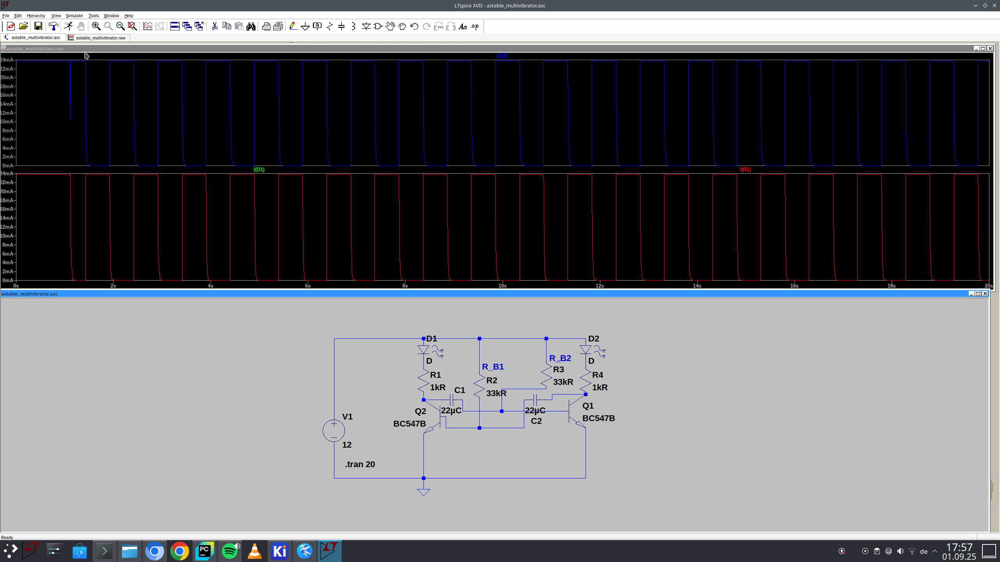

link:./astable_multivibrator.asc[astabiler Multivibrator – ltspice-Datei]

=== BJT als Verstärker

Dieses Kapitel werde ich größtenteils 1:1 aus dem Buch „Wege in die Elektronik” von Joseph Glagla und Gert Lindner aus dem Jahr 1980 übernehmen.

==== Zwei-Port-Theorie Grundschaltungen und  h-Parameter

Die Zwei-Port-Theorie und die h-Parameter sind die theoretische Grundlage für Zwei-Port-Schaltungen.
Sie wird beispielsweise zur Beschreibung von Verstärkern verwendet, wobei alle hier behandelten Schaltungen eine gemeinsame Grundlage haben.
Alle drei Grundschaltungen sind nach ihrem Eingang und Ausgang benannt:
Emitter-Schaltung, Basis-Schaltung und Kollektor-Schaltung.

[cols="3"]
|===
a|
a| 
a|
|===

Je nach Schaltung hat der transistorbasierte Verstärker unterschiedliche Eigenschaften, wie in der
nachstehenden Tabelle dargestellt...
Um den Verstärkungsfaktor einer Schaltung zu berechnen, werden die dynamische Eingangsimpedanz (Wechselstrom) [r_{BE} = h_{11}]
und die dynamische Ausgangsimpedanz [r_{CE}= 1: h_22] sowie die Wechselstromverstärkung [\beta = h_{21}]

Diese h-Parameter werden später erläutert und erklärt – zunächst wollen wir uns die verschiedenen Schaltungen ansehen...

=== Grundlegende Transistorschaltungen (Übersicht)

[cols="4"]
|===
a|
a| Emitter-Schaltung
a| Basisschaltung
a| Kollektorschaltung
a| Prinzip
a| 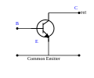
a| image:./common_base.svg[width="400px"]
a| 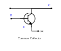
a| Schaltplan
a| image:./emitter_circuit.svg[width="400px"]
a| 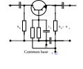
a| 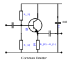
a| Stromverstärkung
a|
[image src="./current_gain_emitter.svg" format="svg" alt="none"]
\[ V_{i} = \frac{\beta * r_{CE}}{r_{CE} + R_{C}} \]
    (10...500)
a|
[image src="./current_gain_base.svg" format="svg" alt="none"]
\[ V_{i} = \frac{\beta }{1  + \beta } \]
    (< 1)
a|
[image src="./current_gain_collector.svg" format="svg" alt="none"]
\[ V_{i} = \frac{\beta * r_{CE}}{ R_{E} + r_{CE} } \]
    (10...500)
a| Spannungsverstärkung
a|
[image src="./voltage_gain_emitter.svg" format="svg" alt="none"]
\[V_{u} = \frac{\beta \cdot (R_{C} \parallel r_{CE})}{r_{BE}}\]
(50...1000)
a|
[image src="./voltage_gain_base.svg" format="svg" alt="none"]
\[V_{u} = \frac{\beta \cdot R_{C} \parallel r_{CE}}{r_{BE}}\]
(50...1000)
a|
[image src="./voltage_gain_base.svg" format="svg" alt="none"]
\[V_{u} = 1- \frac{r_{BE}}{\beta \cdot R_{E} \parallel r_{CE}}\]
(<1)
a| Leistungsverstärkung
a| 5000...1000
a| 100...1000
a| 50...500
a| Eingangsimpedanz
a|
[image src="./input_impedance_emitter.svg" format="svg" alt="none"]
\[r_{e} = r_{BE} \parallel R_{1} \parallel R_{2}\]
(10 Ohm...5 kOhm )
a|
[image src="./input_impedance_base.svg" format="svg" alt="none"]
\[r_{e} = \frac{r_{BE}}{\beta} \parallel R_{E} \]
(< 1 Ohm...1 kOhm)
a|
[image src="./input_impedance_collector.svg" format="svg" alt="none"]
\[r_{e} = (r_{BE}+\beta \cdot R_{E}) \parallel R_{1} \]
(500 Ohm...5 MOhm)
a| Ausgangsimpedanz
a|
[image src="./output_impedance_emitter.svg" format="svg" alt="none"]
\[r_{a} = r_{C} \parallel r_{CE} \]
(10 Ohm...500 kOhm )
a|
[image src="./output_impedance_base.svg" format="svg" alt="none"]
\[r_{a} = r_{C} \parallel r_{CE} \]
(100 kOhm...10 MOhm)
a|
[image src="./output_impedance_collector.svg" format="svg" alt="none"]
\[r_{e} = r_{E} \parallel \frac{r_{BE} + R_{Generator}}{\beta} \]
(10 Ohm...1kOhm)
a| Phasenlage
a| 180°
a| in Phase
a| in Phase
a| Typische Anwendungen
a| Standardanwendung für Niederfrequenz- und Hochfrequenzverstärker
a| für sehr hohe Frequenzen (UKW, VHF, UHF)
a| Verstärkereingänge, „Impedanzwandler”, Leistungsverstärker
|===

=== Transistor in Emitterschaltung

Die Emitterschaltung wird meist in Kleinsignallösungen (auch für Leistungsverstärker) verwendet.
Sie wird als Allrounder eingesetzt. Die beiden anderen Schaltungen (Basis- und Kollektorschaltung) werden nur
in besonderen Fällen verwendet...
Die Emitterschaltung verstärkt sowohl Strom als auch Spannung und ist außerdem die Schaltung mit der größten
Leistungsverstärkung. Die Eingangsimpedanz besteht aus der BE-Diode und schwankt zwischen sehr
kleinen (großes $I_B$) und großen Werten (minimales $I_B$). Die Ausgangsspannung baut sich an R_{L} auf.
Sie wird gegen die gemeinsame Masse gemessen (praktisch U_{CE}= U_{b} - U_{RL}).
Somit besteht eine Phasenverschiebung von 180° zwischen der Eingangsspannung und der Ausgangsspannung.
Für „normale” Verstärker ist dies nicht besonders interessant. Dies ändert sich jedoch, sobald das Ausgangssignal
wieder zum Eingang zurückgeführt wird...

link:./emitter_circuit.asc[Emitter-Schaltung – LTSpice-Datei]

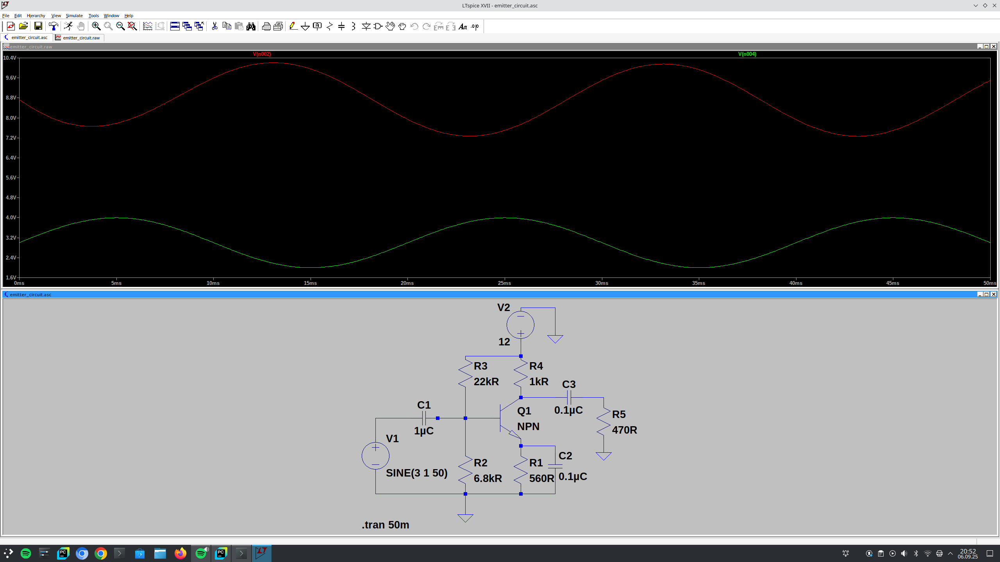

=== Transistor in Basisschaltung
Die Basisschaltung hat eine extrem niedrige Eingangsimpedanz, die durch den parallel geschalteten
notwendigen niedrigen Emitterwiderstand zusätzlich minimiert wird. Die Ausgangsimpedanz ist jedoch sehr hoch. Die Stromverstärkung ist immer
kleiner als 1 (<1), da der Emitterstrom (=I_{B}+I_{C}) immer größer ist als der Kollektorstrom
bzw. der Ausgangsstrom. Der Vorteil der Basisschaltung besteht darin, dass sie die höchsten Frequenzen verarbeiten kann.
Außerdem hat diese Schaltung den geringsten Einfluss auf den Eingang. Daher sind die typischen Anwendungen Empfänger
für sehr hohe Frequenzen.

link:./base_circuit.asc[ Basisschaltung – LTSpice-Datei]

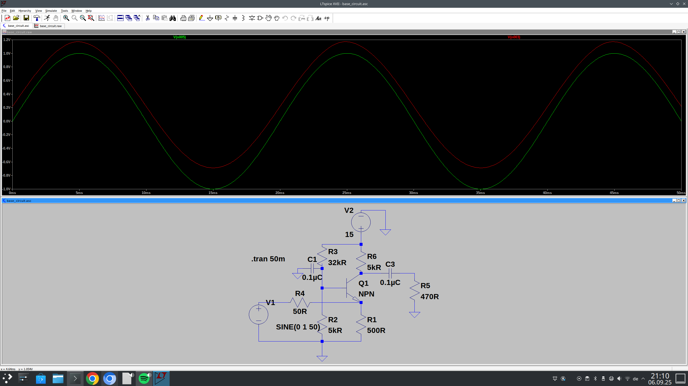

=== Transistor in Kollektorschaltung

Die Kollektorschaltung zeichnet sich durch eine hohe Eingangsimpedanz, aber eine niedrige Ausgangsimpedanz aus.
Die hohe Eingangsimpedanz wird sowohl durch den Eingangsstrom als auch durch den Ausgangsstrom verursacht, der über
den gemeinsamen Emitterwiderstand (R_{L}) fließt. Ein niedriger Basisstrom erfordert einen mit \beta multiplizierten Kollektor-/Emitterstrom,
der durch R_{L} verursacht wird. Dies führt zu einem Spannungsabfall über der Eingangsimpedanz.
Wenn ein kleiner Strom einen großen Spannungsabfall am Widerstand verursacht, muss der Widerstand groß sein.
Ohne Berücksichtigung des Basisstroms beträgt er \beta \cdot R_{L} -
Die Ausgangsspannung u_{2} ist immer kleiner als die Eingangsspannung u_{1} – ihr Wert entspricht der Schwellenspannung
der BE-Diode. Wenn u_{1} größer wird, wird der Spannungsabfall an R_{L} aufgrund des
größeren Emitterstroms größer. Wenn u_{1} sinkt, sinkt auch u_{2} aufgrund des geringeren Emitterstroms.

Daher wird diese Schaltung auch als Emitterfolger bezeichnet. In dieser Schaltung gibt es keine Spannungsverstärkung (u_{2}
ist immer kleiner als u_{1}). Nur die Stromverstärkung wird um den Faktor \beta multipliziert
Der Emitterfolger wird aufgrund seiner hohen Eingangsimpedanz und niedrigen Ausgangsimpedanz häufig in Verstärkereingängen verwendet.

link:./collector_circuit.asc[Kollektorschaltung – LTSpice-Datei]

image:./collector_circuit.png[width="750px"]

=== Verstärkerekopplung

Eine Verstärkerstufe reicht in der Regel nicht aus, sodass mehrere Einheiten zusammengeschaltet werden müssen.
Die Kopplung erfordert jedoch einige Überlegungen, um eine unkontrollierbare Verschiebung der Arbeitspunkte zu vermeiden.

==== Transformatorenkopplung
Dies ist die älteste, aber heutzutage eher unkonventionelle und mehr oder weniger veraltete Technik.
Nachteile sind Preis, Größe und Gewicht des Transformators.
Aus diesem Grund wird sie heute nur noch selten verwendet.
Sie hat jedoch den Vorteil, dass durch Resonanzeffekte die richtigen Signale ausgewählt werden können.

image:./induction-coupling.svg[width="450px"]

==== RC-Kopplung
Die RC-Kopplung ist wahrscheinlich die am häufigsten verwendete Technik zur Entkopplung von Verstärkerstufen.
Aufmerksamen Lesern wird auffallen, dass der Kondensator und der Widerstand einen Hochpassfilter bilden,
den wir bereits in https://wehrend.github.io/pages/short-introduction-to-electronics-102/#_highpass_filter[hier...] kennengelernt haben.
Diese Kopplung ist einfach und kostengünstig, hat jedoch den Nachteil, dass sie ebenfalls ein Hochpassfilter ist, der das Signal formt.
Sehr niedrige Frequenzen können auf diese Weise nicht übertragen werden. ..

==== Direkte Kopplung

Die einfachste Kopplung ist eine Kopplung über Kabel – dies wird auch als Gleichstromkopplung bezeichnet.
Der Nachteil hierbei ist, dass sich die Vorspannungspunkte der verschiedenen Verstärkerstufen in den verschiedenen Stufen verschieben.

Der Vorteil ist, dass sie eine Gleichstromverstärkung ermöglicht; daher wird sie bei Messungen und Operationsverstärkern verwendet.
Außerdem lässt sie sich leicht in integrierten Schaltungen implementieren...

== JFETs und MOSFETs

Im Vergleich zur Elektronenröhre hat der Bipolartransistor viele Vorteile, aber einen wesentlichen Nachteil: Er benötigt einen Steuerstrom und
damit Steuerleistung. Sein Eingangswiderstand ist niedrig, er belastet die Quelle (z. B. Antenne, Mikrofon) und kann oft nur von hochohmigen
Quellen  mit speziellen Techniken gesteuert werden.
Die Elektronenröhre hingegen benötigt keine Leistung und kann allein durch die Feldstärke der angelegten Steuerspannung gesteuert werden. In der Praxis bedeutet dies, dass
ihr Eingangswiderstand sehr hoch ist und die Quelle (z. B. Mikrofon) nicht belastet wird.
Kein Wunder also, dass nach einem Bauteil gesucht wurde, das die Vorteile des Transistors mit denen der Röhre vereint. Das Ergebnis dieser Entwicklung
ist die Gruppe der Feldeffekttransistoren (abgekürzt FET). Der Name bezieht sich auf das Funktionsprinzip: Der FET wird nur durch die Feldstärke
der angelegten Steuerspannung gesteuert, ohne Steuerstrom, d. h. ohne Leistung (abgesehen von Leckströmen und Verlusten). Da in ihm nur Ladungsträger einer
Polarität bewegt werden – entweder Elektronen oder „Löcher“ – werden FETs als unipolare Transistoren bezeichnet.

== Funktionsprinzip des Feldeffekttransistors

Das Prinzip der Feldeffektsteuerung ist im Vergleich zum bipolaren Transistor „alt“. Bereits 1928 erhielt Julius Edgar Lilienfeld ein Patent für das Prinzip der
Änderung des Widerstands eines elektrischen Feldes.
Diese Entdeckung konnte jedoch noch nicht praktisch genutzt werden, da ein elektrisches Feld nicht tief in gute (metallische) Leiter eindringt;
obwohl die Eindringtiefe in Isolatoren sehr groß ist, können diese nicht als Widerstände ( =Leiter) verwendet werden. Die Entwicklung der Halbleiter lieferte das
geeignete Material, das einerseits leitet und andererseits das elektrische Feld tief eindringen lässt. 1952 konnte Shockley den ersten brauchbaren FET vorstellen.
Es dauerte jedoch noch viele Jahre, bis er serienreif war.

Um die Funktionsweise des FET zu verstehen, erinnern wir uns an folgende Grundlagen:

1. Ein Leiter leitet nur, wenn er bewegliche Ladungsträger (Elektronen oder „Löcher”) enthält.
2. Der Widerstand eines Leiters (aus dem gleichen Material) steigt mit abnehmendem Querschnitt: Der Widerstand eines dicken Kupferdrahtes ist
geringer als der eines dünnen.
3. Gleiche Ladungen stoßen sich ab, ungleiche Ladungen ziehen sich an.

Der Hauptteil des FET ist ein Strompfad ("Kanal") aus schwach dotiertem Silizium. Je nachdem, ob der Kanal n-dotiert oder p-dotiert ist, wird er als n-Kanal oder p-Kanal bezeichnet.
Der Kanal ist ein Widerstand und leitet in beide Richtungen. Seine Enden werden als Source (abgekürzt S) und Drain (abgekürzt D) bezeichnet.
Eine Elektrode, das Gate (abgekürzt G), ist um den Kanal herum isoliert.

Die Funktionsweise wird anhand eines n-Kanal-FET erklärt: Der n-Kanal leitet, weil er frei bewegliche Elektronen enthält. Erhält das Gate eine negative Spannung relativ zum Kanal
(Source),
 stoßen die Elektronen im Gate die Elektronen im Kanal ab und drücken sie vom Randbereich zur Mitte. Im Randbereich wird der Kanal wieder zu einem
reinen Kristall, also zu einem Isolator. Dadurch verengt sich der leitende Querschnitt des Kanals und sein Widerstand steigt.
Wird die (negative) Gate-Spannung erhöht, werden immer mehr Elektronen aus dem Kanal verdrängt, d. h. sein leitender Teil wird immer schmaler. Bei einer
bestimmten Gate-Spannung (der „Cut-off-Spannung”) werden schließlich alle Elektronen verdrängt, der Kanal wird „abgeschnitten” und leitet nicht mehr.

Die Steuerung funktioniert auch umgekehrt: Ein sehr schwach dotierter p-Kanal ist zunächst nicht leitfähig. Eine positive Gate-Spannung zieht Elektronen in den Kanal
und macht ihn leitfähig. Der Kanalwiderstand nimmt mit steigendem U_{GS} ab.
''
Der FET ist ein Widerstand, der durch die Feldstärke der Steuerspannung gesteuert werden kann.
‚‘
Der Regelbereich ist sehr groß. Grundsätzlich können D und S vertauscht werden, da FETs jedoch nicht exakt symmetrisch gefertigt werden, erzielt die „richtige”
Anschlussmethode bessere Ergebnisse.
Je nachdem, wie das FET-Prinzip umgesetzt wird, unterscheidet man zwischen verschiedenen FET-Familien.
Die beiden Hauptgruppen sind der Sperrschicht-FET  (JFET) und der MOSFET.

== Der Sperrschicht-Feldeffekttransistor (JFET)

Das Gate befindet sich als stark dotierte Zone um den schwach dotierten Kanal herum. Es ist in entgegengesetzter Richtung zum Kanal dotiert, wodurch ein pn-Übergang entsteht, dessen Barriereschicht
als Isolierung wirkt. Diese Gruppe von Feldeffekttransistoren wird daher als Junction-FET oder JFET (J für Junction) bezeichnet.

image:./JFET.jpg[width="750px"]

Die Funktion wird erneut anhand des n-Kanal-FET (siehe Bild oben) veranschaulicht: U_{DS} liegt zwischen D und S. Die Elektronen fließen von S nach D. Nun wird die Spannung U_{GS}
(Minuspol an G) an das Gate angelegt. Der pn-Übergang zwischen G und dem Kanal liegt in Sperrrichtung. Wie bei der Kapazitätsdiode (https://en.wikipedia.org/wiki/Varicap)
 wird die Barriereschicht mit steigender Spannung breiter. Da der Kanal im Verhältnis zum Gate schwach dotiert ist, wächst die Barriereschicht vorwiegend in den Kanal hinein, d. h.
die Elektronen werden aus einem Teil des Kanals verdrängt. Dieser Teil wird wie reiner Kristall nichtleitend. Der leitende Teil des Kanals wird schmaler, sein Widerstand steigt,
bis der Kanal bei einer bestimmten Gate-Spannung „abgeschnitten” wird und nicht mehr leitet – siehe oben. Es fließt kein Steuerstrom – mit Ausnahme des geringen
Leckstroms, der in allen Dioden vorhanden ist. Der p-Kanal-JFET funktioniert genau gleich, nur mit umgekehrt polarisierten Batterien (Spannungsquellen).

== Der MOSFET

Bei der zweiten Gruppe von FETs besteht die Isolierung zwischen Gate und Kanal aus einer extrem dünnen Schicht aus Siliziumdioxid (SiO_{2});
das Gate ist als metallische Beschichtung (vakuumbeschichtetes Al) ausgeführt. Entsprechend ihrer Struktur werden diese FETs nach dem Metall des Gates, dem Oxid der Isolierschicht und dem Halbleiter
des Kanals benannt: MOS-FET.

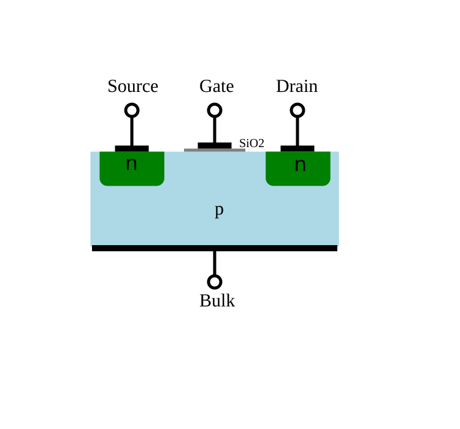

In der obigen Abbildung besteht der Kanal aus schwach p-dotiertem Material, D und S aus stark n-dotierten Inseln. Das Substrat, die „Basis” des Kristalls (B, von bulk = Masse, Hauptteil)
ist intern oder durch externe Verdrahtung mit S verbunden.

Unabhängig davon, wie Spannung an S und D angelegt wird, befindet sich einer der pn-Übergänge zwischen dem Kanal und der Verbindungsinsel in Sperrrichtung. Der MOSFET blockiert, wenn keine Spannung an G angelegt wird.
Erhält G eine positive Spannung U_{GS}, werden die Löcher als positive Ladungsträger sofort aus dem Kanalbereich gegenüber der Gate-Elektrode verdrängt, Elektronen aus dem Substrat, das mit S (negativer Pol
der Spannungsquelle) vorhanden ist, werden angezogen, so dass sich zwischen D und S gegenüber G eine n-leitende Brücke, die „Inversionsschicht”, bildet.
Der Widerstand dieser Schicht nimmt mit steigendem U_{GS} ab.
Dieser MOSFET-Typ wird nur leitfähig, wenn der Kanalbereich mit Elektronen angereichert ist; er wird daher als „Anreicherungstyp” bezeichnet und ist außerdem selbstblockierend, da er nicht leitet, wenn das Gate offen ist
oder U_{GS} = 0 V.
Ein anderer Typ wird so hergestellt, dass der Kanalbereich bereits schwach n-dotiert ist. Wenn G offen ist oder U_{GS} = 0 V, leitet er; er ist „selbstleitend”. Bei negativem U_{GS} können die Elektronen aus
dem Kanalbereich verdrängt werden, bis sie abgeschnitten sind; bei positivem U_{GS} können Elektronen in den Kanalbereich gesaugt werden, so dass der Kanalwiderstand weiter abnimmt und I_{D} entsprechend zunimmt.
Die Steuerung mit negativem U_{GS}, d. h. mit der Verdrängung von Elektronen, wird bevorzugt. Daher wird diese Familie von MOSFETs als „Verarmungstyp” bezeichnet.
Die Besonderheit selbstleitender MOSFETs besteht darin, dass sie sowohl durch positive als auch durch negative Gate-Spannungen gesteuert werden können.

Die anderen MOSFET-Typen sind Ableitungen der beiden oben genannten Hauptgruppen, die in dieser Einführung nicht beschrieben werden.

== Vom BJT zum FET

Entsprechend den Grundschaltungen für Bipolartransistoren (BJT)
gelten die gleichen Regeln für Feldeffekttransistoren, die in link:/pages/01_boolean_algebra/#_implementation_on_electrical_level[diesem Blogbeitrag] vorgestellt werden.
Die Emitterschaltung ist die Source-Schaltung, die Basisschaltung ist die Gate-Schaltung und die Kollektorschaltung ist die Drain-Schaltung.

Die Gate-Schaltung wird selten verwendet, da der größte Vorteil des FET, die hohe Eingangsimpedanz, damit nicht genutzt werden kann.

[cols="3"]
|===
a| Source-Schaltung
a| Gate-Schaltung
a| Drain-Schaltung
a| 
a| image:./gate_circuit.svg[width="280px"]
a| image:./drain_circuit.svg[width="280px"]
|===

Übersetzt mit DeepL.com (kostenlose Version)
//
// Diese Seite befindet sich noch im Aufbau.
//
// image:./under_construction.png[width=„350px“]

//
// === Anwendungen als Schalter
//
// === Anwendungen als Verstärker

// Leistungsverstärker (optional)
//
// === MOSFET-Transistoren

// Elektronik 104 sollte grundlegende IC-Kenntnisse enthalten; Operationsverstärker und ihre Anwendungen

// == Von der Diode zum Transistor
//
// // Von der Diode zum Transistor
//
// === Der Transistor als Verstärker
//
// === Der Transistor als Schalter
//
// == Nichtlineare Komponenten // Nichtlineare Schaltungen...