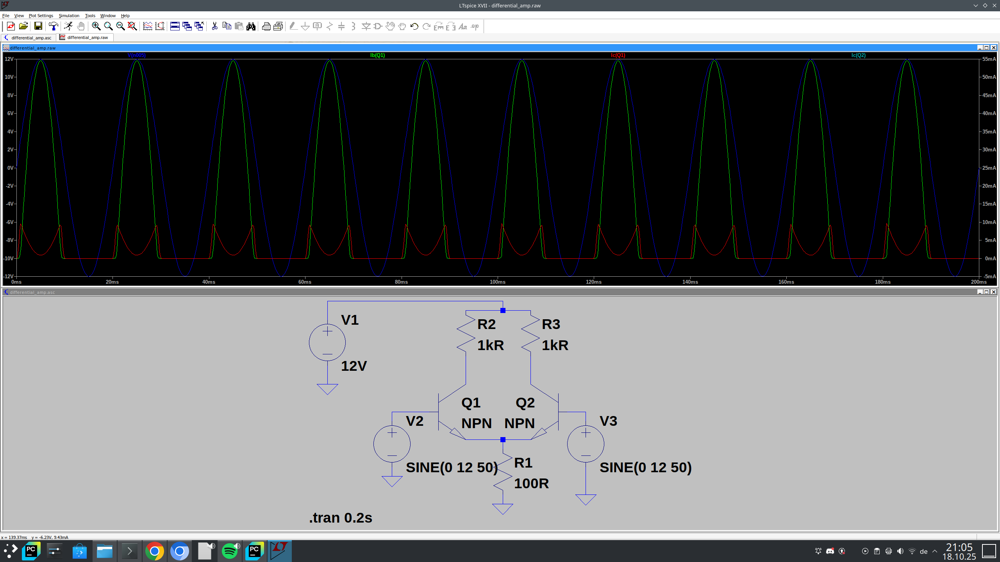
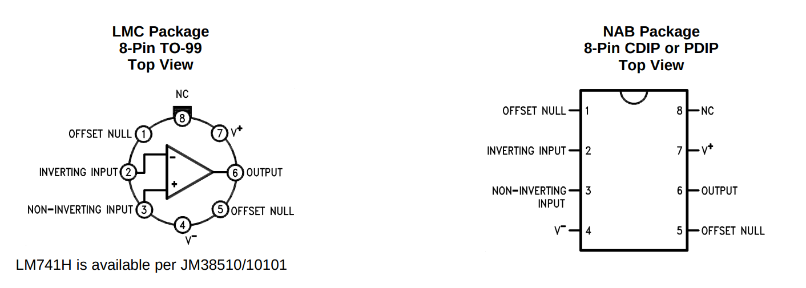
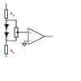


Nach diesem Kapitel kennen Sie alle Grundlagen zu linearen Bauteilen, integrierten Verstärkern und Operationsverstärkern...


= Integrierte NF-Verstärker

Heute werden dringend benötigte elektronische Funktionen wie NF-Verstärker nicht mehr überwiegend aus „diskreten” (von lateinisch discretum = getrennt)
Komponenten aufgebaut, sondern durch integrierte Schaltungen (lateinisch integrare = vereinen) ersetzt; umgangssprachlich werden sie als ICs
(von englisch integrated circuit) bezeichnet. Besonders verbreitet sind monolithische integrierte Schaltungen (von griechisch monos = eins,
griechisch lithos = Stein, Kristall). Hier wird ein einzelner Siliziumwafer mit einer Größe von einem oder wenigen mm² verwendet, um eine Vielzahl von
Transistoren, Dioden, Widerständen und Kondensatoren mit kleiner Kapazität unter Verwendung der Planartechnik auf einem einzigen Siliziumwafer unterzubringen, die zusammen eine Gesamtfunktion erfüllen, z. B.
die eines kompletten Niederfrequenzverstärkers, Empfängers, Zeitgebers, Computers, Uhren usw. Nur größere Bauteile wie Kondensatoren mit großer Kapazität,
Spulen und natürlich die Ausführungsorgane wie Lautsprecher, Digitalanzeigen usw. werden diskret hinzugefügt. Integrierte Schaltungen
arbeiten äußerst zuverlässig, da sie es ermöglichen, elektronische Komplexität auf sehr kleinem Raum zu erreichen, was mit diskreten
Bauteilen nur schwer zu finanzieren wäre. In einem IC kostet eine Transistorfunktion einen Zehntel Cent.
Auch in der Unterhaltungselektronik ersetzen ICs zunehmend diskrete Schaltungen. Integrierte NF-Verstärker bestehen in der Regel
im Wesentlichen aus einem Operationsverstärker als Vorverstärker und einer Gegentakt-Endstufe. Eine Besonderheit des Operationsverstärkers
ist seine Eingangsstufe, die als Differenzverstärker ausgeführt ist. Daher werden wir zunächst das Prinzip des Differenzverstärkers erläutern,
gefolgt von den grundlegenden Eigenschaften des Operationsverstärkers, soweit sie für das Verständnis der integrierten Niederfrequenzverstärkerkomponenten erforderlich sind.

== Der Differenzverstärker

Der Differenzverstärker besteht aus zwei Transistoren in Emitterkonfiguration. Die Kollektor-Emitter-Pfade der Transistoren sind
steuerbare Widerstände. Die Schaltung stellt somit eine Widerstandsbrücke dar, die aus R1/T1 als linkem Spannungsteiler und R2/T2 als rechtem Spannungsteiler besteht.
Der gemeinsame Emitterwiderstand R_{E} dient zur Stabilisierung der Schaltung. Er kann auch durch eine andere Transistorschaltung ersetzt werden.

Die Brückendiagonale besteht zwischen den Ausgängen A1 und A2. Unter der Annahme, dass R1 und R2 oder T1 und T2 gleich sind,
 bleibt die Brücke im Gleichgewicht (keine Spannung zwischen A1 und A2), solange die Basen die gleiche Steuerspannung erhalten,
unabhängig davon, ob es sich um Gleich- oder Wechselspannung handelt. Bei gleicher Ansteuerung ändern sich auch die Widerstände der Transistoren
auf die gleiche Weise, sodass sich die Widerstandsverhältnisse der Brücke nicht ändern. Der „Gleichtakt“ der Steuerspannungen an E1 / E2
hat keinen Einfluss auf die Brückendiagonale A1 / A2. Die Gleichtaktunterdrückung ist eine der wichtigsten Eigenschaften des Differenzverstärkers.

image:./differential_amplifier.svg[alt="Differenzverstärker", width="700"]

Wenn jedoch eine Spannungsdifferenz zwischen den Eingängen besteht, leiten die Transistoren unterschiedlich, d. h. sie ändern ihre Widerstandswerte
unterschiedlich. Die Brücke gerät aus dem Gleichgewicht, und es entsteht eine Spannungsdifferenz, die Ausgangsspannung U_{a}, in der Brückendiagonale.
U_{a} ist die verstärkte Differenz zwischen den Eingangsspannungen. Da dieser Verstärker nur die Spannungsdifferenz zwischen den Eingängen verstärkt,
wird er als Differenzverstärker bezeichnet.

Der Differenzverstärker wurde ursprünglich als Messverstärker eingesetzt, hat aber aufgrund seiner hervorragenden Eigenschaften, insbesondere seiner
Stabilität und Gleichtaktunterdrückung, inzwischen alle Bereiche der analogen Schaltungstechnik erobert. Änderungen der Betriebsspannung haben keinen Einfluss auf das Gleichgewicht
der Brücke. In integrierten Schaltungen unterliegen beide Transistoren den gleichen Temperaturänderungen, da sie auf einem gemeinsamen Kristall untergebracht sind,
 weshalb die Brücke weitgehend temperaturstabil ist.

Die Bedeutung der Gleichtaktunterdrückung lässt sich anhand eines Beispiels veranschaulichen: Zwischen den Sensoren eines Rauchdichtemessers, eines
Temperaturmonitors, eines EKG-Geräts usw. liegen in der Regel große Entfernungen, die mit entsprechend langen Kabeln überbrückt werden müssen.
 Das Messsignal wird als Differenz an die beiden Eingänge angelegt. Die oft sehr hohen Störspannungen (Brummstörungen usw.)
wirken sich auf beide Kabel aus, liegen an den Eingängen im Gleichtakt und werden somit unterdrückt.
In einem normalen Single-Ended-Verstärker würden sie ebenfalls verstärkt und zu einer erheblichen Verzerrung des Messsignals führen.

link:./differential_amp.asc[LTSpice-Datei]

== Der Operationsverstärker

Operationsverstärker sind Differenzverstärker, die mit zusätzlichen Stufen ausgestattet sind, um die Verstärkung zu erhöhen und
die Empfindlichkeit gegenüber Schwankungen der Versorgungsspannung, Temperatur usw. zu verringern.
Sie wurden ursprünglich für den Einsatz in Analogcomputern entwickelt, wo sie zur Durchführung arithmetischer Operationen
wie Addition, Subtraktion, Multiplikation, Division, Integration und Differentiation verwendet werden können.
Daher stammt auch ihr Name „Operationsverstärker”, umgangssprachlich abgekürzt als OpAmp.
Operationsverstärker sind nahezu ideale Verstärker, deren Eigenschaften durch externe Schaltungen auf verschiedene Weise bestimmt werden können.
Infolgedessen ist die Computertechnik heute nur noch einer von vielen Anwendungsbereichen.

image:./op-amp-symbol.svg[width="700px"]

=== Allgemeine Eigenschaften

1. Operationsverstärker sind Gleichspannungsverstärker. Sie zeichnen sich durch eine außergewöhnlich hohe Spannungsverstärkung aus
(V_{Uo}= 10^3 bis 10^5 mal und mehr  = 60 bis 100 dB). V_{Uo} ist die „Leerlaufverstärkung”. Sie wird in der Praxis kaum verwendet.
Sie wird durch negative Rückkopplung auf 20... 40 dB reduziert, wodurch sehr stabile Bedingungen erreicht werden. Wenn sich die V_{Uo} zweier
Operationsverstärker aufgrund von Fertigungstoleranzen um 30 % unterscheiden, weicht die V_{U} im stark negativ gekoppelten Verstärker nur um ca.
0,1 % ab.

2. Operationsverstärker benötigen in der Regel eine doppelte Stromversorgung; dadurch kann die Ausgangsspannung positive oder negative Werte von 0
(wichtig für Computeranwendungen) annehmen kann. In bestimmten Anwendungen kann die doppelte Stromversorgung mit
Hilfe eines Spannungsteilers umgangen werden.

3. Operationsverstärker haben zwei Eingänge und (in der Regel) einen Ausgang sowie einen oder mehrere Hilfsanschlüsse.
Die Eingänge sind mit + (I) und - (I/) gekennzeichnet. Der Ausgang ist mit Q gekennzeichnet.
Die beiden Eingänge bestimmen das Verhalten des Ausgangs. Wenn nur ein Eingang angeschlossen ist, muss der andere einen Strompfad zu 0 haben.
„+“ ist der nicht invertierende Eingang. Wenn „-“ eine positive Spannung U_{1} von 0 erhält, steigt die Ausgangsspannung U_{Q} der
Spannungsverstärkung ebenfalls positiv an. Wenn U_{1} abnimmt, nimmt auch U_{Q} ab. Der Ausgang folgt daher dem Eingang in Phase.
In Schaltplänen wird der nicht invertierende Eingang mit dem Symbol „+“ gekennzeichnet.
Dies gibt keinen Spannungswert an, sondern nur die „nicht invertierende“ Funktion.
„-“ ist der invertierende Eingang. Steigt seine Eingangsspannung U_{-} auf positive Werte, fällt U_{Q} auf negative Werte; wird U_{-} negativ,
steigt U_{Q} auf positive Werte. Der Ausgang verhält sich daher entgegengesetzt zum invertierenden Eingang; es
tritt eine Phasenverschiebung von 180° zwischen - und Q auf. In Schaltplänen wird der invertierende Eingang mit dem Symbol „-“ gekennzeichnet, das keinen Spannungswert, sondern nur die Funktion
„invertierend“ angibt.
Sind beide Eingänge angeschlossen, bestimmt die Differenz zwischen U_{+} und U_{-} das Verhalten des Ausgangs. Sind U_{+}  und U_{-} gleich,
passiert am Ausgang nichts; der Ausgang geht auf O  (Gleichtaktunterdrückung).
Die vielfältigen Anwendungsmöglichkeiten des Operationsverstärkers ergeben sich aus dem entgegengesetzten Verhalten der Eingänge.
Wird U_{Q} auf (-) reduziert, entsteht eine negative Rückkopplung mit allen Möglichkeiten, den Verstärkungsfaktor, den Frequenzgang usw. zu variieren.
Wenn U_{Q} auf (+) reduziert wird, entsteht eine positive Rückkopplung, was zu Oszillations- und Toggle-Schaltungen mit einer Vielzahl von Einstellmöglichkeiten führt.
Das grundlegende Verhalten des Operationsverstärkers sollte experimentell untersucht werden (siehe unten).

4. Selbst der beste Operationsverstärker ist nicht perfekt. Bei der Herstellung entstehen unvermeidbare Asymmetrien, die besonders im Differenzverstärker auffallen.
Damit der Eingang wirklich auf 0 geht, muss zwischen den Eingängen eine kleine Spannung vorhanden sein. Diese wird als „Eingangs-Offsetspannung”,
„Eingangs-Nullspannung” oder „Offsetspannung” (Eingangs-Offsetspannung = Eingangsabweichungsspannung) U_{EOS} bezeichnet. Die Offsetspannung liegt im
Bereich von wenigen mV. Der Eingangs-Offset kann bei vielen Operationsverstärkern über die oben genannten Hilfsanschlüsse kompensiert werden.

5. Jedes Transistorsystem hat an seinen pn-Übergängen Kapazitäten, die ebenfalls in Richtung 0 („Masse”) in Bezug auf Wechselstrom wirken. In Verbindung mit den Widerständen
bilden sie Tiefpassfilter, die einerseits die Verstärkung hoher Frequenzen abschwächen und andererseits den Phasenwinkel des Ausgangs gegenüber dem Eingang mit steigender Frequenz drehen.
Aufgrund der Abfolge mehrerer Stufen im Operationsverstärker addieren sich die Phasenverschiebungen, sodass bei sehr hohen Frequenzen die negative Rückkopplung zu einer positiven Rückkopplung werden kann
und der Verstärker instabil wird und möglicherweise sogar zu schwingen beginnt.
Dies kann durch eine sogenannte „Frequenzkompensation” behoben werden. Durch Hinzufügen eines zusätzlichen Kondensators oder eines RC-Elements an

=== Design und Typen

==== Der klassische Operationsverstärker „741”

Der LM741 oder µA741 ist der klassische Operationsverstärker. Er verfügt über zwei explizite Pins (1 und 5) für die Offset-Kompensation,
die neuere/moderne Operationsverstärker nicht benötigen/haben.

Er verfügt außerdem über eine Frequenzkompensation – siehe den 30-pF-Kondensator im Schaltplan.

image:./lm741-schematic.png[width="700px"]

==== Der heute verwendete allgemeine Operationsverstärker LM358

(Fortsetzung folgt)

==== Operationsverstärker für Audioanwendungen (TL07x, TL08x)

(Fortsetzung folgt)

=== Eigenschaften und Grundschaltungen

Die obige Abbildung zeigt eine Testschaltung, mit der das grundlegende Verhalten des Operationsverstärkers getestet werden kann.
Die Schaltung wird später als Verstärkerschaltung verwendet.

1. Experiment (Offset-Spannung und Open-Loop-Verstärkung):

Der Operationsverstärker wird ohne zusätzliche Bauteile (d. h. ohne Trimmer zur Offset-Einstellung) an zwei Batterien oder eine symmetrische Stromversorgung
von +/- neun bis +/- zwölf Volt angeschlossen. Die Ausgangsspannung wird mit einem Voltmeter überwacht. Ist kein Voltmeter verfügbar, reichen im Notfall zwei antiparallel geschaltete LEDs (D1/D2) aus.
Die ansonsten erforderlichen Vorwiderstände können entfallen, da der 741 den Ausgangsstrom auf ca. 18 mA begrenzt und so eine Überlastung entweder der LED oder der Schaltung verhindert.
Anstelle von zwei antiparallel geschalteten LEDs kann auch eine bipolare LED verwendet werden.
Nach dem Anschließen der Spannungsquelle(n) nimmt der Ausgang einen Extremzustand (+ oder -) an, obwohl beide Eingänge offen sind.
Wenn beide Eingänge über kurze (!) Testkabel mit 0 verbunden sind, ändert sich am Ausgang nichts. Der Grund dafür ist die Offset-Spannung U_{EOS}.
Der 741 hat eine Open-Loop-Verstärkung von ca. 200.000. Ist U_{EOS} nur 1 mV groß, bedeutet dies eine rechnerische Spannung von 200 V am Ausgang, was die Betriebsspannung
natürlich nicht zulässt. Diese Berechnung soll nur verdeutlichen, wie stark der Operationsverstärker übersteuert wird.

2. Versuch (Offset-Einstellung):

Verbinden Sie nun den Trimmer mit den Offset-Einstellanschlüssen 5 und 1. Stellen Sie den Trimmer so ein, dass sich der Ausgang von einem Extremwert zum anderen verschiebt.
Die Ausgangsspannung U_{a} = 0 kann nur mit großer Präzision eingestellt werden. Der Grund dafür ist wiederum die hohe Open-Loop-Verstärkung des Operationsverstärkers.
Bei diesem Operationsverstärker (741) ist die Offset-Einstellung (aufgrund der internen Konstruktion) über separate Anschlüsse möglich. Ist diese Option nicht verfügbar,
erfolgt die Offset-Einstellung durch Verschieben eines Eingangs (siehe unten). Die beiden Dioden stabilisieren einen Teil der Spannung um den Nullpunkt;
die Offset-Spannung kann mit dem Trimmer eingestellt werden.

3. Versuch (negative Rückkopplung und invertierende Verstärker)

Die volle Spannungsverstärkung V_{uo} wird äußerst selten verwendet. V_{uo} wird daher durch negative Rückkopplung auf den gewünschten Wert reduziert, indem die Ausgangsspannung teilweise
zum invertierenden Eingang (-) zurückgeführt wird. V_{u} wird ausschließlich durch den Grad der negativen Rückkopplung bestimmt, der sich aus dem
Spannungsteilerverhältnis ergibt (siehe unten).
Je nachdem, ob der nichtinvertierende (+) Eingang oder der invertierende (-) Eingang gesteuert wird, spricht man von einem „nichtinvertierenden” oder „invertierenden” Verstärker.
Für den nichtinvertierenden Verstärker gilt

[role=„image”, „./noninverting-amplifier.svg”, imgfmt="svg"]
\[V_{u} = \frac{R_{1} + R_{2}}{R_{1}} = 1 + \frac{R_{2}}{R_{1}}\]

Die „1“ kann bei groben Berechnungen weggelassen werden (es macht keinen großen Unterschied). Wenn V_{u} auf 100 (~40 dB) gesetzt ist, bedeutet die 1 nur 1 %.
Wenn der Spannungsteiler aus zwei Widerständen der E-12-Serie (5 % Toleranz) besteht, kann die Abweichung von der Berechnung aufgrund der Fertigungstoleranzen der Widerstände
im schlimmsten Fall 10 % betragen. (Beachten Sie, dass der Originaltext schon recht alt ist; der Preisunterschied zwischen Kohlewiderständen (5 % Toleranz) und Metallfilmwiderständen (1 % Toleranz)
ist heute fast unerheblich.

Ein Sonderfall tritt ein, wenn die Ausgangsspannung ungeteilt entweder über eine direkte Verbindung oder über einen Widerstand (siehe unten) zum invertierenden Eingang (-) zurückgeführt wird.
R_{2} kann eine sehr hohe Impedanz (bis zu 1 MOhm) haben, da viel Strom in den Eingang fließt;
dies ändert den Grad der negativen Rückkopplung von 100 % nicht wesentlich. V_{u} ist in dieser Art von Schaltung gleich 1.

image:./voltage-follower.svg[voltage-follower,width="400px"]

Diese Schaltung wird als „Spannungsfolger” bezeichnet und dient als Impedanzwandler. Der sehr hohe Eingangswiderstand steht im Gegensatz zu einem niedrigen Ausgangswiderstand. Anwendungsbeispiele finden Sie auch in den
Experimenten 5 und 6.

Für invertierende Verstärker gilt Folgendes

[role=„image“, „./inverting-amplifier.svg“, imgfmt=„svg“]

image:./op-amp-test-circuit-experiment3.svg[width="750px"]

Wir fügen nun den Spannungsteiler in die Komponente ein (siehe unten): R2 = 100 kOhm (C -B) und R1 = 10 kOhm (B-A)
verbinden A mit 0 und B mit dem invertierenden Eingang (-). Dies ergibt V_{u} = 11. Der nichtinvertierende Eingang (+) erhält einen Strompfad zu 0 oder Masse, entweder über einen Widerstand
(Größenordnung R1 || R2) oder, was hier ausreichend ist, über ein kurzes (!) Testkabel. Wir versuchen erneut, 0 V am Ausgang herzustellen, indem wir den Offset mit dem Trimmer einstellen, was diesmal einfach ist,
da die Verstärkung stark reduziert wurde.
Die Eigenschaften des Operationsverstärkers werden weitgehend durch den Grad und die Art der negativen Rückkopplung bestimmt. In diesem Beispiel wurde U_{a}  über einen ohmschen Widerstand zurückgeführt.
Für die Rückkopplung ist jedoch auch jede Impedanz geeignet: Besteht die Rückkopplung beispielsweise aus einem Tiefpassfilter, werden die hohen Frequenzen bevorzugt verstärkt, da sie weniger stark
negativ rückgekoppelt werden. Erfolgt der Rückweg über einen Hochpassfilter, werden die tiefen Frequenzen bevorzugt verstärkt. Dies ermöglicht beispielsweise die Einstellung von Höhen und Bässen in HiFi-Verstärkern.
Die Möglichkeiten sind äußerst zahlreich und können hier nur angedeutet werden. Es sei auch erwähnt, dass die Verstärkung über einen Trimmer (anstelle von R2) stufenlos eingestellt werden kann.

4. Experiment (Betrieb als nichtinvertierender Verstärker):

Zur Steuerung der Eingänge verwenden wir ein Potentiometer, um einen Spannungsteiler mit ca. 10... 50 kOhm lin. einzurichten (siehe Abbildung). Der Spannungsteiler ermöglicht die Steuerung der Eingänge mit positiven und negativen variablen Spannungen.
 Die Vorgänge am Ausgang lassen sich noch besser beobachten, wenn V_{u} weiter reduziert wird, z. B. durch Verringern des Widerstands R2 von 100 kOhm auf 22 kOhm.

Wir verbinden den Schieber des Potentiometers mit dem nichtinvertierenden Eingang und messen U_{a} (ein aus dem vorherigen Experiment verbliebener Kurzschluss muss natürlich beseitigt werden).
Wird der Schieber auf positive Werte gedreht, erhält der Eingang eine positiv ansteigende Spannung U_{e}, und U_{a} steigt auf positive Werte an. Wird der Schieber zurückgedreht, nimmt U_{e} ab und steigt
nach Durchlaufen von 0 Volt auf negative Werte an. Auch U_{a} nimmt ab, durchläuft 0 Volt und steigt auf negative Werte an. Im nichtinvertierenden Verstärkerbetrieb folgt U_{a}
– erhöht um V_{u} – phasengleich der Eingangsspannung.

[role=„image“, „./inverting-amplifier2.svg“, imgfmt=„svg“]
\large \[U_{a} = U_{e} \cdot ( 1 + \frac{R_{2}}{R_{1}})\] .

5. Experiment (Betrieb als invertierender Verstärker):

Nun steuern wir den invertierenden Eingang (-) mit dem Spannungsteiler aus dem Experiment. V_{u} wird wieder auf ~10 gesetzt. Der nicht-invertierende Eingang erhält einen Strompfad zu 0.
Wenn U_{e} am invertierenden Eingang positiv wird, wird U_{a} negativ; umgekehrt nimmt U_{a} positive Werte an, wenn U_{e} negativ ist.
Bei Betrieb als invertierender Verstärker folgt U_{a} der Eingangsspannung mit umgekehrtem Vorzeichen, d. h. um 180° phasenverschoben.
Das Verhalten ist vergleichbar mit dem des Transistors in https://wehrend.github.io/pages/electronics-103/#_transistor_in_emitter_circuit[the emitter circuit].

[role=“image”, “./inverting-amplifier3.svg”, imgfmt="svg"]
\large \[U_{a} =  - (\frac{R_{2}}{R_{1}}) \cdot U_{e}\]

Das Minuszeichen zeigt die Phasenumkehr an.

// Diese Seite befindet sich noch im Aufbau.
//
// image:./under_construction.png[width=„350px“]

// === Anwendungen als Verstärker

// Leistungsverstärker (optional)