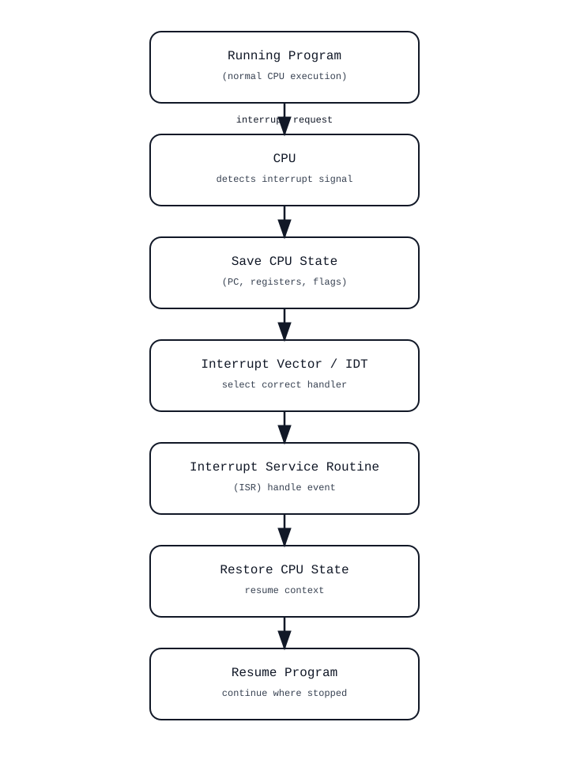

== Interrupts – Die Analogie mit der Türklingel

Stellen Sie sich eine Person vor, die ruhig zu Hause sitzt und sich ganz auf das Lesen eines Buches konzentriert. Diese Person steht für die CPU,
und das Lesen steht für die normale Ausführung eines Programms. In einer Welt ohne Türklingeln wäre die einzige
Möglichkeit, um zu erfahren, ob jemand an der Tür steht, das wiederholte Unterbrechen des Lesens, um zur Tür zu gehen und nachzusehen.
Meistens wäre diese Mühe umsonst, weil niemand da ist.

== Abfrage

Diese Situation ähnelt stark einem Computersystem, das sich auf Abfragen statt auf Unterbrechungen stützt. Die CPU
unterbricht wiederholt ihre Arbeit, um zu überprüfen, ob eine Taste auf der Tastatur gedrückt wurde, ein Festplattenvorgang abgeschlossen ist oder ein
Netzwerkpaket angekommen ist, auch wenn nichts passiert ist. Dieser Ansatz ist zwar einfach, aber ineffizient, da
wertvolle Verarbeitungszeit für die Überprüfung von Ereignissen aufgewendet wird, die selten auftreten. Führen wir nun eine Türklingel ein. Mit einer
installierten Türklingel muss der Leser nicht mehr ständig die Tür überprüfen.

== Die Türklingel-Analogie

Er kann sich ganz auf das Buch konzentrieren, da er sicher sein kann, dass er sofort benachrichtigt wird, wenn jemand kommt.
In dieser Analogie steht die Türklingel für einen Interrupt. Ein Gerät wie eine Tastatur, eine Maus oder ein Festplattencontroller
wartet nicht darauf, dass die CPU fragt, ob es Aufmerksamkeit benötigt, sondern signalisiert der CPU aktiv, wenn ein Ereignis
eintritt.

Wenn die Türklingel läutet, vergisst der Leser nicht, wo er im Buch war. Er legt ein Lesezeichen ein, steht auf
und geht zur Tür, um zu öffnen. Dies entspricht dem Speichern des aktuellen Zustands der CPU, wie z. B. Registerwerte und dem
Programmzähler, bevor sie auf die Unterbrechung reagiert. Das Öffnen der Tür und die Interaktion mit dem
Besucher entspricht der Ausführung einer Interrupt-Service-Routine (ISR), einem kleinen, speziellen Codeabschnitt, der
für die Verarbeitung dieses bestimmten Ereignisses entwickelt wurde. Nachdem der Besucher versorgt wurde, kehrt der Leser zu seinem Stuhl zurück,
entfernt das Lesezeichen und liest genau dort weiter, wo er aufgehört hat. Ebenso stellt die CPU ihren
gespeicherten Zustand wieder her und setzt das unterbrochene Programm fort, als wäre nichts geschehen.

image:./interrupts-stack.svg[width="800px"]

== Interrupts in Mikrocontrollern

In Mikrocontrollern sind Interrupts oft der primäre Mechanismus, um auf externe Ereignisse zu reagieren. Ein Tastendruck,
 ein Timer-Überlauf oder der Abschluss einer Analog-Digital-Wandlung können einen Interrupt auslösen.
Da Mikrocontroller in der Regel eine einzige Hauptschleife ausführen, wirkt ein Interrupt wie eine plötzliche Türklingel, die
die Ausführung vorübergehend auf eine kleine Handler-Funktion umleitet – die sogenannte Interrupt Service Routine (ISR).
Diese Handler sind in der Regel kurz und deterministisch und
führen nur die minimal erforderlichen Arbeiten aus, bevor sie die Kontrolle an das Hauptprogramm zurückgeben. Da Mikrocontroller
oft unter strengen Zeit- und Leistungsbeschränkungen arbeiten, sind Interrupts für ein effizientes und reaktionsschnelles
Design unerlässlich.

== Interrupts auf x86-Systemen

Auf x86-Prozessoren sind Interrupts komplexer und stark strukturiert. Externe Geräte signalisieren Interrupts
über dedizierte Interrupt-Leitungen, die von Interrupt-Controllern wie dem älteren PIC oder dem
modernen APIC verwaltet werden. Wenn ein Interrupt auftritt, verwendet die CPU eine Interrupt-Deskriptor-Tabelle (IDT), um zu bestimmen, welcher
Handler ausgeführt werden soll. Der Prozessor speichert automatisch einen Teil des Ausführungskontexts und wechselt bei Bedarf in einen
privilegierten Modus. Dieser Mechanismus ermöglicht eine klare Trennung von Benutzerprogrammen, Gerätetreibern und Hardwareereignissen,
 während dennoch sofort auf externe Stimuli reagiert werden kann.

== Interrupts in Betriebssystem-Kerneln

In Betriebssystem-Kerneln bilden Interrupts die Grundlage für Multitasking und Hardware-Interaktion. Timer-Interrupts
ermöglichen es dem Scheduler, die Kontrolle über die CPU zurückzugewinnen und zwischen laufenden Prozessen zu wechseln, wodurch
Fairness und Reaktionsfähigkeit gewährleistet werden. Hardware-Interrupts benachrichtigen den Kernel über abgeschlossene E/A-Operationen, Netzwerkverkehr
oder Benutzereingaben. Da Interrupt-Handler in einem hochprivilegierten Kontext ausgeführt werden, muss der Kernel-Code
sorgfältig entwickelt werden, damit er schnell, wiederaufnehmbar und sicher ist. Oft werden nur die kritischsten Aufgaben direkt im
Interrupt-Handler ausgeführt, während längere Aufgaben auf spätere Ausführungskontexte verschoben werden.

== Einführung von nicht maskierbaren Interrupts (NMIs)

Nicht alle Türklingeln oder Alarme sind gleich wichtig. Wenn die Türklingel gleichzeitig mit einem Feueralarm ertönt,
ignoriert der Leser den Besucher und reagiert sofort auf den Notfall. In dieser Analogie steht der Feueralarm
für den nicht maskierbaren Interrupt (NMI)-Pin der CPU. NMIs sind kritische Signale, die nicht deaktiviert werden können und
in der Regel für schwerwiegende Zustände wie Hardwareausfälle oder Watchdog-Timer verwendet werden.

Dies spiegelt wider, wie Interrupts Prioritäten haben können. Kritische Interrupts können weniger wichtige Interrupts verdrängen,
wodurch sichergestellt wird, dass dringende Situationen sofort behandelt werden.

Es gibt auch Momente, in denen der Leser überhaupt nicht gestört werden möchte, beispielsweise während einer Prüfung oder einem
wichtigen Telefonat. Er könnte die Türklingel stumm schalten oder ein „Bitte nicht stören”-Schild aufstellen. In Computersystemen
entspricht dies dem Maskieren oder vorübergehenden Deaktivieren von Interrupts, wodurch die CPU sensible Vorgänge
ohne Unterbrechung ausführen kann.

In einem größeren Haus kann es mehrere Signale geben: eine Türklingel, ein klingelndes Telefon und einen Rauchmelder, die jeweils
eine andere Art von Ereignis anzeigen. In ähnlicher Weise gibt es in einem Computer viele mögliche Interrupt-Quellen, und die CPU
kann bestimmen, welches Gerät den Interrupt ausgelöst hat, und zum entsprechenden Handler springen. Insgesamt ermöglichen Interrupts
einem Computer, effizient zu arbeiten, indem er nur dann auf Ereignisse reagiert, wenn sie tatsächlich auftreten, so wie eine Türklingel es
einem Menschen ermöglicht, in Ruhe zu lesen, ohne ständig nach der Tür zu sehen.

== Verschachtelte Interrupts

In manchen Situationen kann ein Interrupt auftreten, während ein anderer Interrupt bereits verarbeitet wird.
Dies wird als verschachtelter Interrupt bezeichnet. Um bei der Analogie mit der Türklingel zu bleiben:
Stellen Sie sich vor, der Leser öffnet die Tür, als plötzlich der Feueralarm losgeht. Der Leser unterbricht sofort das
Gespräch an der Tür und reagiert auf den dringenderen Alarm. Sobald der Notfall behoben ist, kehrt er zum Besucher zurück
und macht dort weiter, wo er aufgehört hat.

In Computersystemen werden verschachtelte Interrupts durch Interrupt-Prioritäten ermöglicht.
Jeder Interrupt-Quelle wird eine Prioritätsstufe zugewiesen. Wenn ein Interrupt-Handler ausgeführt wird, können
Interrupts mit niedrigerer Priorität vorübergehend blockiert werden, während Interrupts mit höherer Priorität weiterhin
den aktuellen Handler unterbrechen dürfen.
Dadurch wird sichergestellt, dass zeitkritische Ereignisse, wie z. B. Timer-Ticks oder Hardware-Fehlersignale, mit
minimaler Verzögerung behandelt werden.

Wenn ein verschachtelter Interrupt auftritt, muss die CPU den aktuellen Status des Interrupt-Handlers speichern, bevor
sie zum Handler mit höherer Priorität springt. Das bedeutet, dass mehrere Kontextschichten gleichzeitig auf dem Stack
vorhanden sein können. Nachdem der Interrupt mit der höchsten Priorität
beendet ist, wird die Ausführung in umgekehrter Reihenfolge fortgesetzt, wobei die unterbrochenen Handler zurückverfolgt
werden, bis das ursprüngliche Programm fortgesetzt wird.



Verschachtelte Interrupts verbessern die Reaktionsfähigkeit des Systems, erhöhen aber auch die Komplexität.
Interrupt-Handler müssen sorgfältig geschrieben werden, damit sie wiedereintrittsfähig sind oder anderweitig vor einer
Beschädigung gemeinsam genutzter Daten geschützt sind. Aus diesem Grund halten viele Systeme Interrupt-Service-Routinen
kurz und vermeiden komplexe Logik, wobei längere Arbeiten auf Nicht-Interrupt-Kontexte verschoben werden. Einige Systeme
beschränken oder deaktivieren die Verschachtelung auch vollständig, um das Design zu vereinfachen und ein
vorhersehbares Timing zu gewährleisten.


Insgesamt bieten verschachtelte Interrupts ein Gleichgewicht zwischen Reaktionsfähigkeit und Komplexität.
Indem sie zulassen, dass kritische Ereignisse weniger wichtige Arbeiten – sogar andere Interrupt-Handler – unterbrechen,
können Systeme strenge Timing-Anforderungen erfüllen und gleichzeitig die Kontrolle über den Ausführungsfluss behalten.

== Hardware-Watchdog-Timer

Ein Hardware-Watchdog-Timer ist ein Sicherheitsmechanismus, der einem System hilft, sich zu erholen, wenn die Software
hängen bleibt. Stellen Sie sich das wie einen Wachmann mit einer Stoppuhr vor: Der Wachmann erwartet regelmäßig eine
"Ich lebe noch"-Meldung. Wenn diese Meldung nicht rechtzeitig erfolgt, geht der Wachmann davon aus, dass etwas nicht in
Ordnung ist, und löst eine Notfallmaßnahme aus.

In vielen eingebetteten Systemen ist der Watchdog als dedizierter Hardware-Timer implementiert, der herunterzählt.
Die Software muss den Watchdog regelmäßig „streicheln“ oder „treten“ (ihn füttern), bevor er abläuft.
Im Normalbetrieb ist dies einfach: Die Hauptschleife oder der Scheduler erreicht einen bekannten Punkt und setzt den
Watchdog-Timer zurück. Wenn die CPU jedoch in einer Endlosschleife hängen bleibt, sich in einem Deadlock befindet,
mit deaktivierten Interrupts feststeckt oder auf eine Weise abstürzt, die die normale Ausführung verhindert, wird der
Watchdog nicht bedient.

Wenn der Watchdog abläuft, hängt die Reaktion von der Plattform ab:

Reset-Watchdogs:
Das häufigste Verhalten besteht darin, den gesamten Mikrocontroller/die gesamte CPU zurückzusetzen,
wodurch das System in einen bekannten guten Startzustand zurückversetzt wird.

Interrupt-Watchdogs:
Einige Watchdogs lösen zunächst einen Interrupt aus (oft einen Interrupt mit hoher Priorität und auf einigen Systemen
sogar einen NMI-ähnlichen Pfad), um dem System eine letzte Chance zu geben, Diagnosedaten zu protokollieren oder eine
kontrollierte Wiederherstellung vor einem Reset zu versuchen.

Fenster-Watchdogs:
Strengere Varianten erfordern, dass der Watchdog innerhalb eines bestimmten Zeitfensters bedient wird – nicht zu früh und
nicht zu spät –, um Code zu erkennen, der in einer engen Schleife hängen geblieben ist und den Watchdog „zu oft“ bedient,
ohne echte Arbeit zu leisten.

Watchdogs sind besonders wichtig in unbeaufsichtigten oder sicherheitsrelevanten Geräten – Routern, Autos, industriellen
Steuerungen, medizinischen Geräten –, bei denen ein manueller Neustart nicht möglich ist. Sie verhindern zwar keine Fehler,
aber sie begrenzen die Zeit, in der ein Fehler das System in einem fehlerhaften Zustand halten kann.

Ein wichtiger Punkt beim Design ist, wo Sie den Watchdog bedienen. Wenn Sie ihn über einen schnellen Interrupt zurücksetzen,
der auch während eines Systemausfalls weiterläuft, wird der Watchdog möglicherweise nie ausgelöst, obwohl das Hauptprogramm
hängen geblieben ist. Ein gängiges Muster besteht darin, den Watchdog erst dann zu warten, wenn das Programm einen aussagekräftigen
„Gesundheitscheck” erfolgreich abgeschlossen hat (z. B. wenn die Hauptschleife gelaufen ist, kritische Aufgaben ausgeführt wurden oder
der Scheduler Fortschritte gemacht hat). Auf diese Weise zeigt der Watchdog wirklich an, dass das System als Ganzes aktiv ist – und
nicht nur, dass noch ein Interrupt ausgelöst wird.

== Zusammenfassung

Interrupts ermöglichen es einer CPU, effizient auf Ereignisse zu reagieren, ohne ständig nach ihnen zu suchen. Anstatt
Geräte abzufragen und Rechenzeit zu verschwenden, kann sich die CPU auf die Ausführung von Programmen konzentrieren und nur dann reagieren, wenn ein
Gerät signalisiert, dass Aufmerksamkeit erforderlich ist.

Um bei der Analogie mit der Türklingel zu bleiben: Ein Interrupt ist wie eine Benachrichtigung, die die laufende Arbeit vorübergehend unterbricht. Die CPU
speichert ihren aktuellen Zustand, führt einen kleinen Handler aus, um das Ereignis zu bearbeiten, und setzt dann die Ausführung genau dort fort,
wo sie aufgehört hat. Dieser Mechanismus ist grundlegend für alle Computersysteme, von einfachen Mikrocontrollern
bis hin zu modernen x86-Prozessoren und vollständigen Betriebssystem-Kerneln.

In Mikrocontrollern ermöglichen Interrupts schnelle und energieeffiziente Reaktionen auf externe Signale und Timer. Auf
x86-Systemen werden sie durch strukturierte Mechanismen wie Interrupt-Controller und Deskriptortabellen verwaltet.
Innerhalb von Betriebssystemkernen bilden Interrupts das Rückgrat von Multitasking, Geräte-E/A und Systemreaktionsfähigkeit.

Schließlich sind nicht alle Interrupts gleich. Interrupts mit hoher Priorität und nicht maskierbare Interrupts stellen sicher,
dass kritische Ereignisse sofort behandelt werden, selbst wenn normale Interrupts deaktiviert sind. Zusammen ermöglichen diese
Mechanismen, dass Computersysteme  reaktionsschnell, effizient und zuverlässig bleiben.

