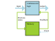
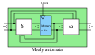
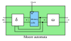
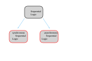



== Sequential Logic

Complementary to Combinatorial logic, sequential logic contains some type of memory,
making the behaviour state-dependent. We need to feed it a clock signal.

=== Mealy and Moore Automata (synchronous)
There are two different types of finite automata in the digital logic.
Those are:

. The mealy automata, which is dependent on the input and the state
. The moore automata, which is only dependent on the state

=== Synchronous and Asynchronous sequential Logic

There are two different types of sequential logic, the synchronous sequential logic
with one central clock, as well as the asnychonous logic which has multiple clock
domains.

When we add a clock function to our automata shown above the synchronous
automata becomes an asynchronous automata.