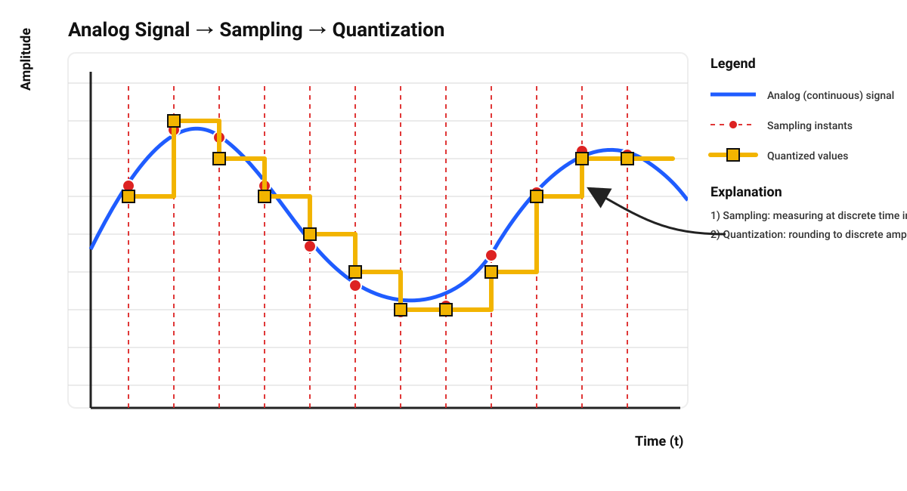
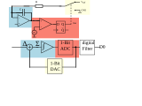
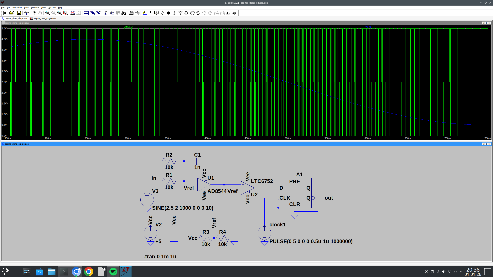

== The two important pillars - Digital-Analog-Converter and Analog-Digital-Converter

What we haven't checked yet in  our journey around (analog) electronics and digital electronics
where the converter circuits from analog to digital and vice versa - for this we first want to
explain the different terms around.

==  The theory about analog signals, digital signals, sampling and quantisation

Analog signals are characterized by being continuous in time and continuous in value.
The conversion process of analog signals
is often referred to as quantization.

Digital signals, on the other hand, are signals that have undergone a form of
quantization process, which means that instead of being continuous signals, they are discrete signals.
Digital signals are both time-discrete and value-discrete.

=== Analog Signals

Analog signals are continuous in time and continuous in value.
This means that the signal exists at every moment in time and can
take any value within a certain range. There are no jumps or gaps in the signal.
Many physical quantities, such as sound, temperature, or light intensity,
can naturally be described by analog signals.

Because analog signals change continuously, they provide a direct representation
of real-world processes.

=== Digital Signals

Digital signals, on the other hand, are not continuous. They are signals that have undergone a quantisation process.
As a result, digital signals are discrete in time and discrete in value.
Instead of being defined at every point in time, a digital signal is only defined at certain time instants.
In addition, the signal values are restricted to a finite set of possible values. Digital signals therefore consist
of individual values rather than a continuous waveform.

=== Sampling and Quantisation

==== Sampling
Sampling describes the process of measuring a continuous-time signal at discrete points in time.
Quantisation describes the process of mapping these sampled values to a finite set of discrete amplitude levels.

==== Quantisation
Quantisation describes the process of converting an analog signal into a digital signal.
During this process, the continuous signal is represented by a sequence of discrete values.
This process makes it possible to process, store, and transmit signals using digital systems.

image:./adc_abstraction.svg[width="1000px"]

== The Analog-Digital-Converter (ADC)

The other way around is described as Analog-Digital-Converter. The fastest one, is a flash converter,
a single IC which contains (2^n) -1  comparators where n stands for the bit width.

[width="100%" cols="a,a"]
|=====
| 
| image:./flash_adc.svg[width="500px"]
|=====

// image:./Flash_ADC.png[width="500px"]
== The Sigma-Delta Converter (ΣΔ-Converter)

In addition to fast converter architectures such as the flash ADC and simple DAC structures
like the R-2R ladder, there exists another very important class of converters that is optimized
not for speed, but for precision and resolution: the sigma-delta converter.

Sigma-delta converters are widely used in modern electronic systems, especially in audio
applications, sensor interfaces, and precision measurement equipment. Their main idea is
to trade conversion speed for accuracy by using oversampling and digital signal processing.

Instead of converting an analog signal directly into a multi-bit digital word, a sigma-delta
converter operates with a very high sampling frequency and a feedback loop. The analog input
signal is continuously compared with a feedback signal derived from the converter output.
The difference between these two signals is integrated over time. This integration process
emphasizes the low-frequency components of the signal while averaging out high-frequency noise.

The name sigma-delta originates from the two operations used inside the converter loop.
The sigma (Σ) represents the integration of the error signal over time, while the
delta (Δ) represents the difference between the input signal and the feedback signal.
Together, these operations form a closed-loop system that continuously corrects itself.

At the heart of the sigma-delta converter is a very simple quantizer, often implemented as
a 1-bit comparator. This quantizer decides whether the integrator output is positive
or negative and generates a corresponding digital output bit. The digital output is then
converted back into an analog signal using a simple DAC and fed back to the input of the
converter. This feedback mechanism forces the average value of the digital output to follow
the analog input signal.

The direct output of a sigma-delta modulator is therefore not a conventional multi-bit
binary number, but a fast stream of single bits, for example:

111011101111010111...

The information is encoded in the density of ones within this bitstream. A higher density
of ones corresponds to a higher input voltage, while a lower density corresponds to a lower
input voltage. This type of representation is known as pulse-density modulation (PDM).

Sigma-delta converters operate with a sampling frequency that is much higher than the
Nyquist frequency of the input signal. This technique is called oversampling.
Oversampling reduces the quantization noise within the signal band and significantly
relaxes the requirements for analog anti-aliasing filters.

Another key concept of sigma-delta converters is noise shaping. While quantization
noise cannot be eliminated, the feedback loop pushes most of this noise toward higher
frequencies, outside the frequency range of interest. A digital low-pass filter removes
this high-frequency noise, and a decimator reduces the data rate to produce a high-resolution
multi-bit digital output value.

Because of this principle, sigma-delta converters can achieve very high resolutions,
often 16 to 24 bits, with relatively simple analog circuitry. However, this comes at the
cost of conversion speed and latency introduced by digital filtering. For this reason,
sigma-delta converters are not suitable for very high-frequency or fast transient signals,
but they are ideal for precision applications.

(Not my own LT-Spice file but found https://github.com/teddokano/sigma-delta_modulation_sim[here])

link:./sigma_delta_adc.asc[LTSpice file]

== The Digital-Analog-Converter (DAC)
One extraordinary simple example of a DAC is a resistor network R-2R-Ladder... It just consists of a simple
resistor network and a simple single op-amp.

=== The R-2R-DAC

The most simple DAC ist the r-2r-ladder DAC. It is basically a resistor network,
with a amplifier (op-amp) at the output.

// This page is still under construction
//
// image:./under_construction.png[width="350px"]