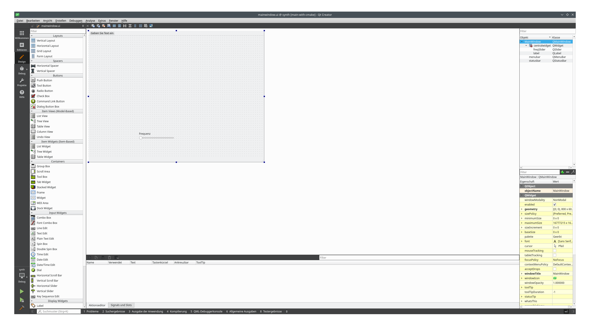



=== A GUI is a *fantastic* idea... But what should it be - SDL, wxWidgets, or Qt?

Choosing a GUI framework for a C++ audio project is a "fork in the road" moment. Each of these options pulls the project in a completely different architectural direction.

Since your course currently uses SDL, it’s the natural frontrunner, but here is how they stack up for a synth-building context:

1. **SDL (Simple DirectMedia Layer) - The "Low-Level" Choice**
Since you already introduced SDL in Tutorial 02, staying here is the path of least resistance.

*Pros:* It doesn't "take over" your `main()` function as aggressively as the others. It’s perfect for custom-drawn knobs and sliders using simple shapes or bitmaps.

*The "Audio" Fit:* It’s great for creating visualizers (oscilloscopes or spectrum analyzers) because you have direct access to the pixel buffer or hardware-accelerated rendering.

*Cons:* It has no built-in "widgets" (buttons, text inputs). You have to build your own UI system from scratch or use a library like Dear ImGui.

2. **Qt - The "Professional/Industrial" Choice**

Qt is the heavyweight champion. If you want your synth to look like a modern DAW (Digital Audio Workstation) or a commercial plugin, this is it.

*Pros:* Incredible documentation and a "What You See Is What You Get" (WYSIWYG) editor. It handles high-DPI scaling and complex layouts beautifully.

*The "Audio" Fit:* It’s overkill for a simple tutorial but excellent for teaching **Signals and Slots**, a C++ mechanism that perfectly mimics how patch cables work in a modular synth.

*Cons:* Huge binary size and a steep learning curve. It also requires the **moc** (Meta-Object Compiler), which adds a layer of "magic" that might hide the raw C++ logic you are trying to teach.

3. **wxWidgets - The "Native" Choice**

wxWidgets uses the host operating system's native controls (it looks like a Windows app on Windows, and a GTK app on Linux).

*Pros:* No "magic" pre-processors like Qt. It’s "pure" C++ in a very traditional sense.

*Cons:* It feels a bit dated. Styling custom, "cool-looking" synth knobs is significantly harder in wxWidgets than in SDL or Qt because it strives to look like a standard spreadsheet or file explorer.

[width="100%" cols="a,a,a,a"]
|=====
| Feature        |  SDL                     | Qt                  | wxWidgets
| Learning Curve |  Easy (if you know SDL)  | Steep               | Moderate
| Look & Feel    | Custom/Game-like         | Modern/Slick        | Native/Standard
| Best For...    | Visualizers & Prototyping| Commercial Software | Traditional Desktop Apps
| C++ Style      | Procedural/Simple OOP    | Heavy OOP & Macros  | Traditional OOP
|=====

== So, we choose Qt - let's install the dependencies and the Qt Creator IDE

We start by simply installing Qt 5 plus dependencies (roughly 500 MB)...

```
sudo apt install qtbase5-dev qtchooser qt5-qmake qtbase5-dev-tools qtcreator
```

==  The QTCreator

image:./qt_creator_overview.png[QtCreator Overview]



The QTCreator allows us - for example to create our own UI ....

We start with the simple *.pro(ject) file which is to be generated when creating a new project...

synth.pro

QT       += core gui
QT       += multimedia
greaterThan(QT_MAJOR_VERSION, 4): QT += widgets

CONFIG += c++17

# You can make your code fail to compile if it uses deprecated APIs.
# In order to do so, uncomment the following line.
#DEFINES += QT_DISABLE_DEPRECATED_BEFORE=0x060000    # disables all the APIs deprecated before Qt 6.0.0

SOURCES += \
    main.cpp \
    mainwindow.cpp

HEADERS += \
    mainwindow.h

FORMS += \
    mainwindow.ui

TRANSLATIONS += \
    synth_en_150.ts
CONFIG += lrelease
CONFIG += embed_translations

# Default rules for deployment.
qnx: target.path = /tmp/$${TARGET}/bin
else: unix:!android: target.path = /opt/$${TARGET}/bin
!isEmpty(target.path): INSTALLS += target



== The meta-object compiler (moc)



The Meta-Object Compiler, or moc, is the tooling that makes Qt more than just a standard C++ library.
While C++ is powerful, it historically lacks introspection—the ability for a program to examine its own structure
(like classes, methods, or properties) at runtime.

The moc handles this by generating additional C++ code that bridges the gap between standard C++ and Qt’s advanced features.



=== How It Works
The moc isn't a replacement for your compiler (like GCC or Clang); it’s a pre-processor. Here is the typical workflow:

Scanning:
The moc reads your C++ header files.

Detection:
It looks for the Q_OBJECT macro. If it finds it, it knows this class needs "meta-powers."

Generation:
It creates a new C++ file (usually named moc_filename.cpp) containing the meta-object code.

Compilation:
Your standard compiler compiles both your original code and the generated moc code, linking them together into the final binary.

Key Features Enabled by moc
Without the Meta-Object Compiler, the following core Qt features wouldn't exist:

1. Signals and Slots
This is Qt's signature way of letting objects communicate. Because standard C++ doesn't have a built-in "signal" keyword, the moc generates the "glue code" required to look up functions by name and execute them when a signal is emitted.

2. Introspection (Run-Time Type Information)
You can ask a QObject about its class name, what signals it has, or what methods are available at runtime using metaObject(). This is much more descriptive than the standard C++ typeid.

3. Properties
The moc enables the Q_PROPERTY system, allowing you to treat class members like properties in languages like Python or C#. You can get/set values by string names, which is vital for Qt Quick (QML).

==

main.cpp

#include "mainwindow.h"

#include <QApplication>
#include <QLocale>
#include <QTranslator>

int main(int argc, char *argv[])
{
    QApplication a(argc, argv);

    QTranslator translator;
    const QStringList uiLanguages = QLocale::system().uiLanguages();
    for (const QString &locale : uiLanguages) {
        const QString baseName = "synth_" + QLocale(locale).name();
        if (translator.load(":/i18n/" + baseName)) {
            a.installTranslator(&translator);
            break;
        }
    }
    MainWindow w;
    w.show();
    return a.exec();
}



++++
<div class="code-tooltip-data" style="display:none;">
{
"1-3": "includes",
"5": "main() definition",
"7": "create QApplication",
"9": "create QTranslator",
"10-17": "detect system language and load translation",
"18-19": "create and show main window",
"20": "start Qt event loop"
}
</div>
++++


mainwindow.h

#ifndef MAINWINDOW_H
#define MAINWINDOW_H

#include <QMainWindow>
#include <QVector>
#include <QPointF>
#include <QtMath>
#include <QAudioOutput>
#include <QIODevice>

QT_BEGIN_NAMESPACE
namespace Ui { class MainWindow; }
QT_END_NAMESPACE

class MainWindow : public QMainWindow
{
    Q_OBJECT

public:
    MainWindow(QWidget *parent = nullptr);
    ~MainWindow();

private:
    Ui::MainWindow *ui;
    // In der mainwindow.h unter private:
    class AudioGenerator *m_generator;
    class QAudioOutput *m_audioOutput;

protected:
    void paintEvent(QPaintEvent *event) override; // This draws the waveform

private:
    QVector<QPointF> waveformPoints;
    float currentFreq = 440.0;
    void generateWaveform(); // Logic to calculate the sine wave
};

class AudioGenerator : public QIODevice {
    Q_OBJECT
public:
    // Konstruktor mit Parent, damit Qt den Speicher verwalten kann
    AudioGenerator(QObject *parent = nullptr) : QIODevice(parent) {}

    void setFrequency(float f) { m_frequency = f; }

    qint64 readData(char *data, qint64 maxlen) override {
        qint16 *samples = reinterpret_cast<qint16*>(data);
        int sampleCount = maxlen / sizeof(qint16);
        for (int i = 0; i < sampleCount; ++i) {
            float val = 8000.0 * qSin(m_phase);
            samples[i] = static_cast<qint16>(val);
            m_phase += 2.0 * M_PI * m_frequency / 44100.0;
            if (m_phase > 2.0 * M_PI) m_phase -= 2.0 * M_PI;
        }
        return maxlen;
    }

    qint64 writeData(const char *data, qint64 len) override {
        Q_UNUSED(data); Q_UNUSED(len); return 0;
    }

private:
    float m_frequency = 440.0;
    float m_phase = 0.0;
};
#endif // MAINWINDOW_H


++++

<div class="code-tooltip-data" style="display:none;">
{
"1-2": "header guard start",
"4-9": "Qt includes used by the application",
"11-13": "forward declaration of the UI class",
"15": "MainWindow class declaration",
"17": "enable Qt meta-object system (signals/slots)",
"19-21": "constructor and destructor",
"23-26": "private members including UI and audio objects",
"28-29": "Qt paint event override for drawing the waveform",
"31-34": "waveform data, frequency value, and waveform generator function",
"36": "AudioGenerator class declaration (custom audio device)",
"37": "enable Qt meta-object system",
"39-41": "constructor and frequency setter",
"43-52": "readData() generates the sine wave audio samples",
"54-56": "writeData() unused for this generator",
"58-61": "internal audio state variables",
"62": "header guard end"
}
</div>
++++

mainwindow.cpp

#include "mainwindow.h"
#include "ui_mainwindow.h"
#include <QPainter>

MainWindow::MainWindow(QWidget *parent)
    : QMainWindow(parent)
    , ui(new Ui::MainWindow)
{
    ui->setupUi(this);

    // 1. Audio-Format definieren (Standard CD-Qualität)
    QAudioFormat format;
    format.setSampleRate(44100);
    format.setChannelCount(1);
    format.setSampleSize(16);
    format.setCodec("audio/pcm");
    format.setByteOrder(QAudioFormat::LittleEndian);
    format.setSampleType(QAudioFormat::SignedInt);

    // 2. Audio-Generator (Logik im Header) und Output initialisieren
    m_generator = new AudioGenerator(this);
    m_generator->open(QIODevice::ReadOnly);

    m_audioOutput = new QAudioOutput(format, this);
    m_audioOutput->start(m_generator);

    // 3. Slider-Verbindung: Ändert Tonhöhe und Grafik gleichzeitig
    connect(ui->freqSlider, &QSlider::valueChanged, this, [this](int value) {
        currentFreq = static_cast<float>(value);
        m_generator->setFrequency(currentFreq); // Ändert die Audio-Frequenz
        generateWaveform();                     // Berechnet neue Punkte für das Oszilloskop
        update();                               // Erzwingt das Neuzeichnen (paintEvent)
    });

    // Initiale Berechnung der Wellenform
    generateWaveform();
}

void MainWindow::generateWaveform() {
    waveformPoints.clear();
    // Wir nutzen die Breite des Fensters als Basis für die X-Achse
    for (int x = 0; x < width(); ++x) {
        // Die Konstante 3.14... ersetzt M_PI, falls Makros nicht gefunden werden
        float y = 80 * qSin(2 * 3.14159265 * currentFreq * (float)x / 10000.0);
        waveformPoints.append(QPointF(x, 200 + y));
    }
}

void MainWindow::paintEvent(QPaintEvent *event) {
    (void)event; // Verhindert Warnung über ungenutzten Parameter
    QPainter painter(this);
    painter.setRenderHint(QPainter::Antialiasing);

    // Zeichne den schwarzen "Bildschirm" des Oszilloskops
    painter.fillRect(0, 100, width(), 200, Qt::black);

    // Zeichne die grüne "Phosphor"-Linie
    painter.setPen(QPen(Qt::green, 2));
    painter.drawPolyline(waveformPoints.data(), waveformPoints.size());
}

MainWindow::~MainWindow() {
    m_audioOutput->stop(); // Audio-Stream sauber beenden
    delete ui;
}


++++
<div class="code-tooltip-data" style="display:none;">

{
"1-3": "includes",
"5": "MainWindow constructor definition",
"7-8": "initialize base class and UI pointer",
"10": "initialize UI widgets",
"12-18": "define audio format (44.1 kHz mono PCM)",
"20-25": "create audio generator and audio output",
"27-33": "connect slider to update frequency, waveform, and repaint",
"35-36": "initial waveform generation",
"39": "generateWaveform() function definition",
"40-46": "calculate sine wave points for visualization",
"49": "paintEvent() override definition",
"50-51": "ignore unused event parameter",
"52-53": "create QPainter and enable antialiasing",
"55-56": "draw oscilloscope background",
"58-60": "draw waveform polyline",
"63": "MainWindow destructor",
"64-65": "stop audio output and clean up UI"
}
</div>
++++


<?xml version="1.0" encoding="UTF-8"?>
<ui version="4.0">
 <class>MainWindow</class>
 <widget class="QMainWindow" name="MainWindow">
  <property name="geometry">
   <rect>
    <x>0</x>
    <y>0</y>
    <width>800</width>
    <height>600</height>
   </rect>
  </property>
  <property name="windowTitle">
   <string>MainWindow</string>
  </property>
  <widget class="QWidget" name="centralwidget">
   <widget class="QSlider" name="freqSlider">
    <property name="geometry">
     <rect>
      <x>230</x>
      <y>460</y>
      <width>160</width>
      <height>16</height>
     </rect>
    </property>
    <property name="maximum">
     <number>2000</number>
    </property>
    <property name="orientation">
     <enum>Qt::Horizontal</enum>
    </property>
   </widget>
   <widget class="QLabel" name="label">
    <property name="geometry">
     <rect>
      <x>230</x>
      <y>440</y>
      <width>54</width>
      <height>17</height>
     </rect>
    </property>
    <property name="text">
     <string>Frequenz</string>
    </property>
   </widget>
  </widget>
  <widget class="QMenuBar" name="menubar">
   <property name="geometry">
    <rect>
     <x>0</x>
     <y>0</y>
     <width>800</width>
     <height>22</height>
    </rect>
   </property>
  </widget>
  <widget class="QStatusBar" name="statusbar"/>
 </widget>
 <resources/>
 <connections/>
</ui>



== From linear to logarithmic



Human perception of pitch and loudness is logarithmic, so the slider must be mapped using an exponential function.

The standard approach:

[role=“image”,“./logarithmic_scale_formula.svg” ,imgfmt=“svg”]
\large \[f = f_{min} * (f_{max} / f_{min} )^{(slider/maxSlider)}\]

This is the valid approach for both, volume and frequency.



So next we show the both adapted files mainwindow.h and mainwindow.cpp

mainwindow.h


#ifndef MAINWINDOW_H
#define MAINWINDOW_H

#include <QMainWindow>
#include <QVector>
#include <QPointF>
#include <QIODevice>

QT_BEGIN_NAMESPACE
namespace Ui { class MainWindow; }
QT_END_NAMESPACE

class QAudioOutput;
class QPaintEvent;

class AudioGenerator : public QIODevice
{
    Q_OBJECT

public:
    explicit AudioGenerator(QObject *parent = nullptr);

    void setFrequency(float frequency);
    void setAmplitude(float amplitude);

    qint64 readData(char *data, qint64 maxlen) override;
    qint64 writeData(const char *data, qint64 len) override;

private:
    float m_frequency = 440.0f;
    float m_phase = 0.0f;
    float m_amplitude = 8000.0f;
};

class MainWindow : public QMainWindow
{
    Q_OBJECT

public:
    explicit MainWindow(QWidget *parent = nullptr);
    ~MainWindow() override;

protected:
    void paintEvent(QPaintEvent *event) override;

private:
    static float sliderToLogFrequency(int value, int minValue, int maxValue,
                                      float minFreq, float maxFreq);
    static float sliderToLogAmplitude(int value, int minValue, int maxValue,
                                      float minAmp, float maxAmp);
    void generateWaveform();

    Ui::MainWindow *ui = nullptr;
    AudioGenerator *m_generator = nullptr;
    QAudioOutput *m_audioOutput = nullptr;
    QVector<QPointF> waveformPoints;
    float currentFreq = 440.0f;
};

#endif // MAINWINDOW_H




mainwindow.cpp


#include "mainwindow.h"
#include "ui_mainwindow.h"

#include <QAudioFormat>
#include <QAudioOutput>
#include <QPainter>
#include <QPaintEvent>
#include <QSlider>
#include <QtMath>

namespace {
constexpr float kMinFreq = 20.0f;
constexpr float kMaxFreq = 20000.0f;
constexpr float kMinAmp = 0.0f;
constexpr float kMaxAmp = 16000.0f;
constexpr int kFreqSliderDefault = 895; // ~440 Hz on a 0..2000 logarithmic slider
}

AudioGenerator::AudioGenerator(QObject *parent)
    : QIODevice(parent)
{
}

void AudioGenerator::setFrequency(float frequency)
{
    m_frequency = frequency;
}

void AudioGenerator::setAmplitude(float amplitude)
{
    m_amplitude = amplitude;
}

qint64 AudioGenerator::readData(char *data, qint64 maxlen)
{
    qint16 *samples = reinterpret_cast<qint16 *>(data);
    const int sampleCount = static_cast<int>(maxlen / static_cast<qint64>(sizeof(qint16)));

    for (int i = 0; i < sampleCount; ++i) {
        const float value = m_amplitude * qSin(m_phase);
        samples[i] = static_cast<qint16>(value);

        m_phase += static_cast<float>(2.0 * M_PI) * m_frequency / 44100.0f;
        if (m_phase >= static_cast<float>(2.0 * M_PI)) {
            m_phase -= static_cast<float>(2.0 * M_PI);
        }
    }

    return static_cast<qint64>(sampleCount) * static_cast<qint64>(sizeof(qint16));
}

qint64 AudioGenerator::writeData(const char *data, qint64 len)
{
    Q_UNUSED(data)
    Q_UNUSED(len)
    return 0;
}

MainWindow::MainWindow(QWidget *parent)
    : QMainWindow(parent)
    , ui(new Ui::MainWindow)
    , m_generator(new AudioGenerator(this))
{
    ui->setupUi(this);

    QAudioFormat format;
    format.setSampleRate(44100);
    format.setChannelCount(1);
    format.setSampleSize(16);
    format.setCodec("audio/pcm");
    format.setByteOrder(QAudioFormat::LittleEndian);
    format.setSampleType(QAudioFormat::SignedInt);

    m_generator->open(QIODevice::ReadOnly);
    m_generator->setAmplitude(8000.0f);

    m_audioOutput = new QAudioOutput(format, this);
    m_audioOutput->start(m_generator);

    ui->freqSlider->setRange(0, 2000);

    connect(ui->freqSlider, &QSlider::valueChanged, this, [this](int value) {
        currentFreq = sliderToLogFrequency(value,
                                           ui->freqSlider->minimum(),
                                           ui->freqSlider->maximum(),
                                           kMinFreq,
                                           kMaxFreq);
        m_generator->setFrequency(currentFreq);
        generateWaveform();
        update();
    });

    if (QSlider *volumeSlider = findChild<QSlider *>(QStringLiteral("volumeSlider"))) {
        connect(volumeSlider, &QSlider::valueChanged, this, [this, volumeSlider](int value) {
            const float amplitude = sliderToLogAmplitude(value,
                                                         volumeSlider->minimum(),
                                                         volumeSlider->maximum(),
                                                         kMinAmp,
                                                         kMaxAmp);
            m_generator->setAmplitude(amplitude);
        });
    }

    ui->freqSlider->setValue(kFreqSliderDefault);
    currentFreq = sliderToLogFrequency(ui->freqSlider->value(),
                                       ui->freqSlider->minimum(),
                                       ui->freqSlider->maximum(),
                                       kMinFreq,
                                       kMaxFreq);
    m_generator->setFrequency(currentFreq);
    generateWaveform();
}

MainWindow::~MainWindow()
{
    if (m_audioOutput != nullptr) {
        m_audioOutput->stop();
    }
    delete ui;
}

float MainWindow::sliderToLogFrequency(int value, int minValue, int maxValue,
                                       float minFreq, float maxFreq)
{
    if (maxValue <= minValue || minFreq <= 0.0f || maxFreq <= minFreq) {
        return minFreq;
    }

    const float normalized = static_cast<float>(value - minValue)
                           / static_cast<float>(maxValue - minValue);
    return minFreq * qPow(maxFreq / minFreq, normalized);
}

float MainWindow::sliderToLogAmplitude(int value, int minValue, int maxValue,
                                       float minAmp, float maxAmp)
{
    if (maxValue <= minValue || maxAmp < minAmp) {
        return minAmp;
    }

    const float normalized = static_cast<float>(value - minValue)
                           / static_cast<float>(maxValue - minValue);

    if (normalized <= 0.0f) {
        return minAmp;
    }

    return minAmp + (maxAmp - minAmp) * qPow(normalized, 2.0f);
}

void MainWindow::generateWaveform()
{
    waveformPoints.clear();
    waveformPoints.reserve(width());

    for (int x = 0; x < width(); ++x) {
        const float y = 80.0f * qSin((2.0f * static_cast<float>(M_PI) * currentFreq * static_cast<float>(x)) / 10000.0f);
        waveformPoints.append(QPointF(x, 200.0 + y));
    }
}

void MainWindow::paintEvent(QPaintEvent *event)
{
    Q_UNUSED(event)

    QPainter painter(this);
    painter.setRenderHint(QPainter::Antialiasing);
    painter.fillRect(0, 100, width(), 200, Qt::black);
    painter.setPen(QPen(Qt::green, 2));

    if (!waveformPoints.isEmpty()) {
        painter.drawPolyline(waveformPoints.constData(), waveformPoints.size());
    }
}

