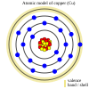
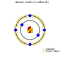
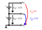
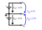
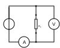
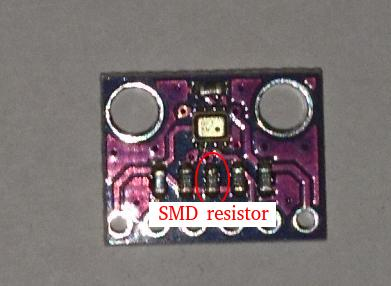




After this chapter you will know all the basics around electricity and simple circuits utilizing ohmic load...


= Prequel Introduction to electronics

'''
While I was about to write the implementation part of the boolean algebra post, the basic logic
gates, the writing process got quickly out of hand and I caught myself to write more about less connected
topics like explaining basic electronic components and their implementation on silicon than the actual content,
here shall be the place for those excursions. This is not meant to be a complete reference more a supplement to
existing literature.
'''

== Free electrons and electric current

What is electricity? Broadly spoken it is the flow of electrons in a conductor. In layman's term you can say,
electrons on the outer shell - also called as valence band - of an atom are hopping from the valence band
of an atom to the adjacent one. So essential electricity constitutes the movement of electrons through matter.
In practical application this matter is an electrical circuit, but also for example the lightning discharge
occurs, in this case the ionised air can be considered as the (short) circuit.

////
write about it

The table below shows the atomic models of carbon, silicon, and copper conductor. The author chooses those elements
based on their interesting properties. Carbon and silicon belong to the group of semiconductors while copper is known
as excellent conductor. The conductivity of semiconductors is variable to a wide degree, dependent on its degree of purity and temperature

////

=== Going atomic: Conductors...

The first group of elements (or compounds) we will introduce here are the conductors.
Some important representations of this group are the elements aluminium and copper
which both are indispensable for electric transmission lines and power grids.
As the table below depicts, both elements have free electrons available on it's valence
shell, which as described above, are needed to allow the hopping of electrons from one atom
to another and thus allow movement of electrons, making the element (in its pure form) a conductor.

Of course in real world there are multiple factors counteracting to the idealized properties
proposed here. E.g. we have to consider among others that metals oxide when coming in contact
with oxygen, which builds up a thin but effectively isolating layer on the surface of the metal,
preventing a good contact. We might discuss such effects later. For now just let's continue on the topic...

[width="100%" cols="a,a"]
|=====
2+>| conductor
| image:./atomic_model_Al.svg[width="300px"]
| 
| atomic model of aluminium (13) | atomic model of copper (28)
| valence shell / free electron(s): 3 (3) | valence shell / free electron(s): 1 (1)
|=====

image:./simple_circuit.svg[width="400px"]

[role="image", "./elemental_charge.svg", imgfmt="svg"]
\large \[Q = N \cdot (\pm e)\]

[role="image", "./current.svg", imgfmt="svg"]
\large \[I = \frac{\Delta Q }{\Delta t}\]

=== ...and not so conductors

The second group of elements we want to introduce here are elements which
conductivity is (highly) dependent on its purity degree and environment
factors like temperature. Representations of this group are called semiconductors.
Carbon and silicon are examples showing up on the periodic table.
The author picked those two elements as they have very exciting properties
in regards to - but not limited to - conductivity. This is due to the number of valence
electrons on the outer shell.

[width="100%" cols="a,a"]
|=====
2+>| semiconductor
| 
| image:./atomic_model_Si.svg[width="300px"]
| atomic model of carbon (6) | atomic model of silicon (14)
| valence shell / free electron(s): 4 (0) | valence shell / free electron(s): 4 (0)
|=====

So why does carbon and silicon have so poor conductivity properties compared to copper despite their four electrons
on the valence shell electrons?

The answer lies in the simple fact, that both carbon as well as silicon form a lattice, using up all electrons of the valence
shell.

[width="100%" cols="a,a"]
|=====
| covalent bonding of carbon | covalent bonding of silicon
| image:./covalent_bonding_c.svg[width="400px"]
| image:./covalent_bonding_si.svg[width="400px"]
2+>|semiconductor | conductor
|=====

== Voltage and potential

The table below shows the common symbols for voltage sources. On the left side
an ideal voltage source is shown, while on the right side a real voltage source
is  shown. As you can see the real source resembles a battery cell. Of course the
voltage source can differ from an actual battery cell, and also most often is not displayed implicit.

[width="100%" cols="a,a"]
|=====
| ideal voltage source | real voltage source
| 
| image:./real_voltage_source.svg[width="150px"]
|=====

An ideal voltage source provides a voltage of a certain level.

As we can see in below shown circuit schematics a voltage is just the difference between two potentials.
In the first example (left) the junction at the bottom is chosen as reference point, as it
is signaled as ground. So the voltage amounts to 1.5V for U_B0 respectively to 3V for U_A0.
Whereas in the example on the right the junction between the battery cells is chosen as reference point and ground.
The potential differences we measure  here are: U_A0 = 1.5V and U_B0 =-1.5V.
As a remark dual power supplies like that with - however with a voltage range of 12...15V - are often used for
applications with op-amps.

[width="100%" cols="a,a"]
|=====
| Single power supply | Dual power supply
|  | 
|=====

[role="image", "../images/electronic_basics/potentialdifference.svg", imgfmt="svg"]
\large \[U = \phi_{1} - \phi_{0}\]

////
Simple circuit with voltage source and resistor, bridge to next section
////
The next image shows the simplest possible circuit: A voltage source with a resistor in series.
Physically seen every resistor is just a  converter from electrical energy to thermically energy, thus heat.

Resistors are generally used in circuits to drop the voltage to the desired level, respectively
limit the current flowing between certain paths of a circuits. We will learn about it in the next section.

== Ohm's law and lead resistance

*Exercise: Measure Resistance*
To execute the following exercise you need one voltage meter and one amperemeter (or just two multimeter's), a variable voltage source and
some sample wires of different materials but same in length and diameter.
If you do not have the equipment, in theory you could also simulate this exercise in http://qucs.sourceforge.net[Qucs] or
https://www.analog.com/en/design-center/design-tools-and-calculators/ltspice-simulator.html[LTspice].

But as we need to upfront define the parameters of sample wires we want
to measure, this approach kinda torpedoes the purpose of the exercise, of learning how to do an indirect measurement of electrical
resistance.

Connect the equipment according to the figure shown below, with the sample wire as the resistor Rx.

//.Resistance measurement principal

Now, for every wire measure the voltage and the current and plot a graph of it with voltage on x-axis and current on y-axis.
You will see that for different materials, you get a linear graph but with a different slope. So you have find a relation
between voltage current and resistance. In addition after measuring the different wires you can also use pen & paper: draw a line with
a pencil or scribble a small area. Now connect these with the probes of the measurement assembly. You will see, that also
the graphit trace work as a conductor - not an optimal one but a conductor.

This observance leads us to the most important formula you will encounter in an electrical engineering 101 course, Ohm's law.

[role="image","../images/electronic_basics/ohms_law.svg" ,imgfmt="svg"]
\large \[ R [\Omega] = \frac{U [V]}{I [A]}\]

// .Ohm's law
// :figure-caption: Equation

When we rearrange this equation to its simpler interpretable form, U = R·I, we recognize, that the voltage drop (U) on the Resistor corresponds
to the resistance value ( R) times the current flowing thru (I). We did not speak about the current yet and we will postpone this to a later section.
As indicated in the brackets the unit of Resistance is Ω.
// Todo: write more about / to the ohms law.

////
Add rules for series and parallel wiring
////
In the image below the rules for series and parallel connection of resistors are shown.

image:./resistor_rules.svg[width="500px"]

For the series connection the values simply adds up like we have seen it for the voltage sources,
while for the parallel connection see same applies, however for the conductance G which is the reciprocal
of the resistance R and measured in S(iemens).

////
Add explanation for parallel connection
////

So we discovered that the materials differ in their electrical conductivity - which is the reciprocal of the electrical resistance -
some are good (conductor) some are pretty bad and unusable (non-conductor) but nevertheless useful as dielectric, as we will see in
the next section and some in between.
We also need to note, of course that the conductivity is not only dependent on the material itself but also its geometries (further it is
also dependent on the temperature, but I will not go into this here), you know we handle with physics, so another useful formula / equation
in this context is the following.

[role="image","../images/electronic_basics/wire_resistance.svg" ,imgfmt="svg"]
\large \[ R = \frac{\rho L}{A}\]

For the most common rectangle form - like a strip conductor on a PCB  - area A resolves to width times height

[role="image","../images/electronic_basics/strip_resistance.svg" ,imgfmt="svg"]
\large \[ R = \frac{\rho L}{A} = \frac{\rho L}{w \cdot h}\]

So the total resistance of a wire or a strip conductor on a PCB is dependent upon the specific resistivity ρ, the length
of the conductor and the area used to transfer the current. Logically the specific resistivity as well as the length of the conductor
increases the resistance while the area counteracts it.

*Why do we need to know this?*

At this point you may ask why it is important to know this if we can just pull a schematic of our DIY project and realize it with discrete components
on a breakout board- the answer is simple scale - it might work for this simple hobbyist example but lack scalability,costs and / or reliability.

The further we get down on scale the more important parasitic effects become - we will learn about it in the subsequent sections.

'''
Resistance measurement

Below figure shows the principal of resistance measurement applied within a digital multimeter - leaving aside the range switch.
On the left side we have a constant current source, in the middle the resistor - or wire under measurement and on the left
a voltmeter measuring the voltage. As with the constant current source the overall current in the circuit is known, the resistance
can be scaled from that with the voltage measured.

// .Resistance measurement applied in a digital multimeter
image:./resistance_measurement_ll.svg[width=550]

'''

== Basic circuits


This is a simplified model used for intuition; real semiconductor physics behaves more complexly


Basic circuits in electrical engineering consist of a source with internal resistance and a load. Depending on how the source is viewed,
a distinction is made between a basic circuit with a voltage source and a basic circuit with a current source.
In circuit analysis, the aim is to reduce complex circuits to basic circuits. Basic circuits are defined as
series and parallel connections of components.

=== Basic laws of circuits

What generally applicable laws apply to every circuit, regardless of whether the resistors in it are linear or nonlinear?
The three laws described below form the basis for circuit calculations.

==== Ohm's law

For every resistor, if the current and resistance value are known, the following applies

[role=“image”,“./ohms_law.svg” ,imgfmt=“svg”]
\[ I[A] = \frac{U[V]}{R[\Omega]} \]

However, only linear resistors exhibit proportionality between voltage and current.

==== Kirchhoff's first law

Kirchhoff's 1st law states: The sum of all signed currents belonging to a node is equal to zero:

[role=“image”,“./kirchhoff_law1.svg” ,imgfmt=“svg”]
\large \[ \sum_{i=1}^{n} I_i = 0\]

A node is any connection point of lines in an electrical circuit. Since no charges are generated, lost, or stored at a node,
the amount of charge flowing into the node during the time \Delta t must be equal to the sum of the charges flowing out of the node.

==== Kirchhoff's Second Law

Kirchhoff's second law states: The sum of all signed voltages in a mesh is equal to zero:

[role=“image”,“./kirchhoff_law2.svg” ,imgfmt=“svg”]
\large \[ \sum_{i=1}^{n} U_i = 0\]

A mesh is any closed loop in a circuit. For each mesh, the same applies as for an unbranched circuit:
The sum of all voltages is equal to zero, since the charge has returned to the same potential as the starting point after completing a loop.
.

==== Example

Let's consider a typical mesh configuration and apply Kirchhoff's first and second laws to it.

image:./example.svg[Example svg]

==== Solution:

Kirchhoff's first law

The mesh in the above figure contains three nodes. When applying the above equation (Kirchhoff's first law) to a node,
the incoming currents are assigned a positive sign and the outgoing currents a negative sign.

The following applies to node P1:
 (+ I_a) + (-I_1) + (-I_2) = 0
 Furthermore, the equation also applies in extended form to the external currents I_a, I_b, I_c of a mesh. The following applies to the nodes:

     P1: +I_a - I_1 - I_2 = 0  => I_a = I_1 + I_2

     P2: +I_2 - I_c - I_3 = 0  => I_c = I_2 - I_3

     P3: +I_b + I_3 + I_1 = 0  => I_b = -I_1 - I_3

According to the node rule, the following must apply to the three external currents:

+ I_a  + I_b -I_c = 0

Check:

  + I_1 + I_2 - I_1 -I_3 -I_2 + I_3 = 0

2. Kirchhoff's law

In general, it is not possible to make any predictions about the direction of the currents. Therefore, the current directions are assumed.
The voltage arrows on the resistors then point in the selected current direction. The source voltage arrows point from the positive
to the negative pole of the voltage source. The direction of circulation was chosen at our discretion to be counterclockwise, and the
voltage arrows pointing in the direction of circulation were counted as positive, the others as negative. For the network mesh shown above,
we obtain:

(+ U_R3) + (-U_R1) + (+ U_R2) + (-U_q) = 0

(+ I_3 * R_3) + (-I_1 * R_1) + (+ I_2 * R_2) + (-U_q) = 0

=== The Resistor

The electrical component itself comes in all shapes and sizes dependent on the area of application.
the miniature ones for surface mounted devices technique, used in all higher integrated electronic devices,
the average 1/4 Watt resistor based on coal with 5 percent tolerance ( in the picture below shown central)
and the more precise metal film resistors with 1 percent tolerance (blue, shown right in the picture).
There are resistors with mechanically adjustable resistance called potentiometer (like the ones shown left in the picture )
Other types are varistor where the resistance is dependent upon the voltage applied, some other types like
NTC / PTC depending on the temperature.

image:./discrete_resistors_edit.jpg[width=550]

//Explain structure and costruction of smd resistors

////
Explain this whole thing on a physical level
rho and geometry thing (same for Capacitors and coils)
Why? Because mostly we not only handle lumped components
but rather distributed ones - especially in HF but dont get
me started about HF. Network thingies also - Why do we need this?
///
