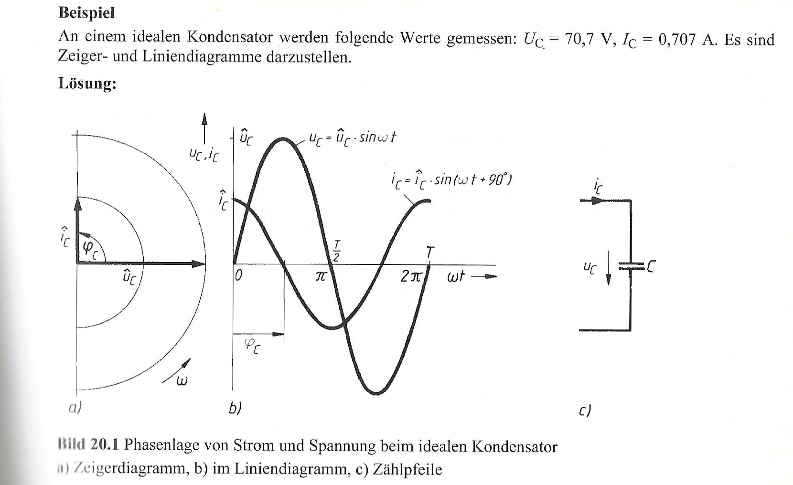
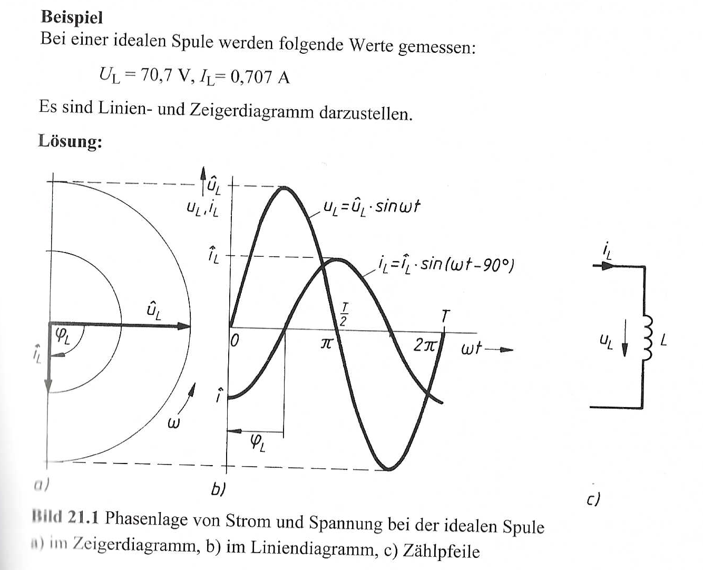
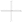
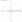
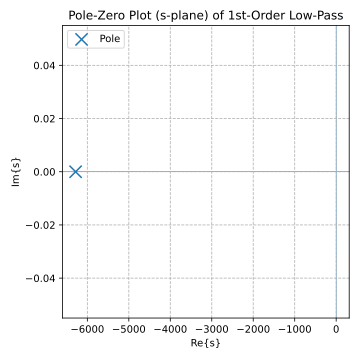
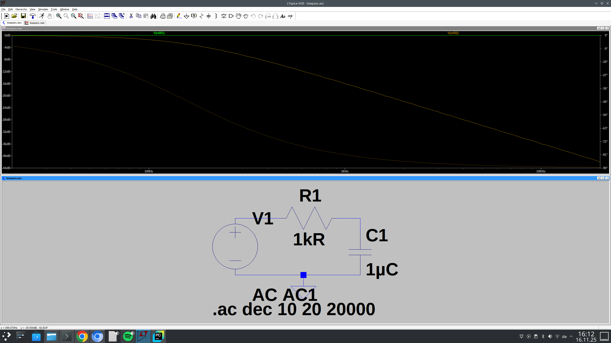
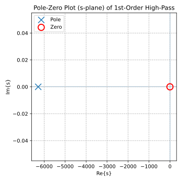
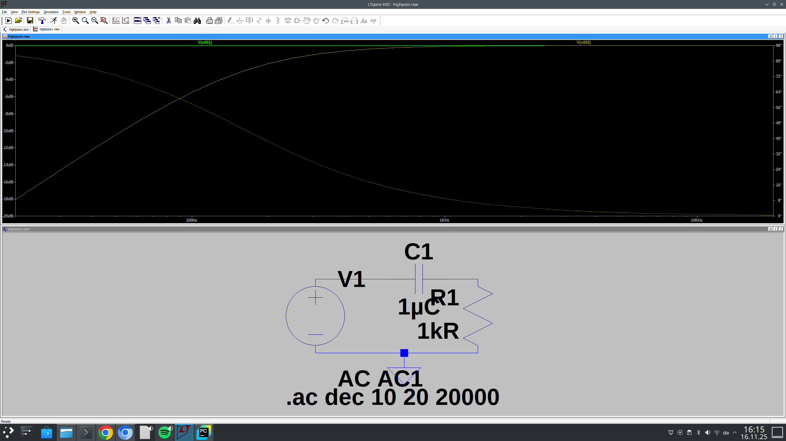
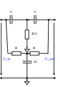
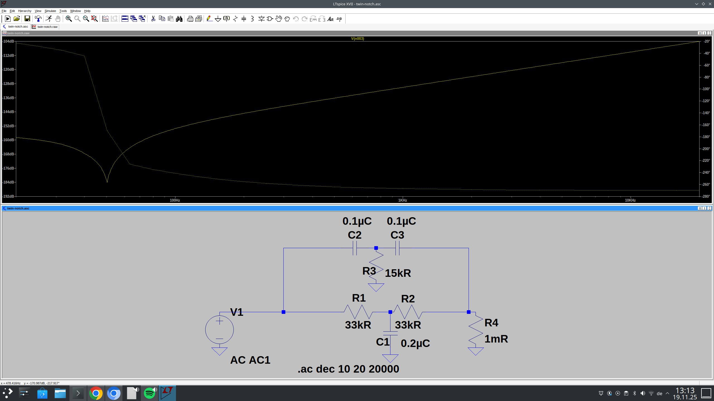




After this chapter you will know all the basics around time-sensitive components like coils and capacitors and simple circuits utilizing those components...


== Electronics 102

== Time-sensitive components

After reviewing and extensively describing the most important component,
the resistor, in  the first part, now we want to have a look at the next important
component, the capacitor. Capacitor are also passive components, meaning
they do not amplify a signal.

=== Electrostatic field
If we take two metal planes and park them side by side, with a small thin layer of a non-conducting
substance in-between, we created an electrostatic field.

The build-up of the electrostatic field happens via a DC source, in the image below depicted by the generator G.
The source voltage of the generator shifts th electrons located in the wire and the metal plates.
This way on the right plate originates an overflow of electrons (-Q) , while on the other plate a shortage
of the same amount, +Q, originates.

For a short amount of time, a charging current flows with the instantaneous value i, which in traditional direction,
promotes a quantity of electricity +Q. The charging current i becomes zero, if the quantity of electricity +Q and -Q
generated voltage equals out.

The electrostatic field endures after detachment from the DC source, which can be verified with
a high impedance voltmeter.The conclusion: The electrostatic field originates by the separated loads
+Q, -Q. THe existing voltage shows, that energy is stored in the field. This arrangement is called a plate capacitor.

Reference: Dieter Zastrow, Elektrotechnik,16.Auflage, p. 120.
It is another basic electronic component, oftentimes
used in electronic devices. The substance in-between is called a dielectricum.

=== Capacitance
The basic equation for computing the capacity, the no.-1 property of a condensator is a follows.
The capacity C of the capacitor gives the interesting ratio of the stored charge quantity Q to the charging
voltage U_c .

[role="image","../images/electronic_basics/Capacitance.svg" ,imgfmt="svg"]
\[C= \frac{Q}{U_c}\]

=== Parallel- and series circuit

In parallel connection of capacitors, the capacitances add up to the total capacitance.

[role="image","../images/electronic_basics/parallel_C.svg" ,imgfmt="svg"]
\[C= C_{1} + C_{2} + ... \]

In series connection, the reciprocal of the total capacitance is equal to
the sum of the reciprocals of the individual capacitances.

[role="image","../images/electronic_basics/series_C.svg" ,imgfmt="svg"]
\[ \frac{1}{C}= \frac{1}{C_{1}} + \frac{1}{C_{2}} + ... \]

=== The Capacitor and Coils

The elements next introduced, have a clue compared to the static of (ohmic) resistor.
Now the time comes into focus, too, since capacitator and coils are both in a sense time-sensitive
elements.
So normally we would start with introducing the Capacitor with all its implication, and then go over to the coils which
are introduced then afterwards. Instead for this post, we show both of them in a comparison
as they have complementary properties.

[width="100%" cols="a,a"]
|=====
| conductor | coil
| image:./capacitor.svg[width="300px"]
| 
| circuit symbol of a capacitor | circuit symbol of a coil
| 
| 
| stores energy in electrical field | stores energy in a magnetic field
| leads in phase | lags in phase
| blocks in DC Mode | in DC mode current is growing while, voltage is taken done, with the same rate
|
|=====

== Complex Calculation

To calculate circuits using capacitors (and / or coils) with ease and accurately, we need to extend
our range of numbers from real-valued numbers to complex-valued numbers. That means, in the end we have
not only one but two dimensions of numbers like shown below:

[role="image","./complex_numbers.svg", imgfmt="svg"]
\[ z = x + yi  \]

where i is:

[role="image","./imaginary_numbers.svg", imgfmt="svg"]
\[ i = \sqrt(-1) \]

Complex numbers can be expressed in  both, the cartresian coordinate system like shown above,
or like polar coordinates with a phase \phi and a radius r .

[width="100%" cols="a,a"]
|=====
| 
| 
|=====

=== Calculation rules for complex numbers

Complex numbers can be calculated either in cartesian coordinates or in polar coordinates.
We will analyze that in the next subsection

==== Calculation rules for cartesian coordinates

===== Addition and Subtraction of cartesian coordinates

[role="image","./addition-rule.svg", imgfmt="svg"]
\[ z = a + bi   w =  c + di \]

[role="image","./addition-rule2.svg", imgfmt="svg"]
\[ z + w = (a + c) + (b +d) i \]

===== Multiplication of cartesian coordinates

[role="image","./multiplication-rule.svg", imgfmt="svg"]
\[ z = a + bi   w =  c + di \]

[role="image","./multiplication-rule2.svg", imgfmt="svg"]
\[ z \cdot w = (a + ci) \cdot (b +di)  = (ac -bd)+ (ad +bc)i with i^2 = -1 \]

===== Division of cartesian coordinates
To divide a complex number
z {\displaystyle z} by a complex number  w≠ 0
{\displaystyle w\neq 0}, extend the fraction with the complex number conjugate to the denominator.

[role="image","./conjugated-complex-rule.svg", imgfmt="svg"]
\[ \overline{w} = c -di\]

[role="image","./division-rule2.svg", imgfmt="svg"]
\[ \frac{z}{w} = \frac{z \cdot \overline{w} }{w \cdot \overline{w}} = \frac{(a + bi) (c-di)}{(c+di)(c - di )} = \frac{ac+bd}{c^2 + d^2} +\frac{bc-ad}{c^2 + d^2} i \]

==== Calculation rules for polar coordinates

===== Addition and Subtraction of polar coordinates

For the polar coordinates addition and subtraction are not defined, we have to calculating them by computing into cartesian coordinates,
and eventually convert them back to polar coordinates.

===== Multiplication of polar coordinates

[role="image","./multiplication-polar-rule.svg", imgfmt="svg"]
\[ z_{1} = a + bi   z_{2} =  c + di \]

[role="image","./multiplication-polar-rule2.svg", imgfmt="svg"]
\[ z_{1} \cdot z_{2} = r_{1} r_{2} \cdot e^{i{(\phi_{1} + \phi_{2})}}\]

===== Division of polar coordinates
To divide a complex number
z {\displaystyle z} by a complex number  w≠ 0

[role="image","./conjugated-divison-rule.svg", imgfmt="svg"]
\[ \frac{z_{1}}{z_{2}} =\frac{r_{1}}{r_{2}} \cdot e^{{i(\phi_{1} - \phi_{2})}}, with  r_{2} \neq 0\]

////
- Aufbau Kondensator
- Kondensator im Gleichstromkreis
- RC-Glieder
////


Since the variable i is in electronic engineering already is reserved for current, we use instead j as i !


== Frequency-dependent networks (Filters)

An often and very popular application of capacitors are filters,
Simple filters of first order like shown here,are build up from
one resistor and one capacitor. Next we want to compute the frequency
response of a filter by getting the frequency response function,
which is the outgoing voltage divided by the in-going voltage -
this becomes clearer with the following examples.

=== Lowpass Filter
1.order lowpass

frequency response

[role="image","../images/electronic_basics/lowpass_fr.svg", imgfmt="svg"]
\[ H(\omega) = \frac{U_{out}}{U_{in}} = \frac{(1/j\omega C)}{(R+ 1/j \omega C)} = \frac{(1/j\omega C)\cdot j \omega C}{(R+ 1/j \omega C) \cdot j \omega C } =
\frac{1}{1+ j\omega RC } = \frac{1}{1+ j \omega/ \omega_g}\]

cutoff frequency (with example values of R=1kOhm, C= 1µF)
[role="image","../images/electronic_basics/cutoff_fr.svg", imgfmt="svg"]
\[ \omega_g = \frac{1}{RC} = \frac{1}{1 \cdot 10^3 \cdot 1 \cdot 10^(-6)}= 10^3= 1000 \cdot 1/s\]

image:./lowpass_bode_diagram.svg[width="1250px"]

We have to use some help to generate the Bode diagram for the lowpass shown above,
to do that, please install matplotlib via the following command:

'''
pip install matplotlib

'''
and execute the following python script:

[source,python]
----

import matplotlib.pyplot as plt
import numpy as np

# Define the transfer function of a first-order low-pass filter (magnitude only)
def lowpass_first_order(frequency, cutoff_frequency):
    x = frequency / cutoff_frequency
    return 1 / np.sqrt(1 + x**2)

# Frequency range for the Bode diagram (logarithmic scale)
frequency = np.logspace(0, 6, 1000)  # From 10^0 to 10^6 Hertz

# Cutoff frequency of the low-pass filter
cutoff_frequency = 1000  # Example value - You can set your own value here

# --- BODE DIAGRAM --------------------------------------------------------

# Calculate the gain in decibels (20 * log10(Amplitude))
gain_db = 20 * np.log10(lowpass_first_order(frequency, cutoff_frequency))

# Calculate the phase response in degrees
phase_deg = np.degrees(np.arctan(-frequency / cutoff_frequency))

plt.figure(figsize=(10, 6))

# Gain plot (magnitude)
plt.subplot(2, 1, 1)
plt.semilogx(frequency, gain_db, label='Gain (dB)')
plt.ylabel('Gain (dB)')
plt.title('Bode Diagram of a First-Order Low-Pass Filter')
plt.grid(which='both', axis='both', linestyle='--')
plt.legend()

# Phase plot
plt.subplot(2, 1, 2)
plt.semilogx(frequency, phase_deg, label='Phase (degrees)')
plt.xlabel('Frequency (Hz)')
plt.ylabel('Phase (degrees)')
plt.grid(which='both', axis='both', linestyle='--')
plt.legend()

plt.tight_layout()
plt.savefig('lowpass_bode_phase.svg', format='svg')
plt.show()

# --- S-PLANE POLE-ZERO PLOT ---------------------------------------------

# Für den 1. Ordnung Tiefpass: H(s) = 1 / (1 + s/ωc)
# Pol bei s = -ωc, keine endliche Nullstelle

omega_c = 2 * np.pi * cutoff_frequency

pole_real = -omega_c
pole_imag = 0.0

plt.figure(figsize=(5, 5))

# Achsen zuerst (damit Marker oben liegen)
plt.axhline(0, linewidth=0.5, zorder=0)
plt.axvline(0, linewidth=0.5, zorder=0)

# Pol(e) – gut sichtbar machen
plt.scatter(pole_real, pole_imag,
            marker='x', s=150,
            label='Pole', zorder=3)

# Hier gäbe es theoretisch keine endliche Nullstelle.
# Wenn du eine hypothetische Nullstelle plotten willst, kannst du z.B. s = ∞ nicht darstellen,
# daher lassen wir sie weg.

plt.xlabel('Re{s}')
plt.ylabel('Im{s}')
plt.title('Pole-Zero Plot (s-plane) of 1st-Order Low-Pass')
plt.grid(True, linestyle='--')
plt.legend()
plt.tight_layout()
plt.savefig('lowpass_pz_plot.svg', format='svg')
plt.show()

----

=== Simple Lowpass in LTspice

We can verify our results by utilizing LTSpice and building our model in this software.
If you need to know how to use LTspice on Linux (Debian/Ubuntu) by using wine take a look
link:https://github.com/joaocarvalhoopen/LTSpice_on_Linux_Ubuntu__How_to_install_and_use[here]

link:./lowpass.asc[LTSpice Lowpass]

=== Highpass Filter
1.order highpass

frequency response

[role="image","../images/electronic_basics/highpass_fr.svg", imgfmt="svg"]
\[ H(\omega) = \frac{U_{out}}{U_{in}} = \frac{R}{R+ 1/j\omega C} = \frac{j \omega C}{1+ j \omega RC} =
\frac{j\omega / \omega_g}{1+ j\omega/ \omega_g}\]

cutoff frequency (with example values of R=1kOhm, C= 1µF)

////
[role="image", "../images/electronic_basics/cutoff_fr.svg", imgfmt="svg"]
\[ \omega_g = \frac{1}{RC} = \frac{1}{1 \cdot 10^3 \cdot 1 \cdot 10^6}= 10^3= 1000 \cdot 1/s\]
////

image:./highpass_bode_diagram.svg[width="1250px"]

And here again the python script, this time for the high-pass:

[source,python]
----

import matplotlib.pyplot as plt
import numpy as np

# Define the transfer function of a first-order high-pass filter (magnitude only)
def highpass_first_order(frequency, cutoff_frequency):
    # Normierter Hochpass: |H(jw)| = (f/fc) / sqrt(1 + (f/fc)^2)
    x = frequency / cutoff_frequency
    return x / np.sqrt(1 + x**2)

# Frequency range for the Bode diagram (logarithmic scale)
frequency = np.logspace(0, 6, 1000)  # From 10^0 to 10^6 Hertz

# Cutoff frequency of the high-pass filter
cutoff_frequency = 1000  # Example value - You can set your own value here

# Calculate the gain in decibels (20 * log10(Amplitude))
gain_db = 20 * np.log10(highpass_first_order(frequency, cutoff_frequency))

# Calculate the phase response in degrees (angle)
# Für H(s) = s / (s + ωc) gilt: φ = 90° - arctan(ω/ωc)
phase_deg = 90 - np.degrees(np.arctan(frequency / cutoff_frequency))

# --- BODE DIAGRAM --------------------------------------------------------

plt.figure(figsize=(10, 6))

# Gain plot (magnitude)
plt.subplot(2, 1, 1)
plt.semilogx(frequency, gain_db, label='Gain (dB)')
plt.ylabel('Gain (dB)')
plt.title('Bode Diagram of a First-Order High-Pass Filter')
plt.grid(which='both', axis='both', linestyle='--')
plt.legend()

# Phase plot
plt.subplot(2, 1, 2)
plt.semilogx(frequency, phase_deg, label='Phase (degrees)')
plt.xlabel('Frequency (Hz)')
plt.ylabel('Phase (degrees)')
plt.grid(which='both', axis='both', linestyle='--')
plt.legend()

plt.tight_layout()

# Save the Bode diagram as an SVG file
plt.savefig('highpass_bode_diagram.svg', format='svg')

# Optionally, display the Bode diagram
plt.show()

# --- S-PLANE POLE-ZERO PLOT ---------------------------------------------

omega_c = 2 * np.pi * cutoff_frequency

pole_real = -omega_c
pole_imag = 0.0

zero_real = 0.0
zero_imag = 0.0

plt.figure(figsize=(5, 5))

# Achsen zuerst, mit kleinem zorder
plt.axhline(0, linewidth=0.5, zorder=0)
plt.axvline(0, linewidth=0.5, zorder=0)

# Pol(e) – etwas größer und nach vorne
plt.scatter(pole_real, pole_imag,
            marker='x', s=150,
            label='Pole', zorder=3)

# Nullstelle(n) – deutlich sichtbar
plt.scatter(zero_real, zero_imag,
            marker='o', s=150,
            facecolors='none', edgecolors='red',
            linewidths=2,
            label='Zero', zorder=4)

plt.xlabel('Re{s}')
plt.ylabel('Im{s}')
plt.title('Pole-Zero Plot (s-plane) of 1st-Order High-Pass')
plt.grid(True, linestyle='--')
plt.legend()
plt.tight_layout()
plt.savefig('highpass_pz_plot.svg', format='svg')
plt.show()


----
=== Simple Highpass in LTspice

We can verify our results by utilizing LTSpice and building our model in this software.

link:./highpass.asc[LTSpice Highpass]

=== Twin -T notch filter

Next, we want to take a look at a bit different filter, which is mostly for a notch filter -
https://electronicscoach.com/band-stop-filter.html[see the twin T's].

You must note here that the capacitors in the above design are in such configuration that the upper two capacitors are C
while the capacitor in the middle of the network is 2C. Similarly, the two resistors at the bottom are R but the one present
in the middle is R/2.
To have the proper narrow band reject operation this described configuration must always be maintained.

The formula for this filter is as follows:

[role="image","./formula.svg", imgfmt="svg"]
\[ f_0 = \frac{1}{2\pi RC}\]

So if we want to create a notch filter for 50Hz we need to calculate the values for R as well as C.lowpass_pz_plot
The value for the RC constant is computed by the following equation:

[role="image","./formula2.svg", imgfmt="svg"]
\[ RC = \frac{1}{2\pi f_0}= 0.00318\]

If we set the Value for R = 10 kOhm , this leaves us with the following result(s):

[role="image","./formula2.svg", imgfmt="svg"]
\[ C = \frac{RC}{R}= \frac{0.00318}{10000}= \approx 0.0000003183 F = 318nF\]

Which results in the following values for the particular components:

[cols="3"]
|===
| component
| calculated value
| selected standard  value
| R
| 10.0kΩ
| 10.0kΩ
| R/2
| 5.0kΩ
| two 10.0kΩ in parallel
| C
| 318.3nF
| 330 nF
| 2C
|636.6nF
| 680 nF
|===

link:./twin_notch.asc[LTSpice - notch filter]

=== Lookahead (active Filters)

We want to give a short heads-up to active Filterd built with op-amp which are shown and explained in
https://wehrend.github.io/pages/electronics-104/[electronics-104].
The op-amp wwe find in the image below is an op-amp switched as an voltage follower.
This means that the filter can be encumbered with a circuit with a resistor at the output without changing the behaviour
ot the precedent filter circuit...

