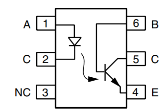




After this chapter you will know all the basics around the semiconductor component transistor (BJT as well as MOSFETs) and their effects...




The transistor belongs an own chapter, thanks to its gamechanging influence to a complete new generation of electronics in the 1970ies to 1980...

The transistor is a *nonlinear component* ,  a device whose current–voltage relationship is **not proportional**.
In other words, the current does not increase linearly with the applied voltage.

Examples of nonlinear components include:

* diodes (conduct current only in one direction),
* transistors (whose behaviour depends on internal semiconductor junctions),
* and CMOS structures.

Because of this nonlinear behaviour, such components allow switching, amplification,
rectification, and almost all forms of digital logic.


== Electronics 103.5: Further applications for transistors

In link:https://wehrend.github.io/pages/electronics-103/[Electronics 103], we explored the physics of semiconductors and
how a single BJT or MOSFET acts as a basic switch or amplifier. But in modern systems, transistors rarely work alone.

To build a smartphone or an electric vehicle, we need to push transistors into specialized configurations. This post covers
the "missing chapters": Power scaling, Differential signaling, and the efficiency of PWM.

== 1. The Power Multipliers: Darlington Pairs
A single transistor has a physical limit on its current gain (stem:[ \beta ]). If you need to switch a 5A motor using a 20mA
signal from a microcontroller, a single BC547 simply won't open wide enough.

The **Darlington Pair** solves this by cascading two transistors: the emitter of the first drives the base of the second.

* **Total Gain:** stem:[ \beta_{total} \approx \beta_1 \cdot \beta_2 ]
* **The Trade-off:** The "turn-on" voltage increases from 0.7V to ~1.4V, and switching speeds are slightly slower due to
the stored charge in the first transistor.

== 2. Differential Pairs: Rejecting the Noise
A standard common-emitter amplifier is "single-ended"—it amplifies everything, including electromagnetic interference (EMI) picked up by your wires.
We will explore this further in electronics-104, but here is the gist of it...

The **Differential Pair** (or Long-Tailed Pair) uses two transistors with a shared current source at their emitters.

image:differential_amplifier.svg[differential amplifier, width="600px"]

* **Common-Mode Rejection:** If a noise spike hits both inputs (e.g., 50Hz hum), both transistors react equally, and the *difference* between their collectors remains zero.
* **Precision:** This is the "front door" of every Operational Amplifier (Op-Amp) ever made.

== 3. Phototransistors and Optocouplers

Having explored LEDs in our previous article, it is essential to examine their functional counterpart: the phototransistor.
These components are most commonly utilized within optocouplers, where their primary purpose is to provide galvanic isolation.

Galvanic isolation allows for signal transmission between two independent circuits without a direct electrical path,
effectively protecting sensitive low-voltage components from high-voltage transients. A classic example is the CNY17,
which integrates an infrared LED and a phototransistor in a single package.

Its internal construction and pinout are shown below:

== 4. The CMOS Revolution
Why did CMOS (Complementary Metal-Oxide-Semiconductor) win the processor wars? Because of **static power consumption**.
(This is another topic for electronics-105)...

In older NMOS logic, resistors were used to "pull up" the voltage, meaning current flowed constantly even when the circuit wasn't changing states. CMOS pairs an **N-channel** and a **P-channel** MOSFET so that one is always OFF when the other is ON.

> **Key Takeaway:** In a CMOS circuit, power is only consumed during the "flip" (switching). This is why your CPU gets hotter as the clock speed increases.

== 5. Linear vs. PWM Control
When controlling a load like a motor or an LED, we have two choices: act like a variable resistor (Linear) or act like a high-speed shutter (PWM).

=== Comparison of Control Methods

[cols="1,2,2", options="header"]
|===
| Feature | Linear Mode (Analog) | Switching Mode (PWM)
| **Transistor State** | Partially Open (Active Region) | Fully ON or Fully OFF
| **Efficiency** | Low (approx. 40-60%) | High (90%+)
| **Heat Output** | Significant (Requires Heatsinks) | Minimal
| **Best For** | Audio Amplifiers, Radio | Motors, LED Dimming, Power Supplies
|===

In **Linear Mode**, the transistor dissipates the "unused" voltage as heat:
[stem]
++++
P_{waste} = (V_{supply} - V_{load}) \cdot I_{load}
++++

In **PWM Mode**, the transistor is either a perfect conductor (0V drop) or a perfect insulator (0A flow), meaning the power dissipated by the transistor itself is nearly zero.

== 6. Protecting the Switch: The Flyback Diode
When using a MOSFET or BJT to switch an **inductive load** (anything with a coil, like a motor or relay), you must include a **Flyback Diode**.

When the transistor turns OFF, the magnetic field in the coil collapses, creating a massive voltage spike (Back-EMF) that can exceed 100V, punching a hole through your transistor's silicon. The diode provides a safe return path for this energy.

_This blog post was created with the help of AI - specifically Google Gemini._

//'''
//
// == What's Next?
// Now that we've seen how transistors handle power and logic, would you like me to provide a **Bill of Materials (BOM) and schematic** for a practical DIY project, such as a **Transistor-based PWM Motor Controller**?