

== Electronics 103 - nonlinear components

From the first view on electronics, we now want to deepen the understanding components like diodes and -more important -
Transistors and CMOS technology. We want to show that a transistor is both analog and also digital depending only on which
level - or layer of abstraction you want to look at...

== Semiconductor materials

[cols="3"]
|===
a| image:./atomic_model_C.svg[width="350px"]
a| image:./atomic_model_Si.svg[width="350px"]
a| image:./atomic_model_Ge.svg[width="350px"]
|===

Let us start our tour over semiconductor devices with a small repetition of this topic from
https://wehrend.github.io/pages/prequel-short-introduction-to-electronics[electronics 101]

If we can make sure that the semiconductor material, here silicon, is not polluted oder doped,
with any tri- or pentavalent material the only interesting factor here is the temperature - given, this
is room-temperatured (25°C), silicon is a non-conductor..

[cols="3"]
|===
a| Examples of tetravalent elements: +
    - Kohlenstoff ( C) +
    - #Silicium (Si)# +
    - #Germanium (Ge)# +
    - Zinn (Sn) +
    - Blei (Pb) +
a| image:./covalent_bonding_si.svg[width="350px"]
a| 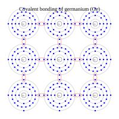
|===

== negative doping (or pentavalent elements)
Pentavalent elements (for example Bor)

[cols="2"]
|===
a| Examples of pentavalent elements: +
    - Stickstoff (N) +
    - #Phosphor (P)# +
    - #Arsen (As)# +
    - Antimon (Sb) +
    - Bismut (Bi) +
a| image:./covalent_bonding_As.svg[width="350px"]
|===

== positive doping

Trivalent elements (for example Arsen)

[cols="2"]
|===
a| Examples of tetravalent elements: +
    - #Bor (B)# +
    - #Aluminium (Al)# +
    - Gallium (Ga) +
    - Indium (In) +
    - Thallium (Tl) +
a| 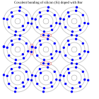
|===

When we put both of the elements mentioned above together, (1.)
the negative doped semiconductor material with the p-doped material,
we achieve a very interesting behaviour at the pn-junction.

What Happens at the Junction?

(1.) Diffusion Starts:
Electrons from the N-side move to the P-side (because electrons want to fill the holes).
Holes from the P-side move to the N-side.

[cols="2"]
|===
a| 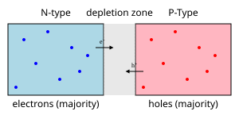
a| 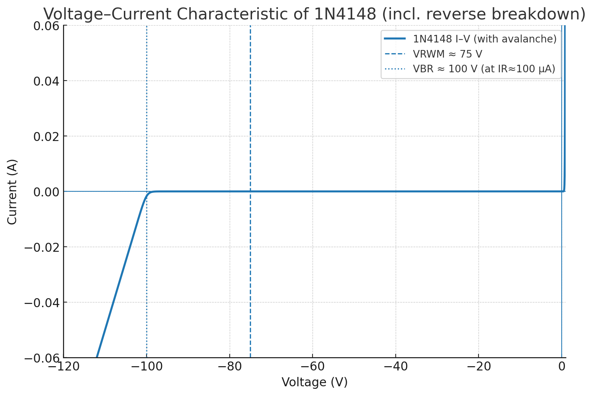
|===

(2.) Depletion Region Forms:
When electrons and holes meet, they cancel each other out.
This creates a neutral zone in the middle with no free charge carriers — this is called the depletion region.
An electric field builds up here that prevents more electrons and holes from moving across.

(3.)Equilibrium is Reached:
Eventually, a balance is reached. Electrons want to move across, but the electric field pushes them back.

What Happens When You Apply Voltage?
Forward Bias (positive to P-side, negative to N-side):
Pushes electrons and holes toward the junction.
Current flows across the junction.

Reverse Bias (negative to P-side, positive to N-side):
Pulls electrons and holes away from the junction.
Depletion region gets wider.
Very little current flows.

Here we want to take a deep dive into the workings of semiconductors:
link:/pages/01_boolean_algebra/#_implementation_on_electrical_level[the workings of semiconductors:]

== Applications of diodes

=== The diode as rectifier

==== The half wave rectifier

The simplest possible - but highly inefficient rectifier is the half wave rectifier we introduce here.
It is a simple diode put in the forward direction...
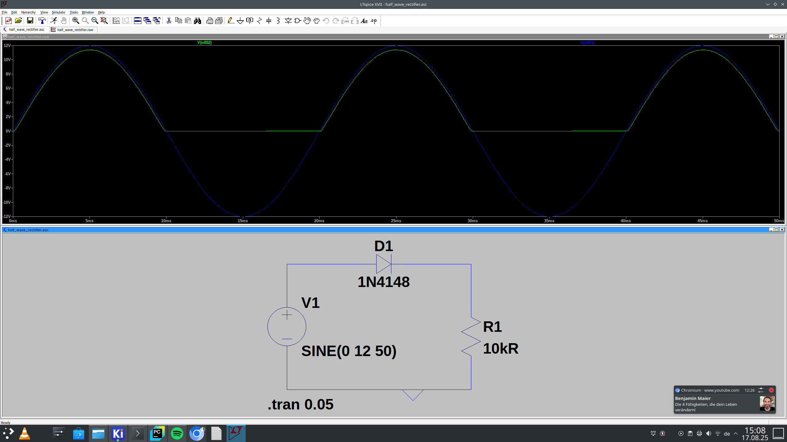

As diode we introducing here the 1N4148 which is a popular signal diode but untypical as a rectifer
diode -  As we can see only one half of the sine wave is used...

link:./half_wave_rectifier.asc[ half wave rectifier - LTspice file]

Below, there is the same circuit but with a capacitor to eliminate the ripples...
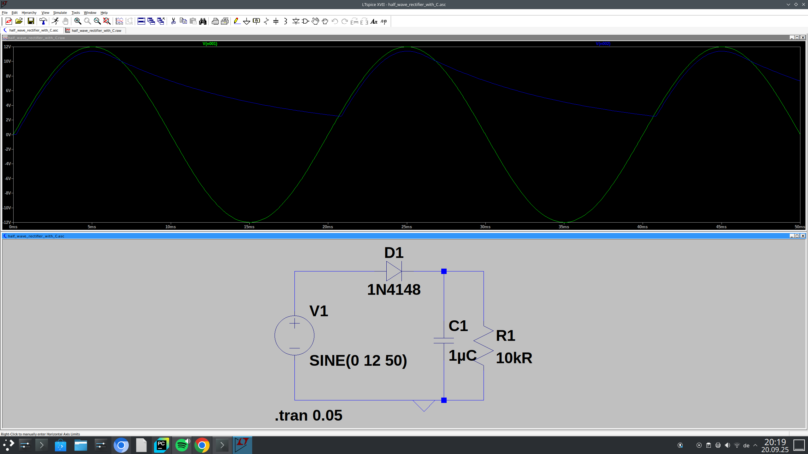

link:./half_wave_rectifier_with_C.asc[half wave rectifier w/ capacitor - LTspice file]

==== The full wave rectifier

To make the rectifer more efficient we also utilize the negative part of the sine wave to create our DC Voltage

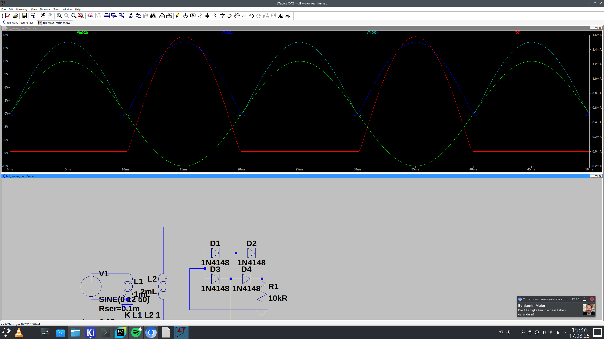

link:./full_wave_rectifier.asc[full wave rectifier - LTspice file]

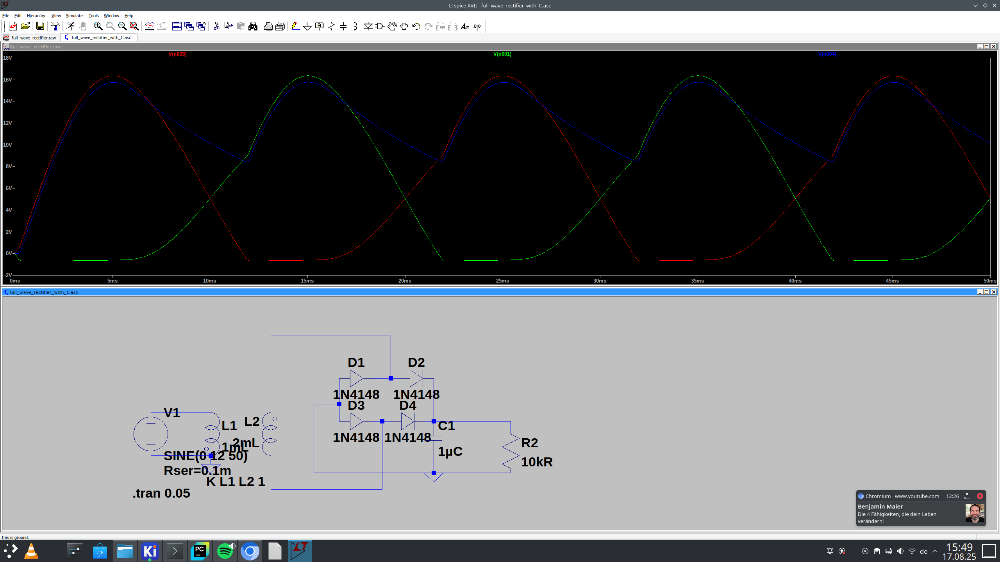

link:./full_wave_rectifier_with_C.asc[full wave rectifier w/ capacitor - LTspice file]

== The (simple) LED circuit

First we want to show one of the simplest possible circuits, some that lighten your day (or night, pun intended).

[cols="2"]
|===
a| 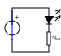 Diodes in schematic circuit
a| image:./simple_led_circuit.png[Diodes as LED circuit in LTspice]
|===

A light emitting diode (LED) does not go without its pre-resistor which is there to limit the currents that goes thru the LED.
You can take a resistor from 1kOhm to 10kOhm,the precise vale is in most csases uncritical...
But for you to verify the equation is as follows:

[image src="./pre-resistor.svg" format="svg" alt="pre-resistor"]
\large \[ R_{V} = \frac{U_{\text{Total}} - U_{R}}{I} \]

With that equation we can calculate the value for the resistor - after calculation we just use the next-higher available resistor
in the E24 series. In most cases you can simply choose 1kOm resistor that will do it,
Also, for the purposes I describe here, 1/4 Watt resistor are sufficient, even 1/8 Watt resistors are.

Now, we want to see happens when we switch the poles, then the diode is working in reverse polarity and so not lighting up...

LEDs came in a big variety of different sizes, shapes and colors, for example size differs in different smd sizes e.g.
0805 as well as in different shapes (see https://makezine.com/article/craft/what-shape-of-led-should-i-use-for-my-project/[here]).
But first and foremost color is crucial. The different dotation make up for different colors.

[cols="2"]
|===
a| 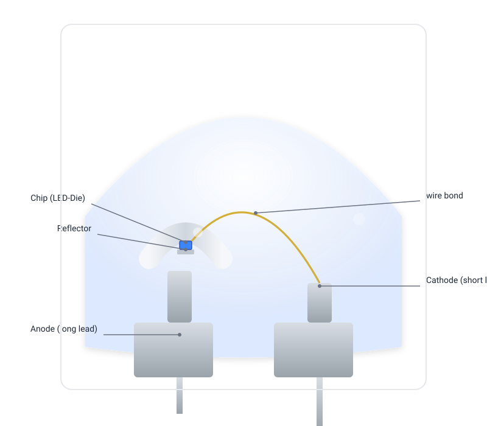
a| image:./led_die.svg[width="350px"]
|===

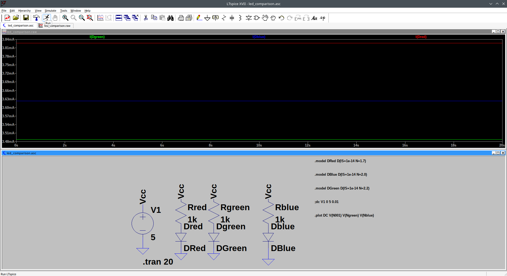

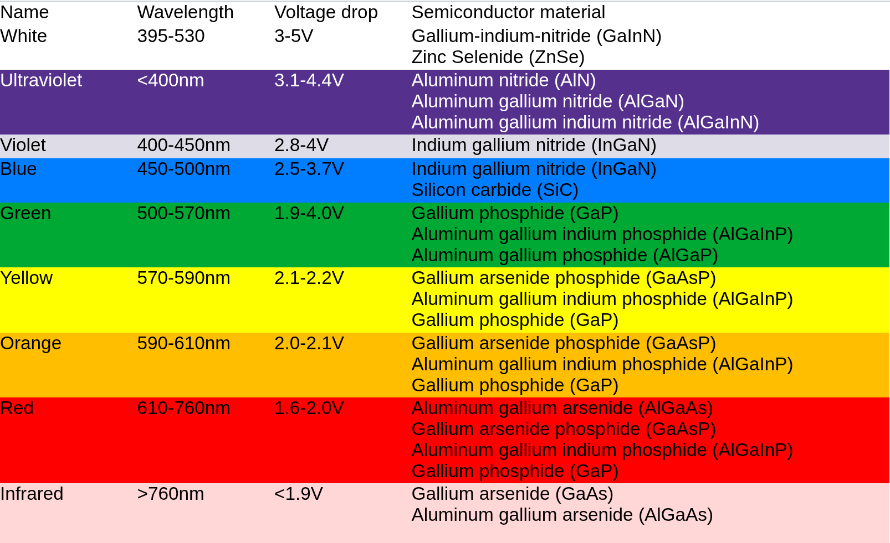

https://www.electricaltechnology.org/2022/06/led-light-emitting-diode.html[see here]

// LEDs like all the other ordinary diodes do only work in one direction, and block in counter directory,
// we get to this behaviour in the next chapter...

== Bipolar transistors and their applications

When we extend the pn-junction used in diodes as shown in the section above now we get from simple to the
the so called BJT (bipolar junction transistor). There are two different versions of https://www.allaboutcircuits.com/textbook/semiconductors/chpt-4/bipolar-junction-transistors-bjt/[BJTs] (named after
their dotations): The NPN transistor and the PNP transistor.

[cols="2"]
|===
| Case
| Picture
| TO-92
a| image:./to-92.png[width="400px"]
|===

[cols="3"]
|===
| Type
| Symbol
| Structure
| BC-547 (TO-92)
a| image:./bjt_npn_symbol.svg[width="400px"]
a| 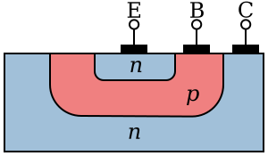
| BC-557 (TO-92)
a| image:./bjt_pnp_symbol.svg[width="400px"]
a| image:./transistor_pnp_schema.svg[width="400px"]
|===

=== The simple circuit

There are a gazillion of applications for either BJTs as switch as well as amplifier - in the following
we only want to visit the most vital applications (of both types).
For the following example it works as an amplifier. But we also use it for logic circuit as shown http://localhost:1313/pages/01_boolean_algebra/[here].

=== The simple circuit with negative feedback
Imagine you bought a bag full of BC547 , the most popular npn Transistors.
If you measure them out, you will notice that there is a wide distribution of their properties.
If you decide some BC547 from different charges respectively different companies, you will notice
an even wider distribution of their mein parameters.

Therefore, we introduce the systemic principle of a negative feedback loop.

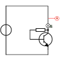

==== Negative feedback
Another quite proper method ist to engage a negative feedback...
If part of the output voltage is fed back to the input of an amplifier,
this is called feedback.  In-phase feedback is called “positive feedback”;
in this case, the fed-back output signal is added to the input signal,
leading to self-excitation (resonance). Opposite-phase feedback is called negative feedback;
in this case, the returned output voltage cancels out part of the input voltage. In relation
to the magnitude of the output signal, negative feedback therefore acts as a significant
reduction in amplification (a reduced input signal leads to a correspondingly smaller output signal).

So why use negative feedback?

This negative feedback has one disadvqantage but multiple great advantages over the normal circcuit without the control
loop. We make a lesser great amplification gain, but adopt a far better amplifier circuit - greater bandwith, less
distortion factor...

Values fo this feedback resistor should be 30 to 70kOhm...

== BJT as Switch

=== The flipflop

Another vital application, we already visited some time ago, is the application as a flip-flop
as shown http://localhost:1313/pages/11_clocks_and_registers/#_a_binary_counter[here].
The flipflop is a central component in almost all digital circuit, which stores digital values (0 and 1)

[cols="3"]
|===
a| Symbol
a| logic Circuit
a| detailed circuit
a| image:./flipflop_symbol.svg[width="400px"]
a| image:./flipflop_circuit.svg[width="500px"]
a| 
|===

=== The astable multivibrator

The so-called astable multivibrator in laymen terms is a blinker circuit.
The formula to compute the desired frequency from the given parameters is as follows:

[image src="./multivibrator_frequency.svg" format="svg" alt="frequency"]
\large \[ f = \frac{1}{T}= \frac{1}{R_{B1} * C_1 + R_{B2} * C_2 * ln(2)} \]

image:./astable_multivibrator.png[width="700px"]

link:./astable_multivibrator.asc[astable multivibrator - ltspice file]

== BJT as Amplifier

This chapter I will mostly be written 1:1 from the book "Wege in die Elektonik" from Joseph Glagla and Gert Lindner; 1980.

==== Two-Port-Theory Basic cricuits and  h-parameters

The two-port-theory and the h-parameters are theoretical foundation for two-port-schematics.
It is utlized for example to describe amplifiers, all circuits discussed here have a common ground
in common. All three basic circuits are named after their in- and output:
emitter circuit, base circuit and collector circuit.

[cols="3"]
|===
a|
a| image:./amplifier_symbol.svg[width="280px"]
a|
|===

Depending on circuit the transistor-based amplifier has different properties as shown in the
table below...
To compute tha amplifier factor of a circuit the dynamic input (alternate current) stem:[r_{BE} = h_{11}]
and dynamic output impedance stem:[r_{CE}= 1: h_22] and the alternate current gain stem:[\beta = h_{21}]

Those h-parameters where discussed and explained later - first we want to have a look at the different circuits...

=== Basic transistor circuits (Overview)

[cols="4"]
|===
a|
a| emitter  Circuit
a| base circuit
a| collector circuit
a| Principle
a| image:./common_emitter.svg[width="400px"]
a| 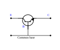
a| image:./common_collector.svg[width="400px"]
a| Schematic
a| 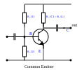
a| image:./base_circuit.svg[width="500px"]
a| image:./collector_circuit.svg[width="400px"]
a| Current gain
a|
[image src="./current_gain_emitter.svg" format="svg" alt="none"]
\[ V_{i} = \frac{\beta * r_{CE}}{r_{CE} + R_{C}} \]
    (10...500)
a|
[image src="./current_gain_base.svg" format="svg" alt="none"]
\[ V_{i} = \frac{\beta }{1  + \beta } \]
    (< 1)
a|
[image src="./current_gain_collector.svg" format="svg" alt="none"]
\[ V_{i} = \frac{\beta * r_{CE}}{ R_{E} + r_{CE} } \]
    (10...500)
a| Voltage gain
a|
[image src="./voltage_gain_emitter.svg" format="svg" alt="none"]
\[V_{u} = \frac{\beta \cdot (R_{C} \parallel r_{CE})}{r_{BE}}\]
(50...1000)
a|
[image src="./voltage_gain_base.svg" format="svg" alt="none"]
\[V_{u} = \frac{\beta \cdot R_{C} \parallel r_{CE}}{r_{BE}}\]
(50...1000)
a|
[image src="./voltage_gain_base.svg" format="svg" alt="none"]
\[V_{u} = 1- \frac{r_{BE}}{\beta \cdot R_{E} \parallel r_{CE}}\]
(<1)
a| Power gain
a| 5000...1000
a| 100...1000
a| 50...500
a| Input impedance
a|
[image src="./input_impedance_emitter.svg" format="svg" alt="none"]
\[r_{e} = r_{BE} \parallel R_{1} \parallel R_{2}\]
(10 Ohm...5kOhm )
a|
[image src="./input_impedance_base.svg" format="svg" alt="none"]
\[r_{e} = \frac{r_{BE}}{\beta} \parallel R_{E} \]
(< 1 Ohm...1 kOhm)
a|
[image src="./input_impedance_collector.svg" format="svg" alt="none"]
\[r_{e} = (r_{BE}+\beta \cdot R_{E}) \parallel R_{1} \]
(500 Ohm...5 MOhm)
a| Output impedance
a|
[image src="./output_impedance_emitter.svg" format="svg" alt="none"]
\[r_{a} = r_{C} \parallel r_{CE} \]
(10 Ohm...500kOhm )
a|
[image src="./output_impedance_base.svg" format="svg" alt="none"]
\[r_{a} = r_{C} \parallel r_{CE} \]
(100kOhm...10MOhm)
a|
[image src="./output_impedance_collector.svg" format="svg" alt="none"]
\[r_{e} = r_{E} \parallel \frac{r_{BE} + R_{Generator}}{\beta} \]
(10 Ohm...1kOhm)
a| Phase position
a| 180°
a| in phase
a| in phase
a| Typical applications
a| standard application for low frequency and high frequency amplifier
a| for very high frequencies (UKW, VHF, UHF)
a| amplifier inputs, "impedance converter", power amps
|===

=== Transistor in emitter circuit

The emitter circuit is mostly used in small signal solutions, (also for power amplifiers).
It is used as handyman. The other both circuits (base and collector circuit) are only used
for special occasions...
The emitter circuit gains both current and voltage, it is also the circuit with the biggest
power amplification. The input inpedance consists of the BE-Diode and fluctuates between very
small (big $I_B$ ) and big values (minimal $I_B$). The output voltage builds up on R_{L}.
It is measured against the commmon ground (practically U_{CE}= U_{b} - U_{RL}).
Thus, there is a phase lag of 180° from the input voltage to the output voltage.
For "normal" amplifiers this id not very interesting. But this changess as soon as the output
signal is feedbacked to the input again...

link:./emitter_circuit.asc[emitter circuit - ltspice file]

image:./emitter_circuit.png[width="750px"]

=== Transistor in base circuit
The base circuit has an extremly low input impedance, which is also minimized by the parallel connected
necessary low emitter resistance. The output impedance however is very high. The current gain is always
smaller 1 (<1), due to the emitter current (=I_{B}+I_{C}) which is always bigger then the current collector
respectively the output current. The advantage of the base circuit is that she can manage the highest frequencie.
Also, this circuit has the smallest influences to the input. Thus, the typically applications are receiver
for very high frequencies.

link:./base_circuit.asc[ base circuit - ltspice file]

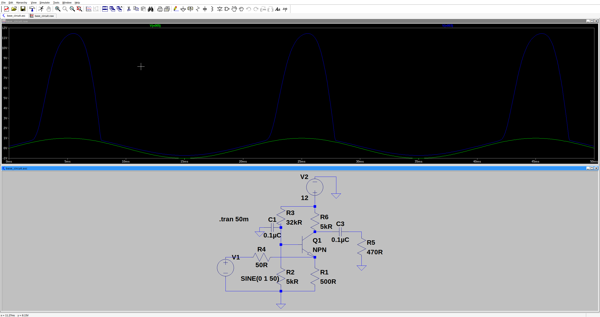

=== Transistor in collector circuit

The collector circuit is awarded by a high input - but low output impedance.
The high input impedance is caused by the input current as well as the output current which flows over
the common emitter resistor (R_{L}). A low base current calls for a \beta multiplied collector / emitter current;
which is caused by R_{L}. This ends up in voltage drop over the input impedance.
If a small current causes a big voltage drop at the resistor, the resistance has to be big.
Without considering the base current it amounts to \beta \cdot R_{L} -
The output voltage u_{2} is always smaller than then the input voltage u_{1} - its amount is the threshold
voltage from the BE-Diode.If u_{1} becomes bigger, the bigger amounts the voltage drop at R_{L} becomes due to
the bigger emitter current. If u_{1} drops, so u_{2} drops due to the lower emitter current.

Thus this circuit is also called emitter follower. There is no voltage gain in this circuit (u_{2}
is allways smaller than u_{1}). Only the current gain gets \beta times multiplied
The emitter follower is often used in amplifier inputs for his big input impedance but low output impedance.

link:./collector_circuit.asc[collector circuit - ltspice file]

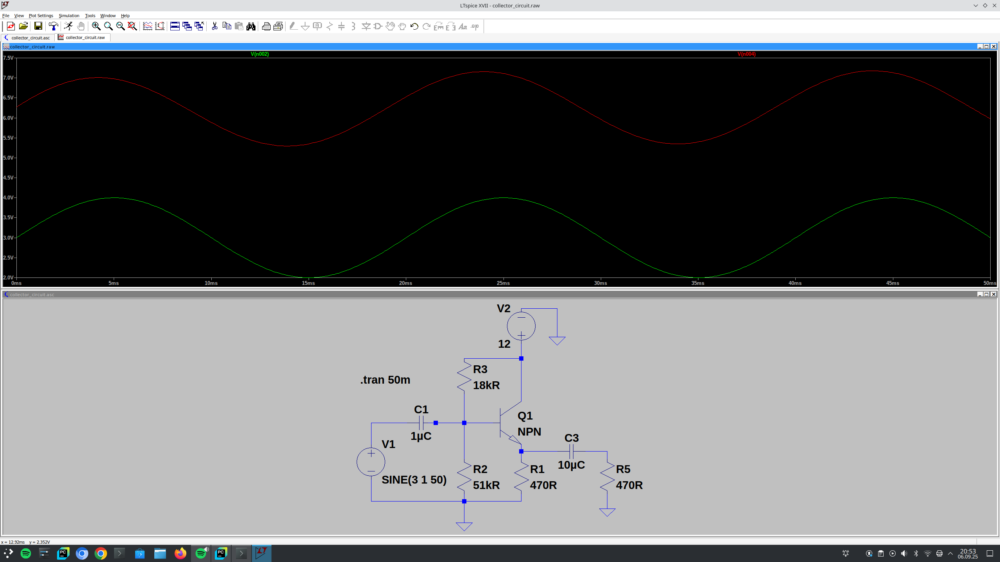

=== Amplifier coupling

One amplifier stage is regularly not sufficient, and you need to put together multiple units.
But doing the coupling needs a bit of thought to not shift bias points uncontrollable.

==== Transformer coupling
This is the oldest but in these days unconventional more or less obsolete technique.
Disadvantages are price, size and weight of the transformer.
Today it is seldom used for that reason.
However, it has an advantage in selecting the right signals by resonance effects.

==== RC coupling
The RC-coupling is probably the most used technique to de-couple amplifier stages.
the attentive reader will note, that the capacitor and the resistor are forming a high-pass
filter which we have seen first in https://wehrend.github.io/pages/short-introduction-to-electronics-102/#_highpass_filter[here...]
This coupling is easy anc cheap; but has the disadvantage of also being a high-pass filter shaping the signal.
Very low frequencies cannot be transmitted that way...

image:./rc-coupling.svg[width="450px"]

==== Direct coupling

The simplest possible coupling is a coupling by wire - this is also known as direct current coupling.
Here the disadvantage is that the bias points of the different amplifier stages shifts in the different stages.

The advantage is that it allows for direct current amplification; therefore it ist use in measurements and op-amp.
It is also easy to implement in integrated circuits...

image:./direct-coupling.svg[width="450px"]

== JFETs and MOSFETs

Compared to the electron tube, the bipolar transistor has many advantages but one significant disadvantage: it requires a control current and
therefore control power. Its input resistance is low, it loads the source (e.g., antenna, microphone), and it can often only be controlled from high-impedance
sources  using special techniques.
The electron tube, on the other hand, requires no power and can be controlled solely by the field strength of the applied control voltage. The practical significance of this is that
its input resistance is very high and the source (e.g., microphone) is not loaded.
No wonder, then, that a component was sought that combined the advantages of the transistor with those of the tube. The result of this development
is the group of field-effect transistors (abbreviated FET). The name refers to the operating principle: the FET is controlled only by the field strength
of the applied control voltage, without control current, i.e., without power (apart from leakage currents and losses). Since only charge carriers of one
polarity are moved in it – either electrons or “holes” – FETs are called unipolar transistors.

== Functional principle of the field-effect transistor

The principle of field-effect control is “old” compared to the bipolar transistor. As early as 1928, Julius Edgar Lilienfeld received a patent for the principle of
changing the resistance of an electric field.
However, this discovery could not yet be put to practical use, because an electric field does not penetrate deeply into good (metallic) conductors;
although the penetration depth in insulators is very large, they cannot be used as resistors ( =conductors). The development of semiconductors provided the
suitable material that conducts on the one hand and allows the electric field to penetrate deeply on the other. In 1952, Shockley was able to present the first usable FET.
However, it took many years before it was ready for production.

To understand the operating principle of the FET, let us recall the following basics:

1. A conductor only conducts if it contains mobile charge carriers (electrons or “holes”).
2. The resistance of a conductor (made of the same material) increases as its cross-section decreases: the resistance of a thick copper wire is
lower than that of a thin one.
3. Like charges repel each other, unlike charges attract each other.

The main part of the FET is a current path (“channel”) made of weakly doped silicon. Depending on whether the channel is n-doped or p-doped, it is called an n-channel or p-channel.
The channel is a resistor and conducts in both directions. Its ends are called the source (abbreviated S) and drain (abbreviated D).
An electrode, the gate (abbreviated G), is insulated around the channel.

The mode of operation is explained using an n-channel FET: The n-channel conducts because it contains freely moving electrons. If the gate receives a negative voltage relative to the channel
(source),
 the electrons in the gate repel those in the channel and push them from the edge zone to the center. In the edge zone, the channel becomes a
pure crystal again, i.e., an insulator. This narrows the conductive cross-section of the channel and increases its resistance.
If the (negative) gate voltage is increased, more and more electrons are displaced from the channel, i.e., its conductive part becomes increasingly narrower. At a
certain gate voltage (the “cut-off voltage”), all electrons are finally displaced at one point, the channel is “cut off,” and it no longer conducts.

The control also works in reverse: a very weakly doped p-channel is initially non-conductive. A positive gate voltage draws electrons into the channel
and makes it conductive. The channel resistance decreases with increasing U_{GS}.
'‘’
The FET is a resistor that can be controlled by the field strength of the control voltage.
‘’'
The control range is very large. In principle, D and S can be swapped, but since FETs are not manufactured to be exactly symmetrical, the “correct”
connection method achieves better results.
Depending on how the FET principle is implemented, a distinction is made between different families of FETs.
The two main groups are the junction FET  (JFET) and the MOSFET.

== The junction field-effect transistor (JFET)

The gate is located as a heavily doped zone around the lightly doped channel. It is doped in the opposite direction to the channel, creating a pn junction whose barrier layer
acts as insulation. This group of field-effect transistors is therefore called a junction FET or JFET (J for junction).

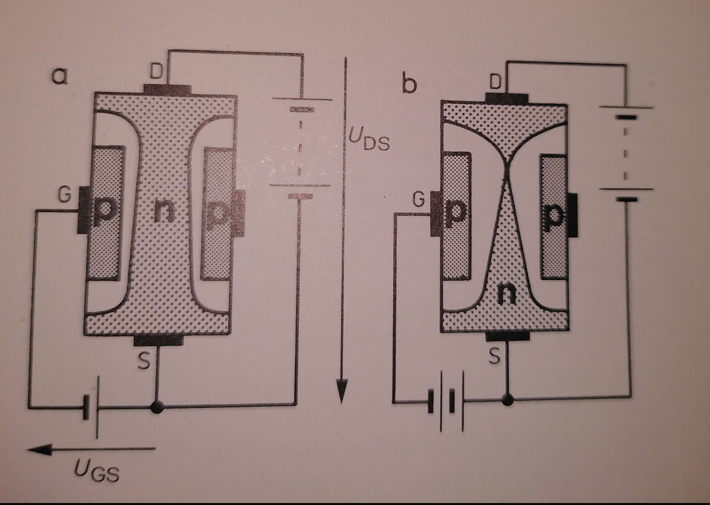

The function is again illustrated using the n-channel FET (see image above): U_{DS} lies between D and S. The electrons flow from S to D. Now the voltage U_{GS}
(negative pole at G) is applied to the gate. The pn junction between G and the channel is in the reverse direction. As with the https://en.wikipedia.org/wiki/Varicap[capacitance diode],
 the barrier layer becomes wider as the voltage increases. Since the channel is weakly doped in relation to the gate, the barrier layer grows predominantly into the channel, i.e.
the electrons are displaced from part of the channel. This part becomes non-conductive as pure crystal. The conductive part of the channel becomes narrower, its resistance increases,
until the channel is “cut off” at a certain gate voltage and no longer conducts – see above. No control current flows – with the exception of the small
leakage current present in all diodes. The p-channel JFET works in exactly the same way, only with reverse-polarized batteries (voltage sources).

== The MOSFET

In the second group of FETs, the insulation between the gate and the channel consists of an extremely thin layer of silicon dioxide (SiO_{2});
the gate is designed as a metallic coating (vacuum-deposited Al). According to their structure, these FETs are named after the metal of the gate, the oxide of the insulating layer, and the semiconductor
of the channel: MOS-FET.

image:./mosfet_model.svg[size="500px"]

In the figure above, the channel consists of weakly p-doped material, D and S of strongly n-doped islands. The substrate, the “base” of the crystal (B, from bulk = mass, main part)
is connected to S internally or by external wiring.

Regardless of how voltage is applied to S and D, one of the pn junctions between the channel and the connection island is in the reverse direction. The MOSFET blocks if no voltage is applied to G.
If G receives a positive voltage U_{GS}, the holes as positive charge carriers are immediately displaced from the channel area opposite the gate electrode, electrons from the substrate present with S (negative pole
of the voltage source) are attracted, so that an n-conducting bridge, the “inversion layer,” is formed between D and S opposite G.
The resistance of this layer decreases as U_{GS} increases.
This type of MOSFET only becomes conductive when the channel region is enriched with electrons; it is therefore called an “enrichment type” and is also self-blocking because it does not conduct when the gate is open
or U_{GS} = 0V.
Another type is manufactured in such a way that the channel region is already weakly n-doped. When G is open or U_{GS} = 0V, it conducts; it is “self-conducting.” With negative U_{GS}, the electrons can be displaced from
the channel region until they are cut off; with positive U_{GS}, electrons can be sucked into the channel area, so that the channel resistance decreases further and I_{D} increases accordingly.
Control with negative U_{GS}, i.e., with the displacement of electrons, is preferred. Therefore, this family of MOSFETs is called “depletion type.”
The special feature of self-conducting MOSFETs is that they can be controlled by both positive and negative gate voltages.

The other MOSFET types are derivatives of the two main groups above, which will not be described in this introduction.

Translated with DeepL.com (free version)

== From the BJT to the FET

Corresponding to the basic circuits for bipolar junction transisitors (BJT)
the same rules apply to the Field-Effect-Transistors,  introduced in link:/pages/01_boolean_algebra/#_implementation_on_electrical_level[this blog post].
The emiitter circuit is the source circuit, the base circuit ist the gate circuit and the collector circuit the drain circuit.

The gate circuit is seldom used, because the biggest advantage of the FET, the high input impedance cannot be applied with thaat.

[cols="3"]
|===
a| Source circuit
a| Gate circuit
a| Drain circuit
a| image:./source_circuit.svg[width="280px"]
a| 
a| 
|===

//
// This page is still under construction
//
// 

//
// === Applications as switch
//
// === Applications as Amplifier

// power amps (optional)
//
// === MOSFET transistors

// electronics 104 should contain basic IC knowledge; op-amps and their applications

// == From the diode to the transistor
//
// // from the diode to the transistor
//
// === The transistor as amplifier
//
// === The transistor as switch
//
// == nonlinear components // nonlinear circuits...