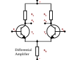
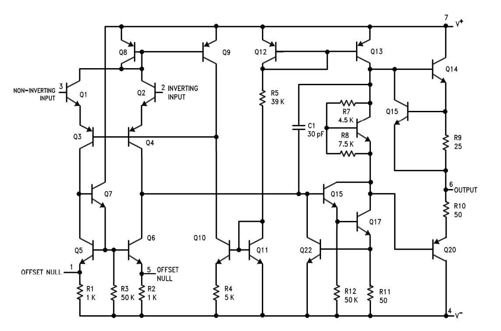
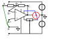

= Integrated NF amplifiers

Today, much-needed electronic functions such as NF amplifiers are no longer predominantly constructed from “discrete” (from Latin discretum = separate)
components, but are replaced by integrated circuits (Latin integrare = to unite); colloquially, they are called ICs
(from English integrated circuit). Monolithic integrated circuits (from Greek monos = one,
Greek lithos = stone, crystal) are particularly widespread. Here, a single silicon wafer measuring one or a few mm² in size is used to house a wealth of
transistors, diodes, resistors, and capacitors of small capacity are accommodated on a single silicon wafer using planar technology, which together perform an overall function, e.g.,
that of a complete low-frequency amplifier, receiver, timer, computer, clock, etc. Only larger components such as capacitors of large capacity,
coils, and, of course, the executive organs such as loudspeakers, digital displays, etc. are added discretely. Integrated circuits
work extremely reliably because they allow electronic complexity to be achieved in a very small space, which would be difficult to finance with discrete
components. In an IC, a transistor function costs a tenth of a cent.
In consumer electronics, too, ICs are increasingly replacing discrete circuits. Integrated NF amplifiers usually consist
essentially of an operational amplifier as a preamplifier and a push-pull output stage. A special feature of the operational amplifier
is its input stage, which is designed as a differential amplifier. Therefore, we will first discuss the principle of the differential amplifier,
followed by the basic characteristics of the operational amplifier, insofar as they are necessary for understanding the integrated low-frequency amplifier components.

== The differential amplifier

The differential amplifier consists of two transistors in emitter configuration. The collector-emitter paths of the transistors are
controllable resistors. The circuit thus provides a resistor bridge consisting of R1/T1 as the left voltage divider and R2/T2 as the right voltage divider.
The common emitter resistor R_{E} serves to stabilize the circuit. It can also be replaced by another transistor circuit.

The bridge diagonal exists between outputs A1 and A2. Assuming that R1 and R2 or T1 and T2 are equal
, the bridge remains in equilibrium (no voltage between A1 and A2) as long as the bases receive the same control voltage,
regardless of whether the voltage is DC or AC. With the same control, the resistances of the transistors also change
in the same way, so the resistance ratios of the bridge do not change. The “common mode” of the control voltages at E1 / E2
has no effect on the bridge diagonal A1 / A2. Common mode rejection is one of the most important characteristics of the differential amplifier.

However, if there is a voltage difference between the inputs, the transistors conduct differently, i.e., they change their resistance values
differently. The bridge becomes unbalanced, and a voltage difference, the output voltage U_{a}, arises in the bridge diagonal.
U_{a} is the amplified difference between the input voltages. Since this amplifier only amplifies the voltage difference between the inputs,
it is called a differential amplifier.

The differential amplifier was originally used as a measuring amplifier, but has since conquered all areas of analog circuitry due to its excellent characteristics, in particular its
stability and common-mode rejection. Changes in the operating voltage do not affect the equilibrium
of the bridge. In integrated circuits, both transistors are subject to the same temperature changes because they are housed on a common crystal,
 which is why the bridge is largely temperature-stable.

The importance of common-mode rejection can be illustrated with an example: There are usually large distances between the sensors of a smoke density meter, a
temperature monitor, an ECG device, etc., which must be bridged with correspondingly long cables.
 The measurement signal is switched to the two inputs as a difference. The often very high interference voltages (hum interference, etc.)
affect both cables, are in common mode at the inputs, and are thus suppressed.
In a normal single-ended amplifier, they would be amplified as well and lead to considerable distortion of the measurement signal.

== The Operational Amplifier

Operational amplifiers are differential amplifiers that have been enhanced with additional stages to increase gain and
reduce sensitivity to fluctuations in supply voltage, temperature, etc.
They were originally developed for use in analog computers, where they can be used to perform arithmetic operations
such as addition, subtraction, multiplication, division, integration, and differentiation.
This is where their name “operational amplifier” comes from, colloquially abbreviated to OpAmp.
Operational amplifiers are almost ideal amplifiers whose characteristics can be determined in a variety of ways by external circuitry.
As a result, computing technology is now only one application area among many.

=== General characteristics

1. Operational amplifiers are DC voltage amplifiers. They are characterized by exceptionally high voltage gain
(V_{Uo}= 10^3 to 10^5 times and more  = 60 to 100 dB). V_{Uo} is the “open-loop gain.” It is hardly ever used in practice.
It is reduced to 20... 40dB by negative feedback, thereby achieving very stable conditions. If the V_{Uo} of two
operational amplifiers differ by 30% due to manufacturing tolerances, the V_{U} in the strongly negative feedback amplifier only deviates by approx.
0.1%.

2. Operational amplifiers usually require a dual power supply; this allows the output voltage to assume positive or negative values of 0
(important for computer applications). In certain applications, the dual power supply can be bypassed with
the aid of a voltage divider.

3. Operational amplifiers have two inputs and (usually) one output, plus one or more auxiliary connections.
The inputs are labeled + (I) and - (I/). The output is labeled Q.
The two inputs determine the behavior of the output. If only one input is connected, the other must have a current path to 0.
“+” is the non-inverting input. If “-” receives a positive voltage U_{1} of 0, the output voltage U_{Q} of the
voltage amplification also increases positively. As U_{1} decreases, U_{Q} also decreases. The output therefore follows the input in phase.
In circuit diagrams, the non-inverting input is indicated with the symbol “+”.
This does not indicate a voltage value, but only the “non-inverting” function.
“-” is the inverting input. If its input voltage U_{-} rises to positive values, U_{Q} falls to negative values; if U_{-} becomes negative,
U_{Q} rises to positive values. The output therefore behaves in the opposite way to the inverting input; a
phase shift of 180° occurs between - and Q. In circuit diagrams, the inverting input is indicated by the symbol “-”, which does not indicate a voltage but only the function
“inverting”.
If both inputs are connected, the difference between U_{+} and U_{-} determines the behavior of the output. If U_{+}  and U_{-} are equal,
nothing happens at the output; the output goes to O  (common mode rejection).
The diverse applications of the operational amplifier result from the opposite behavior of the inputs.
If U_{Q} is reduced to (-), negative feedback is created with all possibilities to vary the gain factor, frequency response, etc.
If U_{Q} is reduced to (+), positive feedback is created, resulting in oscillating and toggle circuits with a wide range of adjustment options.
The basic behavior of the operational amplifier should be studied experimentally (see below).

4. Even the best operational amplifier is not perfect. During manufacture, unavoidable asymmetries arise, which are particularly noticeable in the differential amplifier.
In order for the input to really go to 0, there must be a small voltage between the inputs. This is called “input offset voltage,”
“input zero voltage” or “offset voltage” (input offset voltage = input deviation voltage) U_{EOS}. The offset voltage is in the
range of a few mV. The input offset can be compensated for in many operational amplifiers using the auxiliary connections mentioned above.

5. Every transistor system has capacitances at its pn junctions that also act towards 0 (“ground”) in terms of alternating current. In conjunction with the resistors,
they form low-pass filters that, on the one hand, weaken the amplification of high frequencies and, on the other hand, rotate the phase angle of the output relative to the input as the frequency increases.
Due to the sequence of several stages in the operational amplifier, the phase shifts add up, so that at very high frequencies, negative feedback can become
positive feedback and the amplifier becomes unstable, possibly even oscillating.
This can be remedied by so-called “frequency compensation.” By adding an additional capacitor or an RC element at

=== Design and Types

==== The Textbook op-amp "741"

The LM741 or µA741 is the classical op-amp. It has two explicit pins (1 and 5 ) for the offset compensation,
newer / modern op-amps does not need / have.

It also has fequency compensation - see the 30 pF capacitor in the schematic.

image:./lm741-pinout.png[width=700]

==== The today used general op-amp LM358

(to be continued)

==== Op-amps used for audio applications (TL07x, TL08x)

(to be continued)

=== Properties and basic circuits

image:./op-amp-test-circuit.svg[width=700]

The figure above shows a test circuit that can be used to test the basic behavior of the operational amplifier.
The circuit will later be used as an amplifier circuit.

1st experiment (offset voltage and open-loop gain):

The operational amplifier is connected to two batteries or a symmetrical power supply
of +/- nine to +/- twelve volts without any additional components (i.e., without a trimmer for offset adjustment). The output voltage is monitored with a voltmeter. If no voltmeter is available, two LEDs (D1/D2) connected in anti-parallel will suffice in a pinch.
The otherwise necessary series resistors can be omitted, as the 741 limits the output current to approx. 18 mA, preventing either The otherwise necessary series resistors can be omitted, as the 741 limits the output current to approx. 18 mA, preventing overload of either
the LED or the circuit. Instead of two LEDs connected in anti-parallel, a bipolar LED can also be used.
After connecting the voltage source(s), the output assumes an extreme state (+ or -), even though both inputs are open.
If both inputs are connected to 0 via short (!) test cables, nothing changes at the output. The reason for this is the offset voltage U_{EOS}.
The 741 has an open-loop gain of approx. 200,000. If U_{EOS} is even 1 mV, this means a calculated voltage of 200 V at the output, which the operating voltage
does not allow, of course. This calculation is only intended to illustrate how strongly the operational amplifier is overdriven.

2nd experiment (offset adjustment):

Now connect the trimmer to the offset adjustment terminals 5 and 1. Adjust the trimmer to shift the output from one extreme to the other.
The output voltage U_{a} = 0 can only be set with great precision. The reason for this is again the high open-loop gain of the operational amplifier.
With this operational amplifier (741), offset adjustment is possible (due to the internal design) via separate connections. If this option is not available,
the offset adjustment is made by shifting an input (see below). The two diodes stabilize part of the voltage around the 0 point;
the offset voltage can be adjusted using the trimmer.

image:./offset-adjustment.svg[width=450]

3rd attempt (negative feedback and inverting amplifiers)

Full voltage gain V_{uo} is used extremely rarely. V_{uo} is therefore reduced to the desired level by means of negative feedback, by partially feeding the output voltage
back to the inverting input (-). V_{u} is determined solely by the degree of negative feedback, which is determined by the degree of negative feedback resulting from the
voltage divider ratio (see below).
Depending on whether the non-inverting (+) input or the inverting (-) input is controlled, the operating mode is called a “non-inverting” or “inverting” amplifier.
The following applies to the non-inverting amplifier

image:./op-amp-non-inverting.svg[width=450]

[role=“image”, “./noninverting-amplifier.svg”, imgfmt="svg"]
\large \[V_{u} = \frac{R_{1} \cdot R_{2}}{R_{1}} =1 + \frac{R_{2}}{R_{1}}\]

The “1” can be omitted in rough calculations (it does not make much difference). If V_{u} is set to 100 (~40dB), the 1 only means 1%.
If the voltage divider is composed of two resistors from the E-12 series (5% tolerance), the deviation from the calculation due to the manufacturing tolerances of the resistors can be
10% in the worst case. (Note that the original text is quite old; the price difference between carbon (5% tolerance) and metal film resistors (1% tolerance)
is almost insignificant today.)

A special case occurs when the output voltage is fed back undivided to the inverting input (-) either via a direct connection or via a resistor (see below).
R_{2} may be very high impedance (up to 1 MOhm) because a lot of current flows into the input;
it does not significantly change the degree of negative feedback from 100%. V_{u} is 1 in this type of circuit.

This circuit is called a “voltage follower” and is used as an impedance converter. The very high input resistance is contrasted by a low output resistance. For applications, see also
Experiments 5 and 6.

The following applies to inverting amplifiers

[role=“image”, “./inverting-amplifier.svg”, imgfmt="svg"]

We now insert the voltage divider into the component (see below): R2 = 100 kOhm (C -B) and R1 = 10 kOhm (B-A)
connect A to 0 and B to the inverting input (-). This gives V_{u} = 11. The non-inverting input (+) receives a current path to 0 or ground, either via a resistor
(order of magnitude R1 || R2) or, which is sufficient here, via a short (!) test cable. We try again to establish 0V at the output by adjusting the offset with the trimmer, which is easy to do this time
because the gain has been greatly reduced.
The characteristics of the operational amplifier are largely determined by the degree and type of negative feedback. In this example, U_{a}  was fed back via an ohmic resistor.
However, any impedance is also suitable for feedback: If the feedback consists of a low-pass filter, for example, the high frequencies are preferentially amplified because they are less strongly
negatively fed back. If the return path is via a high-pass filter, the low frequencies are preferentially amplified. This makes it possible, for example, to adjust the treble and bass in hi-fi amplifiers.
The possibilities are extremely numerous and can only be hinted at here. It should also be mentioned that the gain can be continuously adjusted via a trimmer (instead of R2).

4. Experiment (operation as a non-inverting amplifier):

To control the inputs, we use a potentiometer to set up a voltage divider with approx. 10... 50 kOhm lin. (see figure). The voltage divider allows the inputs to be controlled with positive and negative variable voltages
. The processes at the output can be observed even more easily if V_{u} is reduced further, e.g., by reducing the resistance R2 from 100 kOhm to 22 kOhm.

We connect the potentiometer's slider to the non-inverting input and measure U_{a} (any short circuit remaining from the previous experiment must of course be eliminated).
If the slider is turned to positive values, the input receives a positively rising voltage U_{e}, and U_{a} rises to positive values. If the slider is turned back, U_{e} decreases and rises
to negative values after passing through 0 volts. U_{a} also decreases, passes through 0 volts, and rises to negative values. In non-inverting amplifier operation, U_{a}
- increased by V_{u} - follows the input voltage in phase.

[role=“image”, “./inverting-amplifier2.svg”, imgfmt="svg"]
\large \[U_{a} = U_{e} \cdot ( 1 + \frac{R_{2}}{R_{1}})\] .

5th experiment (operation as an inverting amplifier):

Now we control the inverting input (-) with the voltage divider from the experiment. V_{u} is set to ~10 again. The non-inverting input receives a current path to 0.
If U_{e} at the inverting input becomes positive, U_{a} becomes negative; conversely, if U_{e} is negative, U_{a} takes on positive values.
When operating as an inverting amplifier, U_{a} follows the input voltage with the opposite sign, i.e., phase-shifted by 180°.
The behavior is comparable to that of the transistor in https://wehrend.github.io/pages/electronics-103/#_transistor_in_emitter_circuit[the emitter circuit].

[role=“image”, “./inverting-amplifier3.svg”, imgfmt="svg"]
\large \[U_{a} =  - (\frac{R_{2}}{R_{1}}) \cdot U_{e}\]

The minus sign indicates the phase reversal.

// This page is still under construction
//
// image:./under_construction.png[width="350px"]

// === Applications as Amplifier

// power amps (optional)