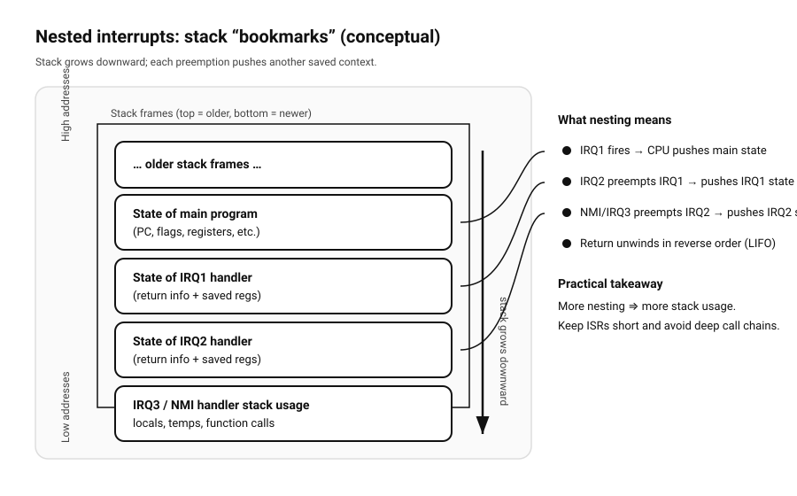

== Interrupts - The doorbell analogy

Imagine a person sitting quietly at home, deeply focused on reading a book. This person represents the CPU,
and the act of reading represents the normal execution of a program. In a world without doorbells, the only
way to know whether someone is at the door would be to repeatedly stop reading, walk over, and check the door.
Most of the time this effort would be wasted, because nobody is there.

== Polling

This situation closely resembles a computer system that relies on polling instead of interrupts. The CPU
repeatedly pauses its work to check whether a keyboard key was pressed, a disk operation has finished, or a
network packet has arrived, even when nothing has happened. While simple, this approach is inefficient because
valuable processing time is spent checking for events that rarely occur. Now introduce a doorbell. With a
doorbell installed, the reader no longer needs to constantly check the door.

== The doorbell analogy

They can focus entirely on the book, confident that if someone arrives, they will be notified immediately.
In this analogy, the doorbell represents an interrupt. A device such as a keyboard, mouse, or disk controller
does not wait for the CPU to ask whether it needs attention; instead, it actively signals the CPU when an event
occurs.

When the doorbell rings, the reader does not forget where they were in the book. They place a bookmark, stand up,
and go answer the door. This corresponds to the CPU saving its current state, such as register values and the
program counter, before responding to the interrupt. The act of opening the door and interacting with the
visitor is like executing an interrupt service routine (ISR), which is a small, specialized piece of code
designed to handle that specific event. Once the visitor has been dealt with, the reader returns to the chair,
removes the bookmark, and continues reading from exactly where they left off. Likewise, the CPU restores its
saved state and resumes the interrupted program as if nothing had happened.

image:./interrupts.svg[width="800px"]

== Interrupts in microcontrollers

In microcontrollers, interrupts are often the primary mechanism for responding to external events. A button
press, a timer overflow, or the completion of an analog-to-digital conversion can all trigger an interrupt.
Because microcontrollers typically run a single main loop, an interrupt acts like a sudden doorbell that
temporarily diverts execution to a small handler function - so called Interrupt Service Routine (ISR).
These handlers are usually short and deterministic,
doing only the minimum work required before returning control to the main program. Since microcontrollers
often operate under strict timing and power constraints, interrupts are essential for efficient and responsive
design.

== Interrupts on x86 systems

On x86 processors, interrupts are more complex and highly structured. External devices signal interrupts
through dedicated interrupt lines, which are managed by interrupt controllers such as the legacy PIC or the
modern APIC. When an interrupt occurs, the CPU uses an interrupt descriptor table (IDT) to determine which
handler to execute. The processor automatically saves part of the execution context and switches to a
privileged mode if necessary. This mechanism allows user programs, device drivers, and hardware events to be
cleanly separated while still reacting immediately to external stimuli.

== Interrupts in operating system kernels

In operating system kernels, interrupts form the foundation of multitasking and hardware interaction. Timer
interrupts allow the scheduler to regain control of the CPU and switch between running processes, ensuring
fairness and responsiveness. Hardware interrupts notify the kernel of completed I/O operations, network
traffic, or user input. Because interrupt handlers run in a highly privileged context, kernel code must be
carefully designed to be fast, reentrant, and safe. Often, only the most critical work is performed directly in
the interrupt handler, while longer tasks are deferred to later execution contexts.

== Introduce non-maskable Interrupts (NMIs)

Not all doorbells or alarms are equally important. If the doorbell rings at the same time a fire alarm goes off,
the reader will ignore the visitor and immediately respond to the emergency. In this analogy, the fire alarm
represents the non-maskable interrupt (NMI) pin of the CPU. NMIs are critical signals that cannot be disabled and
are typically used for severe conditions such as hardware failures or watchdog timers.

This reflects how interrupts can have priorities. Critical interrupts can preempt less important ones,
ensuring that urgent situations are handled immediately.

There are also moments when the reader does not want to be disturbed at all, perhaps during an exam or an
important phone call. They might mute the doorbell or put up a “Do Not Disturb” sign. In computer systems, this
is similar to masking or temporarily disabling interrupts, allowing the CPU to complete sensitive operations
without interruption.

In a larger house, there may be multiple signals: a doorbell, a phone ringing, and a smoke detector, each
indicating a different kind of event. Similarly, a computer has many possible interrupt sources, and the CPU
can determine which device raised the interrupt and jump to the appropriate handler. Overall, interrupts allow
a computer to work efficiently by reacting to events only when they actually occur, just as a doorbell allows
a person to read peacefully without constantly checking the door.

== Nested interrupts

In some situations, an interrupt can occur while another interrupt is already being handled.
This is known as a nested interrupt. Returning to the doorbell analogy, imagine the reader answering the door when,
suddenly, the fire alarm goes off. The reader immediately stops the conversation at the door and responds to the
more urgent alarm. Once the emergency is handled, they return to the visitor and continue where they left off.

In computer systems, nested interrupts are made possible through interrupt priorities.
Each interrupt source is assigned a priority level. When an interrupt handler is running, lower-priority interrupts
may be temporarily blocked, while higher-priority interrupts are still allowed to preempt the current handler.
This ensures that time-critical events, such as timer ticks or hardware fault signals, are handled with minimal delay.

When a nested interrupt occurs, the CPU must save the current interrupt handler’s state before jumping to the higher-priority
handler. This means that multiple layers of context can exist on the stack at the same time. After the highest-priority
interrupt finishes, execution resumes in reverse order, unwinding back through the interrupted handlers until the
original program continues.


Nested interrupts improve system responsiveness but also increase complexity.
Interrupt handlers must be carefully written to be reentrant or otherwise protected against shared data corruption.
For this reason, many systems keep interrupt service routines short and avoid complex logic, deferring longer work
to non-interrupt contexts. Some systems also limit or completely disable nesting to simplify design and guarantee
predictable timing.


Overall, nested interrupts provide a balance between responsiveness and complexity.
By allowing critical events to interrupt less important work—even other interrupt handlers—systems can meet strict timing
requirements while still maintaining control over execution flow.

== Hardware watchdog timers

A hardware watchdog timer is a safety mechanism that helps a system recover if software gets stuck.
Think of it like a security guard with a stopwatch: the guard expects a regular “I’m alive” check-in.
If the check-in doesn’t happen in time, the guard assumes something is wrong and triggers an emergency action.

In many embedded systems, the watchdog is implemented as a dedicated hardware timer that counts down.
The software must periodically “pet” or “kick” the watchdog (feed it) before it expires. Under normal
operation this is easy: the main loop or scheduler reaches a known point and resets the watchdog timer.
But if the CPU hangs in an infinite loop, deadlocks, gets trapped with interrupts disabled, or crashes
in a way that prevents normal execution, the watchdog won’t be serviced.

When the watchdog expires, the reaction depends on the platform:

Reset watchdogs: the most common behavior is to reset the entire microcontroller/CPU, bringing the system back to a
known good boot state.

Interrupt watchdogs:
some watchdogs first raise an interrupt (often a high-priority interrupt, and on some systems
even an NMI-like path) to give the system a last chance to log diagnostics or attempt a controlled recovery before
a reset.

Window watchdogs:
more strict variants require the watchdog to be serviced within a specific time window—not too early and not too
late—helping detect code that is stuck in a tight loop that services the watchdog “too often” without doing real work.

Watchdogs are especially important in unattended or safety-relevant devices—routers, cars, industrial controllers,
medical devices—where a manual reboot is not an option. They don’t prevent bugs, but they limit how long a bug can keep
the system in a broken state.

A key design point is where you service the watchdog. If you reset it from a fast interrupt that still runs during a
system failure, the watchdog may never fire even though the main program is stuck. A common pattern is to service the
watchdog only after the program has successfully completed a meaningful “health check” (e.g., the main loop ran,
critical tasks executed, or the scheduler made progress). That way, the watchdog truly indicates that the system as a
whole is alive—not just that some interrupt is still firing.

== Summary

Interrupts allow a CPU to respond to events efficiently without constantly checking for them. Instead of
polling devices and wasting processing time, the CPU can focus on executing programs and react only when a
device signals that attention is required.

Using the doorbell analogy, an interrupt is like a notification that temporarily pauses ongoing work. The CPU
saves its current state, executes a small handler to deal with the event, and then resumes execution exactly
where it left off. This mechanism is fundamental across all computing systems, from simple microcontrollers
to modern x86 processors and full operating system kernels.

In microcontrollers, interrupts enable fast and power-efficient responses to external signals and timers. On
x86 systems, they are managed through structured mechanisms such as interrupt controllers and descriptor
tables. Within operating system kernels, interrupts form the backbone of multitasking, device I/O, and system
responsiveness.

Finally, not all interrupts are equal. High-priority and non-maskable interrupts ensure that critical events
are handled immediately, even when normal interrupts are disabled. Together, these mechanisms allow computer
systems to remain responsive, efficient, and reliable.

