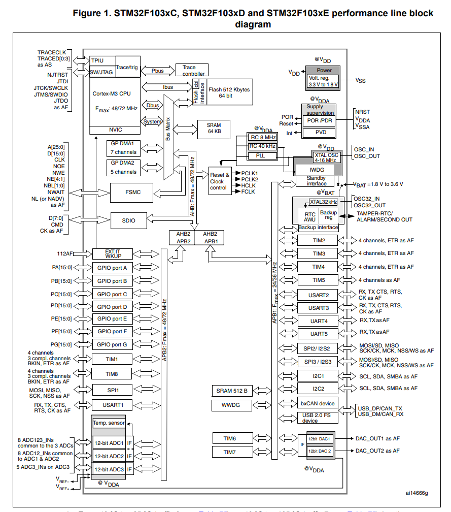
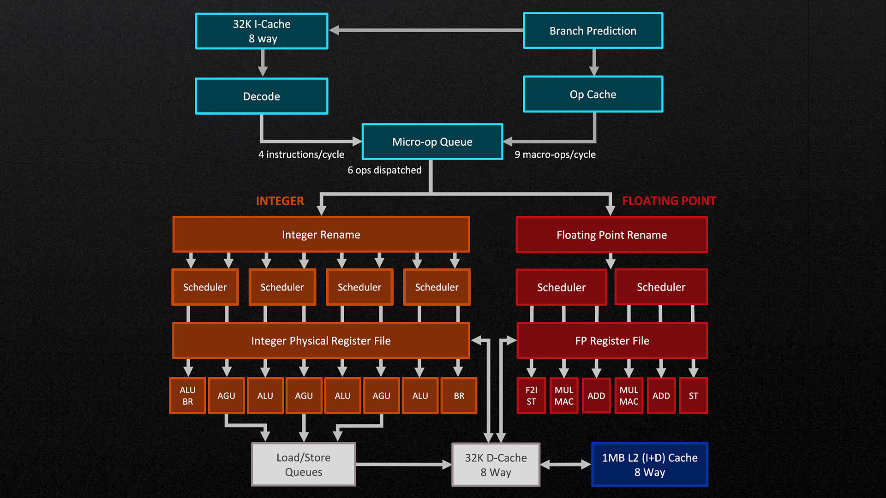

== The two totally distinct worlds - Microcontrollers vs. Microprocessors (MCU vs. CPU)

In this post we want to deepen the insight into the fundamental differences between embedded systems based on
microcontrollers and desktop or server machines built around powerful CPUs with a complete operating system stack.

We will contrast an MCU platform, for example an STM32-based system, with a typical desktop CPU platform such as
an AMD Ryzen system. Although both execute software and process data, they are optimized for completely different
goals and usage scenarios.

While the main property of embedded systems is predictability and deterministic timing behavior, the main property
of desktop and server systems driven by CPUs is high performance and overall throughput.

== The most important properties and structure of MCUs / embedded systems

Microcontrollers are designed to directly interact with the physical world. An MCU typically integrates the CPU
core, memory, and a rich set of peripherals on a single chip. This high level of integration allows very compact,
energy-efficient, and cost-effective systems.

MCU boards usually provide peripherals such as GPIOs, timers, communication interfaces, and analog components like
ADCs and DACs, as discussed in
https://wehrend.github.io/pages/adc_dac/[this post].
These peripherals make it possible to connect sensors for temperature, humidity, pressure, light, or sound
directly to the microcontroller without additional hardware (minus the sensors itself).

Software for embedded systems is often executed either bare-metal or on top of a small real-time operating system.
In both cases, the software architecture is typically simple and tightly coupled to the hardware. Programs are
often structured around a main loop or a small number of real-time tasks. The crucial requirement is that certain
operations happen within guaranteed time bounds. Worst-case execution time matters far more than average
performance, because missing a deadline may lead to incorrect system behavior or even physical damage.

== The most important properties and structure of CPU / desktop and server systems

Desktop and server systems based on CPUs follow a fundamentally different design philosophy. Here, the CPU is only
one part of a much larger and more complex system. External RAM, mass storage, graphics hardware, network
interfaces, and many other components are connected via high-speed buses and controlled by a full-featured
operating system such as Linux or Windows.

In this environment, performance is measured primarily in terms of throughput and average-case execution speed.
Modern CPUs use techniques like deep pipelines, multiple cache levels, out-of-order execution, and speculative
execution to maximize the number of instructions executed per unit of time. These optimizations greatly increase
performance but make precise timing behavior difficult or even impossible to predict.

Operating systems on desktop and server machines focus on fairness, resource utilization, and user experience.
Processes are scheduled dynamically, memory is virtualized, and applications are isolated from each other. Small
latency variations are acceptable as long as the system remains responsive and can handle a large number of tasks
concurrently.

