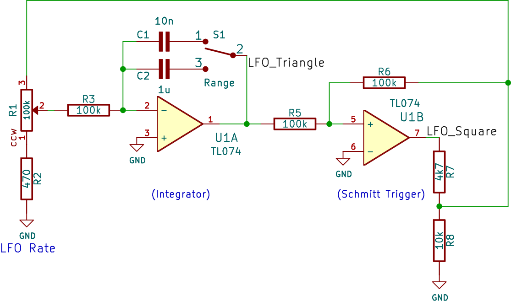
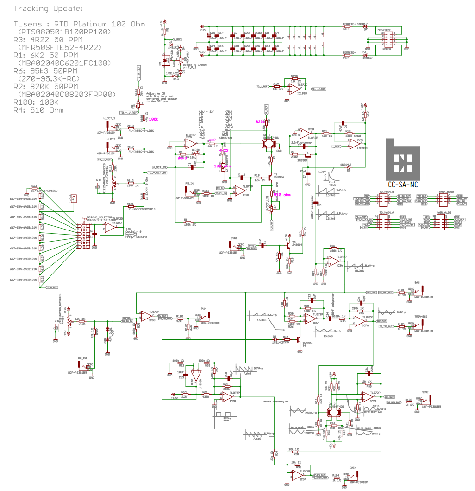
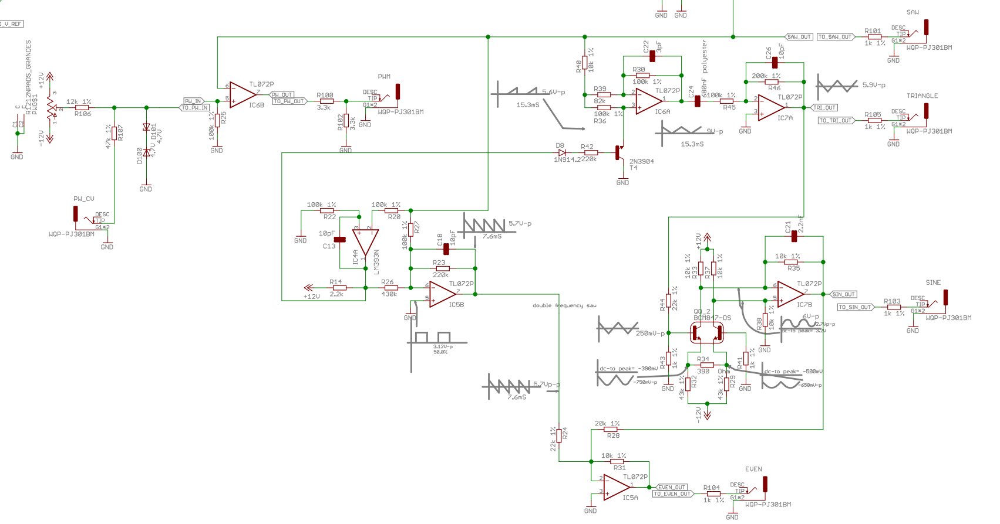
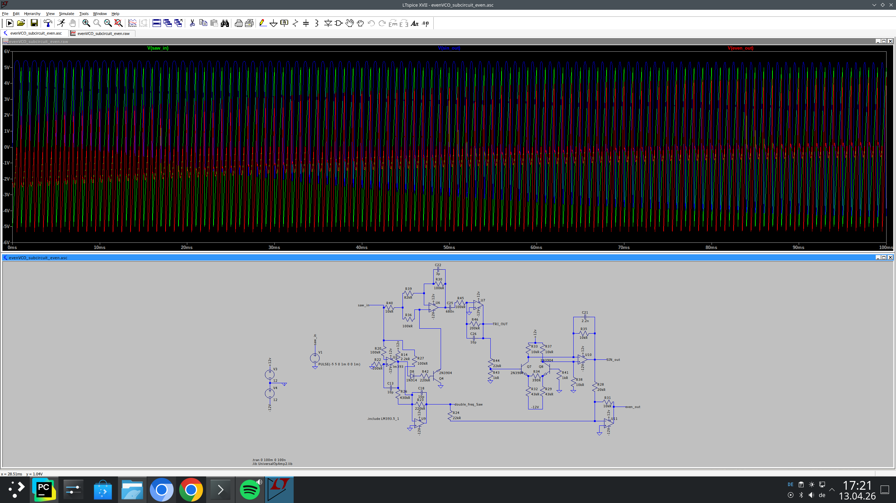

== The oscillator(s) - what it is and how it is working behind the scenes...

With exception to noise every synthesizer needs some swinging circuit - better known as an oscillator.
There are pleanty of circuits doing that thing but we want to look first into Low-frequency oscillator, better known
as LFO...

== A simple (LF)O

Think of this circuit as a high-speed game of electronic tag between two sections of the op-amp. It’s a self-sustaining loop
where each part is constantly reacting to the other to keep the signal moving.

The process starts with the **Integrator**. Imagine this as a steady ramp builder. When it receives a fixed voltage from the
next stage, it begins to charge a capacitor. Because it charges at a constant rate, the output voltage doesn't just jump;
it climbs or falls in a perfectly straight line, creating that smooth **Triangle Wave** we use for modulation.
The "Rate" knob is essentially a valve here—it controls how much current flows into that capacitor, which determines how
steep the ramp is and, therefore, how fast the LFO cycles.

Watching this ramp is the **Schmitt Trigger**. This part of the circuit is essentially a "decision maker" with two specific
flip-points. It sits there waiting for the triangle wave to hit a certain height. The moment the ramp reaches the upper threshold,
the Schmitt trigger "snaps" its output to a high state. Conversely, when the ramp drops to the lower threshold, it snaps back to a low state.
This sudden switching is what gives us the **Square Wave** output.

The "oscillation" happens because these two are wired in a feedback loop. When the Schmitt trigger snaps High, it sends
that high voltage back to the input of the Integrator. The Integrator sees that "High" and immediately starts ramping its output *downward*.
It keeps sliding down until it hits the Schmitt trigger’s bottom limit, which causes the trigger to flip "Low."
Now, the Integrator sees that "Low" and starts ramping *upward* again.

They essentially chase each other's tails forever. To make sure the circuit stays stable, David Haillant added a **Buffer** stage
at the very end. This acts like a one-way mirror; it lets the triangle and square waves out to your other synth modules but prevents
those modules from "tugging" on the core circuit and messing with the frequency or wave shape. Finally, a separate part of the chip
handles the LED, ensuring that the power draw from the blinking light doesn't cause any tiny wobbles in your actual audio signal.

link:./simpleLFO.asc[So here is my interpretation of the Simple LFO circuit].

And here ist the graphical representation of the circuit.

image:./SimpleLFO_simulation.png[Circuit Simulation]

== The BEFACO evenVCO

After looking into the simple LFO we want to have a look at a more complex circuit the Befaco evenVCO - for reference its full schematic below:

We have a deeper look at a partial of this circuit:

The Befaco EvenVCO is a bit of a clever beast because, unlike many oscillators that start with a Triangle wave, this one
is natively a **Ramp/Sawtooth** oscillator. This means the "waveshaper" section has to do some serious gymnastics to give
you those smooth Sines and Triangles.

The core of the shaping happens by taking that raw Ramp and folding or filtering it through specific transistor and op-amp
stages. To get the **Triangle wave**, the circuit essentially "folds" the ramp. Imagine taking the diagonal line of a Sawtooth
and mirrored the second half of it; by using a window comparator and an inverter, the circuit flips the falling edge of the
ramp back up. It’s like a paper-folding trick—once you fold that diagonal line over itself, you’re left with the symmetrical
"V" shape of a Triangle.

Once you have that Triangle, the **Sine shaper** takes over. This is usually a "soft-clipping" stage. If you push a Triangle
wave into a pair of transistors (often a differential pair) or a specific diode network, the circuit starts to "round off" the
sharp peaks. It’s a bit like taking a piece of sandpaper to a wooden pyramid; as you sand down the sharp top and the harsh
corners at the bottom, the linear slopes curve out into the smooth, mathematical arc of a Sine wave.

The "Even" output—the module’s namesake—is a unique shaping trick. It creates a signal that is primarily composed of
**even harmonics**, which gives it a super distinct, almost vocal or "hollow" quality compared to a standard saw.
It does this by doubling the frequency of the internal ramp and mixing it back in a way that emphasizes those specific overtones.
It’s less about carving a shape and more about shifting the harmonic DNA of the sound.

Finally, for the **PWM and Square** waves, the circuit uses a comparator similar to the Schmitt trigger we talked about before.
It compares the raw Ramp wave against a fixed (or CV-controlled) voltage level. Whenever the ramp is higher than that level, the
output stays "High." When it’s lower, it stays "Low." By moving that "level" up and down with the PWM knob, you’re changing exactly
where the wave "snaps," which is how you stretch or shrink the width of the pulse.

link:./evenVCO_subcircuit_even.asc[So here is my interpretation of the evenVCO]

_This blog post was created with the help of AI - specifically Google Gemini._
