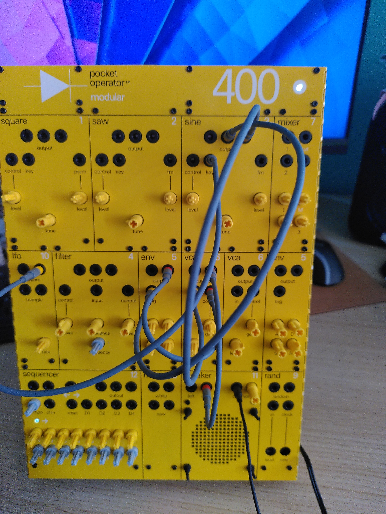
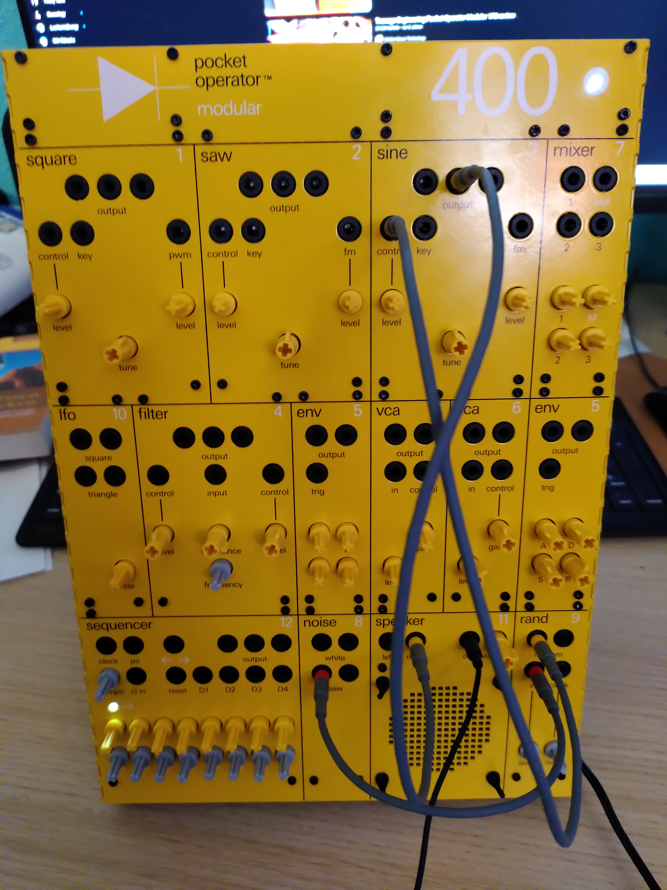
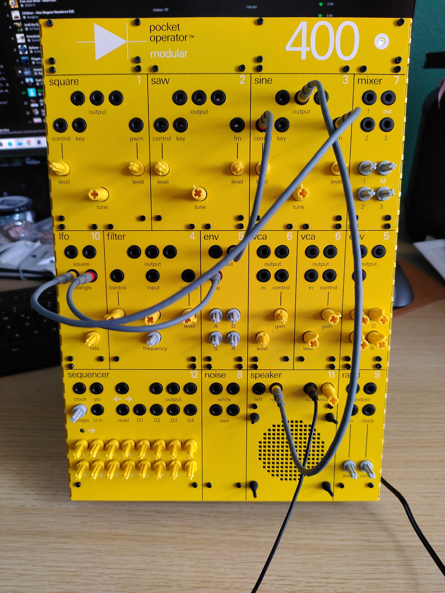

link:./00_plong_plong_plong.mp4[Plong... Video]

Mit dem Zufallsmodul können wir ein Signal vom Eingang abtasten und halten. Sein Gegenstück ist das Rauschmodul.
Wir speisen den Sägeausgang in den Eingang des Zufallsmoduls ein.

link:./01_beep_bleep.mp4[Beep,bleep... Video]

'''.

 Sinus-Ausgang -> Lautsprecher rechts.
 Hüllkurvenausgang -> Sinus-Taste.
 LFO-Rechteck -> Hüllkurven-Trigger.
 LFO-Rechteck -> Sinus fm

Wir können das Setup erweitern, indem wir den Sequenzer verwenden und den Filter nutzen. Denn  das Schöne
an modularen Synthesizern ist, dass der Filter nicht nur in Signalpfaden, sondern
auch in Steuerpfaden verwendet werden kann ;-) ..

 Filterausgang -> Sinussteuerung.
 Sequenzerausgang -> Filtereingang
---