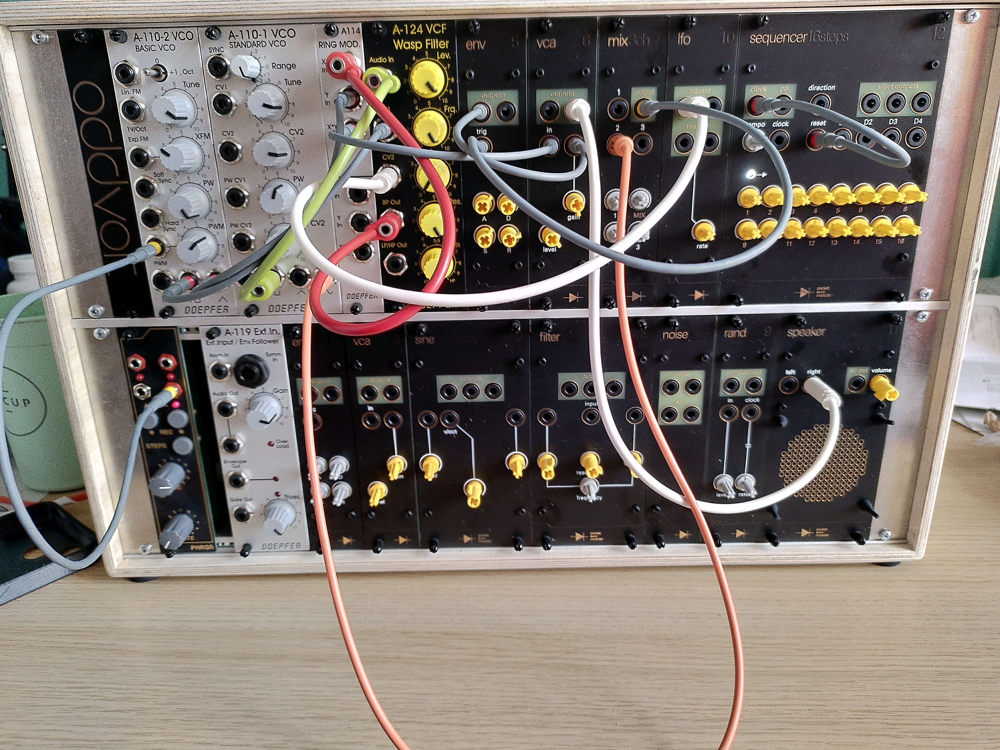

Hier ist also eine weitere Patch-Idee für das Doepfer A-100-System.
Die Ergebnisse der Doepfer-Oszillatoren sind prägnante „knarzig-kernige“ Klänge.
Wir verwenden zwei A-110-Oszillatormodule (ein Standard- und ein Basic-Modul), einen Ringmodulator (A-114)
und ein Wasp-Filter (A-124) sowie einige Hilfsmodule wie einen Sequenzer und einen LFO.

link:./00_pithily_sounds.m4a[pithily... Audio]

