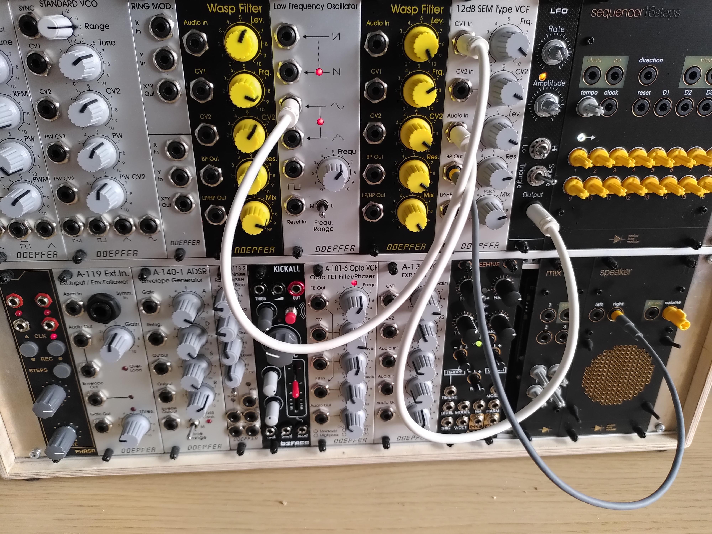
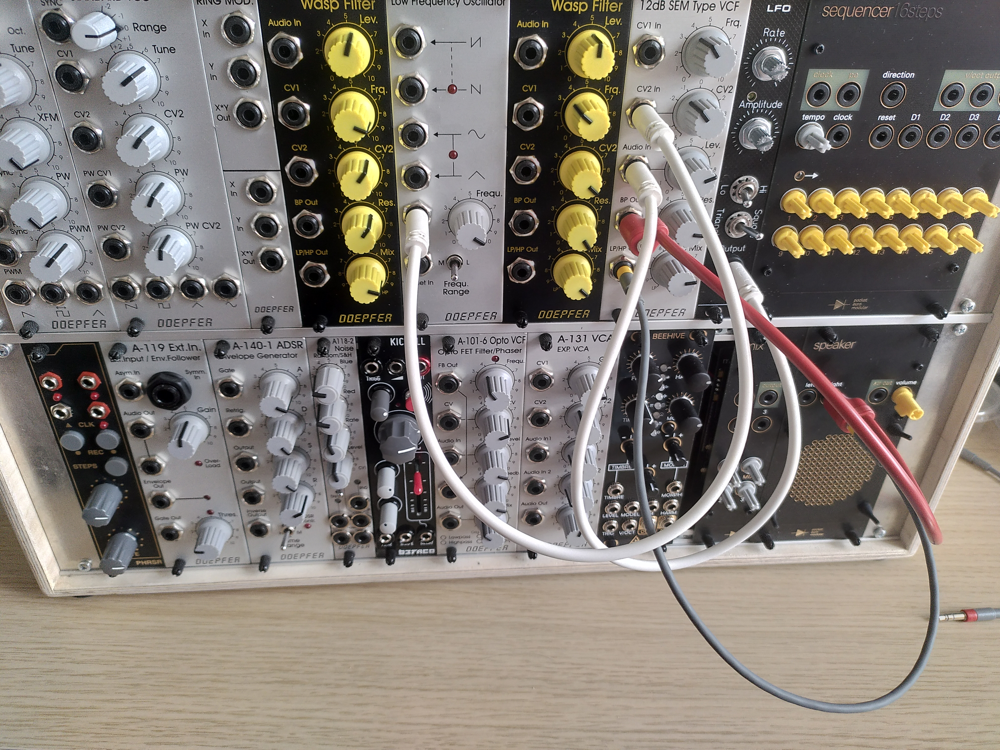

So here is another small patch idea for the Doepfer A-100 system,
this time featuring the SEM filter from Oberheim, incarnated in the Doepfer
modul A-106-5.
We also utilize two LFO modules...

link:./00_lfo_sem_patch.m4a[LFO SEM Patch Audio]

link:./01_lfo_sem_patch2.m4a[LFO SEM Patch Audio 2]

link:./02_lfo_sem_patch3.m4a[LFO SEM Patch Audio 3]

To this day I did not find the right audio recorder,and I am recording with my smartphone,
so the sound quality is rather bad. I am still searching for the ideal recording hardware.
