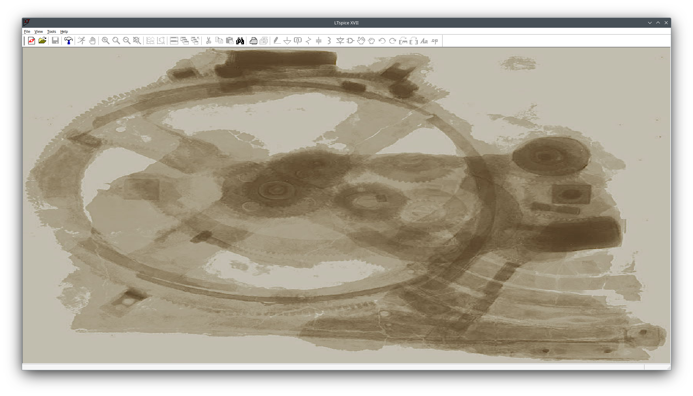
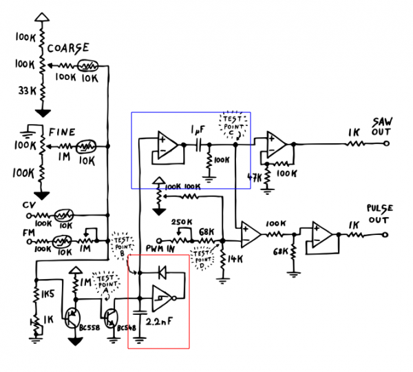
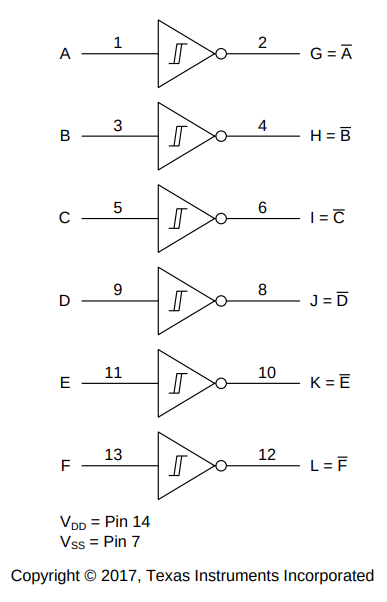
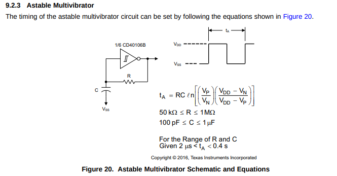
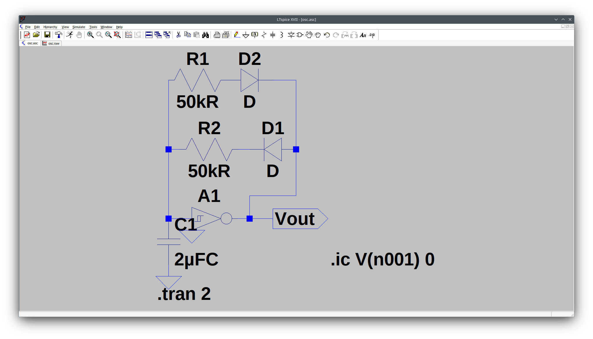
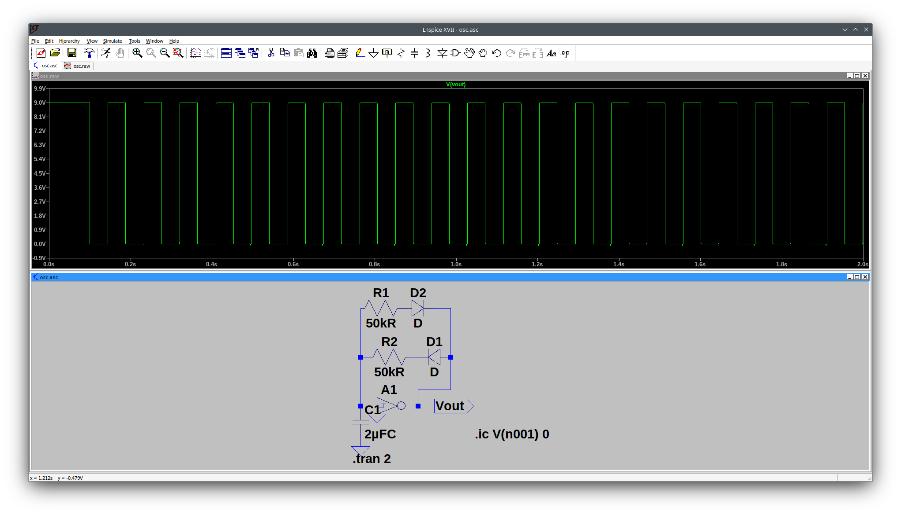

Hello folks,

today I want to start with a topic that I had already longer in my mind and finally took hands on.

We want to simulate a simple LFO (or a normal oscillator, depending on the chosen dimensions) and for that
we use the relative well-known tool https://www.analog.com/en/resources/design-tools-and-calculators/ltspice-simulator.html[LTSpice]
that thankfully also works on Linux machines thanks to using the non-emulator https://www.winehq.org/[wine].

A simple tutorial how to start that is found https://github.com/joaocarvalhoopen/LTSpice_on_Linux_Ubuntu__How_to_install_and_use[here].

Simple, after installation in the shell we enter (or copy):

----
# Start lstpice through wine
wine ~/.wine/drive_c/Program\ Files/LTC/LTspiceXVII/XVIIx64.exe
----

We start with a schmitt-inverter based oscillator, utilizing a 40106 IC with six schmitt-inverters

Its based ont the VCO cicuit schematic from erica synths, see as below

Below the schematic from the datasheet

For more details, see the datasheet below

https://www.ti.com/lit/ds/symlink/cd40106b.pdf[Datasheet]

The important piece here is the following use case as astable multivibrator

We add two antiparallel diodes to the circuit, allowing to usse different timings for pulse and pause..

Dont forget to set values for the schmitt-inverter, otherwise it will not behave like it should, but like an ideal component,
so do a right click on the schmitt inverter and under value add this: Vhigh=9 Vt=4.45 Vh=.85 Trise=.1u Tfall=.1u

After implementing the circuit part by part we end up with simulation, for that we need to set some initial condition .ic, the whole
spice command is as below

----
.ic V(n001) 0
----

additionally we need to set the transition times and how long the simulation should go..

----
.tran 2s
----

A finished version of the oscillator to download:

link:./osc.asc[osc.asc]

That allows us to run the simulator:

Next, we can modify the resistor values and note that they control the pulse-pause-ratio .

Dont forget that, in a real circuit, you need an op-amp designed as voltage follower or impedance converter,
like sketched blue in the cicuit schematic in order to be able to encumber the output with the next stage.
Last but not least we have an RC filter on the end, a first-order high-pass filter...

Thats it for now, see you later in other articles.