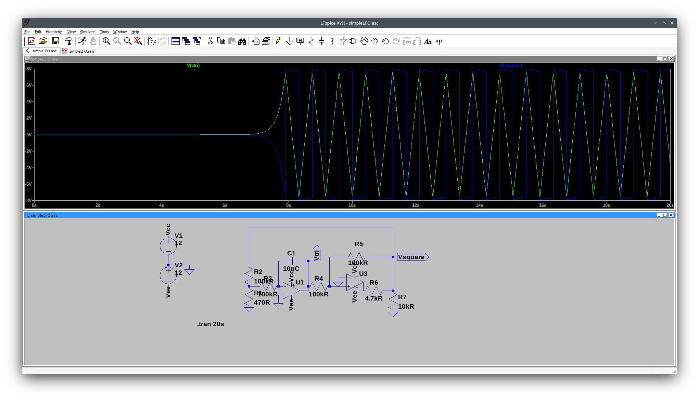

Hello folks,

today I want to discuss with you the
https://www.davidhaillant.com/category/electronic-projects/simple/simple-lfo/[simple LFO made by David Haillant].

It was the very first module I began my dives into the world of diy.

Quite simple and not to complicated to begin with...

image:./simpleLFO.png[Simple LFO schematic].

If you do not shy away from mathematical deep-dive explanations - (I sometimes do),
you can view the details https://www.electronics-tutorials.ws/opamp/opamp_6.html[here (integrator)]
and here (schmitt-trigger)

A more electronics dive in can be made
https://service.projektlabor.tu-berlin.de/wordpress/wp-content/uploads/sites/19/2017/05/Dreiecksgenerator_Marten_Folien.pdf[here (german)]

link:./simpleLFO.asc[So here is my interpretation of the Simple LFO circuit].

And here ist the graphical representation of the circuit.

Last but not least the https://www.davidhaillant.com/wp/wp-content/uploads/lfo-with-pot-20160207.asc[original sources by David Haillant],
and https://www.davidhaillant.com/wp/wp-content/uploads/pot.zip[here the potentiometer].

