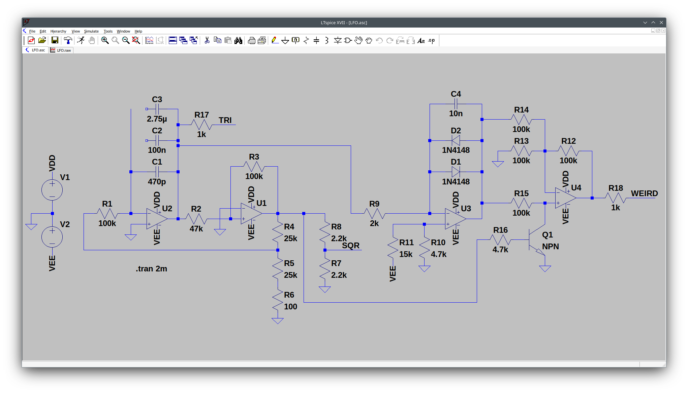
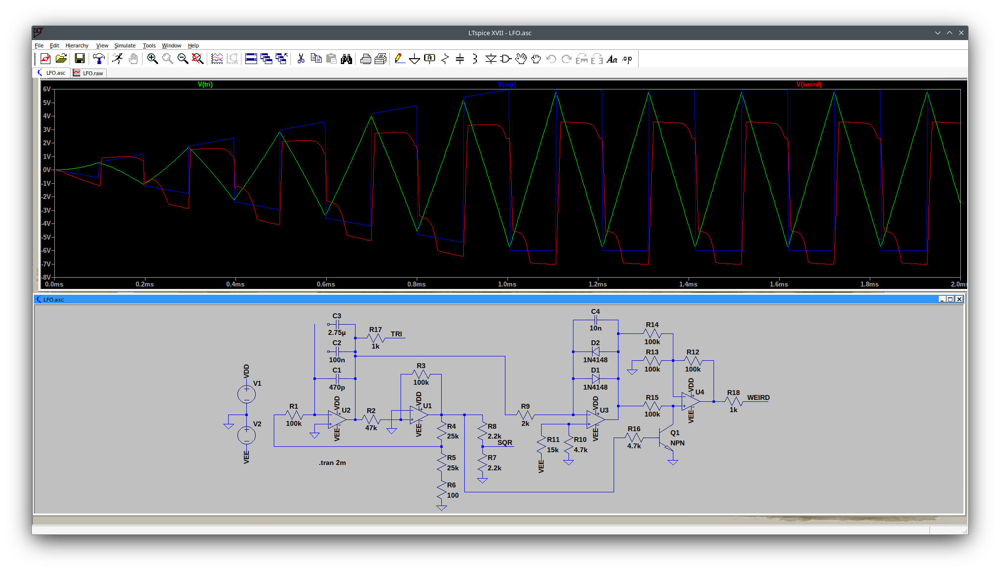

Hello folks,

today I want to continue the series about simulation of synth modules with LTspice.

We start with this module from etsy which we disect and reverse engineer, so that
we can build it with reverse polarity protection diodes...

We want to analyze https://www.etsy.com/de-en/listing/983875302/lfo-eurorack-module-full-kit[this module].

Lets start with the pcbs:

[cols="2"]
|===
a| image::./lfo_front.jpg[PCB front]
a| image::./lfo_back.jpg[PCB back]
|===

To begin with, we first want to reversse enginnering the two sides of the pcb, to build another pcb, with reverse polarity protection
diodes in the mind, following the schematic in LTSpice: Also here is the download link for the LTSpice file:

link:./LFO.asc[LTspice file]

First of all here the link to https://www.modwiggler.com/forum/viewtopic.php?t=292778[this ModWiggler-Forum post] which helped me to realize this idea and proofread my reverse engineered circuit,
without https://www.modwiggler.com/forum/memberlist.php?mode=viewprofile&u=3566a[Synthiq] I could not have made it.

[cols="2"]
|===
a| image::./kicad_lfo_front.png[PCB front]
a| image::./kicad_lfo_back.png[PCB back]
|===

(To bes continued, when the ordered PCBs arrive)

And here the BoM:
----
"Reference","Value","Footprint","Datasheet","Qty","DNP","Exclude from BOM","Exclude from Board"
"C1,C4","100nFC","Capacitor_THT:C_Disc_D4.7mm_W2.5mm_P5.00mm","~","2","","",""
"C2,C5","2.2µFC_Polarized","Capacitor_THT:CP_Radial_D5.0mm_P2.00mm","~","2","","",""
"C3,C7","10µFC_Polarized","Capacitor_THT:CP_Radial_D5.0mm_P2.00mm","~","2","","",""
"C8","470pFC","Capacitor_THT:C_Disc_D9.0mm_W2.5mm_P5.00mm","~","1","","",""
"D1","1N4148","Diode_THT:D_DO-41_SOD81_P2.54mm_Vertical_AnodeUp","https://assets.nexperia.com/documents/data-sheet/1N4148_1N4448.pdf","1","","",""
"D2","LED","LED_THT:LED_D5.0mm","~","1","","",""
"D3","1N5817","Diode_THT:D_DO-201AD_P3.81mm_Vertical_AnodeUp","http://www.vishay.com/docs/88525/1n5817.pdf","1","","",""
"D4","1N5817","Diode_THT:D_DO-41_SOD81_P10.16mm_Horizontal","http://www.vishay.com/docs/88525/1n5817.pdf","1","","",""
"J1","PJ398SM-12 (Tri)","Connector_Audio:Jack_3.5mm_QingPu_WQP-PJ398SM_Vertical_CircularHoles","","1","","",""
"J2","PJ398SM-12 (square)","Connector_Audio:Jack_3.5mm_QingPu_WQP-PJ398SM_Vertical_CircularHoles","","1","","",""
"J3","PJ398SM-12 (weird)","Connector_Audio:Jack_3.5mm_QingPu_WQP-PJ398SM_Vertical_CircularHoles","","1","","",""
"J4","Conn_02x05_Odd_Even","Connector_PinSocket_2.54mm:PinSocket_2x05_P2.54mm_Vertical","~","1","","",""
"Q1","BC547","Package_TO_SOT_THT:TO-92_Inline","https://www.onsemi.com/pub/Collateral/BC550-D.pdf","1","","",""
"R1","100R","Resistor_THT:R_Axial_DIN0204_L3.6mm_D1.6mm_P5.08mm_Horizontal","~","1","","",""
"R2,R4,R7","2.2kR","Resistor_THT:R_Axial_DIN0204_L3.6mm_D1.6mm_P5.08mm_Horizontal","~","3","","",""
"R3,R5","4.7kR","Resistor_THT:R_Axial_DIN0204_L3.6mm_D1.6mm_P5.08mm_Horizontal","~","2","","",""
"R6,R9","1kR","Resistor_THT:R_Axial_DIN0204_L3.6mm_D1.6mm_P5.08mm_Horizontal","~","2","","",""
"R8","15kR","Resistor_THT:R_Axial_DIN0204_L3.6mm_D1.6mm_P5.08mm_Horizontal","~","1","","",""
"R10,R11,R14,R15,R16","100kR","Resistor_THT:R_Axial_DIN0204_L3.6mm_D1.6mm_P5.08mm_Horizontal","~","5","","",""
"R12","47kR","Resistor_THT:R_Axial_DIN0204_L3.6mm_D1.6mm_P5.08mm_Horizontal","~","1","","",""
"R13","100kR","Resistor_THT:R_Axial_DIN0204_L3.6mm_D1.6mm_P2.54mm_Vertical","~","1","","",""
"RV1","R_Potentiometer","Potentiometer_THT:Potentiometer_Alpha_RD901F-40-00D_Single_Vertical","~","1","","",""
"SW1","SW_SPDT","100SP1T1B4M2QE:SW_100SP1T1B4M2QE","~","1","","",""
"U1","TL084","Package_DIP:DIP-14_W7.62mm_Socket_LongPads","http://www.ti.com/lit/ds/symlink/tl081.pdf","1","","",""
----

