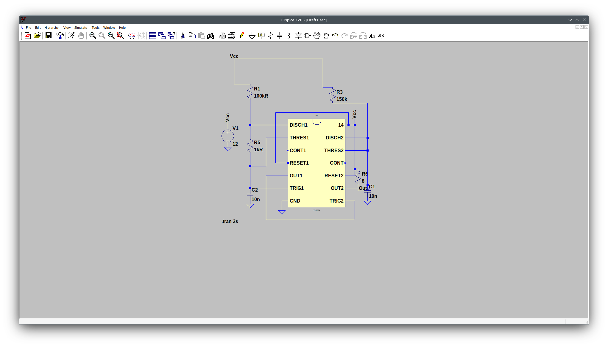
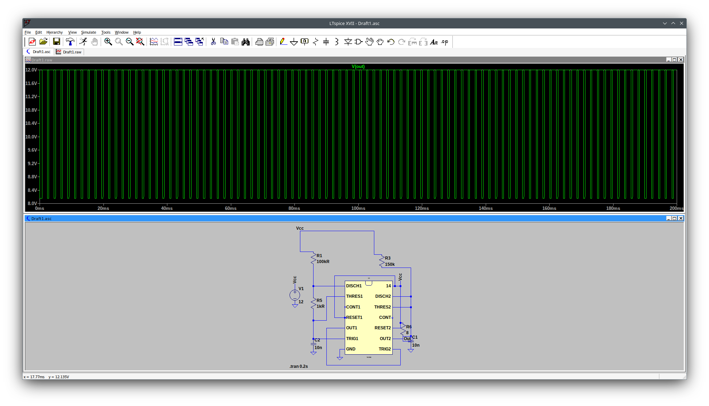

Hello folks,

this time I want to continue the series about simulation of synth modules with LTspice.

We start with another module from Tear Apart Tapes , found on etsy which we disect and reverse engineer, so that
we can build it with reverse polarity protection diodes...

We want to analyze https://www.etsy.com/de-en/listing/1535258595/dual-atari-punk-console-eurorack-module?show_sold_out_detail=1&ref=nla_listing_details[this module].

I found the schematic for the atari punk console, so thats easy to reverse engineer it

This time, it is not about op-amps or schmitt-trigger inverters bug about the universal very pupular timer-IC ne555,
but in its dual variant, ne556.

Since this module is missing in the LT-SPice Library, I looked around online and found it (see next line)...

link:./ne556_ltspice.zip[Download Link NE556]

