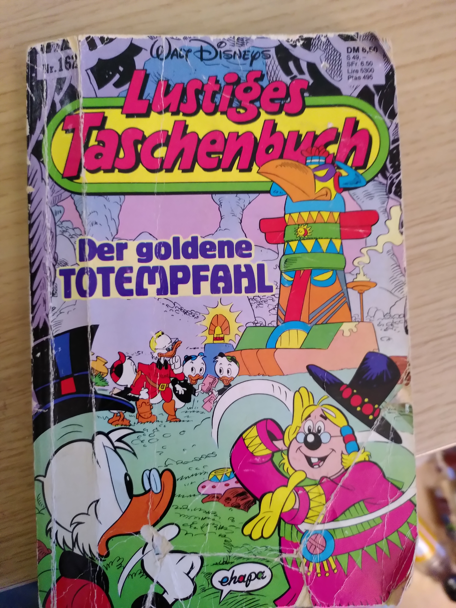
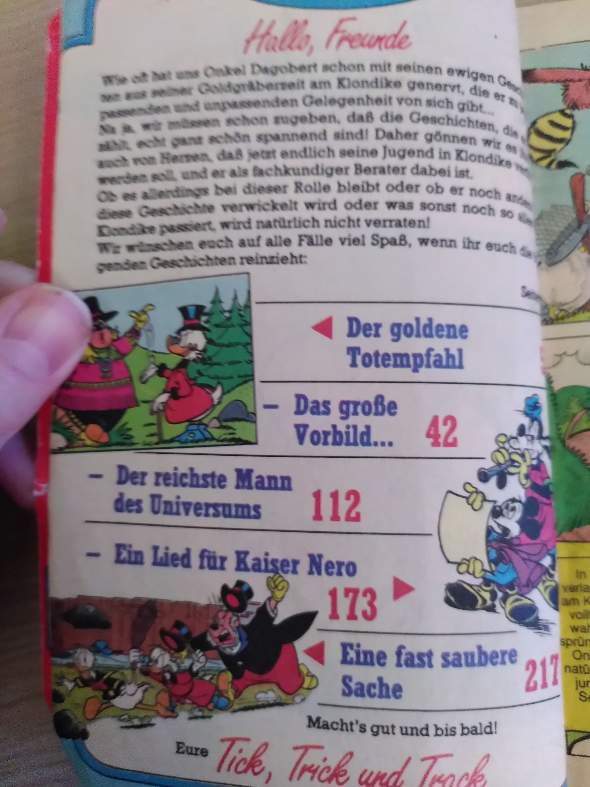
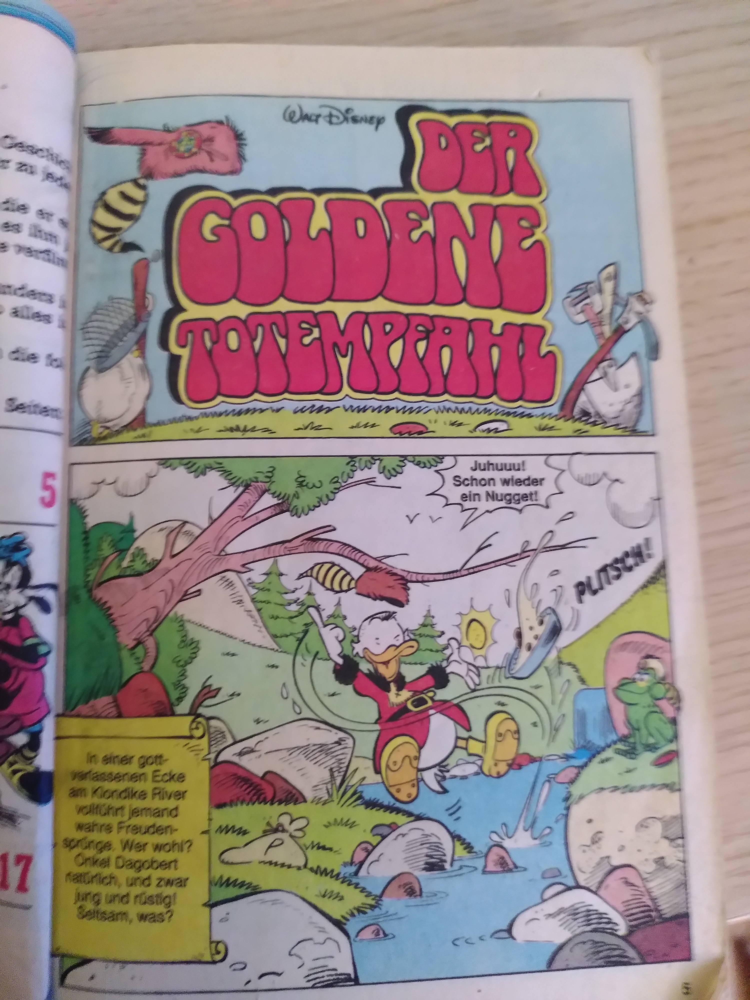
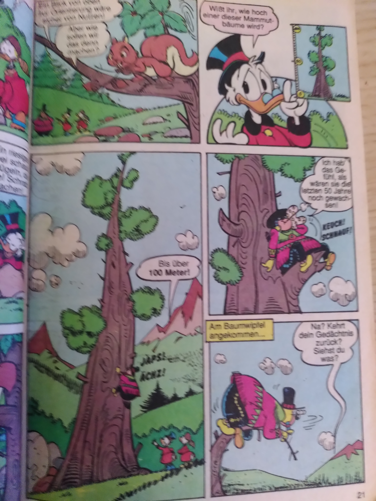
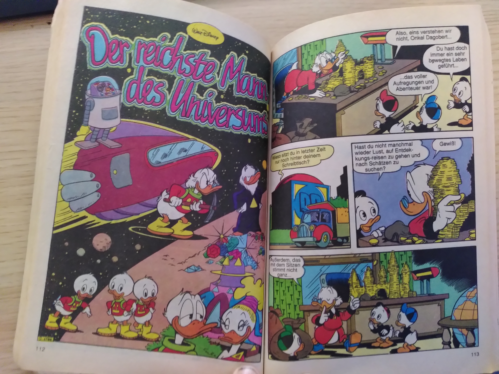
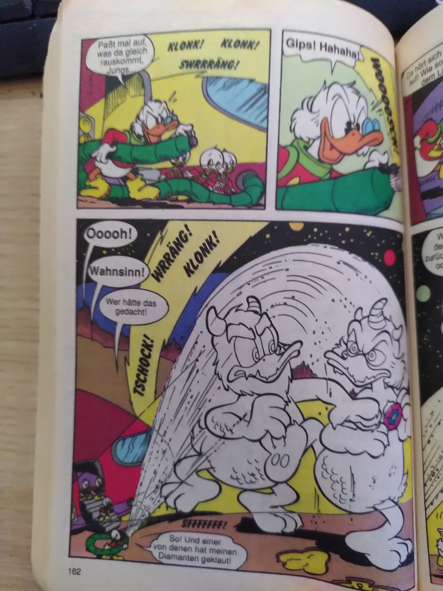

It is about time, to share another favorite of mine with you, and this is duckburg and the duck universe.
I take the LTB (Lustiges Taschenbuch) Nr. 162 as an example from the golden era of the comic series "Lustiges
Taschenbuch"

== Der goldene Totempfahl (The golden totem pole)

In the story "Der goldene Totempfahl" english the golden totem pole, uncle scrooge is making a movie about his life,
the story plays in the county of Dawson, where they are getting lost after a storm, they meet the indianer "großer Elch"
english "big moose" and are searching for the gold nuggets big moose saved for uncle scrooge back in time.
The movie ends with big moose ending as a movie star.

== Der reichste Mann des Universums (The richest men in universe)

In the story "Der reichest Mann des Universums" (the richest men in universe) uncle scrooge goes on a tour in space with
his kins (the nephew Donald Duck and grandnephews Tick, Trick and Track). They become involved in a contest of the richest
men in universe with some other guy out in space, who has a wish-machine... Due to uncle scrooge presence,
the sensitive balance of the ecosystem gets disturbed... (you have to read the story for yourself ;-) )

