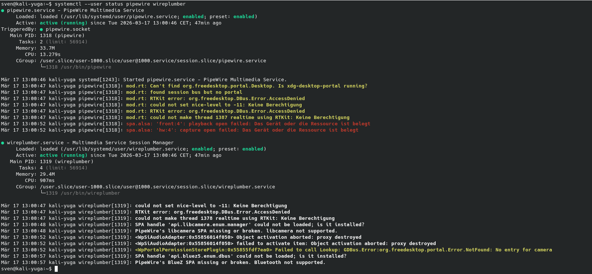

== Could not share my screen on Zoom, Google Meet or Discord - and how to solve it

If you are running **Debian 12 (Bookworm)** or a similar modern Linux distribution, you might have encountered a frustrating issue: you try to share your screen in a browser or a communication app, and nothing happens—or you get a cryptic error like `Failed to connect PipeWire context`.

The root cause is usually a disconnect between your desktop session and the **PipeWire** multimedia framework.

=== The Problem: Why it fails
Modern Linux desktops use **Wayland** for security, which requires a "Portal" to share your screen. If the PipeWire service or the session manager (**WirePlumber**) isn't running correctly within your user session, the portal cannot "see" your monitor.

The most common mistake? Trying to fix it as the `root` user. PipeWire is a **user-level service** and must be managed by your standard user account.

=== The Solution: Reconnecting the Wires

Follow these steps to reset your PipeWire stack. **Important:** Do not use `sudo` for these commands!

. **Switch to your standard user**
Make sure your terminal prompt shows your username (e.g., `sven@kali-yuga:~$`) and not `root#`.

. **Reload and Enable the Services**
Run the following commands to ensure the services start automatically every time you log in:

[source,bash]
----
systemctl --user daemon-reload
systemctl --user enable --now pipewire pipewire-pulse wireplumber
----

. **Restart the Session Manager**
If things are still glitchy, force a restart of the components:

[source,bash]
----
systemctl --user restart pipewire pipewire-pulse wireplumber
----

=== Troubleshooting: The "Bus" Error
If you see `Failed to connect to bus: Operation not permitted`, you are likely still trying to run the commands as `root`. Exit the root shell and try again as a normal user.

=== Persistence
By using the `enable` flag, these settings will persist across reboots. Your screen sharing should now work seamlessly in Zoom, Discord, and Google Meet.

[TIP]
====
If you are using a Chromium-based browser, make sure to visit `chrome://flags/#enable-webrtc-pipewire-capturer` and set it to **Enabled** for the best experience.
====

---

You can check the status with the following command it should look similar like below (green - enabled)

[source,bash]
----
systemctl --user restart pipewire pipewire-pulse wireplumber
----

