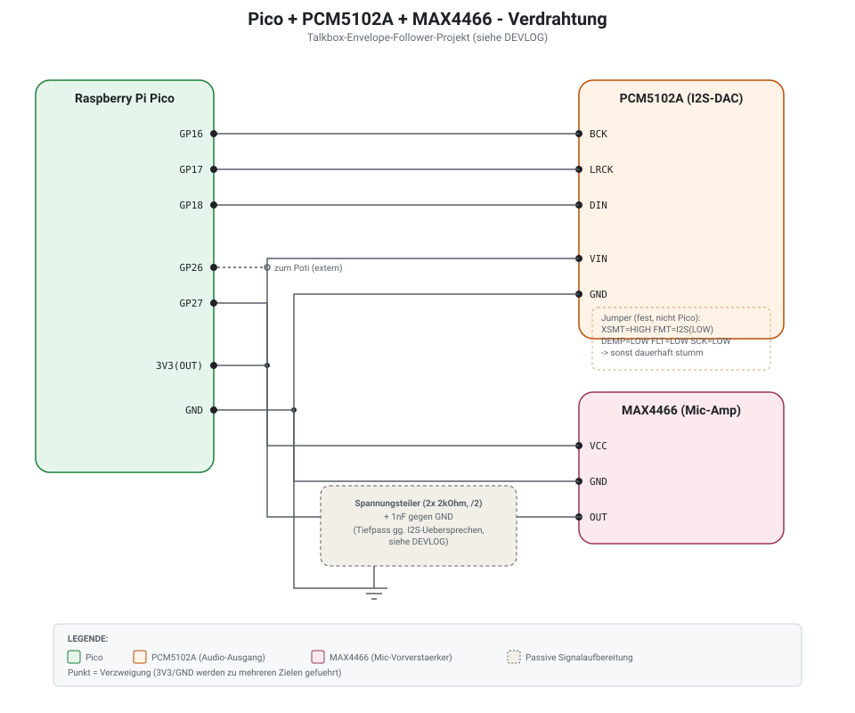
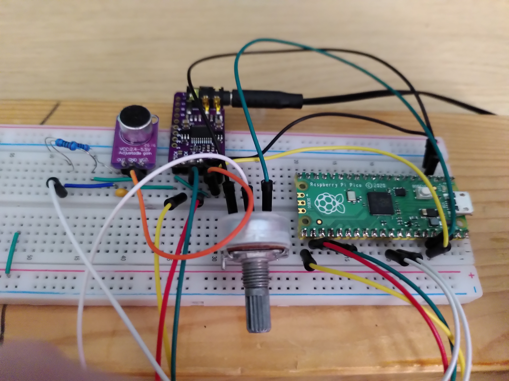

= A Vocoder on the RP2040: From Sine Wave to (Almost) a Talking Robot
:toc:
:toclevels: 2
:icons: font
:source-highlighter: rouge
:sectnums:


This article documents an ongoing debugging series. The vocoder
sounds considerably better than it did at the start, but "sounds
like a proper vocoder" hadn't been achieved yet at the time of
writing. I'll update the conclusion once that changes.


== The Plan

I'm building a small hardware vocoder on a generic Raspberry Pi Pico
(RP2040) — as a hardware port of my browser-based software vocoder
(Tone.js/Web Audio). Ingredients:

* An electret microphone with a MAX4466 preamp as the modulator input
* A PCM5102A I2S DAC for audio output
* A potentiometer for carrier pitch
* FreeRTOS, because I also wanted to use this project as practice
  with an RTOS on a microcontroller

The basic idea of a filter-bank vocoder is simple: split a modulator
signal (the voice) into several frequency bands, measure only the
loudness (envelope) per band, and use that to modulate the same
frequency bands of an artificial carrier tone. The result sounds like
a robot voice — *if* everything works together correctly. How much
"working together correctly" actually entails wasn't clear to me at
the start.

== Chapter 1: The Sine Wave That Wouldn't Cooperate

The very first test setup (still on a PicoADK board, before I
switched to generic hardware) was supposed to output nothing more
than a 440Hz tone over I2S — no ADC, no FreeRTOS, just the raw audio
signal path.

Two pitfalls right at the start:

* The onboard DAC (PCM5100A) has an `XSMT` pin (mute/unmute) that
  defaults to muted. Without explicitly setting it HIGH, the output
  stays silent — easy to mistake for a general I2S configuration
  error, since both failure modes look identical (silence).
* `pico-extras` (needed for `pico_audio_i2s`) has to be included via
  its own import file **before** `project()` in CMake, not via
  `add_subdirectory()` afterwards. Otherwise the configuration runs
  through without errors, but the library simply never materializes
  as a build target — resulting in a confusing `fatal error` for a
  file that demonstrably exists.

After that: a clean tone. On to the actual project.

== Chapter 2: From 1 Band to 12 — and the CPU Explodes

After a few intermediate steps (carrier oscillator, envelope follower
for a single band), came the jump to a full 12-band filter bank with
FreeRTOS. The first build ran — but the built-in timing measurement
showed something sobering:

[source]
----
avg=51156us  budget=5804us   (at 44.1kHz, 256 samples/buffer)
----

**8.6x too slow.** The filter bank alone took almost 200µs per
sample, while only 23µs were available.

=== The Dead End: `-O3` Made Absolutely No Difference

Before I understood why it was so slow, there was an annoying
detour: I first suspected a broken build (`-O0` instead of `-O3`).
But after repeated verification (embedding the build timestamp
directly in the diagnostic output, `strings *.elf | grep` for the
compiled diagnostic string), it was confirmed: **the measurements
were identical, down to the microsecond, with confirmed `-O0` and
confirmed `-O3`.**

That only made sense once it clicked: the RP2040 has no FPU. Every
single `float` operation becomes a call into a precompiled software
library routine (`__aeabi_fmul` & co.) — and those routines don't get
any faster through compiler optimization, because they're finished,
precompiled functions, not inline instructions that `-O3` could
improve.


TIP: If `-O0` and `-O3` produce exactly the same runtime on an
embedded target without an FPU, that's itself a signal of
softfloat-dominated code — not (just) evidence of a broken build.


=== The Fix: Q16.16 Fixed-Point

The solution was switching to Q16.16 fixed-point arithmetic (32-bit
signed integer, 16 integer/16 fractional bits) for everything running
in the sample hot path. Only the filter coefficient calculation
(`sinf`/`cosf`, once per band at startup) stayed in float — there,
readability matters more than speed.

[source,cpp]
----
using q16 = int32_t;
constexpr int kQ16Frac = 16;

inline q16 q16_mul(q16 a, q16 b) {
    return (q16)(((int64_t)a * (int64_t)b) >> kQ16Frac);
}
----

Result: 3.56x faster — noticeable, but not enough yet. The M0+ core
has a single-cycle 32×32→32-bit multiply, but *no* native 64-bit
multiply, which our `q16_mul()` needs — the compiler synthesizes that
across several instructions.

=== Three Free Optimizations

Instead of tweaking the architecture further, three purely algebraic
transformations helped, with zero loss of precision:

1. For our bandpass design (RBJ cookbook formula, constant 0dB peak
   gain), the coefficient `b1` is **structurally always exactly 0** —
   the multiplication `b1*x` was pure wasted compute.
2. Likewise, `b2 == -b0`, exactly — `b2*x` can be obtained from the
   `b0*x` already computed for `y`, just by flipping the sign,
   instead of computing a second multiplication.
3. The envelope smoothing `coeff*envelope + (1-coeff)*rectified` is
   algebraically identical to `envelope + (1-coeff)*(rectified-envelope)`
   — one multiplication instead of two.

Combined with lowering the sample rate to 22.05kHz (our highest band
frequency sits well below that, no loss of information), this got me
under budget — from 8.6x too slow to a comfortable margin.

== Chapter 3: FreeRTOS Teaches Me Something About Scheduling

=== One ADC, Two Consumers

The potentiometer and the microphone hang off the same RP2040 ADC
(just one hardware mux with a single "currently selected channel"
state). Two FreeRTOS tasks switching independently would rip the
channel out from under each other mid sample-loop — with no error
message, only visible as corrupted audio. Solution: only one task
ever touches the ADC; the raw value travels to a second task, which
handles the smoothing, via a queue.

=== The Potentiometer That Was Presumed Dead

Once everything else was working, the potentiometer simply didn't
respond to being turned at all — `carrierHz` stubbornly stayed at its
startup value. Diagnostic values showed: the raw pot reading came
through cleanly, but it never reached the task responsible for
smoothing it.

The cause was a textbook example of preemptive scheduling: the audio
task had **not a single genuine FreeRTOS blocking point** anywhere in
its loop — `take_audio_buffer()` from `pico_audio_i2s` is written for
bare metal, not FreeRTOS-aware blocking, presumably pure busy-spinning.
Under preemptive scheduling, the scheduler only switches to a
lower-priority task when the currently running task **genuinely**
blocks — not just when it "has nothing to do right now." Without a
real blocking point in the audio task, the pot task never got any CPU
time at all, and its own `vTaskDelay()` never elapsed.

[source,cpp]
----
// Forces the audio task into a real, brief blocking point where the
// scheduler CAN switch to the pot task.
if (++yieldCounter >= 2) {
    yieldCounter = 0;
    vTaskDelay(1);
}
----

One line of code, but one of the most instructive hours of the
entire project.

== Chapter 4: "Sounds Like a Modulated Hum"

With working timing and a working pot, came the most sobering part:
the vocoder produced a tone that got louder/quieter with speech — but
no recognizable speech. What followed was a long series of individual
tests, tried and discarded one after another:

* Narrowed the band range from 100–8000Hz to 200–4000Hz (telephone-
  band principle) → barely any difference
* Lowered Q from 4 to 2 (assumption: narrower = more sluggish) →
  wrong assumption
* Coupled attack/release per band to frequency → improvement, but not
  the breakthrough

The actual progress only came once I stopped testing my own guesses
and instead **used my working software vocoder as a reference.** Two
concrete assumptions were directly disproven: Q=2 was wrong (the
reference uses Q=5, higher than even my original value), and the band
narrowing went in the wrong direction (the reference uses
90–6000Hz, closer to the original range).

=== A Sawtooth Doesn't Reach the Formants

A sawtooth carrier has a 1/n harmonic rolloff. At a fundamental
frequency of, say, 200Hz, the harmonic at 2kHz is already the 10th
overtone — with strongly reduced energy. But that's exactly where
(800Hz–3kHz) the formants F2/F3 live, which distinguish vowels from
one another. The analysis correctly detected different energy per
band, but the carrier had nothing left to shape there. Result:
loudness modulates, timbre stays the same — a "modulated hum."

Fix: a narrow pulse train (20% duty cycle) instead of a sawtooth —
historically the standard carrier for vocoders, for exactly this
reason. A narrow pulse has a much more even, broadband harmonic
spectrum.

=== A Real Compressor Instead of Hard Clipping

My reference implementation uses a proper compressor (threshold,
ratio, attack/release) instead of a hard clip on the summed output. A
hard clip cuts off signal peaks abruptly (harsh/metallic), a
compressor squeezes them down gently and preserves more fine detail.
In fixed-point, this could be built using the envelope-following
infrastructure I already had — just one division per sample for the
dynamically changing compression gain, everything else precomputed.

=== Voiced/Unvoiced Detection: Two Attempts

A static noise ratio mixed into the carrier (a fixed percentage of
noise blended with the pulse train) can't serve vowels and consonants
well at the same time — vowels need a clean tonal carrier, consonants
need noise energy. My first attempt (zero-crossing rate) never had
properly calibrated thresholds. The reference implementation showed a
proven alternative: split the signal around 1.5kHz into a low and
high component, track a smoothed level for each, and use the
difference as the decision.

The first calibrated threshold had a reasoning error: I had assumed
the high-frequency component had to *exceed* the low-frequency one in
absolute terms. Real measurements showed otherwise: sibilants only
reach ~20–26% of the low-band level, never 100% — sibilants are
inherently quieter than vowels, acoustically. The threshold needed to
be defined as a *ratio*, not a comparison between two absolute
quantities.

== Chapter 5: The Second Core

An externally shared reference vocoder on a Teensy 3.6 pointed me
toward what should have been the obvious idea all along: **the RP2040
has two cores, and I was only using one.**

The key design decision here: Core1 runs entirely *outside* of
FreeRTOS, as a raw `pico_multicore` loop — no second RTOS instance
introducing a whole new class of concurrency risk, after everything
I'd already learned from ADC sharing and priority starvation. Just two
handshake signals per buffer (not per sample):

[source,cpp]
----
// Core0: preparation (ADC read, carrier build) -> fill shared arrays
multicore_fifo_push_blocking(1);   // start Core1
// Core0 computes its own half SIMULTANEOUSLY
multicore_fifo_pop_blocking();     // wait for Core1's done signal
----

Result: band-processing time dropped to a bit more than half — while
running 12 bands instead of 10 at the same time. Plenty of headroom
for future experiments.

When the sound still wasn't convincing despite everything, the
two-core synchronization itself became a suspect — a compiler could
in theory reorder writes to ordinary (non-`volatile`) global arrays
around the FIFO handshake. A diagnostic switch (`kUseSecondCore`)
that pulls Core1 entirely out of the signal path for testing showed:
identical result with and without the second core. Suspicion cleared
— but at least conclusively ruled out rather than merely assumed.

== Chapter 6: Where Does the Energy Go?

The most revealing diagnostic step so far: instead of only exposing
*aggregate* values (sum, overall envelope), I printed the envelope of
**each of the 12 bands individually**.

[source]
----
bands[0..11] = 40 41 22 16 12 8 5 3 0 1 0 1
----

A smooth, monotonically decaying curve from band 0 (90Hz) down to
about band 7 (~1.5kHz), then essentially nothing — regardless of
whether "iii" or "uuu" was spoken. That doesn't look like a software
bug (which would tend to look jumpy/irregular), but like a genuine
low-pass characteristic somewhere in the *analog* signal path.

=== The Voltage Divider That Shifted the Operating Point

After the mic trimmer was already at its (presumed) limit and the
signal was still clipping, I added an external voltage divider for
extra attenuation. That introduced a new problem: the divider doesn't
just attenuate the AC amplitude, it also shifts the *DC operating
point* along with it — but my code still assumed the original ADC
midpoint.

Instead of recalculating the new operating point by hand (which I did
at first, and which would have been wrong again the next time a
component changed), the code now continuously tracks the DC component
itself, via a very slow low-pass filter:

[source,cpp]
----
// ~300ms time constant - well below the lowest band frequency
// (90Hz), continuously tracks the DC bias regardless of the
// exact analog wiring.
g_micDcState += q16_mul(g_micDcUpdateRate, rawQ16 - g_micDcState);
return rawQ16 - g_micDcState;
----

That was the third fix in a row for the same underlying issue — time
to solve the problem structurally instead of patching it point by
point.

=== Gain Costs Bandwidth

The MAX4466 datasheet supplies a concrete number for the remaining
low-pass character: a gain-bandwidth product of 600kHz, with the
trimmer's gain range spanning 25×–125×. At 125x gain, only about
**4.8kHz** of usable bandwidth remains — a fundamental op-amp
trade-off, not a misconfiguration. A comparison test without the
voltage divider confirmed it: the band pattern widened noticeably
(activity reaching band 7–8 instead of band 3), but not completely —
both effects (divider loading and the gain-bandwidth trade-off)
appear to be stacking on top of each other.

== Where Things Stand

What's now working reliably and has been individually verified:

* CPU budget: from 8.6x too slow to a ~39% margin
* FreeRTOS priority-starvation bug fixed
* Compressor instead of hard clipping
* Two-core split of the filter bank (timing AND correctness verified)
* Voiced/unvoiced detection cleanly separates vowels from sibilants
* Noise gate with hysteresis (no more chattering)
* Mic operating point self-calibrating

Still open: the signal path audibly loses energy in the upper
frequency bands — likely a combination of the gain-bandwidth
trade-off at the mic preamp and the extra load from the voltage
divider. The next step is to lower the gain at the analog front end
itself (instead of keeping it as high as possible on the trimmer and
only compensating for the resulting overdrive afterward with a
voltage divider) — and then see whether the upper bands finally come
to life.

== Lessons That Apply Beyond This Project

* **On chips without an FPU, identical `-O0`/`-O3` runtimes are a
  finding in themselves**, not just a hint of a broken build.
* **Preemptive scheduling only switches on genuine blocking, not on
  idleness.** A task that never blocks starves every lower-priority
  task — regardless of tick rate.
* **A working reference system is worth more than ten of your own
  theories.** The single biggest jump in progress on this project
  didn't come from clever debugging, but from giving up on guessing
  and instead copying a known-working implementation step by step.
* **A voltage divider shifts not just the amplitude, but the
  operating point too.** And: higher gain on an op-amp fundamentally
  costs bandwidth — that's physics, not a bug.
* **Measure before you guess — even when it's tedious.** Nearly every
  major breakthrough in this project came from a new diagnostic
  number, not a new idea.

To be continued, once the vocoder actually sounds like a vocoder.