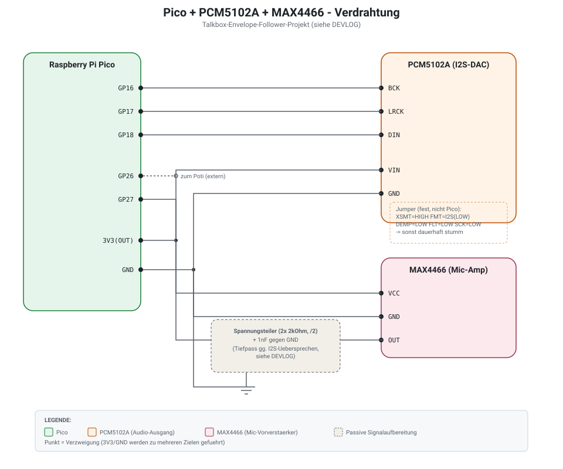
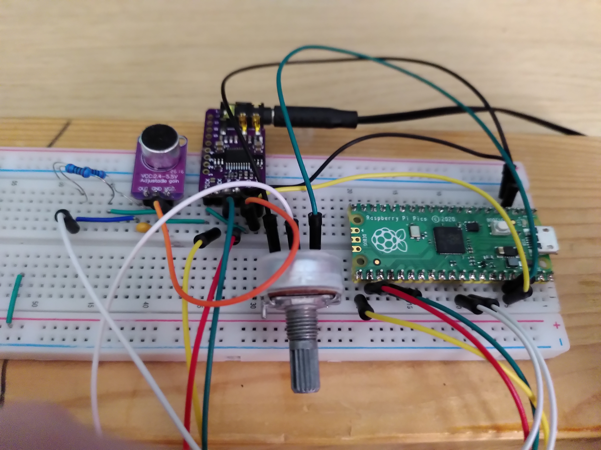

= A Vocoder on the RP2040: From Sine Wave to (Almost) a Talking Robot
:toc:
:toclevels: 2
:icons: font
:source-highlighter: rouge
:sectnums:


This article documents an ongoing debugging series. As of this
update, the project has gone through a full detour (scaling back to
a simpler instrument, then building back up) and one genuinely
surprising root cause (a hardware ground loop, not a software bug).
"Sounds like a proper vocoder" still hasn't been achieved at the time
of writing — see the current status section near the end.


== The Plan

I'm building a small hardware vocoder on a generic Raspberry Pi Pico
(RP2040) — as a hardware port of my browser-based software vocoder
(Tone.js/Web Audio). Ingredients:

* An electret microphone with a MAX4466 preamp as the modulator input
* A PCM5102A I2S DAC for audio output
* A potentiometer for carrier pitch
* FreeRTOS, because I also wanted to use this project as practice
  with an RTOS on a microcontroller

The basic idea of a filter-bank vocoder is simple: split a modulator
signal (the voice) into several frequency bands, measure only the
loudness (envelope) per band, and use that to modulate the same
frequency bands of an artificial carrier tone. The result sounds like
a robot voice — *if* everything works together correctly. How much
"working together correctly" actually entails wasn't clear to me at
the start.

== Chapter 1: The Sine Wave That Wouldn't Cooperate

The very first test setup (still on a PicoADK board, before I
switched to generic hardware) was supposed to output nothing more
than a 440Hz tone over I2S — no ADC, no FreeRTOS, just the raw audio
signal path.

Two pitfalls right at the start:

* The onboard DAC (PCM5100A) has an `XSMT` pin (mute/unmute) that
  defaults to muted. Without explicitly setting it HIGH, the output
  stays silent — easy to mistake for a general I2S configuration
  error, since both failure modes look identical (silence).
* `pico-extras` (needed for `pico_audio_i2s`) has to be included via
  its own import file **before** `project()` in CMake, not via
  `add_subdirectory()` afterwards. Otherwise the configuration runs
  through without errors, but the library simply never materializes
  as a build target — resulting in a confusing `fatal error` for a
  file that demonstrably exists.

After that: a clean tone. On to the actual project.

== Chapter 2: From 1 Band to 12 — and the CPU Explodes

After a few intermediate steps (carrier oscillator, envelope follower
for a single band), came the jump to a full 12-band filter bank with
FreeRTOS. The first build ran — but the built-in timing measurement
showed something sobering:

[source]
----
avg=51156us  budget=5804us   (at 44.1kHz, 256 samples/buffer)
----

**8.6x too slow.** The filter bank alone took almost 200µs per
sample, while only 23µs were available.

=== The Fix: Q16.16 Fixed-Point

The solution was switching to Q16.16 fixed-point arithmetic (32-bit
signed integer, 16 integer/16 fractional bits) for everything running
in the sample hot path. Only the filter coefficient calculation
(`sinf`/`cosf`, once per band at startup) stayed in float — there,
readability matters more than speed.

[source,cpp]
----
using q16 = int32_t;
constexpr int kQ16Frac = 16;

inline q16 q16_mul(q16 a, q16 b) {
    return (q16)(((int64_t)a * (int64_t)b) >> kQ16Frac);
}
----

Result: 3.56x faster — noticeable, but not enough yet. The M0+ core
has a single-cycle 32×32→32-bit multiply, but *no* native 64-bit
multiply, which our `q16_mul()` needs — the compiler synthesizes that
across several instructions.

=== Three Free Optimizations

Instead of tweaking the architecture further, three purely algebraic
transformations helped, with zero loss of precision:

1. For our bandpass design (RBJ cookbook formula, constant 0dB peak
   gain), the coefficient `b1` is **structurally always exactly 0** —
   the multiplication `b1*x` was pure wasted compute.
2. Likewise, `b2 == -b0`, exactly — `b2*x` can be obtained from the
   `b0*x` already computed for `y`, just by flipping the sign,
   instead of computing a second multiplication.
3. The envelope smoothing `coeff*envelope + (1-coeff)*rectified` is
   algebraically identical to `envelope + (1-coeff)*(rectified-envelope)`
   — one multiplication instead of two.

Combined with lowering the sample rate to 22.05kHz (our highest band
frequency sits well below that, no loss of information), this got me
under budget — from 8.6x too slow to a comfortable margin.

== Chapter 3: FreeRTOS Teaches Me Something About Scheduling

=== One ADC, Two Consumers

The potentiometer and the microphone hang off the same RP2040 ADC
(just one hardware mux with a single "currently selected channel"
state). Two FreeRTOS tasks switching independently would rip the
channel out from under each other mid sample-loop — with no error
message, only visible as corrupted audio. Solution: only one task
ever touches the ADC; the raw value travels to a second task, which
handles the smoothing, via a queue.

=== The Potentiometer That Was Presumed Dead

Once everything else was working, the potentiometer simply didn't
respond to being turned at all — `carrierHz` stubbornly stayed at its
startup value. Diagnostic values showed: the raw pot reading came
through cleanly, but it never reached the task responsible for
smoothing it.

The cause was a textbook example of preemptive scheduling: the audio
task had **not a single genuine FreeRTOS blocking point** anywhere in
its loop — `take_audio_buffer()` from `pico_audio_i2s` is written for
bare metal, not FreeRTOS-aware blocking, presumably pure busy-spinning.
Under preemptive scheduling, the scheduler only switches to a
lower-priority task when the currently running task **genuinely**
blocks — not just when it "has nothing to do right now." Without a
real blocking point in the audio task, the pot task never got any CPU
time at all, and its own `vTaskDelay()` never elapsed.

[source,cpp]
----
// Forces the audio task into a real, brief blocking point where the
// scheduler CAN switch to the pot task.
if (++yieldCounter >= 2) {
    yieldCounter = 0;
    vTaskDelay(1);
}
----

One line of code, but one of the most instructive hours of the
entire project.

== Chapter 4: "Sounds Like a Modulated Hum"

With working timing and a working pot, came the most sobering part:
the vocoder produced a tone that got louder/quieter with speech — but
no recognizable speech. What followed was a long series of individual
tests, tried and discarded one after another:

* Narrowed the band range from 100–8000Hz to 200–4000Hz (telephone-
  band principle) → barely any difference
* Lowered Q from 4 to 2 (assumption: narrower = more sluggish) →
  wrong assumption
* Coupled attack/release per band to frequency → improvement, but not
  the breakthrough

The actual progress only came once I stopped testing my own guesses
and instead **used my working software vocoder as a reference.** Two
concrete assumptions were directly disproven: Q=2 was wrong (the
reference uses Q=5, higher than even my original value), and the band
narrowing went in the wrong direction (the reference uses
90–6000Hz, closer to the original range).

=== A Sawtooth Doesn't Reach the Formants

A sawtooth carrier has a 1/n harmonic rolloff. At a fundamental
frequency of, say, 200Hz, the harmonic at 2kHz is already the 10th
overtone — with strongly reduced energy. But that's exactly where
(800Hz–3kHz) the formants F2/F3 live, which distinguish vowels from
one another. The analysis correctly detected different energy per
band, but the carrier had nothing left to shape there. Result:
loudness modulates, timbre stays the same — a "modulated hum."

Fix: a narrow pulse train (20% duty cycle) instead of a sawtooth —
historically the standard carrier for vocoders, for exactly this
reason. A narrow pulse has a much more even, broadband harmonic
spectrum.

=== A Real Compressor Instead of Hard Clipping

My reference implementation uses a proper compressor (threshold,
ratio, attack/release) instead of a hard clip on the summed output. A
hard clip cuts off signal peaks abruptly (harsh/metallic), a
compressor squeezes them down gently and preserves more fine detail.
In fixed-point, this could be built using the envelope-following
infrastructure I already had — just one division per sample for the
dynamically changing compression gain, everything else precomputed.

=== Voiced/Unvoiced Detection: Two Attempts

A static noise ratio mixed into the carrier (a fixed percentage of
noise blended with the pulse train) can't serve vowels and consonants
well at the same time — vowels need a clean tonal carrier, consonants
need noise energy. My first attempt (zero-crossing rate) never had
properly calibrated thresholds. The reference implementation showed a
proven alternative: split the signal around 1.5kHz into a low and
high component, track a smoothed level for each, and use the
difference as the decision.

The first calibrated threshold had a reasoning error: I had assumed
the high-frequency component had to *exceed* the low-frequency one in
absolute terms. Real measurements showed otherwise: sibilants only
reach ~20–26% of the low-band level, never 100% — sibilants are
inherently quieter than vowels, acoustically. The threshold needed to
be defined as a *ratio*, not a comparison between two absolute
quantities.

== Chapter 5: The Second Core

An externally shared reference vocoder on a Teensy 3.6 pointed me
toward what should have been the obvious idea all along: **the RP2040
has two cores, and I was only using one.**

The key design decision here: Core1 runs entirely *outside* of
FreeRTOS, as a raw `pico_multicore` loop — no second RTOS instance
introducing a whole new class of concurrency risk, after everything
I'd already learned from ADC sharing and priority starvation. Just two
handshake signals per buffer (not per sample):

[source,cpp]
----
// Core0: preparation (ADC read, carrier build) -> fill shared arrays
multicore_fifo_push_blocking(1);   // start Core1
// Core0 computes its own half SIMULTANEOUSLY
multicore_fifo_pop_blocking();     // wait for Core1's done signal
----

Result: band-processing time dropped to a bit more than half — while
running 12 bands instead of 10 at the same time. Plenty of headroom
for future experiments.

When the sound still wasn't convincing despite everything, the
two-core synchronization itself became a suspect — a compiler could
in theory reorder writes to ordinary (non-`volatile`) global arrays
around the FIFO handshake. A diagnostic switch (`kUseSecondCore`)
that pulls Core1 entirely out of the signal path for testing showed:
identical result with and without the second core. Suspicion cleared
— but at least conclusively ruled out rather than merely assumed.

== Chapter 6: Where Does the Energy Go?

The most revealing diagnostic step so far: instead of only exposing
*aggregate* values (sum, overall envelope), I printed the envelope of
**each of the 12 bands individually**.

[source]
----
bands[0..11] = 40 41 22 16 12 8 5 3 0 1 0 1
----

A smooth, monotonically decaying curve from band 0 (90Hz) down to
about band 7 (~1.5kHz), then essentially nothing — regardless of
whether "iii" or "uuu" was spoken. That doesn't look like a software
bug (which would tend to look jumpy/irregular), but like a genuine
low-pass characteristic somewhere in the *analog* signal path.

=== The Voltage Divider That Shifted the Operating Point

After the mic trimmer was already at its (presumed) limit and the
signal was still clipping, I added an external voltage divider for
extra attenuation. That introduced a new problem: the divider doesn't
just attenuate the AC amplitude, it also shifts the *DC operating
point* along with it — but my code still assumed the original ADC
midpoint.

Instead of recalculating the new operating point by hand (which I did
at first, and which would have been wrong again the next time a
component changed), the code now continuously tracks the DC component
itself, via a very slow low-pass filter:

[source,cpp]
----
// ~300ms time constant - well below the lowest band frequency
// (90Hz), continuously tracks the DC bias regardless of the
// exact analog wiring.
g_micDcState += q16_mul(g_micDcUpdateRate, rawQ16 - g_micDcState);
return rawQ16 - g_micDcState;
----

That was the third fix in a row for the same underlying issue — time
to solve the problem structurally instead of patching it point by
point.

=== Gain Costs Bandwidth

The MAX4466 datasheet supplies a concrete number for the remaining
low-pass character: a gain-bandwidth product of 600kHz, with the
trimmer's gain range spanning 25×–125×. At 125x gain, only about
**4.8kHz** of usable bandwidth remains — a fundamental op-amp
trade-off, not a misconfiguration. A comparison test without the
voltage divider confirmed it: the band pattern widened noticeably
(activity reaching band 7–8 instead of band 3), but not completely —
both effects (divider loading and the gain-bandwidth trade-off)
appear to be stacking on top of each other.

At this point I'd verified the following as solid, working
foundations: CPU budget with room to spare, the priority-starvation
fix, a proper compressor, a working two-core split, voiced/unvoiced
detection that cleanly separated vowels from sibilants, and a
self-calibrating mic input. What remained open was the upper-band
energy loss above — and, as it turned out, something else entirely
that none of this had touched yet.

== Chapter 7: Cutting Scope on Purpose

After the CPU fight, the FreeRTOS scheduling lesson, the reference-
vocoder correction, the two-core build-out, and the gain-bandwidth
investigation — I stepped back and admitted the obvious: I'd been
carrying too many moving parts (12 bands, voiced/unvoiced detection,
a two-core split, a compressor, a gate) into every single debugging
session. Any given "still doesn't sound right" could have come from
any of them, or from an interaction between several. That's a bad
position to debug from.

So I deliberately cut scope: instead of a 12-band vocoder, build a
1-band **envelope-follower "talkbox"** — one bandpass, one envelope,
straight amplitude modulation of an oscillator, no spectral shaping
at all. No vocoder effect, but a clearly audible, testable result:
the tone gets louder and quieter with speech. Almost the entire
existing infrastructure (oscillator, pot handling, self-calibrating
mic input, compressor, gate) carried over unchanged; the 12-band
filter bank and voiced/unvoiced detection were simply not needed
for this simpler target and got shelved (not deleted — the files
stayed in the repo as reference).

This is the kind of decision that feels like giving something up in
the moment and turns out, in hindsight, to be the thing that actually
made progress possible.

== Chapter 8: An Electrical Ghost in the Machine

With the simpler talkbox running, a new symptom showed up that had
nothing to do with vowels or formants at all: the output would
occasionally start screeching, and once it started, it wouldn't stop
on its own — even with no one talking. This turned into the single
longest debugging thread of the whole project, and the eventual
answer had nothing to do with software.

=== Several Plausible, Wrong Explanations

In roughly the order I chased them down:

* **Acoustic feedback** — ruled out immediately: monitoring was over
  headphones, so there was no air path from speaker back to mic at
  all.
* **A low-pass filter I'd added** to soften the carrier's harsh upper
  harmonics turned out to reliably trigger the same "stuck on"
  behavior. Disabling it (behind a compile-time toggle) fixed the
  runaway — but *why* a filter sitting entirely downstream of the
  gate's decision logic would affect that decision was never fully
  explained. Rather than keep chasing an unexplained side effect, I
  addressed the actual goal (harsh carrier) at the source instead:
  widening the pulse's duty cycle from 20% to 50%, which reduces
  high-harmonic content without adding a new filter stage at all.
* **A CPU-timing anomaly** looked promising for a while — buffer
  processing time visibly rose during the runaway episodes. It turned
  out to be a red herring with a mundane explanation: the compressor's
  gain calculation includes a 64-bit integer division, which only
  gets exercised when the signal is loud enough to trigger compression
  — exactly when the runaway was active. More compute time during
  loud passages is expected; it wasn't a symptom of anything electrical
  breaking.
* **Gate threshold miscalibration** was real, just not the root cause
  of the runaway. A single fixed gate threshold that happened to sit
  right on top of the ambient noise floor caused audible chattering —
  fixed with hysteresis (separate open/close thresholds, a Schmitt-
  trigger pattern), the same fix that had worked for this exact
  problem back in the 12-band project.

=== The One Test That Actually Isolated It

The test that finally nailed the mechanism: pull the DAC's I2S data
line to ground — silencing real audio output — while everything else
kept running. The mic side went completely quiet. Reconnect the line,
and the runaway came back, specifically at certain carrier pitches.
That's about as clean a confirmation of **electrical crosstalk from
the DAC output into the mic input** as you can get without an
oscilloscope.

Rerouting the DAC's data line away from the mic signal path on the
breadboard helped substantially — but not completely; a band near the
low end of the pitch range remained troublesome. Narrowing the usable
pitch range worked around it, but that's containment, not a fix, and
I said so explicitly at the time.

=== The Actual Root Cause: A Ground Loop

Growing suspicious of the breadboard itself (after ruling out
everything downstream of it), I measured resistance between the
ground pins of the Pico, the mic preamp, and the DAC — with the board
unpowered, so there was no risk of a short. The result: **3–4Ω**,
where a clean connection should read close to 0Ω.

That's the whole story right there. A shared, not-quite-low-enough
ground path between a loud output stage and a highly sensitive input
stage (the MAX4466 can run at up to 125x gain) turns any current the
DAC draws into a small voltage ripple *on the ground reference itself*
— which the mic preamp then dutifully amplifies as if it were signal.
It explains the pitch-dependence (different tones draw different
current), the self-sustaining nature (louder output → more ground
ripple → keeps the gate open → stays loud), and why turning down
volume alone never fixed it (same current, same resistor, same
ripple, regardless of how "quiet" the signal nominally is).

The fix was almost anticlimactic after two weeks of software-side
detours: **star grounding** — individual, direct wires from a single
ground point to each IC, instead of relying on the breadboard's own
rail. Verified over the full original pitch range with no recurrence.

I want to be honest about the shape of this story: several fixes I
made along the way (the duty-cycle change, the gate hysteresis, the
pitch-range narrowing) were reasonable and stayed in the design — but
none of them were *the* fix, and I said that plainly in my own notes
at each step rather than declaring victory prematurely. The actual
fix took a five-minute resistance measurement that I could have done
in week one.

== Chapter 9: Back to the Vocoder, One Step at a Time

With the electrical ground cleared up, it was time to rebuild toward
an actual multi-band vocoder — deliberately in a separate branch, and
deliberately in small steps this time, going 1 → 3 → 6 bands rather
than jumping straight back to 12.

=== The CPU Budget Lesson, Again

Six bands (each needing *two* filters — analysis and synthesis,
unlike the talkbox's single filter) at full 44.1kHz sample rate blew
straight through the CPU budget again (`avg=6600us` against a
`5804us` budget) — the exact same category of problem as Chapter 2,
just triggered by a different parameter. The fix was the same one,
too: drop the sample rate to 22.05kHz. With a highest band at 2kHz,
Nyquist at 11kHz leaves plenty of headroom.

=== Considering (and Rejecting) a Different Mic Preamp

Partway through, I considered switching from the MAX4466 to the
MAX9814 — a mic preamp with a flat 20Hz–20kHz response regardless of
gain setting, which would sidestep the gain-bandwidth trade-off from
Chapter 6 entirely. The datasheet confirms it: the MAX9814 splits its
gain across multiple internal stages instead of one high-gain op-amp,
which is exactly why it doesn't pay the same bandwidth penalty.

But the MAX9814 also has built-in automatic gain control (AGC) — and
AGC actively works to flatten out the very loudness dynamics an
envelope-follower vocoder depends on as its primary signal. This
was the reason I'd chosen the MAX4466 over it at the very start of
the project, and revisiting it now didn't change that trade-off: more
bandwidth, but at the risk of fighting the AGC for the thing that
actually carries the vocoder's information. I decided against the
swap and instead widened the existing voltage divider (2kΩ/2kΩ →
12kΩ/12kΩ, same attenuation ratio, five times less loading on the
op-amp's output) — confirmed via the same per-band diagnostic that
meaningfully more energy now reaches the upper bands than before.

=== A Consistent, Non-Obvious Imbalance

With band-by-band diagnostics back in place, a pattern showed up that
held steady across every vowel tested: the lowest band consistently
carried roughly 5x the energy of the highest band, *regardless* of
what was being said. That's not vowel-specific information — it's
just the natural spectral tilt of the human voice source, which rolls
off with frequency independent of vowel identity. With that large and
constant an imbalance, whatever vowel-dependent shifts existed between
the upper bands were getting perceptually swamped by the dominant low
band in the summed output.

The fix: a fixed, per-band output gain applied *after* synthesis,
increasing with frequency, to compensate for the natural tilt. This
is a different mechanism from an experiment I'd tried and abandoned
back in the 12-band project (a uniform envelope boost applied equally
to every band) — a uniform multiplier changes nothing about the
*relative* balance between bands, which is exactly why it made no
difference back then. A per-band, increasing gain does.

== Chapter 10: Q Wasn't the Only Missing Piece

With the CPU budget fixed and the output rebalanced, I finally tested
a parameter that had sat untouched through the entire project: filter
Q. The known-working software reference uses Q=5; the hardware build
had been running at Q=2 the whole time — considerably wider, less
selective bands.

Raising Q to 5 produced the cleanest analysis separation between
vowels seen in the whole project — genuinely distinct, repeatable
ratios between bands depending on what was spoken. And yet: still no
audible timbral difference. That gap between "the numbers clearly
differ" and "it sounds the same" turned out to be the most instructive
puzzle of this whole chapter.

=== Isolating Analysis from Synthesis

Rather than keep comparing vowels, I isolated a more basic question:
does the *synthesis* side even sound different from band to band, on
its own, independent of any voice input? A simple solo switch — mute
every band except one — made this directly testable.

The result at Q=5: soloing the lowest band produced near total
silence; soloing a band a few steps up produced sound. The analysis
side of that low band was picking up real signal; its synthesis side
was getting essentially nothing to shape.

The reason is mechanical, not a bug: a periodic pulse-train carrier
only has energy at discrete harmonics, spaced by its fundamental
frequency, with large gaps in between. At Q=5, a band's passband is
narrow enough that whether any given harmonic happens to fall inside
it is close to a coin flip, depending on the exact carrier pitch —
and that coin flip has nothing to do with the vowel being analyzed.
Turning Q down again (as the earlier Q=2 setting effectively did)
"fixes" this by widening every band enough to usually catch
*something* — but then the windows overlap so much that everything
picks up the same dominant fundamental, and the bands sound similar
regardless of vowel for the opposite reason.

The fix: **decouple analysis and synthesis Q.** Keep analysis narrow
(Q=5, for clean formant separation), but reconfigure each band's
*synthesis* filter separately with a much wider Q (1.2) — trading
frequency selectivity on the output side for reliable coverage,
independent of the input side's precision.

=== Even a Wide Synthesis Filter Isn't Enough on Its Own

With decoupled Q, both a low and a high band were now clearly audible
— but still not clearly *different* from each other in character.
This points at something more fundamental than a filter-width
parameter: a purely periodic carrier, no matter how you tune Q, has
fundamentally sparse spectral content. There's no Q setting that
resolves the tension between "narrow enough to differentiate" and
"dense enough to reliably excite every band" when the excitation
signal itself only exists at a handful of discrete frequencies.

The textbook answer for this is the same one I'd already used for
consonants back in Chapter 4: mix noise into the carrier. Noise has
continuous energy across the whole spectrum, so every band reliably
gets real, distinguishable content to shape, independent of carrier
pitch. Blending a fixed 40% noise into the carrier (ahead of full
voiced/unvoiced switching, which is the natural next refinement)
immediately ran into one more constant-Q subtlety: **white noise
isn't neutral in a constant-Q filter bank.** Since bandwidth scales
with center frequency at a fixed Q, a higher band has a wider *absolute*
bandwidth and therefore passes proportionally more flat-spectrum noise
energy than a lower one — a highest band came through noticeably
louder than the lowest, purely from filter geometry, nothing to do
with the voice signal. The fix, matching the well-known technique from
analog synthesizers: shape the noise with a simple one-pole low-pass
before mixing it in, giving it a "pink" tilt (energy per octave rather
than per hertz) that matches how the bands themselves are spaced.

This is where the project stands as I write this: solo-band tests
with shaped noise still in progress, aiming for bands that are both
audible in comparable proportion *and* audibly distinct from one
another — the actual prerequisite for a vowel comparison to mean
anything.

== Current Status

What's confirmed, stable, and individually verified as of this
update:

* The electrical root cause of the runaway feedback (a ground loop)
  is fixed via star grounding, confirmed over the full original pitch
  range
* CPU budget is healthy again at 6 bands / 22.05kHz
* The natural low-frequency dominance of voice is compensated with a
  per-band output gain
* Mic preamp loading reduced (12kΩ/12kΩ divider), confirmed to pass
  more high-frequency energy than before
* Analysis and synthesis Q are decoupled, addressing a structural
  mismatch that had gone unnoticed through several earlier tuning
  passes

Still open, and the actual subject of the current work: getting the
carrier's spectral content (now a pulse/noise blend) properly
balanced across bands so that the vowel-dependent differences the
*analysis* side reliably measures actually become audible in the
*output* — the gap this whole chapter has been chasing.

== Lessons That Apply Beyond This Project

* **On chips without an FPU, identical `-O0`/`-O3` runtimes are a
  finding in themselves**, not just a hint of a broken build.
* **Preemptive scheduling only switches on genuine blocking, not on
  idleness.** A task that never blocks starves every lower-priority
  task — regardless of tick rate.
* **A working reference system is worth more than ten of your own
  theories.** The single biggest jump in progress on this project
  didn't come from clever debugging, but from giving up on guessing
  and instead copying a known-working implementation step by step.
* **A voltage divider shifts not just the amplitude, but the
  operating point too.** And: higher gain on an op-amp fundamentally
  costs bandwidth — that's physics, not a bug.
* **Measure before you guess — even when it's tedious.** Nearly every
  major breakthrough in this project came from a new diagnostic
  number, not a new idea.
* **When a problem resists every software fix you throw at it,
  seriously consider that it isn't a software problem.** Weeks of
  filter/duty-cycle/threshold tuning around a "runaway feedback"
  symptom ended with a five-minute resistance measurement between
  ground pins. A cheap continuity check earns its place early in the
  list of things to rule out, not late.
* **CPU overruns don't always look like glitches — sometimes they
  just look like "it sounds off."** The same fix (lower the sample
  rate) was needed twice in this project, for the same underlying
  reason, triggered by two completely different feature additions.
* **A constant-Q filter bank has its own hidden assumptions.** Wide
  synthesis filters and white noise both behave differently than
  intuition suggests once bandwidth scales with center frequency —
  worth designing for deliberately rather than discovering by
  surprise.
* **Cutting scope on purpose, even when it feels like giving up
  ground, can be the fastest way to actually make progress.** Every
  genuinely diagnostic test in this update (the solo-band switch, the
  DIN-to-ground test, the resistance measurement) was only possible
  because the system had few enough moving parts left to isolate one
  variable at a time.

To be continued, once the vocoder actually sounds like a vocoder.